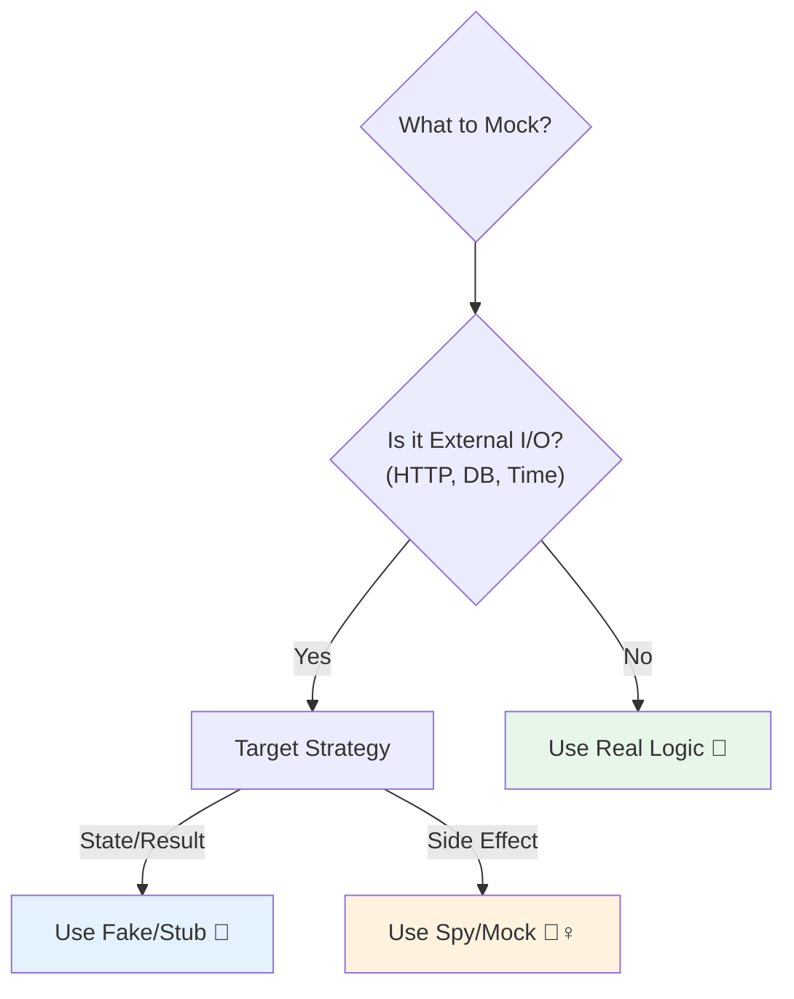

# 第24章：テスト③：境界のテスト方針（何をMockにする？）🎯

この章は「**Mockしすぎてテストが壊れやすい…**」を卒業する回だよ〜！🌸
DIできるようになってきた今こそ、「どこを差し替える？」「どこは本物でテストする？」をスパッと決めよう💪😊

---

## この章のゴール🎓✨

最後までやると、こんな判断ができるようになるよ👇

* ✅ **Mock乱用を避ける**ルールを持てる
* ✅ 「中心（ロジック）」と「外側（I/O）」の**境界**でテスト方針を分けられる
* ✅ Fake / Stub / Spy / Mock を**使い分け**できる
* ✅ テストが**壊れにくく**、変更にも強くなる🔧🧡

---

## 4) まとめ：テスト戦略の地図🗺️


## 1) まず大枠：テストは“ピラミッド”で考える🏔️📚

テストって、全部E2E（画面から操作するやつ）にすると **遅い・不安定・直すの大変** になりがち😵‍💫
だから、一般的には「**Unit多め、E2E少なめ**」のバランスが推奨されるよ〜！🧪✨ ([martinfowler.com][1])

イメージ👇

* 🧪 **Unit**（速い・安定・たくさん）
* 🔩 **Integration**（ほどほど）
* 🖥️ **E2E**（重い・少なめ）

ここで大事なのが…
**Unitテストで“中心のロジック”を守るために、外側だけ差し替える**って発想だよ🎯

---

## 2) 用語の整理：Fake / Stub / Spy / Mock って何？🧸📦

言葉が混ざると事故るので、ここでスッキリしよ〜！🧼✨
（※流派もあるけど、ここでは現場で困らない整理にするね）

## ✅ Stub（スタブ）🎫

* **決まった値を返すだけ**
* 例：APIの代わりに「いつも同じレスポンス」を返す

## ✅ Fake（フェイク）🧩

* **軽い実装を持つ“偽物の本物”**
* 例：メモリ上のDB（配列）で保存・検索ができる

## ✅ Spy（スパイ）🕵️‍♀️

* **呼ばれた回数や引数を記録**して後で確認する
* 例：loggerが何回呼ばれたか見る

## ✅ Mock（モック）🎭

* **「こう呼ばれるべき！」を検証**する（振る舞い検証）
* 例：「`http.post('/login')` が1回呼ばれたよね？」を保証する

このあたりの用語や「Mock中心のテストはどういう性格になるか」は、Martin Fowlerの整理が有名だよ📖 ([martinfowler.com][2])

---

## 3) 結論：何をMockにする？判断ルールはこれだよ🎯🌿

## 🌸 ルールA：中心（ロジック）は“本物同士”でテストする🧠✅

中心＝純粋ロジック（計算・判定・整形・ルール）みたいな部分ね🍱
ここをMockだらけにすると、**テストが実装の写経**になって壊れやすい😣

➡️ 中心は、できるだけ **Fake/Stubで安定化**してテストするのが相性いい✨

---

## 🌸 ルールB：外側（I/O）は差し替える🌐🗄️⏰

外側＝世界とつながるところ👇

* 🌐 HTTP / fetch / 外部API
* 🗄️ DB / Storage / File
* ⏰ 時刻 / タイマー
* 🎲 乱数
* 🖥️ ブラウザAPI（location、localStorage、通知…）

ここは本物でUnitテストすると不安定になりがちだから、**DIして差し替える**のが基本💉✨

---

## 🌸 ルールC：Mockは“外側の境界”でだけ使う（少量）🎯

Mockは便利だけど、やりすぎると👇

* ❌ テストが「内部の呼び出し手順」に依存
* ❌ リファクタで大量に壊れる
* ❌ “何を守りたいテスト？”が不明に…

だからおすすめはこれ👇
**中心：Fake（状態・結果）**
**外側：Mock/Spy（呼び出し）**
の使い分け🌿✨

---

## 4) 依存を“分類”すれば迷わない🗂️✨（チート表だよ！）

| 依存の種類           | 例                      | テストでの扱い            | ねらい     |
| --------------- | ---------------------- | ------------------ | ------- |
| 🧠 純粋ロジック       | パース、計算、バリデーション         | **本物でテスト**         | 仕様を守る   |
| 🎲 非決定（ランダム/時刻） | Math.random / Date.now | **Fake/Stubで固定**   | 安定化     |
| 🌐 外部I/O        | HTTP/DB/FS             | **Mock/Stub**（境界で） | 速く・安全に  |
| 🧾 ログ/通知        | logger/info            | **Spy**（呼び出し確認）    | 副作用の確認  |
| 🧩 自分の小さな部品     | 自作のFormatter等          | **なるべく本物**         | リファクタ耐性 |

---

## 5) 実例①：中心はFakeで安定化（Mockいらない）🍱🧪✨

「有効期限チェック」みたいなロジックを例にするね😊
時刻が絡むだけでテストが不安定になりやすいけど、Fakeで固定すれば最強💪

### 実装例（ClockをDI）⏰💉

```ts
export type Clock = { now(): Date };

export function isExpired(clock: Clock, expiresAt: Date): boolean {
  return clock.now().getTime() > expiresAt.getTime();
}
```

### テスト例（FakeClock）🧪✨

```ts
import { describe, it, expect } from "vitest";
import { isExpired, type Clock } from "./isExpired";

class FakeClock implements Clock {
  constructor(private readonly fixed: Date) {}
  now() { return this.fixed; }
}

describe("isExpired", () => {
  it("期限前ならfalse", () => {
    const clock = new FakeClock(new Date("2026-01-01T00:00:00Z"));
    expect(isExpired(clock, new Date("2026-01-02T00:00:00Z"))).toBe(false);
  });

  it("期限後ならtrue", () => {
    const clock = new FakeClock(new Date("2026-01-03T00:00:00Z"));
    expect(isExpired(clock, new Date("2026-01-02T00:00:00Z"))).toBe(true);
  });
});
```

👉 こういう中心ロジックは **Fakeで十分**。Mockは不要になりやすいよ🌸

---

## 6) 実例②：外側（HTTP）はMockでOK（境界でだけ！）🌐🎭

HTTPみたいな外部I/Oは、Vitestの `vi` を使って差し替えるのが定番だよ🧰✨ ([vitest.dev][3])

### HttpClientをDIする🌐💉

```ts
export type HttpClient = {
  post(url: string, body: unknown): Promise<{ status: number; json: unknown }>;
};

export async function login(http: HttpClient, user: string, pass: string) {
  const res = await http.post("/login", { user, pass });
  if (res.status !== 200) return { ok: false };
  return { ok: true, data: res.json };
}
```

### テストでは“境界だけ”Mockする🎭🧪

```ts
import { describe, it, expect, vi } from "vitest";
import { login, type HttpClient } from "./login";

describe("login", () => {
  it("成功したらok=true", async () => {
    const http: HttpClient = {
      post: vi.fn().mockResolvedValue({ status: 200, json: { token: "t" } }),
    };

    const result = await login(http, "a", "b");

    expect(result.ok).toBe(true);
    expect(http.post).toHaveBeenCalledWith("/login", { user: "a", pass: "b" });
  });
});
```

ここは **外部との境界**だから、
「呼ばれたか」「引数合ってるか」を確認するMockが役立つよ🎯✨

（VitestはJest互換に寄せたAPIも多くて移行しやすいよ〜って方針も公式にあるよ📌） ([vitest.dev][4])

---

## 7) よくある失敗：Mock乱用で“写経テスト”になる📸💥

こんなテスト、見たことある？👀

* ✅ テストが「関数の中の呼び出し順」を全部期待してる
* ✅ ちょっとリファクタしただけで全部落ちる
* ✅ 本当に守りたい仕様（結果）が何か分からない

それ、だいたい **中心までMockしちゃってる**のが原因😣

## 直し方はこれ🌿

* 守りたいのが「結果」なら → **Fake/Stubで結果を検証**
* 守りたいのが「外部への通知」なら → **境界でSpy/Mock**

---

## 8) 判断フロー：この依存、Mockする？🧭✨

迷ったらこの順番でOKだよ👇😊

1. 🤔 それは **I/O（外部）**？

   * YES → 2へ
   * NO → なるべく本物でテスト✅
2. 🎯 テストで守りたいのはどっち？

   * **結果（状態）** → Fake/Stubが基本
   * **呼び出し（副作用）** → Spy/Mockで確認
3. 🧱 そのMockは「手順」に依存してない？

   * してる → なるべく結果検証へ寄せる🌿



---

## 9) ミニ課題：Mockにすべき対象を3つ分類しよう🗂️💖

次の依存を「本物 / Fake / Mock(Spy)」に仕分けしてみてね👇✨

* `Date.now()` ⏰
* `Math.random()` 🎲
* `fetch()` 🌐
* `localStorage` 🗄️
* `console.log` 🧾
* 自作の `formatPrice()` 💰

**答えの雰囲気**（一例）

* Date/Random → Fake/Stubで固定
* fetch/localStorage → 境界でMock/Stub
* console → Spy（呼ばれたか）
* formatPrice → 本物でテスト

---

## 10) AIの使いどころ🤖✨（めちゃ便利！）

AIにはこのへん頼むと強いよ〜😊

* 「この依存一覧を、**本物/Fake/Mock**に分類して理由も添えて」
* 「FakeClock / FakeRandom を**最小実装**で作って」
* 「このテスト、**壊れやすいポイント**ある？改善案ちょうだい」
* 「Mockを減らして、**結果検証 중심**に書き直して」

---

## まとめ🎀🏁

* ✅ **中心（ロジック）は本物＋Fakeで安定化**が強い
* ✅ **外側（I/O境界）だけMock/Spy**でOK
* ✅ 迷ったら「I/O？結果？呼び出し？」の順に判断🎯
* ✅ テストが壊れにくくなって、DIの旨みが爆増するよ💉💖

---

次の章（第25章）は「じゃあDIコンテナって必要なの？🤔🧰」の判断回だね〜！

[1]: https://martinfowler.com/articles/practical-test-pyramid.html?utm_source=chatgpt.com "The Practical Test Pyramid"
[2]: https://martinfowler.com/articles/mocksArentStubs.html?utm_source=chatgpt.com "Mocks Aren't Stubs"
[3]: https://vitest.dev/guide/mocking?utm_source=chatgpt.com "Mocking | Guide"
[4]: https://vitest.dev/guide/comparisons?utm_source=chatgpt.com "Comparisons with Other Test Runners | Guide"
