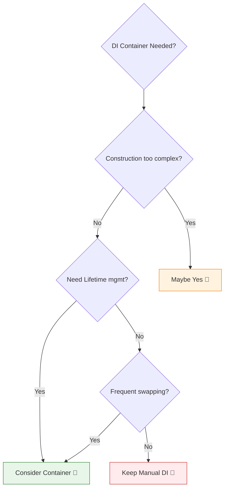

# 第25章：DIコンテナは必要？導入判断を身につける🎯🧰

この章は「DIできるようになってきたけど…コンテナって入れた方がいいの？🤔」に、**迷わず答えられるようになる章**だよ〜！💪🌸
（結論：**“困ってからでOK”** が多い。だけど “困り方” を見極めるのが超大事！🔥）

---

## 1) まず「DIコンテナ」って何？🧩

* **手動DI**：自分で “new” の順番を考えて、必要な依存（deps）を渡して組み立てる🏗️
* **DIコンテナ**：

  * 「Aを作るにはBとCが必要だよね？」を登録しておくと、
  * “resolve” みたいに呼ぶだけで**依存関係を辿って自動で組み立ててくれる**やつ🤖✨

便利そうに見えるんだけど…💡
**“便利さの代わりに、魔法（ブラックボックス）が増える”**のがポイントだよ🪄😇

---

## 2) いきなり判断ルール：基本は「手動DIでOK」🫶

DIコンテナって、入れた瞬間から

* 学習コスト📚
* デバッグ難易度🧯
* 依存関係が見えにくくなる問題🙈
* “便利なはずが、設計が崩れていく”事故🕳️

が起きやすいの。

だからおすすめはこれ👇

## ✅ まずは手動DIで進める（Composition Rootでnewを集中）📍

* “new地獄”は「やり方」でかなり抑えられる
* そして **手動DIが限界を迎えたとき** にコンテナが刺さる🎯

---

## 3) 結論：コンテナは「管理しきれなくなってから」⚖️

シーン集🎯✨

次のうち、**複数当てはまるほど導入価値が上がる**よ👇

## A. 依存の組み立てが “爆発” してきた💥

* 生成順が複雑で、Composition Rootが読めない😵‍💫
* 変更するたびに、組み立て側の修正が多すぎる🧵

## B. “ライフタイム管理” が欲しくなった⏳

* Singleton / Transient / Request-scoped みたいな概念が必要になってきた
* 「リクエスト中だけ同じインスタンス」みたいなやつね🧠

## C. プラグイン型・差し替えが多い🔌

* 支払い/通知/ストレージ…などで実装差し替えが頻繁🔁
* 実行時に設定で切り替えたい🎛️

## D. チーム開発で “組み立てルール” を統一したい👥

* みんなが好き勝手にnewし始めた😇
* 「登録・解決のルール」で統制したい🧯

## E. クロスカット（ログ/トレース等）を注入で統一したい🧾

* logger, tracer, metrics などを全部の層に綺麗に配りたい📦

---

## 4) コンテナ導入の “コスト” も知っておこ🧨

## コスト①：エラーが “実行時” に寄りがち😱

TypeScriptって **型が実行時に消える**から、コンテナは
トークンやメタデータに頼ることが多いの。
その結果「動かしてみたら失敗💥」が起きやすい⚠️

## コスト②：デコレータ系は “設定・ビルド” が増える🧩

デコレータ＋メタデータを使うDIは、だいたい
“emitDecoratorMetadata” と “reflect-metadata” 系が絡むことが多いよ🧬（※ライブラリ次第）
この “emitDecoratorMetadata” は reflect-metadata と一緒に使うための設定として説明されてるよ。([TypeScript][1])

しかもややこしいのが👇
TypeScript 5.0から **新しい（Stage 3）デコレータ**に対応したけど、
**新デコレータは emitDecoratorMetadata と互換じゃない**って注意が公式に書かれてるの。([Microsoft for Developers][2])
→ つまり「デコレータDIを選ぶなら “どのデコレータ方式前提か”」をちゃんと意識する必要があるよ🧠⚡

## コスト③：Service Locator化しやすい🕳️

「どこでも container.resolve() できる〜便利〜🥳」
…をやると、依存が隠れて **設計が一気に崩れる**ことがある（第30章の地雷💣）

---

## 5) 導入判断チェック（点数で決めるやつ）📝✨

各項目、当てはまったら **+1点**👇

1. Composition Rootが100行を超えてきた📜
2. 依存の入れ替え（実装切替）が週1以上ある🔁
3. 「ライフタイム（Request/Singleton等）」が欲しい⏳
4. 依存グラフが複雑で、順番を間違えやすい🧩
5. 複数チーム/複数人で組み立てルールを統一したい👥
6. プラグイン構成・機能追加が頻繁🔌
7. テストで “同じ差し替え” を何度も書いてる🧪
8. DIの登録を “一覧” として管理したい📚
9. 例外時の「誰が作ったの？」追跡がつらい🕵️‍♀️
10. 今後スケール確定（機能数・サービス数が増える予定）📈

## 判定🎯

* **0〜3点**：手動DIでOK🙆‍♀️✨（整えるだけで勝てる）
* **4〜6点**：迷いどころ🤔（小さめコンテナ/一部導入が候補）
* **7点〜**：導入メリット大きい🔥（ルールとセットで導入）

💡AI使いどころ🤖

* 「このプロジェクトの依存をカテゴリ分けして、導入点数を出して」
* 「Composition Rootの責務を分割案として提案して」
  みたいに頼むと一気に整理できるよ✨

---

## 6) “導入しない” 場合に勝つ方法（手動DIを強くする）💪🌸

## ✅ ルール1：Composition Rootにnewを集める📍

* “使う場所” ではnewしない
* “組み立て場所” だけでnewする

## ✅ ルール2：Factoryで読みやすくする🏭

* createX / makeX を作って、組み立てを分割する

## ✅ ルール3：depsオブジェクト注入で引数地獄を防ぐ👜

* clock/logger/storage/api みたいにまとめる

手動DIって「ちゃんと整える」と、かなり長く戦えるよ🔥

---

## 7) “導入する” と決めたら守ること（超重要3ルール）📜⚠️

## ルールA：container.resolve は “端っこだけ” 🧊

* 原則：entry（起動時）/ handler（境界）あたりまで
* domain/core では resolve しない🙅‍♀️

## ルールB：依存は “見える形” に保つ👀

* コンストラクタ引数/関数引数に出す
* 「勝手に注入されてるっぽい」は事故の匂い😇

## ルールC：トークン設計を先に決める🔑

* 文字列トークン乱用→衝突💥
* Symbol等の方針、命名規則を決める（第27章につながるよ🧠）

---

## 8) いま選ぶなら？（代表例と “健康状態” の見方）🩺✨

ここは「例」として、雰囲気を掴もう〜！🌸
（選定は **更新頻度・最終公開日・運用方針** をまず見るのがコツ）

* **Inversify**：npmで “Latest 7.11.0（2026-01-08公開）” が確認できるよ。([npm][3])
  さらに Inversify 8 の計画（2026年3月ターゲット）も言及がある。([InversifyJS][4])
* **Awilix**：npmで “Latest 12.0.5” が確認できる（デコレータ無し寄りの思想）。([npm][5])
* **TSyringe**：npmで “Latest 4.10.0（2025-04-16公開）”。([npm][6])
* **TypeDI**：npm上だと “Latest 0.10.0（2021-01-15公開）” で、Snyk側のメンテ指標は “Inactive” と評価されてる。([npm][7])

> ポイント💡
> 「どれが最強！」より、**自分の方式（デコレータ派？非デコレータ派？）と、運用の安定**を優先してね🫶✨

---

## 9) ミニ課題🎀：あなたのプロジェクト、どっち？🤔

## 課題A：今の状況を “点数化” してみよ📝

* さっきの10項目で点数を出す
* 4点以上なら「手動DIの改善」か「小さく導入」を比較する

## 課題B：境界ルールを1つ書く📦🚫

例：

* 「domainはinfraをimportしない」
* 「resolveはentry層だけ」
* 「depsは最大5個まで」

## 課題C：AIレビュー🤖✅

* 「この判断（手動DI/コンテナ）で起きそうな事故を3つ」
* 「事故を防ぐルール案を3つ」
  を出してもらって、良いのを採用✨

---

## まとめ🎁✨

* DIコンテナは **“必要になったら入れる”** で間に合うことが多い🙆‍♀️
* でも、**必要になるサイン**（組み立て爆発・ライフタイム・差し替え頻発）を見逃さないのが大事🎯
* デコレータDIは特に、TypeScriptのデコレータ方式やメタデータ周りの相性に注意⚠️([Microsoft for Developers][2])
* 導入したら「resolveは端っこだけ」ルールで、Service Locator化を防ぐ🛡️

次の第26章で、**Mapで超軽量コンテナを自作して仕組みを腹落ち**させるよ〜！🗺️✨

[1]: https://www.typescriptlang.org/tsconfig/?utm_source=chatgpt.com "TSConfig Reference - Docs on every TSConfig option"
[2]: https://devblogs.microsoft.com/typescript/announcing-typescript-5-0/?utm_source=chatgpt.com "Announcing TypeScript 5.0"
[3]: https://www.npmjs.com/package/inversify?utm_source=chatgpt.com "inversify"
[4]: https://inversify.io/blog/planning-inversify-8-0-0/?utm_source=chatgpt.com "Planning InversifyJS 8 - Feedback Needed!"
[5]: https://www.npmjs.com/package/awilix/v/1.0.0?activeTab=versions&utm_source=chatgpt.com "awilix"
[6]: https://www.npmjs.com/package/tsyringe?utm_source=chatgpt.com "tsyringe"
[7]: https://www.npmjs.com/package/typedi?utm_source=chatgpt.com "typedi"
