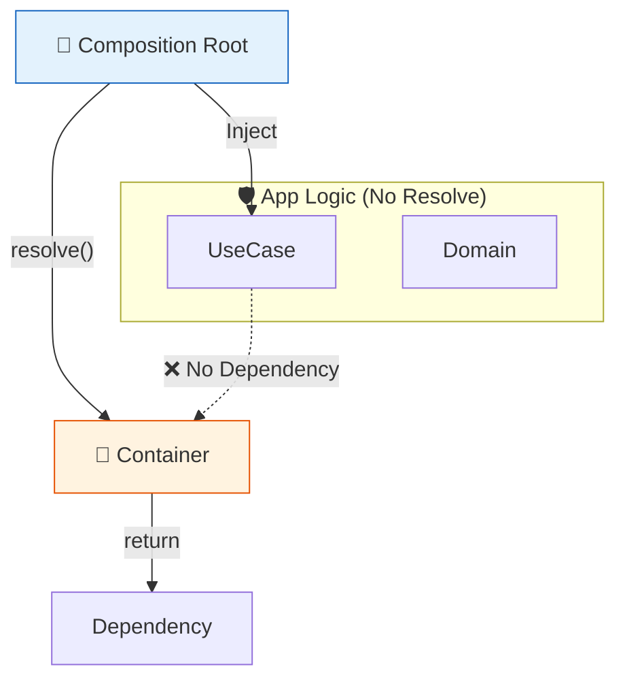
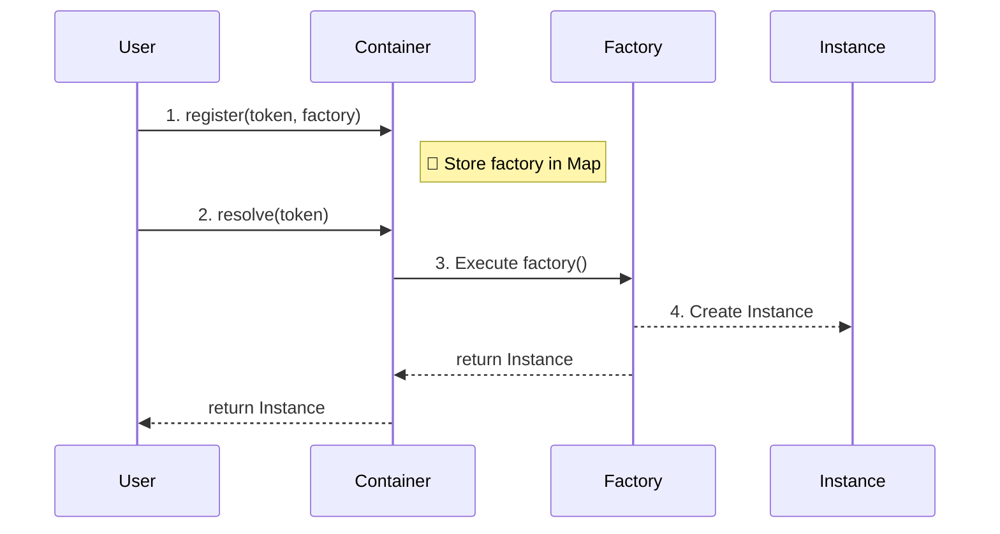
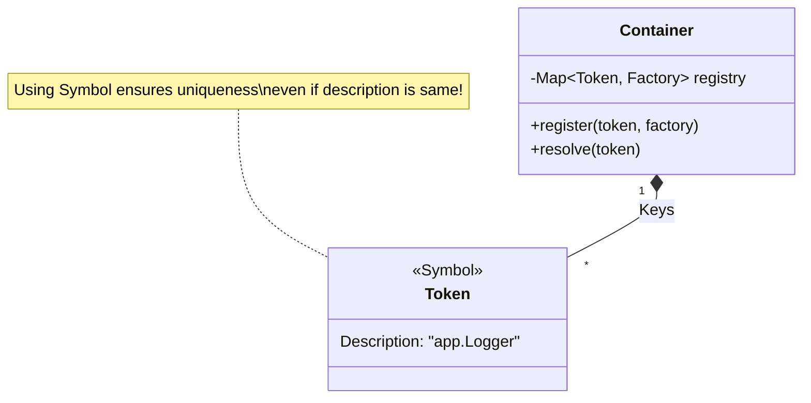

# 第26章：超軽量コンテナ自作：Mapで“仕組み”を理解🗺️✨

この章は「DIコンテナって結局なにしてるの？😳」を、**自作して体で理解する回**だよ〜！💉🧩
完成すると、次の章（token設計🔑）がめちゃくちゃスッと入るようになるよ🌸

---

## この章のゴール🎯✨

* 「コンテナ＝登録📌→解決🔍」を自分の言葉で説明できる😊
* **Mapで作れる最小コンテナ**を実装できる🛠️
* **Singleton（使い回し）**と**Transient（毎回作る）**の違いが分かる🔁👑
* テストで依存を差し替えできる🧪💖

---

## まず、DIコンテナがやってる“超ざっくり絵”🎨


* 依存は **引数 or コンストラクタで受け取る**💉


* **登録（register）**：token（鍵🔑）に「作り方（factory）」を覚えさせる
* **解決（resolve）**：token（鍵🔑）で「作って！」ってお願いする

イメージ👇

* `token -> factory` をコンテナが持ってる
* `resolve(token)` で factory が動いて実体が返る



ちなみに、有名コンテナ（例：tsyringe）も「tokenを登録して、factoryで解決する」形が基本だよ✨ ([GitHub][1])

---

## 今日つくる“ミニコンテナ”の仕様🧰✨

できることはこれだけでOK！むしろこれが分かれば勝ち🏁💖

* `register(token, factory)`：作り方を登録
* `registerSingleton(token, factory)`：最初の1回だけ作って保存（使い回し）
* `resolve(token)`：取り出す（作る）
* 追加：**登録忘れ**が分かりやすいエラーになる（地味に超大事⚠️）

---

## ステップ0：ファイル構成（この形で行こう📁✨）

* `src/di/container.ts`（コンテナ本体🧠）
* `src/app/services.ts`（例のサービスたち🧩）
* `src/main.ts`（起動・組み立て（Composition Root）🚀）

---

## ステップ1：token（鍵🔑）を作る

TypeScriptは実行時に`interface`が消えるから👻、「型そのものを鍵にする」のが難しいのね。
そこで今日は **Symbolを鍵🔑にする**よ！（衝突しにくくて安全✨）

---

## ステップ2：コンテナ本体を実装しよう🛠️✨

ポイントはこれ👇

* `providers: Map<Token, Factory>` を持つ
* `singletons: Map<Token, Instance>` を持つ（Singleton用）

```ts
// src/di/container.ts

export type Token<T> = symbol & { readonly __type?: T };

export const createToken = <T>(description: string): Token<T> =>
  Symbol(description) as Token<T>;

export type Factory<T> = (c: Container) => T;

export class Container {
  private readonly providers = new Map<symbol, Factory<unknown>>();
  private readonly singletons = new Map<symbol, unknown>();

  register<T>(token: Token<T>, factory: Factory<T>): void {
    this.providers.set(token, factory as Factory<unknown>);
    // 上書き登録したとき、古いsingletonが残ると事故るので消す💥
    this.singletons.delete(token);
  }

  registerSingleton<T>(token: Token<T>, factory: Factory<T>): void {
    this.providers.set(token, factory as Factory<unknown>);
    // singletonは resolve 時に遅延生成するよ🐢
  }

  resolve<T>(token: Token<T>): T {
    // まずsingletonキャッシュを見る👀
    if (this.singletons.has(token)) {
      return this.singletons.get(token) as T;
    }

    const factory = this.providers.get(token);
    if (!factory) {
      const name = token.description ?? "(no description)";
      throw new Error(`DI: token is not registered: ${name}`);
    }

    const value = factory(this) as T;

    // 「registerSingletonで登録されたものだけキャッシュしたい」なら、
    // ここにフラグが必要だけど、今回は超軽量版なので
    // “singleton登録＝同じtokenをキャッシュする”にしちゃうね😊
    //
    // ただし、Transientも欲しいので…👇
    // → singletonにしたい時だけ explicit に cache するAPIを分ける！
    return value;
  }

  resolveSingleton<T>(token: Token<T>): T {
    if (this.singletons.has(token)) {
      return this.singletons.get(token) as T;
    }

    const factory = this.providers.get(token);
    if (!factory) {
      const name = token.description ?? "(no description)";
      throw new Error(`DI: token is not registered: ${name}`);
    }

    const value = factory(this) as T;
    this.singletons.set(token, value);
    return value;
  }
}
```



ここ、ちょい大事💡

* `resolve()` は **毎回作る（Transient）**
* `resolveSingleton()` は **1回作って保存（Singleton）**

「DIコンテナって結局これだけなんだ😳」ってなるはず！

---

## ステップ3：3サービスを作って、登録→解決してみよう🔁✨

例はシンプルにするね🌸

* `Clock`：時刻を返す⏰
* `Logger`：ログを出す📝
* `Greeter`：あいさつする（ClockとLoggerに依存）💬

```ts
// src/app/services.ts

export interface Clock {
  now(): Date;
}

export class SystemClock implements Clock {
  now(): Date {
    return new Date();
  }
}

export interface Logger {
  info(message: string): void;
}

export class ConsoleLogger implements Logger {
  info(message: string): void {
    console.log(message);
  }
}

export class Greeter {
  constructor(
    private readonly clock: Clock,
    private readonly logger: Logger
  ) {}

  hello(name: string): string {
    const msg = `Hello, ${name}! (${this.clock.now().toISOString()})`;
    this.logger.info(msg);
    return msg;
  }
}
```

---

## ステップ4：Composition Root（組み立て）を書く📍🚀

「どこでnewするの？」問題はここで解決✨
**登録と解決は“起動ファイル側”に寄せる**のがコツだよ😊

```ts
// src/main.ts

import { Container, createToken } from "./di/container";
import { Clock, ConsoleLogger, Greeter, Logger, SystemClock } from "./app/services";

const TOKENS = {
  clock: createToken<Clock>("clock"),
  logger: createToken<Logger>("logger"),
  greeter: createToken<Greeter>("greeter"),
};

const c = new Container();

// Clockは毎回作ってもいいけど、今回はsingletonにしちゃう⏰👑
c.register(TOKENS.clock, () => new SystemClock());

// Loggerもsingletonが自然📝👑
c.register(TOKENS.logger, () => new ConsoleLogger());

// Greeterは依存をresolveで取って作る🧩
c.register(TOKENS.greeter, (cc) => {
  const clock = cc.resolve(TOKENS.clock);
  const logger = cc.resolve(TOKENS.logger);
  return new Greeter(clock, logger);
});

const greeter = c.resolve(TOKENS.greeter);
greeter.hello("こみやんま");
```

---

## 「え、singletonどこ？」ってなった？👀✨

上のコードだと `resolve()` は毎回作る仕様だから、
「LoggerやClockを1回だけ作りたい！」はこうする👇

```ts
// main.ts の一部だけ差し替え例

c.register(TOKENS.clock, (cc) => cc.resolveSingleton(TOKENS.clock)); // ←これはダメ例😇（無限ループ）
```

なので、**正しいやり方**はこう👇（“キャッシュしたい側”で resolveSingleton を使う）

```ts
// src/main.ts（Greeter生成側だけ修正版）

c.register(TOKENS.greeter, (cc) => {
  const clock = cc.resolveSingleton(TOKENS.clock);
  const logger = cc.resolveSingleton(TOKENS.logger);
  return new Greeter(clock, logger);
});
```

この形だと、Clock/Loggerは最初の1回だけ作られて、後は使い回しになるよ👑✨

> もっとちゃんとやるなら「registerSingleton(token, factory)」でフラグ管理して、`resolve()`だけでsingleton化できるようにするのが本格派だよ🧰
> でもまずは仕組み理解が最優先🥳

---

## ステップ5：テストで差し替え🧪💖（ここがDIのご褒美🎁）

ClockをFakeにして、時間が固定されるテストを作るよ⏰✅

```ts
// 例：テスト用Clock

import type { Clock } from "./app/services";

export class FakeClock implements Clock {
  constructor(private readonly fixed: Date) {}
  now(): Date {
    return this.fixed;
  }
}
```

差し替えは超簡単👇（同じtokenに再登録すればOK🔁）

```ts
import { Container } from "./di/container";
import { FakeClock } from "./fakeClock";
import { ConsoleLogger, Greeter } from "./app/services";

// c は main と同じ登録をした前提として…
c.register(TOKENS.clock, () => new FakeClock(new Date("2026-01-01T00:00:00.000Z")));

const greeter = c.resolve(TOKENS.greeter);
const msg = greeter.hello("Test");

// msgに固定時刻が入ってればOK！🎉
```

---

## よくある事故ポイント⚠️（ここだけは避けて〜😭）

## 1) “どこでも container.resolve()” し始める🕳️

便利すぎて、アプリ中で `resolve()` しまくると **Service Locator化**しがち💥
➡️ **解決（resolve）は起動側（Composition Root）に寄せる**のが基本だよ📍✨

## 2) 循環依存🌀

AがBをresolveして、BがAをresolveして…で無限ループ😇
➡️ 小さいうちに「責務分割」か「依存方向の見直し」🔁

## 3) token未登録💔

➡️ だからこそ、今日みたいに**分かりやすいエラー**が大事！

---

## ミニ課題（15〜30分）📝✨

1. `Greeter` に `Random` 依存（乱数🎲）を追加して、テストで固定してみてね🎯
2. `Logger` を `MemoryLogger`（配列に貯める📦）に差し替えて、呼ばれたログを検証してみてね🕵️‍♀️
3. `Container` に `tryResolve(token)` を追加して、「未登録ならundefined」版も作ってみよう😊

---

## AIに投げると捗るプロンプト例🤖💬

* 「今のContainerに registerSingleton(token, factory) を追加して、resolveだけでsingleton化できるようにして」
* 「循環依存を検知して、分かりやすいエラーにして（解決スタックを表示して）」
* 「vitestでGreeterのテストを書いて。FakeClockとMemoryLoggerを使って」

---

## ちょい最新メモ🆕✨（今どきTSの空気感）

* 2026年1月時点の公式リリースノート（TypeScript 5.9）では、`tsc --init` の更新や `--module node20` 対応などが触れられてるよ📌 ([TypeScript][2])
* さらに先の話として、TypeScriptのコンパイラ周りは「ネイティブ化プレビュー」で高速化が進んでる流れもあるよ🚀（大規模だと10x級の話も） ([Microsoft Developer][3])

（でもDIコンテナ自作は、バージョン関係なくずっと効く基礎体力💪✨）

---

## まとめ🎀✨

* DIコンテナは結局「token→factory をMapで管理して resolveするだけ」🗺️
* Singletonは「1回作って保存」👑、Transientは「毎回作る」🔁
* 自作すると「コンテナ怖い😭」が消える！そして次章のtoken設計が楽しくなる🔑💖

---

次は **第27章 token設計（文字列？Symbol？）** に進む流れだけど、
このミニコンテナをベースに「安全で事故りにくいtoken設計」を一緒に作っていこうね😊🔑✨

[1]: https://github.com/microsoft/tsyringe?utm_source=chatgpt.com "microsoft/tsyringe: Lightweight dependency injection ..."
[2]: https://www.typescriptlang.org/docs/handbook/release-notes/typescript-5-9.html "TypeScript: Documentation - TypeScript 5.9"
[3]: https://developer.microsoft.com/blog/typescript-7-native-preview-in-visual-studio-2026 "TypeScript 7 native preview in Visual Studio 2026 - Microsoft for Developers"
