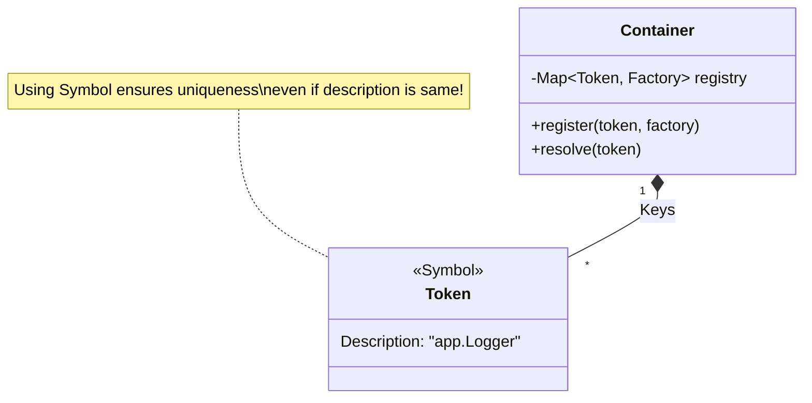

# 第27章：token設計：文字列？Symbol？安全な選び方🔑

> この章は「第26章で作った超軽量コンテナ（Map登録→resolve）」を、**“現場で事故らない形”**に育てる回だよ〜🌱😊
> TSでは「interfaceが実行時に消える👻」せいで、**token設計＝DIの安定性**に直結します💥

---

## 1) この章のゴール🎯💖

読み終わったら、こんなことができるようになります✨

* DIコンテナの「token」って何かを説明できる🗣️
* **文字列token**と**Symbol token**の違いを理解して、使い分けできる🔄
* 「tokenが衝突した」「同じつもりで別物になった」みたいな事故を防げる🧯
* “token置き場”と“命名ルール”を作れる📦🏷️

---

## 2) そもそも token って何？🪪


DIコンテナって、要するにこういう箱だよね📦✨

* 「この**名前（token）**が来たら、この**作り方（factory）**で作ってね〜」って登録しておく
* `resolve(token)` で、対応するインスタンスを返す

つまり token は **「依存性に貼る名札」**です🪪😊
この名札がブレると、別人（別実装）を呼んじゃう💥



---

## 3) TypeScriptで token が超重要な理由👻⚠️

TSは `interface` が実行時に存在しないよね👻
だから「interfaceをキーにして自動解決！」みたいなノリが成立しづらいの🥲

そこで多くのDIライブラリは、**tokenを明示**できるようにしてるよ。例えば tsyringe だと token は **string / symbol / class constructor** などを許可してる（まさにこの章のテーマ！） ([GitHub][1])

---

## 4) token の選択肢は主に3つ🧩

### A. 文字列 token（例: `"Logger"`）📝


**メリット**

* ぱっと見で分かりやすい👀✨
* JSON/設定ファイル/環境変数と相性がいい⚙️

**デメリット（事故ポイント）**

* タイポで死ぬ😇（`"Loggre"` とか）
* 名前衝突しやすい💥（別チーム/別機能の `"Config"` とか）
* リファクタで置換漏れしやすい🧹

---

### B. Symbol token（例: `Symbol("Logger")`）🔱


**メリット**

* **衝突しない（原則）**：同じ説明文でも別Symbolは別物🔱✨
* “名前が同じ”事故を物理的に防げる🧯

**デメリット**

* 設定ファイルにそのまま書けない（文字列じゃない）🥲
* “同じつもりで別Symbolを作う”事故がある（後で対策するよ！）💥

InversifyJS みたいに **service identifier として Symbol を推奨**してるDIもあるよ〜 ([InversifyJS][2])

---

### C. クラス（constructor）token（例: `UserService`）🏛️


**メリット**

* 「クラス＝token」にできて直感的😊
* IDE補完が強い💪

**デメリット**

* interfaceには使えない（消えるから👻）
* “抽象（契約）”より“具象（実装）”に寄りやすい⚠️

---

## 5) 結論：どう使い分ける？🎀

迷ったらこのルールが超安定だよ😊✨

* **アプリ内の契約（interface的なもの）** → **Symbol token** が安全🔱
* **設定ファイルや外部入力で指定したい** → **文字列 token** が便利📝
* **クラスをそのまま使っていい場面** → constructor token 🏛️

実際、Awilixでも登録名は `string | symbol` を受け付ける設計になってるよ（＝どっちも現場で使われる） ([GitHub][3])

---

## 6) Symbol token の“最大の地雷”と対策💣➡️🧯

### 地雷💥：「同じつもりで別Symbolを作った」

たとえば…

* A.ts：`const LOGGER = Symbol("Logger")`
* B.ts：`const LOGGER = Symbol("Logger")`

説明が同じでも **別物**だよ〜😇
だから `resolve(LOGGER)` が噛み合わない事故が起きるの🥲

### 対策✅：tokenは “必ず1箇所に集約” する📦✨


**token置き場（tokens.ts）を作って、そこからimportする**
これだけで事故が激減するよ🙌

---

## 7) まずは「安全な tokens.ts」を作ろう📦🔑

ポイントは3つだよ😊

1. **一箇所に集める**
2. **prefixを付けて読みやすく**（`app.Logger` みたいに）
3. **命名ルールを固定**（後で増えても混乱しない）

```ts
// src/di/tokens.ts
export const TOKENS = {
  Logger: Symbol("app.Logger"),
  Clock: Symbol("app.Clock"),
  Config: Symbol("app.Config"),
} as const;

export type TokenKey = typeof TOKENS[keyof typeof TOKENS];
```

これで「同じつもりで別Symbol」事故がほぼ消えるよ🧯✨

---

## 8) さらに型安全にしたい人へ：unique symbol 🔒✨


TypeScriptには **`unique symbol`** っていう“唯一性のあるSymbol型”があるよ🔒
`const` にしか使えない等の制約はあるけど、**tokenをより厳密に扱える**ようになる😊 ([TypeScript][4])

（超ざっくり言うと：**「このtokenはこのtoken以外になりえない」**って型で守れる感じ🛡️）

```ts
// src/di/tokens-unique.ts
export const LOGGER_TOKEN: unique symbol = Symbol("app.Logger");
export const CLOCK_TOKEN: unique symbol = Symbol("app.Clock");
```

最初は無理に使わなくてOK🙆‍♀️
でも規模が大きくなるほど効いてくるよ〜📈✨

---

## 9) 第26章の超軽量コンテナに、token設計を適用してみよう🧰🔁

ここでは「token＝PropertyKey（string/symbol）」で扱うのが楽ちん😊

```ts
// src/di/container.ts
type Factory<T> = (c: Container) => T;

export class Container {
  private factories = new Map<PropertyKey, Factory<any>>();

  register<T>(token: PropertyKey, factory: Factory<T>) {
    if (this.factories.has(token)) {
      throw new Error(`Token already registered: ${String(token)}`);
    }
    this.factories.set(token, factory);
  }

  resolve<T>(token: PropertyKey): T {
    const f = this.factories.get(token);
    if (!f) throw new Error(`No provider for token: ${String(token)}`);
    return f(this);
  }
}
```

使う側はこんな感じ👇✨

```ts
import { Container } from "./container";
import { TOKENS } from "./tokens";

interface Logger {
  info(msg: string): void;
}
class ConsoleLogger implements Logger {
  info(msg: string) { console.log(msg); }
}

const c = new Container();
c.register(TOKENS.Logger, () => new ConsoleLogger());

const logger = c.resolve<Logger>(TOKENS.Logger);
logger.info("hello DI! 🎉");
```

---

## 10) token命名ルール：これだけ決めれば強い📛💪

ミニルール案（そのまま使ってOK）👇😊

* tokenの説明文字列は **`app.機能.役割`**（例：`app.user.UserRepository`）
* tokensは **`src/di/tokens.ts`** に集約
* domain側は tokens を直接触らない（触るのはcomposition root側）📍
* 文字列tokenを使うなら **prefix必須**（`"app:Logger"` みたいに）🧷

---

## 11) ミニ課題🎒✨（手を動かすと一気に身につくよ！）

### 課題A：token置き場を作る📦

* `TOKENS` に `HttpClient` `Storage` `UserRepository` を追加してみてね🔑🔑🔑

### 課題B：事故をわざと起こしてみる💥（学習に超効く！）

* 別ファイルで `Symbol("app.Logger")` をもう一回作って、`resolve` が失敗するのを確認😇
* それを **tokens.ts importに直して**成功させる🧯✨

### 課題C：AIに命名ルールレビューさせる🤖📝

Copilot/Codexにこう聞くと便利だよ👇

* 「このプロジェクトのDI token命名ルールを `app.xxx.yyy` 形式に統一したい。改善案ある？」
* 「tokens.ts が肥大化した時の分割案を提案して」

---

## 12) よくある失敗まとめ（ここだけは踏まないで！）🚫😵

* ❌ tokenを各所で `Symbol("Logger")` 生成 → **同じつもりで別物**💥
* ❌ 文字列tokenを短くする（`"Logger"`） → 衝突しがち💥
* ❌ tokenが散らばる → どれが正か不明になる🌀
* ✅ tokenは集約・prefix・命名固定📦🏷️✨

---

## 13) まとめ🎀

* tokenは「DIの名札」🪪
* TSでは interface が消えるから token設計が超重要👻
* アプリ内契約は **Symbol token** が安定🔱✨
* 事故を防ぐコツは **tokens.tsに集約**📦
* さらに硬くしたければ `unique symbol` も選択肢🔒 ([TypeScript][4])

---

次の第28章では、**「デコレータ無し流派で現実運用」**に進むよ〜🧰😊
「コンテナは使うけど、支配されない」感じに整えていこうね💪✨

[1]: https://github.com/microsoft/tsyringe?utm_source=chatgpt.com "microsoft/tsyringe: Lightweight dependency injection ..."
[2]: https://inversify.io/docs/introduction/dependency-inversion/?utm_source=chatgpt.com "Dependency inversion"
[3]: https://github.com/jeffijoe/awilix?utm_source=chatgpt.com "jeffijoe/awilix: Extremely powerful Inversion of Control (IoC) ..."
[4]: https://www.typescriptlang.org/docs/handbook/symbols.html?utm_source=chatgpt.com "Symbols - TypeScript: Documentation"
