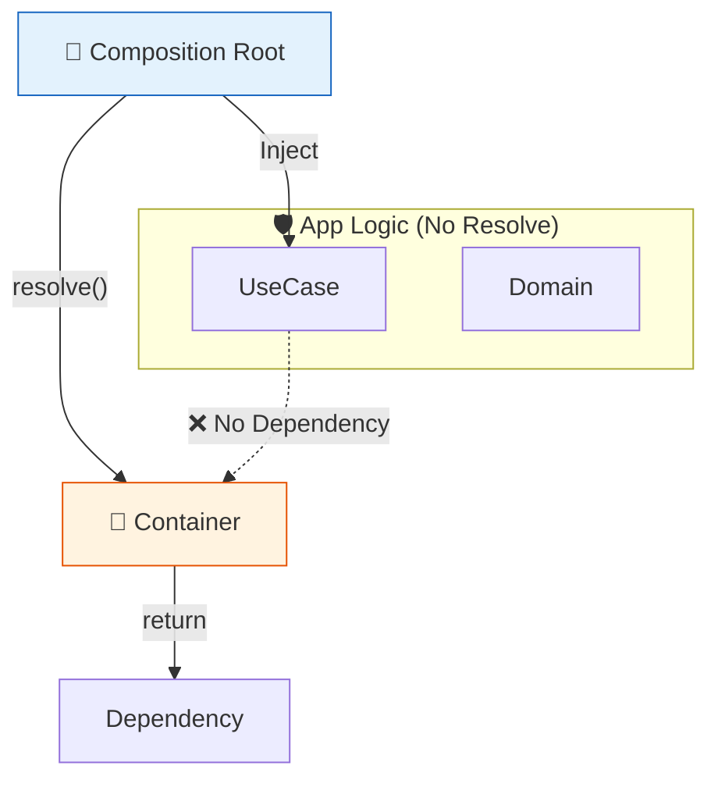

# 第28章：実用コンテナ：デコレータ無し流派で現実運用🧰😊

（Factory登録中心／依存解決は外側で📍）

---

## この章でできるようになること🎯💖

* 「デコレータ無し」で、**安全に運用できるDIコンテナ構成**を作れるようになる🧩✨
* **Composition Root（起動地点）だけ**で依存を解決するルールを身につける📍
* **Singleton / Transient / Scope（リクエスト単位）**の使い分けができるようになる🪄
* 「Service Locator化🕳️」を避けるチェックができる✅

---

## 1) なんで「デコレータ無し」流派なの？🤔💡


TypeScriptは“型が実行時に消える”ので、**型だけで自動注入**するのが難しい…って話が根っこにあるよ👻⚠️（＝実行時にはinterfaceが存在しない）([DEV Community][1])

デコレータ系DI（例：tsyringe / inversify）は、実行時メタデータ（reflect-metadata等）やデコレータで情報を集めて注入する流れが多いのね🪄

* tsyringe はデコレータに依存してメタデータを集める説明があるよ([GitHub][2])
* inversify も `@injectable` 等のデコレータを推奨してるよ([inversify.github.io][3])

もちろんデコレータ系が悪いわけじゃない！✨
でも「デコレータ無し」流派は次が強いの👇

* **ドメイン（中心のロジック）が汚れない**🧼✨
* 依存は **Composition Rootに集約**（どこで組み立ててるか一目でわかる👀）
* bundlingや実行環境差分の地雷を踏みにくい💣↘️
  この思想、実際に「エントリポイントだけでコンテナを使う」みたいな運用指針として紹介されてるよ📌([backstage.orus.eu][4])

---

## 2) まず“現実運用ルール”を1枚で📜✅

ここ超大事！これ守るだけで事故が激減するよ🧸💖

## ✅ ルールA：コンテナは **Composition Rootでだけ** 使う📍


* appの奥（ドメイン / ユースケース）から `container.resolve()` を呼ばない🙅‍♀️
* 依存は **引数 or コンストラクタで受け取る**💉



## ✅ ルールB：登録は “Factory中心” にする🏭


* `new` を隠す（でも隠しすぎない）
* 依存関係グラフが追いやすい👣

## ✅ ルールC：文字列トークン禁止（できれば）🚫🔤

* `'logger'` みたいな文字列はタイポ事故が起きやすい😇
* `symbol` や型付きTokenでいこう🔑

---

## 3) “ミニ実用コンテナ”を作ろう🧩✨（デコレータ無し・型付きToken）

ここでは「仕組みが理解できて」「実運用の最低ライン」を満たす形にするよ🧠💪

## 3-1) Tokenを作る🔑（型を紐づける）

```ts
// token.ts
export type Token<T> = symbol & { readonly __type?: T };

export function createToken<T>(description: string): Token<T> {
  return Symbol(description) as Token<T>;
}
```

* `symbol` だから衝突しにくい✨
* `Token<T>` で「このTokenはこの型のもの」って縛れる🔒

---

## 3-2) Provider（作り方）とLifetime（寿命）を定義🧪


```ts
// container.ts
import type { Token } from "./token";

export type Lifetime = "singleton" | "transient" | "scoped";

export type Provider<T> =
  | { lifetime: Lifetime; useValue: T }
  | { lifetime: Lifetime; useFactory: (c: Container) => T };

type Registry = Map<symbol, Provider<any>>;
type Cache = Map<symbol, any>;

export class Container {
  private readonly registry: Registry;
  private readonly cache: Cache;
  private readonly parent?: Container;

  constructor(registry?: Registry, parent?: Container) {
    this.registry = registry ?? new Map();
    this.cache = new Map();
    this.parent = parent;
  }

  register<T>(token: Token<T>, provider: Provider<T>): this {
    this.registry.set(token, provider);
    return this;
  }

  createScope(): Container {
    // registryは共有、cacheはスコープごとに分離
    return new Container(this.registry, this);
  }

  resolve<T>(token: Token<T>): T {
    const provider = this.registry.get(token);
    if (!provider) throw new Error(`Provider not found: ${String(token.description ?? token.toString())}`);

    // scoped: スコープのcacheに保持（親にキャッシュさせない）
    if (provider.lifetime === "scoped") {
      if (this.cache.has(token)) return this.cache.get(token);
      const value = this.instantiate(provider);
      this.cache.set(token, value);
      return value;
    }

    // singleton: “root”っぽい場所にキャッシュしたいので親を辿る
    if (provider.lifetime === "singleton") {
      const root = this.getRoot();
      if (root.cache.has(token)) return root.cache.get(token);
      const value = root.instantiate(provider);
      root.cache.set(token, value);
      return value;
    }

    // transient: 毎回生成
    return this.instantiate(provider);
  }

  private instantiate<T>(provider: Provider<T>): T {
    if ("useValue" in provider) return provider.useValue;
    return provider.useFactory(this);
  }

  private getRoot(): Container {
    let c: Container = this;
    while (c.parent) c = c.parent;
    return c;
  }
}
```

このコンテナは、**デコレータ無し**で

* `useValue`（値）
* `useFactory`（作る関数）
  を登録して、lifetimeも扱えるよ🪄✨

---

## 4) “使い方の型”を作る🧩（小さなアプリ例）

題材：**学習記録サービス**📚🌸（ありがちでちょうどいい！）

## 4-1) 依存の契約（interface）を作る📜

```ts
// contracts.ts
export interface Clock {
  now(): Date;
}

export interface Logger {
  info(message: string, meta?: unknown): void;
}

export interface StudyLogRepository {
  add(entry: { title: string; at: Date }): Promise<void>;
}
```

## 4-2) 実装（infra側）を作る🧱

```ts
// infra.ts
import type { Clock, Logger, StudyLogRepository } from "./contracts";

export class SystemClock implements Clock {
  now(): Date {
    return new Date();
  }
}

export class ConsoleLogger implements Logger {
  info(message: string, meta?: unknown): void {
    console.log(`[info] ${message}`, meta ?? "");
  }
}

export class InMemoryStudyLogRepository implements StudyLogRepository {
  private readonly items: { title: string; at: Date }[] = [];

  async add(entry: { title: string; at: Date }): Promise<void> {
    this.items.push(entry);
  }

  // デモ用
  dump() {
    return [...this.items];
  }
}
```

## 4-3) ユースケース（app側）を書く🍱✨

```ts
// studyLogService.ts
import type { Clock, Logger, StudyLogRepository } from "./contracts";

export class StudyLogService {
  constructor(
    private readonly repo: StudyLogRepository,
    private readonly clock: Clock,
    private readonly logger: Logger,
  ) {}

  async add(title: string): Promise<void> {
    const at = this.clock.now();
    await this.repo.add({ title, at });
    this.logger.info("Study log added 🎀", { title, at });
  }
}
```

✅ここがポイント：**コンテナの気配ゼロ**😌✨（これが正義！）

---

## 5) Composition Rootで“登録して組み立てる”📍🧩

ここが第28章の主役だよ〜！🎉

## 5-1) Token一覧（1ファイルに集める）🔑

```ts
// tokens.ts
import { createToken } from "./token";
import type { Clock, Logger, StudyLogRepository } from "./contracts";
import type { StudyLogService } from "./studyLogService";
import type { InMemoryStudyLogRepository } from "./infra";

export const TOKENS = {
  clock: createToken<Clock>("clock"),
  logger: createToken<Logger>("logger"),
  repo: createToken<StudyLogRepository>("studyLogRepository"),
  // デモ用に具象も取りたい時だけ（基本は契約で十分！）
  repoImpl: createToken<InMemoryStudyLogRepository>("repoImpl"),
  studyLogService: createToken<StudyLogService>("studyLogService"),
} as const;
```

## 5-2) mainで登録＆起動🚀

```ts
// main.ts
import { Container } from "./container";
import { TOKENS } from "./tokens";
import { ConsoleLogger, InMemoryStudyLogRepository, SystemClock } from "./infra";
import { StudyLogService } from "./studyLogService";

const container = new Container()
  .register(TOKENS.clock, { lifetime: "singleton", useFactory: () => new SystemClock() })
  .register(TOKENS.logger, { lifetime: "singleton", useFactory: () => new ConsoleLogger() })
  .register(TOKENS.repoImpl, { lifetime: "singleton", useFactory: () => new InMemoryStudyLogRepository() })
  .register(TOKENS.repo, {
    lifetime: "singleton",
    useFactory: (c) => c.resolve(TOKENS.repoImpl), // 契約tokenへ寄せる
  })
  .register(TOKENS.studyLogService, {
    lifetime: "transient",
    useFactory: (c) =>
      new StudyLogService(
        c.resolve(TOKENS.repo),
        c.resolve(TOKENS.clock),
        c.resolve(TOKENS.logger),
      ),
  });

async function main() {
  const service = container.resolve(TOKENS.studyLogService);
  await service.add("DIの第28章やった！✨");

  const repoImpl = container.resolve(TOKENS.repoImpl);
  console.log("dump:", repoImpl.dump());
}

main().catch(console.error);
```

---

## 6) “Scope（リクエスト単位）”の現実運用🪄🌐


Webサーバだと「リクエストごとに欲しい依存」があるよね？（requestIdとか）🆔✨
その時は `createScope()` が便利！

## 6-1) RequestContextをscopedで配る🎁

```ts
// requestContext.ts
export interface RequestContext {
  requestId: string;
}
```

```ts
// tokens.ts に追加
import type { RequestContext } from "./requestContext";

export const TOKENS = {
  // ...省略
  requestContext: createToken<RequestContext>("requestContext"),
} as const;
```

## 6-2) “1リクエスト=1スコープ”の例🧁

```ts
// pseudo-server.ts（雰囲気だけの疑似コード）
import { TOKENS } from "./tokens";
import type { Container } from "./container";

export async function handleRequest(root: Container, requestId: string) {
  const scope = root.createScope();

  scope.register(TOKENS.requestContext, {
    lifetime: "scoped",
    useValue: { requestId },
  });

  const logger = scope.resolve(TOKENS.logger);
  const ctx = scope.resolve(TOKENS.requestContext);

  logger.info("request start 🐣", ctx);

  const service = scope.resolve(TOKENS.studyLogService);
  await service.add("scopeで動いてるよ✨");
}
```

* `requestContext` は **scoped**（同リクエスト内は同じ値）
* `logger` は **singleton**（アプリ全体で1個）
* `studyLogService` は **transient**（毎回作ってもOK）

この3つの寿命感がつかめると、急に“設計できる人”になるよ😳💖

---

## 7) ライブラリを使うなら？（デコレータ無し寄りの候補）🧰✨

自作コンテナは学習に最高だけど、実務はライブラリも全然あり！

## Awilix（関数/クラス/値の登録が分かりやすい）📦

`asValue / asFunction / asClass` みたいな登録スタイルが紹介されてるよ🧩([GitHub][5])
「デコレータ無しでやりたい」時の有名どころの一つだね😊

## NovaDI（デコレータ無し・反射なしを強く推す）⚡

“no decorators / no runtime reflection”を明確に掲げてるよ([GitHub][6])
（プロダクトに使う時は、採用前にメンテ状況や周辺実績もチェックしてね🔎）

※ 逆に tsyringe / inversify はデコレータ＋メタデータ活用の世界観だよ（向きが違うだけ）([GitHub][2])

---

## 8) 絶対に踏みたくない地雷3つ💣😭（第28章の“守護神”）

## 💣地雷①：Service Locator化（どこでもresolveし始める）


* 症状：ユースケース内で `container.resolve()` してる
* 結果：依存が見えなくなって、テストも読解も地獄🕳️
  ✅対策：resolveはComposition Rootだけ📍

## 💣地雷②：なんでもsingleton

* 症状：状態持つものまでsingletonにする
* 結果：テストが汚染、バグが再現しない👻
  ✅対策：状態・リクエスト文脈はscoped、迷ったらtransient🌱

## 💣地雷③：依存が増殖（気づいたら10個注入）

* 症状：コンストラクタが長い長い長い😵
  ✅対策：責務を割る／Facade化／「境界アダプタ」を薄くする🚚✨

---

## 9) ミニ課題（この章のゴール演習）🎀📝

## 課題A：tokenを増やしても安全に運用できる形にしてね🔑

* `EmailSender`（ダミー）を追加して、`StudyLogService` から呼ぶ📧
* テストでは `FakeEmailSender` に差し替える🧪

## 課題B：Scopeを使って “requestId付きログ” にしてね🆔

* `RequestContext` を注入して、loggerのmetaに混ぜる✨

## 課題C：ルール監査✅

* 「app/ domain フォルダで `container` を import してない」ことを検索で確認🔎
  （このチェック、めちゃ効くよ💖）

---

## 10) AIの使いどころ（ズルじゃない、賢い使い方🤖💞）

* 「tokens.ts を追加したい。既存Token命名規則に合わせて候補を出して」
* 「main.ts のregister順を、依存関係が上→下になるよう並べ替えて」
* 「Service Locatorになってないかレビューして。疑わしい行にコメント案つけて」
* 「lifetimeの選択が妥当か、singleton/scoped/transientで指摘して」

---

## ちょい最新メモ（今のTS周辺の空気感）📰✨

* TypeScriptは **5.9系**が安定版として公開されていて、5.9.3 のリリースが確認できるよ([GitHub][7])
* さらに先の話として、コンパイラ周辺の大きな改善（ネイティブ化のプレビュー/進捗）も出てきてるよ🧠⚡([Microsoft Developer][8])

（だからこそ、実行時反射に寄せすぎない “デコレータ無し運用” は、長期的に見ても堅い選択になりやすい…って考え方が人気なんだよね😊）

---

必要なら次の章（第29章）の「デコレータDI世界（Nest系）を使うなら守ること⚠️✨」に繋がるように、**比較表（何が嬉しい／何が地雷）**も作ってあげるね📚💖

[1]: https://dev.to/afl_ext/dependency-injection-without-decorators-in-typescript-5gd5?utm_source=chatgpt.com "Dependency Injection without decorators in TypeScript"
[2]: https://github.com/microsoft/tsyringe?utm_source=chatgpt.com "microsoft/tsyringe: Lightweight dependency injection ..."
[3]: https://inversify.github.io/docs/6.x/api/decorator/?utm_source=chatgpt.com "Decorator"
[4]: https://backstage.orus.eu/how-we-use-dependency-injection-with-typescript-at-orus/?utm_source=chatgpt.com "How we use dependency injection with TypeScript at Orus"
[5]: https://github.com/jeffijoe/awilix?utm_source=chatgpt.com "jeffijoe/awilix: Extremely powerful Inversion of Control (IoC) ..."
[6]: https://github.com/janus007/novadi?utm_source=chatgpt.com "janus007/novadi: Decorator-free Dependency Injection ..."
[7]: https://github.com/microsoft/typescript/releases "Releases · microsoft/TypeScript · GitHub"
[8]: https://developer.microsoft.com/blog/typescript-7-native-preview-in-visual-studio-2026?utm_source=chatgpt.com "TypeScript 7 native preview in Visual Studio 2026"
