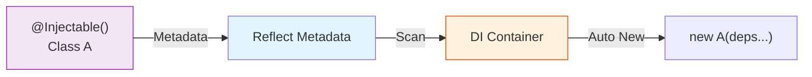

# 第29章：デコレータDI（Nest系）の世界：使うなら守ること✨⚠️

この章のゴールはこれだよ〜😊💡
**「デコレータDIって便利だけど、ルールなしで使うと地雷が増える」**を理解して、**安全運用のコツ（守ること）**を身につけること！✨

---

## 1) デコレータDIって結局なに？🪄💉


ざっくり言うと👇
**クラスにデコレータ（例：`@Injectable()`）を付けて、DIコンテナが“自動で組み立て”してくれる**世界だよ〜🤖✨

* ✅ 便利：`new`を書かなくても依存がつながる🧩
* ✅ 見た目がキレイ：サービス同士の利用が自然に書ける🌸
* ⚠️ こわい：どこで何が登録されてるか分かりにくくなる（魔法が増える）🫥



ポイントはこれ👇
デコレータDIは「雰囲気」じゃなくて、**実は “実行時メタデータ” に頼って動く**のね🧠✨
そのメタデータ周りが、TypeScriptだとクセ強め…！👻⚠️ ([TypeScript][1])

---

## 2) まず知っておくべき：TSのデコレータDIは「設定3点セット」が命🧰✨


TypeScriptのデコレータで“型情報っぽいもの”を実行時に使うには、だいたいこの3つがセットになるよ👇
（ここが壊れると「DIできない🥲」が起きがち）

1. `experimentalDecorators` を有効化（デコレータの実験サポート） ([TypeScript][1])
2. `emitDecoratorMetadata` を有効化（型メタデータを吐く実験サポート） ([TypeScript][1])
3. `reflect-metadata` を読み込む（実験的メタデータAPIのポリフィル）
   ※これは **ECMAScript標準じゃない**点が超重要⚠️ ([TypeScript][1])

例（雰囲気だけつかめればOK）👇

```ts
// main.ts など “一番最初” に近い場所で1回だけ
import "reflect-metadata";
```

---

## 3) いちばんハマる所：interfaceは注入できない（= 実行時に消える）👻🫠


デコレータDIって「コンストラクタの型を見て自動解決してくれる」感じに見えるんだけど…
**interface / type は実行時に存在しない**から、そのままだと注入できないの🥲

Nestのエラーでも、まさにこう言ってるよ👇
`<unknown_token>` が `Object` になるやつ＝**型/インターフェース注入してるのに、トークンが無い**パターン⚠️ ([docs.nestjs.com][2])

だから現実解はこれ👇✨

* **クラス（実体）を注入**する
* または **カスタムトークン + `@Inject(token)`** で注入する ([docs.nestjs.com][2])
* さらに **`import type` だけで読み込むと実体が無い**ので注意⚠️ ([docs.nestjs.com][2])

---

## 4) “守ること” ルール9️⃣（これだけで事故が激減するよ🧯✨）

## ルール①：注入は「constructor注入」基本でいく🏗️💉

* プロパティ注入は「いつセットされるの？」が見えにくく事故りやすい🙈
* まずはコンストラクタ固定がいちばん安全✨

---

## ルール②：interfaceを注入したいなら「トークン注入」にする🔑✨


トークンは **`Symbol`** か **一意な文字列** にして、専用ファイルにまとめるのがおすすめ🧼

```ts
// tokens.ts
export const TOKENS = {
  Clock: Symbol("Clock"),
  Logger: Symbol("Logger"),
} as const;
```

---

## ルール③：Provider登録は “長い書き方” を怖がらない🧾✨

短い書き方はラクだけど、チーム運用だと「何が起きてるか」見えにくいの🥺
`useClass / useValue / useFactory` を使い分けできると強いよ💪
（Nestも公式にこの形で説明してる） ([docs.nestjs.com][3])

例：interface相当を差し替え可能にする👇

```ts
// app.module.ts（イメージ）
import { Module, Inject, Injectable } from "@nestjs/common";
import { TOKENS } from "./tokens";

export interface Clock {
  now(): number;
}

@Injectable()
export class RealClock implements Clock {
  now() { return Date.now(); }
}

@Injectable()
export class UseCase {
  constructor(@Inject(TOKENS.Clock) private clock: Clock) {}
  run() { return this.clock.now(); }
}

@Module({
  providers: [
    UseCase,
    { provide: TOKENS.Clock, useClass: RealClock }, // ←ここが差し替えポイント✨
  ],
})
export class AppModule {}
```

---

## ルール④：設定や環境値は “直読み” しないで provider 化🎛️✨

`process.env` とかを各所で読むと、テストも移植も崩れやすい🥲
`useFactory` で **Configを1か所で組み立てて注入**がキレイ✨ ([docs.nestjs.com][3])

---

## ルール⑤：Moduleの境界（exports/imports）をちゃんと守る🧱✨


DIエラーの王道はこれ👇
「その provider、今の module から見えてないよ！」問題😭
NestのFAQも、**providers / exports / imports** をまず確認してねって言ってるよ📌 ([docs.nestjs.com][2])

---

## ルール⑥：同じproviderを複数moduleで“二重登録”しない🌀

「Feature module と Root module の両方に provider を置く」みたいなやつは、
**同じものを2回インスタンス化**しちゃって不具合の温床になりがち⚠️ ([docs.nestjs.com][2])

---

## ルール⑦：循環依存は “直す” が基本。`forwardRef` は最終手段🧨


循環依存はできれば避けるのが基本。でも、どうしてもなら `forwardRef()` で回避できるよ、って公式にもある😌
ただし「生成順が不定」などの注意もあるから、頼りすぎ注意⚠️ ([docs.nestjs.com][3])

---

## ルール⑧：barrel（`index.ts`）で循環import作りがち！避けて〜🌀📦

Nest公式が **barrel files は循環の原因になるから、module/provider周りは避けてね** って明言してるよ⚠️ ([docs.nestjs.com][3])

---

## ルール⑨：request-scopedは慎重に（パフォーマンスに効く）🐢⚠️

基本は singleton が推奨。request-scoped は “毎リクエスト生成” でコストが増えるよ〜って公式にもある📌 ([docs.nestjs.com][4])
（しかも request scope は依存チェーンを上に伝播するよ〜って説明もある） ([docs.nestjs.com][4])

---

## 5) よくあるエラーの読み方（最短で直すコツ）🔎🛠️

## ✅ 「Cannot resolve dependencies…」が出たら

見る所はこの順でOK👇（だいたいここで直る！）

1. **そのproviderが `providers` に入ってる？** ([docs.nestjs.com][2])
2. 別moduleなら **exports してる？ それを imports してる？** ([docs.nestjs.com][2])
3. `<unknown_token>` が `Object` なら

   * interface/type注入してない？ → **トークン + `@Inject()`** にする ([docs.nestjs.com][2])
   * `import type` だけで実体消してない？ ([docs.nestjs.com][2])

---

## 6) テストでの“差し替え”が本番🔥（ここがDIのごほうび🎁🧪）

デコレータDIは、運用ルールさえ守れば **差し替えテストが超ラク**になるよ😊✨
コツは👇

* provider を **トークン化しておく**
* テストでは **`useValue`（Fake）** に差し替える ([docs.nestjs.com][3])

例（雰囲気）👇

```ts
const fakeClock = { now: () => 1234567890 };

{ provide: TOKENS.Clock, useValue: fakeClock }
```

---

## 7) ミニ課題（30分）⏳💖

## 課題A：Clockをトークン注入にしてみよ⏰✨

* `Date.now()` 直呼びをやめて、`Clock` を注入して使う
* テストでは `fakeClock` に差し替える🧪

## 課題B：わざと `import type` を使って壊してみよ🧨（学習効率UP）

* DIが壊れる感覚を体験すると、以後ぜったい忘れない😂
* 直し方は「実体import」or「トークン注入」だよね✅ ([docs.nestjs.com][2])

## 課題C：barrel file で循環importを作ってみよ🌀

* それが原因でDIが崩れるケースがあるよ、って公式にもある⚠️ ([docs.nestjs.com][3])

---

## 8) AIにお願いするプロンプト例🤖✨（コピペOK）

* 「Nestで interface 相当を注入したい。Symbolトークン設計（tokens.ts）と、`useClass/useValue/useFactory` の使い分け例を作って」
* 「Cannot resolve dependencies が出た。moduleの exports/imports/provider の観点でチェックリスト化して」
* 「循環依存が出た。`forwardRef` を使う前に設計でほどく案（責務分割・中間サービス・イベント化）を3案出して」

---

## 9) 2026/01 “最新状況メモ” 🗓️✨（この章の前提が揺れやすい所だけ）

* `reflect-metadata` は **実験的メタデータAPIのポリフィル**で、**ECMAScript標準ではまだない**（だからこそ運用ルールが大事） ([TypeScript][1])
* TypeScriptの “新デコレータ（TC39）” 側では、**設計時型情報を実行時に使う仕組みがまだ課題**として議論されてる（＝当面は legacy/実験デコレータ前提のフレームワークが多い） ([GitHub][5])
* 参考：本日時点で NestJS は v11 系までリリースが進んでるよ📦✨ ([GitHub][6])
* 参考：TypeScript は GitHubのリリース表示だと 5.9.3 が最新安定として見えてるよ🧷 ([GitHub][7])

---

必要なら、次の章（第30章）の「Service Locator化🕳️／グローバルSingleton乱用👑／循環import🌀」とつなげて、**“デコレータDIでやりがちな地雷”まとめ**も作れるよ〜😆🎀

[1]: https://www.typescriptlang.org/docs/handbook/decorators.html "TypeScript: Documentation - Decorators"
[2]: https://docs.nestjs.com/faq/common-errors "Common errors - FAQ | NestJS - A progressive Node.js framework"
[3]: https://docs.nestjs.com/fundamentals/circular-dependency "Circular dependency | NestJS - A progressive Node.js framework"
[4]: https://docs.nestjs.com/fundamentals/injection-scopes "Injection scopes | NestJS - A progressive Node.js framework"
[5]: https://github.com/microsoft/TypeScript/issues/57533?utm_source=chatgpt.com "Expose design-time type information in TC39 decorator ..."
[6]: https://github.com/nestjs/nest/releases?utm_source=chatgpt.com "Releases · nestjs/nest"
[7]: https://github.com/microsoft/typescript/releases?utm_source=chatgpt.com "Releases · microsoft/TypeScript"
