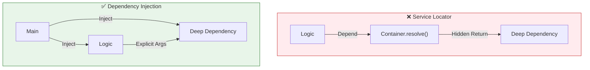
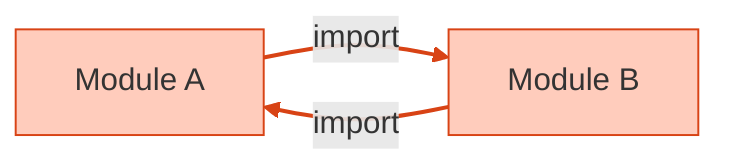

# 第30章：アンチパターン総まとめ＆総合演習🎀🏁

## 今日のゴール🎯✨

この章が終わったら、こんな状態になってます👇😊

* 「DIっぽいけど地雷💣」をサッと見抜ける👀
* 依存を **最大3つ** にしぼったミニアプリを完成できる🧩
* **Composition Root（組み立て場所）** を守って、テストが書ける🧪💖
* 循環import🌀を「検出→直す」までできる🔧✨

---

## 30-1. アンチパターン図鑑💣📚（“やりがち”だけ先に潰す！）


### ① Service Locator化🕳️（DIっぽい顔してる最大の罠）

**症状**：クラスの中で `container.resolve(...)` し始める😇
**何がダメ？**

* 依存が「引数に出てこない」＝読んでも分からない🙈
* 実行してみないと壊れる場所が分からない（地獄）
  Service Locatorは「依存を隠す」のが問題になりやすい、とよく整理されています。([blog.ploeh.dk][1])

**ダメ例（におい）**

```ts
// ❌ usecaseの中で resolve…依存が隠れる
class StudyUseCase {
  add() {
    const repo = container.resolve("StudyRepo")
    // ...
  }
}
```

**改善の合言葉🪄**：
✅「使う側は *お願いしない*。最初から渡される（注入される）」



---

### ② グローバルSingleton乱用👑（“便利”が後で爆発💥）

**症状**：どこからでも `Logger.instance` とかで呼べるやつ
**何がダメ？**

* 依存が隠れる（＝テストで差し替えがしんどい）
* グローバル状態が混ざって、挙動が読めない😵‍💫
  「グローバルにして回避するのはコード臭い（依存を隠す）」という指摘がよくあります。([Stack Overflow][2])

**改善の合言葉🪄**：
✅「必要なら、Composition Rootで1回だけ作って渡す」📍

---

### ③ 循環import🌀（TS/ESMでハマりやすい定番）

**症状**：AがBをimport、BがAをimport、ぐるぐる🌀
**困ること**：

* 実行順で `undefined` が出たり、初期化が壊れたり😇
* “分割したのに” 逆に把握不能になる🙃



**検出方法（おすすめ2つ）🔎✨**

* ESLintの `import/no-cycle`（循環依存を検出するルール）([GitHub][3])
* `madge`（循環依存を見つけられるツール）([npm][4])

---

### ④ 「デコレータDIに寄りかかりすぎ」問題✨⚠️（TSの最新事情込み）

デコレータDI（Nest系・tsyringe系）は便利なんだけど、**TypeScriptは型が実行時に消える👻**ので、実行時に型情報を使いたい場合は追加の仕組みが要ることが多いです。
たとえば **tsyringe** は `reflect-metadata` を使う前提や、`emitDecoratorMetadata` / `experimentalDecorators` が必要になる例がよく紹介されています。([GitHub][5])
また、TypeScriptのデコレータは仕様が段階的に整理されてきていて、従来のメタデータ（設計時の型情報）扱いは論点になり続けています。([GitHub][6])

**この章の結論😊**：
✅ まずは「デコレータ無し」で勝てる形（手動DI＋Composition Root）を完成できるようになろう🎀
（デコレータDIは、その後でも全然遅くないよ✨）

---

## 30-2. “地雷回避”チェックリスト✅🧡（3つだけ！）

コード見た瞬間に、これだけ確認してね👇😆

1. **依存がコンストラクタ/引数に全部見えてる？** 👀
2. **new/importの集中場所（Composition Root）がある？** 📍([blog.ploeh.dk][7])
3. **テストでFake/Spyに差し替えできる？** 🧪

3つともYESなら、かなり健康✨

---

## 30-3. 総合演習：ミニアプリ「学習記録📚🌸」を作ろう（依存は最大3つ！）

### 仕様（ちっちゃくてOK😊）

* `add`：科目と分数を記録する📝
* `list`：記録を一覧表示する📚
* 依存はこの3つだけに制限👇

  * `clock`（時間）⏰
  * `repo`（保存）🗄️
  * `logger`（ログ）🗣️

---

### 設計ルール（これを守れば勝ち🏆）

* `domain` は `infra` を **importしない** 🚫
* `domain` は「インターフェース（型）」だけ知ってる📜
* `main`（エントリポイント）で組み立てて渡す📍（Composition Root）

---

### フォルダ例🗂️✨

```txt
src/
  domain/
    StudyEntry.ts
    StudyUseCase.ts
  ports/
    Clock.ts
    Logger.ts
    StudyRepo.ts
  infra/
    SystemClock.ts
    ConsoleLogger.ts
    JsonFileStudyRepo.ts
  main.ts
test/
  StudyUseCase.test.ts
```

---

## 30-4. 実装してみよう💻✨（サンプルコードつき）

### (1) ports（境界の型）📜

```ts
// src/ports/Clock.ts
export type Clock = {
  now(): Date
}
```

```ts
// src/ports/Logger.ts
export type Logger = {
  info(message: string): void
  error(message: string): void
}
```

```ts
// src/ports/StudyRepo.ts
import type { StudyEntry } from "../domain/StudyEntry"

export type StudyRepo = {
  append(entry: StudyEntry): Promise<void>
  list(): Promise<StudyEntry[]>
}
```

---

### (2) domain（本体ロジック）🍱✨

```ts
// src/domain/StudyEntry.ts
export type StudyEntry = {
  id: string
  subject: string
  minutes: number
  createdAtIso: string
}
```

```ts
// src/domain/StudyUseCase.ts
import type { Clock } from "../ports/Clock"
import type { Logger } from "../ports/Logger"
import type { StudyRepo } from "../ports/StudyRepo"
import type { StudyEntry } from "./StudyEntry"

export type StudyDeps = {
  clock: Clock
  repo: StudyRepo
  logger: Logger
}

export class StudyUseCase {
  constructor(private readonly deps: StudyDeps) {}

  async add(subject: string, minutes: number): Promise<StudyEntry> {
    if (!subject.trim()) throw new Error("subject is empty")
    if (!Number.isFinite(minutes) || minutes <= 0) throw new Error("minutes must be > 0")

    const now = this.deps.clock.now()
    const entry: StudyEntry = {
      id: `${now.getTime()}-${Math.random().toString(16).slice(2)}`,
      subject,
      minutes,
      createdAtIso: now.toISOString(),
    }

    await this.deps.repo.append(entry)
    this.deps.logger.info(`added: ${subject} (${minutes}m)`)
    return entry
  }

  async list(): Promise<StudyEntry[]> {
    return await this.deps.repo.list()
  }
}
```

ここがポイント💖

* `StudyUseCase` は **consoleもfsも知らない** 🙈
* 依存は `deps` に全部まとまって見える👀✨（隠れ依存ゼロ！）

---

### (3) infra（外の世界）🚚✨

```ts
// src/infra/SystemClock.ts
import type { Clock } from "../ports/Clock"

export class SystemClock implements Clock {
  now(): Date {
    return new Date()
  }
}
```

```ts
// src/infra/ConsoleLogger.ts
import type { Logger } from "../ports/Logger"

export class ConsoleLogger implements Logger {
  info(message: string): void {
    console.log(message)
  }
  error(message: string): void {
    console.error(message)
  }
}
```

```ts
// src/infra/JsonFileStudyRepo.ts
import { promises as fs } from "node:fs"
import type { StudyRepo } from "../ports/StudyRepo"
import type { StudyEntry } from "../domain/StudyEntry"

export class JsonFileStudyRepo implements StudyRepo {
  constructor(private readonly filePath: string) {}

  private async readAll(): Promise<StudyEntry[]> {
    try {
      const json = await fs.readFile(this.filePath, "utf8")
      const data = JSON.parse(json) as unknown
      return Array.isArray(data) ? (data as StudyEntry[]) : []
    } catch {
      return []
    }
  }

  async append(entry: StudyEntry): Promise<void> {
    const all = await this.readAll()
    all.push(entry)
    await fs.writeFile(this.filePath, JSON.stringify(all, null, 2), "utf8")
  }

  async list(): Promise<StudyEntry[]> {
    return await this.readAll()
  }
}
```

---

### (4) Composition Root（mainで組み立てる📍）🏗️✨

```ts
// src/main.ts
import { StudyUseCase } from "./domain/StudyUseCase"
import { SystemClock } from "./infra/SystemClock"
import { ConsoleLogger } from "./infra/ConsoleLogger"
import { JsonFileStudyRepo } from "./infra/JsonFileStudyRepo"

async function main() {
  // ✅ Composition Root：ここだけが "new" 祭りOK🎉
  const clock = new SystemClock()
  const logger = new ConsoleLogger()
  const repo = new JsonFileStudyRepo("./study-log.json")

  const usecase = new StudyUseCase({ clock, logger, repo })

  const [cmd, ...args] = process.argv.slice(2)

  if (cmd === "add") {
    const subject = args[0] ?? ""
    const minutes = Number(args[1] ?? "0")
    await usecase.add(subject, minutes)
    return
  }

  if (cmd === "list") {
    const list = await usecase.list()
    for (const e of list) {
      console.log(`${e.createdAtIso} | ${e.subject} | ${e.minutes}m`)
    }
    return
  }

  console.log(`Usage:
  add <subject> <minutes>
  list`)
}

main().catch((e) => {
  console.error(e)
  process.exitCode = 1
})
```

---

## 30-5. テスト🧪💖（Fake/Spyで「DIの旨み」を味わう！）

### VitestでOK（最近の定番枠）🧪✨

VitestはVite由来の高速テストランナーで、Viteを使ってなくても使えるよ〜って説明されています。([vitest.dev][8])
あと最近はVitest 4のリリースも出てます。([vitest.dev][9])

```ts
// test/StudyUseCase.test.ts
import { describe, it, expect } from "vitest"
import { StudyUseCase } from "../src/domain/StudyUseCase"
import type { Clock } from "../src/ports/Clock"
import type { Logger } from "../src/ports/Logger"
import type { StudyRepo } from "../src/ports/StudyRepo"
import type { StudyEntry } from "../src/domain/StudyEntry"

class FakeClock implements Clock {
  constructor(private readonly fixed: Date) {}
  now(): Date { return this.fixed }
}

class InMemoryRepo implements StudyRepo {
  private items: StudyEntry[] = []
  async append(entry: StudyEntry): Promise<void> { this.items.push(entry) }
  async list(): Promise<StudyEntry[]> { return [...this.items] }
}

class SpyLogger implements Logger {
  infos: string[] = []
  errors: string[] = []
  info(message: string): void { this.infos.push(message) }
  error(message: string): void { this.errors.push(message) }
}

describe("StudyUseCase", () => {
  it("addすると記録が増える🎀", async () => {
    const clock = new FakeClock(new Date("2026-01-01T00:00:00.000Z"))
    const repo = new InMemoryRepo()
    const logger = new SpyLogger()

    const usecase = new StudyUseCase({ clock, repo, logger })
    await usecase.add("TypeScript", 30)

    const list = await usecase.list()
    expect(list).toHaveLength(1)
    expect(list[0].subject).toBe("TypeScript")
    expect(logger.infos[0]).toContain("added:")
  })
})
```

この瞬間が最高💖

* `fs` 触ってないのに保存の挙動をテストできる🧪✨
* 時刻も固定できる⏰（テストが安定！）

---

## 30-6. 循環importを「検出→0にする」🌀➡️0️⃣✨

### ① ESLintで検出（import/no-cycle）🧹

`import/no-cycle` は循環依存を検出するルールとして用意されています。([GitHub][3])

### ② madgeで検出🔎

madgeは循環依存を見つけられるツールです。([npm][4])

例（イメージ）👇

```bash
npx madge --circular --extensions ts src
```

---

## 30-7. AI（Copilot/Codex）で“最終仕上げ”🤖✨（おすすめプロンプト）

そのまま貼って使ってOKだよ😊💕

* 「このコード、**Service Locator化**してる箇所ある？あったら指摘して修正案ちょうだい🕳️」
* 「`domain` が `infra` を import してないかチェックして、違反があれば直して🚫」
* 「依存の向きを図にして（箱と矢印で）📦➡️📦」
* 「テストが不安定になりそうな依存（時間/乱数/IO）を列挙して、Fake化の案を出して⏰🎲🧪」

---

## 30-8. おまけ：本気のDIコンテナを使うなら？🧰✨（触れるだけ）

「手動DIが苦しくなったら」選択肢が増えてきます👇

* **tsyringe**：軽量。デコレータ＋`reflect-metadata`前提になりやすい。([GitHub][5])
* **Inversify**：大きめ。次期メジャー（v8）の計画も出ています。([InversifyJS][10])
* **Awilix**：関数/Factory寄りのDIが得意な流派。npmでは 12.x 系が見えます。([npm][11])

でもね…😊
**コンテナ導入より大事なのは「Composition Rootを守る」こと**だよ📍✨
（ここ崩すと、どのコンテナでも一気に辛くなる🥲）

---

## まとめ🎀🏁

この章でいちばん大事なのはコレ👇😆💖

* **依存を隠さない**（Service Locator化しない）🕳️❌
* **グローバルで逃げない**（Singleton乱用しない）👑❌
* **循環importを0にする**🌀❌
* **組み立てはmainだけ**（Composition Root）📍✅ ([blog.ploeh.dk][7])

---

[1]: https://blog.ploeh.dk/2010/02/03/ServiceLocatorisanAnti-Pattern/?utm_source=chatgpt.com "Service Locator is an Anti-Pattern - ploeh blog"
[2]: https://stackoverflow.com/questions/137975/what-are-drawbacks-or-disadvantages-of-singleton-pattern?utm_source=chatgpt.com "What are drawbacks or disadvantages of singleton pattern?"
[3]: https://github.com/import-js/eslint-plugin-import/blob/main/docs/rules/no-cycle.md?utm_source=chatgpt.com "eslint-plugin-import/docs/rules/no-cycle.md at main"
[4]: https://www.npmjs.com/package/madge?utm_source=chatgpt.com "madge"
[5]: https://github.com/microsoft/tsyringe?utm_source=chatgpt.com "microsoft/tsyringe: Lightweight dependency injection ..."
[6]: https://github.com/microsoft/TypeScript/issues/57533?utm_source=chatgpt.com "Expose design-time type information in TC39 decorator ..."
[7]: https://blog.ploeh.dk/2011/07/28/CompositionRoot/?utm_source=chatgpt.com "Composition Root - ploeh blog"
[8]: https://vitest.dev/?utm_source=chatgpt.com "Vitest | Next Generation testing framework"
[9]: https://vitest.dev/blog/vitest-4?utm_source=chatgpt.com "Vitest 4.0 is out!"
[10]: https://inversify.io/blog/planning-inversify-8-0-0/?utm_source=chatgpt.com "Planning InversifyJS 8 - Feedback Needed!"
[11]: https://www.npmjs.com/package/awilix/v/1.0.0?activeTab=versions&utm_source=chatgpt.com "awilix"
