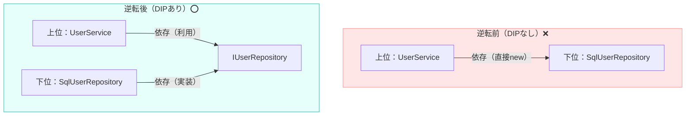

# 第01章：DIPってなに？まずは超ざっくり掴む🧠✨

## この章のゴール🎯✨

この章が終わると、こんな状態になれます👇😄

* 「依存」って言葉を、コードで説明できる🔗
* DIPが何を守りたい原則か、ひとことで言える🛡️
* “怖い変更”が起きる理由を、ふんわり理解できる😱➡️🙂
* DIPっぽい形（interfaceを間に挟む）を見て「おっ、それね！」ってなる👀✨

---

## 1) そもそも「依存」ってどういう意味？🔗🤔


プログラムでいう「依存」は、ざっくり言うと👇

> **AがBを使っている（AがBなしでは成り立たない）状態**🔗

もう少し“実務で効く”言い方にすると…👇
✅ **Bが変わると、Aも直さなきゃいけなくなる可能性が高い** ←これがしんどいポイント😵‍💫

### 依存が生まれやすい“あるある”3つ🧷

* **型として使ってる**（引数・戻り値・フィールドに登場）📦
* **`new` してる**（具象クラスを直接生成）🧱
* **静的メソッド/具体ライブラリを直呼び**（置き換えにくい）📌

---

## 2) DIPが解決したい“怖い変更”ってなに？😱🔥

DIPが本気で守りたいのは、ここです👇

### 「本当に大事なコード」が、外側の都合で壊れるのが怖い😵

たとえば…

* DBが **SQL Server → PostgreSQL** に変わった🗄️🔁
* 外部APIの仕様が変わった🌐🔁
* ファイル保存が **ローカル → クラウド** になった☁️🔁

こういう変更って、現場だと普通に起こります😇（むしろ避けられない）
なのに、業務ロジック（例：会員登録のルール、料金計算、在庫引当…）がそれに巻き込まれて崩れると、地獄です🔥😵‍💫

---

## 3) DIPを一言でいうと？🧩✨（超大事）


DIP（Dependency Inversion Principle / 依存性逆転の原則）は、SOLIDの1つで、定義はよくこう書かれます👇🙂

* **上位モジュールは下位モジュールに依存してはいけない**🙅‍♀️
  **両方とも抽象に依存すべき**☁️
* **抽象は詳細に依存してはいけない**🙅‍♀️
  **詳細が抽象に依存すべき**🔁

この2つがセットです。([Stackify][1])

### ここでいう「上位」「下位」って？🏰🌊

* **上位（守りたい）**：業務ルール・アプリの方針（Policy）❤️
* **下位（変わりやすい）**：DB/HTTP/ファイル/外部サービスなどの実装詳細（Details）🌊

つまりDIPは、ひとことで言うと👇

> **「大事な中心（業務）を、変わりやすい外側（DBやAPI）から守る設計」**🛡️❤️

---

## 4) 「逆転」って、何が逆になるの？🙃🔁

普通に書くと、依存はこうなりがち👇

```
業務（上位） → DB実装（下位）
```

これだと、DBの都合が変わるたびに業務側も揺れます😇🗄️💥

DIPだと、こうします👇

```
業務（上位） → interface（抽象） ← DB実装（下位）
```

“業務が見る先”を **具象（DB実装）じゃなくて抽象（interface）にする**のがコアです✨
（そして、DB実装側がそのinterfaceに合わせる＝「詳細が抽象に依存」🔁）

---

## 5) 超ミニ例で「空気」を掴もう🍬👀

### ❌ DIPなし：業務がDB実装にベタ依存😵

```
public class UserService
{
    private readonly SqlUserRepository _repo = new SqlUserRepository();

    public void Register(string name)
    {
        // ここに「登録ルール」みたいな大事な処理があるとする
        _repo.Insert(name);
    }
}

public class SqlUserRepository
{
    public void Insert(string name)
    {
        // DBにINSERTする詳細…
    }
}
```



ここでSQLの仕様が変わったり、DBを差し替えたいとなった瞬間…

**UserServiceまで一緒に揺れる**可能性が出ます😱🌀

---

### ✅ DIPあり：業務は“約束（interface）”だけを見る🤝✨

```
public interface IUserRepository
{
    void Insert(string name);
}

public class UserService
{
    private readonly IUserRepository _repo;

    public UserService(IUserRepository repo)
    {
        _repo = repo;
    }

    public void Register(string name)
    {
        // 大事な登録ルールはここに集中できる❤️
        _repo.Insert(name);
    }
}

public class SqlUserRepository : IUserRepository
{
    public void Insert(string name)
    {
        // DBにINSERTする詳細…
    }
}
```

これで何が嬉しいかというと👇😍

* `UserService` は **IUserRepository しか知らない**（DB実装の都合を知らない）☁️
* DBを差し替えても、基本は **実装クラス側を変えるだけ**で済む🎛️
* 「登録ルール」という中心が、外の変更から守られる🛡️❤️

DIPの“雰囲気”はこれでOKです👍✨

---

## 6) DIPで得すること（この章では3つだけ覚えよう）🎁✨

### ① 変更が怖くなくなる😱➡️😄

「DB変えるよ！」と言われても、業務ロジックが巻き込まれにくい🛡️

### ② テストがめっちゃ楽になる🧪✨

DBなしでも、Fakeを差し込んで動かせるようになります（後の章でやるよ）🎮

### ③ チーム開発で衝突しにくい🤝

「業務ルール担当」と「DB担当」が、interfaceを境に分業しやすい🧱✨

---

## 7) よくある誤解を先に1個だけ潰す🧯😆

### ❓「DIPって、DI（Dependency Injection）と同じ？」

**似てるけど別モノ**です🙂

* DIP：**設計の考え方（原則）**🧠
* DI：DIPを実現しやすくする **実装テク（注入）**💉

この違いは後半でちゃんとスッキリさせます👌✨

---

## 8) 1分ミニ演習📝😄（依存を見つけるゲーム）

次のコード、`UserService` は何に依存してる？🔍✨
（ヒント：**型**と**new**に注目👀）

```
public class UserService
{
    public void Register(string name)
    {
        var repo = new SqlUserRepository();
        repo.Insert(name);
    }
}
```

✅ 答え：`UserService` は **SqlUserRepository（具象クラス）に依存**してます🔗
→ だから `SqlUserRepository` の都合が変わると、`UserService` も巻き込まれがち😵‍💫

---

## 9) AIに手伝ってもらう小ワザ🤖💡（安全運転）

Copilot / Codex みたいなAI拡張に、こう聞くと学びが速いです👇😄

* 「このクラスの依存関係を、`A → B` 形式で列挙して」🗺️
* 「DIPっぽくするなら、どこにinterfaceを置くのが最小？」🧩
* 「interface名と責務を、2案出して。短くね！」✍️

⚠️ 注意：AIはたまに **interface作りすぎ**提案してきます😂
この段階では「境界（DB/外部API/ファイル）に近いところから最小で」が正解寄りです👌✨

---

## まとめ🌈✨

* **依存＝AがBを使っていて、Bの変更がAに波及しやすい状態**🔗
* DIPは、**業務（上位）を、実装詳細（下位）から守るための原則**🛡️❤️
* コツは、**業務はinterface（抽象）に依存**し、**詳細がそれに合わせる**🙃🔁 ([Stackify][1])
* 2026時点のC#は **C# 14 / .NET 10** が最新として案内されています（DIPの学びはこの上でやると気持ちいい）✨([Microsoft Learn][2])
* Visual Studioも **Visual Studio 2026** が案内されています🛠️✨([Visual Studio][3])

---

## 次章予告ちょい見せ👀✨

次は「変更地獄って実際どんな感じ？」を、わざと体験してもらいます🔥😇
「うわ…これ直したくない…」ってなったら勝ちです😂🎮

[1]: https://stackify.com/dependency-inversion-principle/?utm_source=chatgpt.com "SOLID Design Principles Explained: Dependency Inversion"
[2]: https://learn.microsoft.com/en-us/dotnet/csharp/whats-new/csharp-14?utm_source=chatgpt.com "What's new in C# 14"
[3]: https://visualstudio.microsoft.com/downloads/?utm_source=chatgpt.com "Visual Studio & VS Code Downloads for Windows, Mac, Linux"
