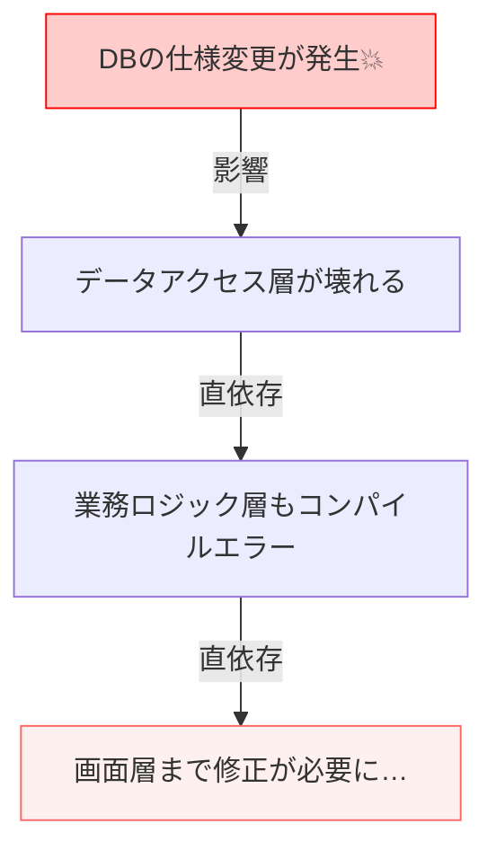

# 第02章：現場で起きがちな“変更地獄”を見よう🔥😵

この章は「DIPって必要なの…？」って思ってる人ほど効きます💉✨
まずは **“変更が来た時にツラいコード”** を、現場あるあるで体験していこ〜！😆🧠

ちなみに今のC#まわりは、.NET 10（LTS）＋C# 14 が現行ど真ん中で、Visual Studio 2026 も出ています🆕🪟✨（この教材もその前提の書き味でいくね） ([Microsoft for Developers][1])

---

## 今日のゴール🎯✨

章を読み終わったら、これができるようになります👇😄

* 「変更が入った時、どこが燃えやすいか🔥」を見抜ける👀
* 「影響範囲が読めない🌀」って何が起きてるのか説明できる🗣️
* 「業務ロジックが下位都合に引きずられる🫠」を具体例で分かる✅

---

## 2-1. 変更って悪いこと？🤔 → 悪いのは“変更が連鎖すること”😱🔗


変更そのものは普通です🙆‍♀️
DBのカラム名変わる📦、外部APIの仕様変わる🌐、ログの出し方変える📝…
問題は **「1個直すと、関係ない場所まで壊れる」** こと💥

この状態がいわゆる **“変更地獄”** 🔥😵
そして、DIPはこの地獄を減らすための強力な考え方です🛡️✨

---

## 2-2. DBやAPIが変わったらどうなる？🗄️➡️🌐

ここからは、ありがちな「ある日突然くるやつ」シリーズ📩😇



### パターンA：DBの変更🗄️💣（カラム名変更・型変更・DB製品変更）

「テーブル定義が変わった」
「SQL Server から PostgreSQL に移行することになった」
たとえば「Usersテーブルの `Name` が `DisplayName` に変わった」みたいなやつ😇
影響が小さそうに見えるのに…

* SQL文字列がいろんな場所に散ってる🧨
* `reader["Name"]` が各所に出てくる🪤
* しかもコンパイルでは気づけない形（文字列）で死ぬことがある😱

> ちなみにSQL Server系のアクセスは **Microsoft.Data.SqlClient が推奨**、System.Data.SqlClient は段階的に非推奨の流れです🧠（現場でも“下位”が変わりやすい例として覚えておくと◎） ([Microsoft Learn][2])

---

### パターンB：外部APIの変更🌐💥（URL・認証・JSON形式）

* エンドポイントが変わった `/v1/...` → `/v2/...` 😇
* 認証方式が変わった Bearer必須になった🔑
* JSONの形が変わった（プロパティ名や入れ子）📦

これが怖いのは **コンパイルは通るのに、実行して初めて爆死** しがちなこと💥😱
（テストが薄いと、リリース後に発覚しやすい…😇）

---

## 2-3. “影響範囲が読めない”状態とは？🌀👀


変更地獄の本体はここです🔥
「どこ直せばいいか分からない」って、だいたいこういう症状👇

### 症状チェック✅（あるある度MAX😂）

* 1つのクラスが **DBもHTTPもファイルも** やってる🧺🍱
* 業務ロジックの中に **SQL/URL/JSON/例外処理** が混ざってる🧂
* “同じ目的の修正”なのに、直す場所が点在する🗺️🧩
* 「この修正で他は壊れないよね…？」が言えない😵‍💫

---

## 2-4. 典型例：業務ロジックが下位都合に引きずられる🫠⚙️


ここが超大事ポイント💡✨
「本当は業務だけ考えたいのに、下の都合（DB/API）が口出ししてくる」状態です😇

### 例：業務クラスが“DBの都合”を知りすぎる🗄️🤐

たとえば「ユーザー登録」って本来は…

* 入力チェック✅
* ルールに沿って登録する🧠
* 必要なら通知する📩

みたいな話のはずなのに、コードがこうなってくる👇😱

```csharp
using Microsoft.Data.SqlClient; // DB都合が業務層に侵入😇
using System.Net.Http.Json;

public class UserRegistrationService
{
    public async Task RegisterAsync(string name, string email)
    {
        // ✅業務の話：入力チェック
        if (string.IsNullOrWhiteSpace(name)) throw new ArgumentException("name");

        // 😱DB都合：SQL文字列・接続文字列・カラム名
        using var con = new SqlConnection("Server=...;Database=...;Trusted_Connection=True;");
        await con.OpenAsync();

        using var cmd = con.CreateCommand();
        cmd.CommandText = "INSERT INTO Users(Name, Email) VALUES (@Name, @Email)";
        cmd.Parameters.AddWithValue("@Name", name);
        cmd.Parameters.AddWithValue("@Email", email);
        await cmd.ExecuteNonQueryAsync();

        // 😱API都合：URLやJSON形式が業務層に混入
        using var http = new HttpClient();
        var res = await http.PostAsJsonAsync("https://api.example.com/v1/welcome",
            new { email = email, displayName = name });

        if (!res.IsSuccessStatusCode)
            throw new Exception("Welcome API failed"); // 😇例外の扱いも雑になりがち
    }
}
```

これ、何がマズいかというと…👇😵

* DBのカラム名が変わると **業務クラスを編集** しないといけない🗄️✍️
* APIのURLやJSONが変わると **業務クラスを編集** しないといけない🌐✍️
* 「ユーザー登録」という大事な業務が、下位の都合でグラグラ揺れる🫠🌀

つまり…
**“守りたい中心（業務）”が、変わりやすい外側（DB/API）に振り回されてる** ってことです😱

> これを防ぐ考え方が、後で出てくる「上位を守る🛡️」「抽象に依存する☁️」につながります✨（第4〜6章あたりでガッチリやるよ！）

---

## 2-5. 変更依頼が来た！どこが燃える？🔥🧯（ミニ演習）

次の“変更依頼”が来たとします📩😇

1. DBのカラム `Name` が `DisplayName` に変わりました🗄️
2. Welcome API が `/v2/welcome` になり、`displayName` が `name` になりました🌐
3. API呼び出しは認証ヘッダー必須になりました🔑

さっきのコードで、直すところを数えてみてね👇👀
（心の中でOK🙆‍♀️）

* 接続文字列の扱いどうする？🧷
* SQL文どこ直す？🧨
* `new HttpClient()` どこで管理する？🌀
* URLとJSONの変更はどこに閉じ込める？📦

**答え**：
直す場所が「UserRegistrationService 1箇所」だけじゃなく、今後同種コードが増えるほど **各所に散らばって“捜索ゲーム”** になります🎮😇
そして「漏れ」が起きます💥（漏れたら本番で爆発💣）

---

## 2-6. “変更地獄予備軍”チェックリスト✅😵‍💫

このどれかに当てはまったら、黄色信号だよ〜🚥💛

* 業務クラスに **SQL文字列** がある🗄️🧨
* 業務クラスに **URL** がある🌐📍
* 業務クラスが **DB例外（SqlExceptionなど）** を直接さばいてる🧯
* 業務クラスが **HTTPの成否（StatusCode）** を直接見てる👀
* 業務クラスが **ファイルパス** を知ってる📁
* 変更時に「とりあえず検索🔎」が最初の作業になってる😂

---

## 2-7. AIを“安全に”使うコツ（この章の範囲）🤖🦺✨

AI便利だけど、今はまだ「設計の芯」が育ってない時期なので、**質問の仕方を固定**すると事故りにくいよ〜😄

おすすめプロンプト例👇（そのまま使ってOK✨）

* 「このコード、変更に弱いポイントを“箇条書きで”教えて。業務ロジックが下位都合に引きずられてる箇所も指摘して」🧠
* 「DB変更（カラム名変更）が来た時の影響範囲を推測して、漏れやすい点を挙げて」🗄️🔎
* 「API変更（URL/JSON/認証）に強くするには、責務をどう分けるべき？」🌐🧩

（この時点では“実装”より **観察力👀** を伸ばすのが目的だよ✨）

---

## まとめ🎀✨（ここだけ覚えて帰ってOK！）

* 変更は普通🙆‍♀️、でも **変更が連鎖すると地獄🔥**
* “影響範囲が読めない”のは、依存が散らかってるサイン🌀
* 業務ロジックがDB/API都合に引きずられると、中心が守れない🫠
* 次章は「嫌なコードを体験（newだらけ）😈🧱」で、もっとハッキリ痛みを体感するよ〜！🔥😆

次は第3章いこっか？🧱😈✨

[1]: https://devblogs.microsoft.com/dotnet/announcing-dotnet-10/?utm_source=chatgpt.com "Announcing .NET 10"
[2]: https://learn.microsoft.com/en-us/sql/connect/ado-net/introduction-microsoft-data-sqlclient-namespace?view=sql-server-ver17&utm_source=chatgpt.com "Introduction to Microsoft.Data.SqlClient Namespace"
