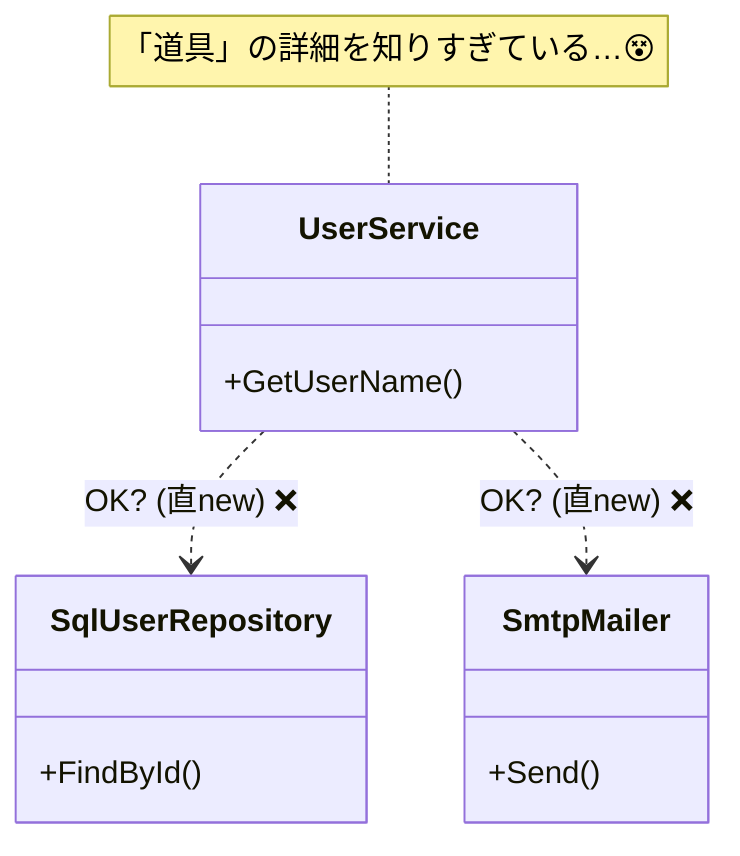

# 第03章：まずは嫌なコードを体験（newだらけ）😈🧱

この章はね、「DIPって何？」を頭で理解する前に、**“DIPが無いと何がつらいのか”**を体で感じる回だよ〜🧠➡️💢
いったんわざと「嫌なコード」を触って、**変更が怖い理由**をハッキリさせようね👀✨

ちなみに今の最新環境だと、.NET は **.NET 10（LTS）**が “latest” 扱いだよ（10.0.2 が 2026-01-13 時点の最新リリース）([Microsoft][1])
言語は **C# 14** が最新で、.NET 10 SDK や Visual Studio 2026 系で試せるよ〜([Microsoft Learn][2])（でもこの章は基本構文だけでOK🙆‍♀️）

---

# 3.1 まずは「newだらけ」地獄コードを見てみよ〜😵‍💫🧱


### 今日のお題：ユーザー情報を取って表示する（よくあるやつ）📇✨

「ユーザーIDを渡すと、ユーザー名を返す」みたいな処理って、めっちゃよくあるよね🙂
で、**悪い例**ではこうなる👇

* 業務ロジック側のあちこちで `new SqlUserRepository()` が出てくる💥
* さらに `new SmtpMailer()` とか `new Logger()` とかも散らばる💥💥
* 「どこを直せばいいの…？」ってなる👻

---

# 3.2 嫌なコード例（new が散らばる）🧨🧨🧨


下のコード、動くっちゃ動く。
でも「変更」に弱い…！それを体験しよう😈



### 例：Repository を直接 new しちゃう😵


```csharp
// UserService.cs
public sealed class UserService
{
    public string GetUserName(int userId)
    {
        // ❌ ここで具体クラスを new（しかも接続文字列まで直書き）
        var repo = new SqlUserRepository(
            connectionString: "Server=localhost;Database=AppDb;Trusted_Connection=True;");

        var user = repo.FindById(userId);

        // ❌ ついでにメール送信もここで new
        var mailer = new SmtpMailer("smtp.example.com");
        mailer.SendWelcomeIfFirstLogin(user);

        return user.Name;
    }
}
```

### さらに別の場所でも new してたら…😇

```csharp
// WeeklyReportJob.cs
public sealed class WeeklyReportJob
{
    public void Run()
    {
        // ❌ ここにも SqlUserRepository new が出てくる
        var repo = new SqlUserRepository(
            "Server=localhost;Database=AppDb;Trusted_Connection=True;");

        var users = repo.FindAllActive();
        Console.WriteLine($"Active users: {users.Count}");
    }
}
```

### Repository 側（下位の都合がギュッと詰まってる）🗄️💦

```csharp
// SqlUserRepository.cs
public sealed class SqlUserRepository
{
    private readonly string _connectionString;

    public SqlUserRepository(string connectionString)
        => _connectionString = connectionString;

    public User FindById(int userId)
    {
        // ここに SQL / ADO.NET / EF / Dapper 等の “インフラ都合” が入る想定
        // （今は例なのでダミーで返す）
        return new User(userId, name: "Taro");
    }

    public List<User> FindAllActive()
        => new List<User> { new User(1, "Taro"), new User(2, "Hanako") };
}

public sealed record User(int Id, string Name);
```

> ここまでで「うん、ありがち〜」って思ったら大正解😂✨


> でも、この “ありがち” が後で爆発する💥💥💥

---

# 3.3 「修正ポイント探しゲーム」開始〜！👀🎮🔍


## ルール：仕様変更が来たよ📩😱

上司「来月からユーザー情報、DBじゃなくて **外部API** から取ってね！」🌐💬
あなた「えっ……😇」

つまりこういう変更👇

* 旧：`SqlUserRepository`（DB）
* 新：`ApiUserRepository`（HTTP API）

---

## ① まずは “どこを直す？” を探してみよう🔍💨

やることは単純！

### ✅ 手動で探す（Visual Studio の場合）🧭

* `Ctrl + Shift + F` で検索🔍
* 検索ワード：`new SqlUserRepository`
* 出てきた場所をメモ📝✨

### ✅ VS Code の場合も同じだよ💻

* `Ctrl + Shift + F` で検索🔍
* ワード：`new SqlUserRepository`

> この時点で気付くはず：
> **「直す場所が “複数” ある」＝すでにだるい** 😵‍💫💦

---

## ② ありがちな事故パターン😱🚑

* 1箇所だけ直して、別の場所が古いまま残る💥
* ある画面だけDB、別の画面だけAPI、みたいな混在が起きる🌀
* “なんか動くけど挙動が違う” が爆誕する👻

これね、地味に一番つらいタイプ😇

---

# 3.4 「差し替えできない」のがつらい理由😢🔁


## つらさ①：変更が “点” じゃなく “面” になる🧱📌


`new SqlUserRepository()` が散らばってると、変更が

* 1箇所修正 ✅
  じゃなくて
* 10箇所修正 😭（しかも漏れる）

になるのね…💦

---

## つらさ②：テストがしにくい（＝確認がめんどい）🧪😵

たとえば「UserService の挙動だけ確認したい」って思っても…

* `UserService` の中で勝手に `new SqlUserRepository()` しちゃう
* するとテスト時に **DB（または接続設定）必須** になる
* つまりテストが遅い・壊れやすい・面倒😇

「本当は Fake（偽物）に差し替えて高速に試したい」のに、できないってやつ💔

---

## つらさ③：責任が混ざって読みにくい🌀📚

`UserService` のやりたいことは本来こう👇

* 「ユーザーの名前を返す」
  なのに、

* DB接続文字列

* DB実装の選択

* メール送信の選択
  まで混ざると、**話がゴチャる**😵‍💫

---

# 3.5 この章のミニ演習（超たいせつ）📝✨


## 演習A：new を数えよう🔢👀

あなたのプロジェクト（またはこのサンプル）で、

* `new SqlUserRepository`
* `new SmtpMailer`

みたいな **“外部っぽい new”** を見つけて、数をメモしてね📝✨
（外部っぽい＝DB/HTTP/ファイル/メール/ログなど）

---

## 演習B：「変更が来たらどこが死ぬ？」を丸つけ⭕️💥

次の変更が来たら、どのファイルが影響受けそう？

* DB → API
* SMTP → 別のメールサービス
* ログ → クラウドログ基盤

「うわ、ここもここも…」ってなったら、それが今日の収穫だよ🎉😇

---

# 3.6 AI（Copilot / Codex）に手伝わせると超ラク🤖✨

この章は “修正しない” けど、**探すのはAIが得意**👍

### 🔍 探す系プロンプト例

* 「このソリューション内で `new SqlUserRepository` が出てくる箇所を一覧にして。ファイル名と行の説明も付けて」🤖📝
* 「DB/HTTP/ファイル/メール送信など “外部I/O” っぽい new を列挙して」🕵️‍♀️✨

### 🧠 気づきを言語化させる例

* 「このコードが ‘差し替えに弱い’ 理由を、初心者にもわかる言葉で3つ説明して」🧠💬
* 「仕様変更 ‘DB→API’ のとき、修正漏れが起きるパターンを想像して列挙して」😱📋

> ポイント：この章は **“直す” じゃなく “痛みを観察する”** だよ👀✨
> AIにいきなりリファクタさせるのは次章以降でOK🙆‍♀️

---

# 3.7 まとめ：この章でわかったこと🎁✨

* `new SqlUserRepository()` が散らばると、変更が怖い😵‍💫
* 修正ポイントが増えると、漏れ・混在・事故が起きる😱
* 差し替えできないと、テストもしにくい🧪💔
* だから次章で「上位（大事）を守る」話に入るよ🛡️❤️

次の第4章では、この“つらさ”をひっくり返す考え方――
**「上位（業務）を守るために、依存の向きを整える」**に入っていくよ〜🏰✨

[1]: https://dotnet.microsoft.com/en-us/download/dotnet "Browse all .NET versions to download | .NET"
[2]: https://learn.microsoft.com/ja-jp/dotnet/csharp/whats-new/csharp-14?utm_source=chatgpt.com "C# 14 の新機能"
