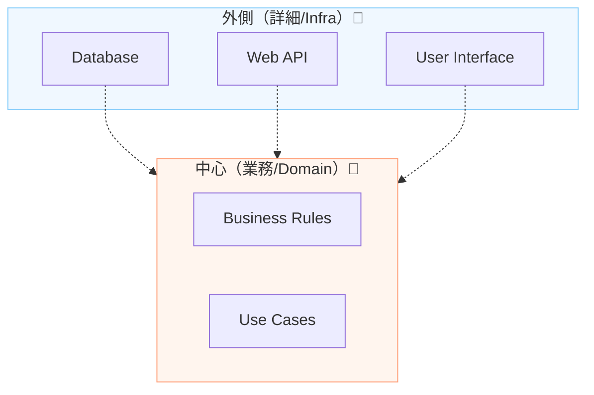

# 第04章：DIPの目的は「上位（大事）を守る」🛡️❤️

この章はね、DIPを学ぶ上でいちばん大事な“心”の部分だよ〜！💡
「なんでわざわざ面倒そうなことするの？」の答えがここにある👍😊

---

### この章でできるようになること🎯✨

* あなたのコードの中で「守りたい上位（大事）」と「変わりやすい下位（都合）」を見分けられる👀🔎
* “依存の向き”が逆だと何が起きるか、具体的にイメージできる💥😱
* DIPが目指す世界（中心＝業務を守る）を言葉で説明できる🗣️🌸

---

## 1) まず「上位」と「下位」ってなに？🏰🌊


### ✅ 上位（大事）＝“業務ルール”や“価値そのもの”🏰❤️

たとえばこんなやつ👇

* 「会員登録するときはメールが必須」📩
* 「購入金額が1万円以上なら送料無料」🚚✨
* 「在庫がなければ注文できない」📦🙅‍♀️
* 「パスワードは一定条件を満たす」🔐

これって **アプリの目的そのもの** だよね？
ここが壊れると “アプリとして終わる” 😵‍💫💔

---

### ✅ 下位（変わりやすい）＝“外部の都合”🌊🛠️

こっちはこんなやつ👇

* DB（SQL Server / SQLite / PostgreSQL とか）🗄️
* Web API / HTTP 通信🌐
* ファイル読み書き📁
* メール送信サービス（SendGrid とか）📩
* キャッシュ（Redis とか）⚡
* ログ基盤、監視、認証プロバイダ…などなど🔧

これらって **変わりやすい** し、乗り換えも普通に起きるんだよね😇
（サービス終了、料金改定、要件変更、性能問題…あるある！）

---

## 2) DIPの目的：上位（業務）を、下位（都合）から守る🛡️❤️


DIPが言いたいのは、超ざっくりこう👇

> **大事な業務ルールが、DBや外部サービスの都合に振り回されないようにしよう**🛡️✨

DIPの定義としてよく引用されるのはこれ👇
「上位モジュールは下位モジュールに依存しない。どちらも抽象に依存する」
「抽象は詳細に依存しない。詳細が抽象に依存する」📌
（この“抽象”は、C#だとだいたい `interface` のイメージでOKだよ〜） ([Stackify][1])

---

## 3) 依存が逆だと何が壊れるの？💥😱（ありがちな地獄）


### 😈 悪い形：業務がDB直結（上位 → 下位）

たとえば「会員登録」っていう業務があるとして…

```csharp
public class UserService
{
    public void Register(string email)
    {
        // ここが「上位（業務）」のつもりなのに…
        var repo = new SqlUserRepository(); // ← 下位(DB都合)に直結 😱
        repo.Insert(email);

        // さらに、メール送信も直でやっちゃうと…
        var mailer = new SmtpMailer();       // ← 下位(外部都合)に直結 😱
        mailer.SendWelcome(email);
    }
}
```

これ、ぱっと見は動くし「何が悪いの？」ってなりがちなんだけど…
**“守りたい業務ロジック”が、外側の都合にベタベタくっついてる**状態なの😵‍💫🧲

---

### 💥 こういう変更が来ると…つらい

* DBを SQL Server → PostgreSQL に変えたい🗄️🔁
* メール送信を SMTP → 外部API に変えたい📩🔁
* テストしたいのに DB がないと動かない🧪😢
* 例外の種類がDB由来で、業務側が汚れる🌀

結果👇
✅ **「業務を変えたいわけじゃないのに、業務コードが改修対象になる」**
これが本当にイヤ〜〜〜！😱🔥

---

## 4) “守るべき中心”を作るイメージ🌟（中心と外側）


DIPの感覚はこれがめちゃ近いよ👇

* **中心（守りたい）**：業務ルール・ユースケース・ドメイン知識🏰❤️
* **外側（変わる）**：DB / API / UI / ファイル / 外部サービス🌊🛠️



イメージ図（ざっくり）👇


```text
   🌊 外側（変わる）: DB / API / File / Mail / UI
          ↑
          │  詳細が、中心の「決めた形」に合わせる
          │
   🏰 中心（守る）: 業務ルール / ユースケース
```

ポイントはね👇
**中心が「こういう形でデータちょうだい」「こういう形で保存して」って“ルール（契約）”を出す**
外側がそれに合わせて実装する✨

だから中心が外側に引きずられなくなるの🛡️😊

---

## 5) 「上位（大事）」を見分けるコツ３つ🔎✨


### コツ①：それが変わったら“アプリの価値”が変わる？❤️

* 送料無料ルール、割引ルール、登録ルール… → 上位🏰
* DBの種類、通信方式… → 下位🌊

### コツ②：それは “外部I/O” ？🌐🗄️📁

外の世界と接するところは、だいたい下位！
（UIも、DBも、外部APIも “外” だからね）

### コツ③：それは「しょっちゅう変更されそう」？🔁😇

変化が多いものは下位に寄せて、中心を守るのが勝ち✨

---

## 6) ミニクイズ📝😄（上位？下位？）


次のうち「上位（守りたい）」っぽいのはどれ？（複数あり）👇

1. 「購入金額が1万円以上なら送料無料」🚚
2. SQL Server の接続文字列🗄️
3. 「未成年は会員登録できない」🧒🙅‍♀️
4. HTTP のタイムアウト設定🌐⏱️
5. 「在庫が0なら注文不可」📦❌

✅ 答え：**1 / 3 / 5 が上位**、**2 / 4 は下位** だよ〜🎉✨

---

## 7) 章末演習🧠✍️（自分のアプリでやってみよ）


あなたの作ってる（or 想像の）アプリでOK！
次をメモしてみてね📝💕

### ✅ Step1：業務ルールを5個書く（上位候補）🏰

例：

* 予約は当日キャンセル不可📅🙅‍♀️
* コメントは200文字まで🗣️✂️
  …みたいな感じ！

### ✅ Step2：外部の都合を5個書く（下位候補）🌊

例：

* DBはSQLiteにする🗄️
* 画像はS3に置く🖼️☁️
  …みたいな感じ！

ここまでできたら、この章はほぼ勝ち〜！🏆✨
（次章から「じゃあどうやって守るの？」を具体化していくよ💪😊）

---

## 8) AI（Copilot/Codex）で理解を爆速にするプロンプト🤖⚡

### 🧩 プロンプト①：上位/下位の仕分けを手伝ってもらう

```text
この機能要件を「上位（業務ルール）」と「下位（外部都合）」に分類して。
分類理由も一言ずつつけて。
要件：
- （ここに自分の要件を箇条書き）
```

### 🗺️ プロンプト②：依存が危ない箇所を指摘してもらう

```text
次のC#コードで「上位が下位に直接依存している」箇所を列挙して。
なぜ危険かも説明して。
（コード貼り付け）
```

※AIは勢いで「なんでもinterfaceにしよう！」って言いがちだから、
この章の基準はあくまで **“守りたい中心が振り回されてるか？”** だよ〜🛡️🙂

---

## まとめ🎁✨

* DIPの目的は **「上位（業務）を、下位（都合）から守る」** こと🛡️❤️
* 上位＝価値・ルール、下位＝外部I/Oや変わりやすい都合🌊
* 依存が逆だと「DB変更なのに業務コードが壊れる」みたいな地獄が起きる😱🔥

次の第5章では、DIPの定義をもっとやさしく分解して、
「上位は下位に依存しない」ってどういうこと？を言葉からスッキリさせるよ〜📌🙂✨

（ちなみに、いまのC#は C# 14 が最新で .NET 10 対応、Visual Studio 2026 も出てるよ〜🪟✨） ([Microsoft Learn][2])

[1]: https://stackify.com/dependency-inversion-principle/?utm_source=chatgpt.com "SOLID Design Principles Explained: Dependency Inversion"
[2]: https://learn.microsoft.com/en-us/dotnet/csharp/whats-new/csharp-14?utm_source=chatgpt.com "What's new in C# 14"
