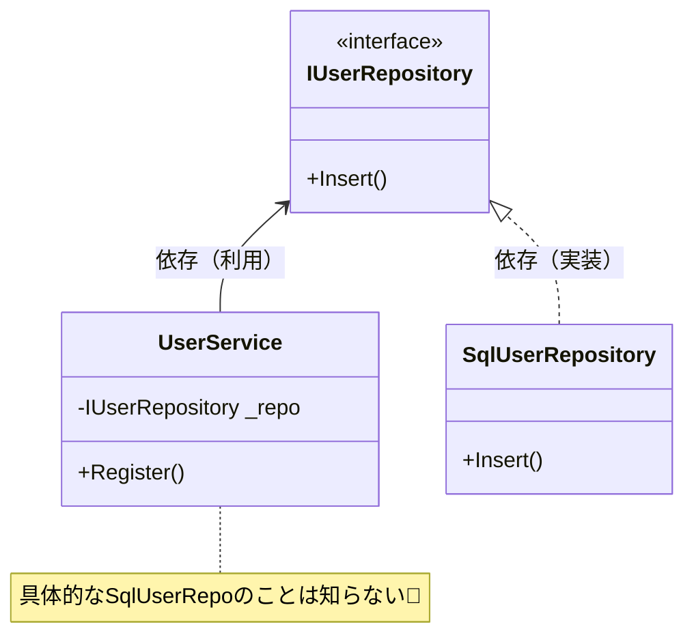

# 第05章：DIPの定義をやさしく分解①（言葉の意味）📌🙂

この章は「DIPって、結局なにを言ってるの？」を **言葉レベルでスッキリ**させる回だよ〜🧠🌷
ここが曖昧だと、後の章で interface を書いても「なんか形だけ…😵」になりがち。なので今回は **“用語の意味”だけに集中**しようね✨

---

## 5.0 今日のゴール🎯✨

章末には、次の3つが言えるようになるよ〜😊💡

* 「上位（高レベル）」「下位（低レベル）」って何を指すの？🏰🌊
* 「依存する」って、コード的には何が起きてること？🔗
* 「抽象に依存する」って、要するにどういう設計の形？☁️➡️🧱

---

## 5.1 DIPの“2行”を日本語でほどく📜🙂


DIPは、ざっくり言うと **次の2つ**を言ってるよ👇
（この2行がDIPの中核！）

1. **上位（大事な方）は、下位（変わりやすい方）に直接くっつくな**🙅‍♀️
2. **どっちも“抽象（約束）”にくっつけ。詳細（具体物）は抽象にぶら下げろ**🪝✨

この考え方が「依存性の**向き**をいい感じにする」ってやつだね🙃🔁
（DIPの説明として一般的に整理されている内容だよ） ([ウィキペディア][1])

---

## 5.2 「上位（高レベル）」と「下位（低レベル）」って何？🏰🌊


ここ、最初のつまずきポイント〜！😵‍💫💦
「上位＝偉いクラス」じゃないよ😂

### ✅ 上位（High-level）＝“やりたいこと”のルール側🏰✨

* 例：注文する、会員登録する、支払いする…みたいな **業務ルール／ユースケース**📦
* 変えたくない＆守りたい中心部分❤️🛡️

### ✅ 下位（Low-level）＝“やり方”の都合側🌊🧰

* DB、HTTP、ファイル、外部API、メール送信、クラウドSDK…など
* 仕様変更や差し替えが起きやすい🌀

> まとめると…
> **上位＝目的・方針（policy）**／**下位＝手段・詳細（details）**
> この言い方はDIPの解説でもよく使われるよ〜😊 ([ウィキペディア][1])

---

## 5.3 「依存する」って、コードでは何のこと？🔗👀


「依存」って聞くと、なんかフワッとするよね😶‍🌫️
でもコード上ではかなりハッキリしてるよ！

### ✅ “依存”はだいたいこの辺で起きる💥

#### 依存が強くなりがちランキング（強い→弱い）🔥➡️🍃


1. **`new` して具体クラスを直接生成**（超強い）🧨
2. **具体クラス名を型として持つ**（フィールド/引数/戻り値）🧱
3. **static呼び出しにベッタリ**（置き換えにくい）🗿
4. **外部ライブラリの型や例外が上位に漏れる**（じわじわ強い）🫠
5. **interface / 抽象クラスに対してだけ型を持つ**（弱い寄り）🌿✨

「依存」ってつまり、**その相手が変わると自分も直さなきゃいけなくなる状態**なんだよね😢

---

## 5.4 「抽象」ってなに？☁️✨（いったん interface だと思ってOK🙆‍♀️）


DIPに出てくる「抽象（abstraction）」は、超ざっくり言うと👇

> **“できることの約束”**🤝✨
> （中身のやり方は知らない。入口だけ知ってる）

C#だと抽象は色々あるけど、初心者の最初の一歩はこれでOK👇

* **interface**（いちばん使う！）🧩
* abstract class（共通実装が欲しいとき）🏗️
* delegate / Func（関数として渡す抽象）🎛️

この章では **「抽象＝interface」**でまずOK！🙆‍♀️✨
（後で「interface以外の抽象」も軽く扱えるようになるよ）

---

## 5.5 「抽象に依存する」って、結局どういう形？🧩➡️🧱


超ミニ例で見るね👀✨
（“雰囲気を掴む”用だから短いよ〜）



### ❌ ダメになりがち：上位が下位に直結（ベタ依存）😵


```csharp
public sealed class UserService
{
    public void Register(string name)
    {
        var repo = new SqlUserRepository(); // ← ここがガチガチ
        repo.Save(name);
    }
}
```

この形だと、もしDBが変わったら…？😱
`UserService`（上位の業務）まで巻き込まれやすい💥

---

### ✅ DIPの形：上位も下位も “約束（interface）” へ😍✨

```csharp
public interface IUserRepository
{
    void Save(string name);
}

public sealed class UserService
{
    private readonly IUserRepository _repo;

    public UserService(IUserRepository repo) => _repo = repo;

    public void Register(string name) => _repo.Save(name);
}

public sealed class SqlUserRepository : IUserRepository
{
    public void Save(string name)
    {
        // DB保存（詳細）
    }
}
```

ポイントはここ👇💡

* `UserService` は **IUserRepository（抽象）だけ知ってる**👀☁️
* `SqlUserRepository`（詳細）は **抽象を実装してぶら下がる**🪝🧱

これが「上位と下位が **どっちも抽象に依存する**」ってこと！✨
DIPの要点として多くの解説でこの形が紹介されているよ ([ウィキペディア][1])

---

## 5.6 よくある誤解あるある3つ😂💥


### 誤解①「interfaceを書いたらDIP達成！」🎉（じゃない）

interfaceは道具🧰
**“どこに境界を引くか”**が本体だよ✍️✨

### 誤解②「上位＝UI、下位＝DB」って決め打ちしちゃう🧩

UIも“外側の都合”になりやすいけど、状況次第！
基本は **“目的（業務）寄りが上位”**だよ🏰

### 誤解③「抽象は1個にまとめるほど良い」🐘💦

でかい interface（神interface）になると逆につらい😇
「ちょうどいい粒度」は後の章で育てようね🌱✨

---

## 5.7 ミニ演習（5分）📝😄

### Q1️⃣：上位はどれ？下位はどれ？👀

1. `PaymentService` と `StripeApiClient`
2. `ReportService` と `PdfExporter`
3. `UserUseCase` と `EmailSender`

👉 コツ：**“やりたいこと（目的）”が上位**、**“やり方（手段）”が下位**✨

---

### Q2️⃣：「依存が強い」のはどれ？💥

A) `IUserRepository repo` を引数でもらう
B) `new SqlUserRepository()` して使う

👉 どっちが将来の変更に弱い？😵

---

### Q3️⃣：一言で言うとDIPって？🗣️

あなたの言葉でOK！
例：「業務の中心が、DBとか外部APIの都合に振り回されないようにするやつ」みたいに😊✨

---

## 5.8 AIに手伝ってもらうプロンプト例🤖💬✨（“言葉の整理”向け）

### ✅ 依存ポイントを洗い出してもらう🔍

* 「このコードの“依存”を列挙して。`new`、型参照、static呼び出しも含めてね」

### ✅ 上位・下位を分類してもらう🏰🌊

* 「このクラス群で、上位（業務ルール）と下位（詳細）を分類して理由も書いて」

### ✅ interface候補を複数案出してもらう🧩✨

* 「DIPにしたい。interface名を3案、責務（何を約束するか）も添えて提案して」

⚠️ 注意：AIはテンション上がると **抽象を増やしすぎ**がち😂
「まずは境界1個だけ」って縛ると安全だよ🛑✨

---

## 5.9 まとめ🎁✨

* **上位＝目的（業務ルール）**、**下位＝手段（詳細）**🏰🌊
* **依存＝変更の影響が伝播しやすい結びつき**🔗
* DIPは **上位と下位を“抽象（約束）”でつなぐ**のがコア🧩✨
* 「interfaceを書けば勝ち！」じゃなくて、**境界を引くのが本体**✍️🌟

---

## 次章の予告📚🙃🔁

次は「何が“逆転”したの？」を、矢印（依存の向き）で完全に言語化するよ〜🧭✨

---

### ちょいメモ（2026の最新前提）📝✨

今のC#は **C# 14 が最新**で、**.NET 10**対応、Visual Studio 2026 で試せる流れになってるよ😊 ([Microsoft Learn][2])

[1]: https://en.wikipedia.org/wiki/Dependency_inversion_principle?utm_source=chatgpt.com "Dependency inversion principle"
[2]: https://learn.microsoft.com/en-us/dotnet/csharp/whats-new/csharp-14 "What's new in C# 14 | Microsoft Learn"
