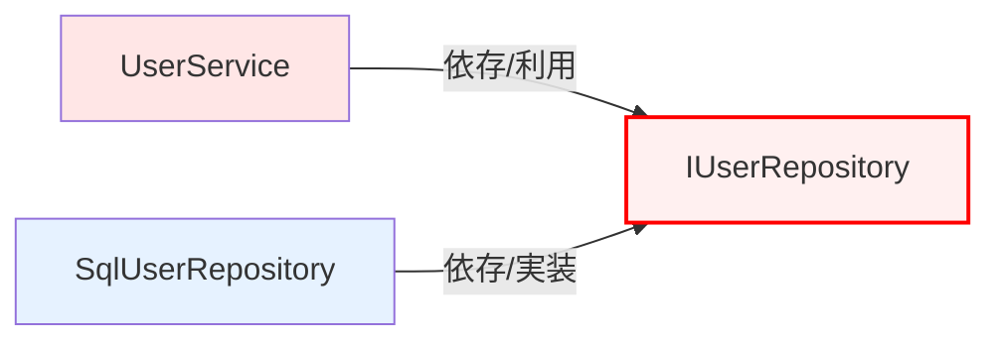

# 第06章：DIPの定義をやさしく分解②（依存の逆転）🙃🔁

この章は **DIPでいちばん「ん？逆転って何が？」ってなるところ**を、スッキリ言葉にできるようにする回だよ〜！🧠✨
（ちなみに今のC#は **C# 14** が最新で、.NETは **.NET 10** が現行の軸だよ🧡） ([Microsoft Learn][1])

---

## 6.1 今日のゴール🎯✨

読み終わったら、これができるようになるよ👇😄

* 「**何が逆転したのか**」を **自分の言葉で**説明できる🗣️✨
* 「逆転前／逆転後」を **矢印の図**で描ける✍️➡️
* 「interfaceはどこに置く？」で迷った時に **判断できる**🧭💡

---

## 6.2 まずは“逆転前”を1枚で見よう😵➡️🗄️

ありがちな形👇（業務ロジックがDB都合に引っ張られがち😢）

```csharp
public class UserService
{
    public void Register(string name)
    {
        var repo = new SqlUserRepository(); // ← ここがガチガチ依存💥
        repo.Insert(name);
    }
}

public class SqlUserRepository
{
    public void Insert(string name)
    {
        // DBにINSERTする処理
    }
}
```

この状態を「依存の矢印」で描くとこう👇

* **業務（上位）** → **DB実装（下位）** 😵

```text
UserService  ─────▶  SqlUserRepository
(上位)                 (下位)
```

ここでつらいのがコレ👇😭

* DB種類が変わる、APIにしたい、保存先をファイルにしたい…
  → **上位のコードが直接巻き込まれる**🌀

---

## 6.3 “逆転”って、何が逆になったの？🙃🔁（ここが本題！）


DIPの「逆転」は、ざっくり言うと **2つ**あるよ👇✨

### ①「契約（interface）を誰が持つか」が逆転する📜🔁

* 逆転前：下位（DB側）の都合で形が決まる🗄️
* 逆転後：上位（業務側）が「私これが欲しい」を決める🏰✨

イメージはこう🍽️💡

* 上位（業務）＝お客さん「この注文票で頼みたい！」
* 下位（DB等）＝厨房「了解、その注文票に合わせる！」

つまり **“注文票（interface）”は上位が持つ**のが気持ちいい🎀

---

### ②「参照（プロジェクト参照 / 型参照）が逆転する」🔁📦

逆転前はこうだった👇

* 上位が下位の“具体クラス”を知ってる（=参照してる）😵

逆転後はこう👇

* 上位は **抽象（interface）だけ**知ってる😍
* 下位が **その抽象を実装して合わせにくる**🛠️✨

ここがまさに **依存の矢印が逆転**するポイントだよ〜！🧡

---

## 6.4 “逆転後”を図で見る😍⬅️➡️




ゴールの形👇✨


* 逆転後：**業務 → interface ← DB実装** 😍

```text
UserService  ─────▶  IUserRepository  ◀─────  SqlUserRepository
(上位)                 (抽象)                 (下位・詳細)
```

「え、矢印2本あるの？」ってなるけど大丈夫😊

* UserServiceは「約束（interface）」だけ見てる
* SqlUserRepositoryは「その約束を守る側」

---

## 6.5 コードで体験：逆転前 → 逆転後🔧✨

### Step 1：上位側に“約束（interface）”を作る🤝💡

```csharp
public interface IUserRepository
{
    void Insert(string name);
}
```

ポイント💡：**interfaceは“上位（業務）側の都合”で設計する**🎀
（DBっぽい型を漏らしにくくなるよ！）

---

### Step 2：上位（Service）は interface にだけ依存する🛡️✨

```csharp
public class UserService
{
    private readonly IUserRepository _repo;

    public UserService(IUserRepository repo)
    {
        _repo = repo;
    }

    public void Register(string name)
    {
        _repo.Insert(name);
    }
}
```

ここで起きた変化はこれ👇😄

* `new SqlUserRepository()` が消えた🧹✨
* **Serviceの依存先が「具体」→「抽象」になった**🎯

---

### Step 3：下位（DB実装）は interface を実装して合わせにくる🗄️➡️🤝

```csharp
public class SqlUserRepository : IUserRepository
{
    public void Insert(string name)
    {
        // DBにINSERTする処理
    }
}
```

はい、これで **「逆転」完成**🎉✨
上位が下位に合わせるんじゃなくて、**下位が上位の決めた約束に合わせた**🙃🔁

---

## 6.6 「逆転できてる？」チェックリスト✅🧭

やってみて、ここをチェックすると迷子になりにくいよ😊✨

* 上位（業務）のプロジェクトが、下位（DB/HTTP/ファイル）を参照してない？📦🚫
* 上位のコードに `new Sql...` みたいな「下位の具体名」出てない？👀💥
* interfaceのメソッド引数・戻り値に「DBっぽい型」が漏れてない？🗄️😵

  * 例：`SqlConnection` とか `DbDataReader` とかが業務側に出るのは黄色信号⚠️

---

## 6.7 よくある罠💣（ここ踏みがち！）

### 罠①：interfaceを“下位プロジェクト側”に置いちゃう😇➡️😵

「RepositoryってDB側だよね？」って思って、Infrastructureに `IUserRepository` を置くと…

* 業務側がそのinterfaceを使うために **下位プロジェクト参照が必要**
* つまり **依存が逆転してない**（むしろ固定されやすい）🫠

**interfaceは“上位が欲しい形”なので上位側に置く**のが基本だよ🎀✨

---

### 罠②：interfaceがなんでも屋になる🐘💦

`IUserRepository` に「検索も更新も削除も集計も…」って詰め込みすぎると
結局 **差し替えしにくい巨大な約束**になって逆効果😢

コツは👇✨

* まずは「今回のユースケースに必要な最小」だけから始める🎯

---

## 6.8 章末ミニ演習📝🎮（30分でOK）

### 演習A：言葉にする練習🗣️✨

次の文を埋めてみてね👇（口に出すと強い！）

* 逆転前：上位（＿＿＿）が下位（＿＿＿）に依存していた😵
* 逆転後：上位（＿＿＿）は抽象（＿＿＿）に依存し、下位（＿＿＿）がそれを実装した😍

---

### 演習B：差し替え体験🔁😄

`SqlUserRepository` の代わりに、メモリ版を作って差し替えてみよう👇

```csharp
public class InMemoryUserRepository : IUserRepository
{
    private readonly List<string> _users = new();

    public void Insert(string name)
    {
        _users.Add(name);
    }
}
```

できたら「差し替えでService側が一切変わらない」快感を味わって〜！🎉💕

---

## 6.9 🤖AI（Copilot / Codex）で理解を爆速にするプロンプト例⚡

そのまま貼って使えるよ〜😄💡

* 「このコードの依存の矢印を図で説明して。逆転前/逆転後も描いて」🧭
* 「DIP的に、interfaceはどこに置くべき？理由もセットで」📦
* 「この `new` が散らばったコードを、最小のDIPでリファクタして。手順も」🧹✨
* 「業務側にDB型が漏れてるかチェックして、漏れてたら改善案」🗄️🚫

---

## まとめ✨🎀

* DIPの“逆転”は **実行順が逆**とかじゃなくて、
  **依存（参照）と契約（interfaceの持ち主）が逆**ってこと🙃🔁
* 上位（業務）が「欲しい形（interface）」を決める🏰
* 下位（DB等）が「それを実装して合わせる」🛠️
* 結果：上位が守られて、差し替えが楽になる😍✨

（今の最新環境だと .NET 10 / C# 14 / Visual Studio 2026 あたりが中心だよ📌） ([Microsoft Learn][1])
（.NETにはDIの仕組みも標準で揃ってるので、あとで“つなぎ方”も自然に学べるよ🤖🔧） ([Microsoft Learn][2])

[1]: https://learn.microsoft.com/en-us/dotnet/csharp/whats-new/csharp-14?utm_source=chatgpt.com "What's new in C# 14"
[2]: https://learn.microsoft.com/en-us/dotnet/core/extensions/dependency-injection?utm_source=chatgpt.com "Dependency injection - .NET"
