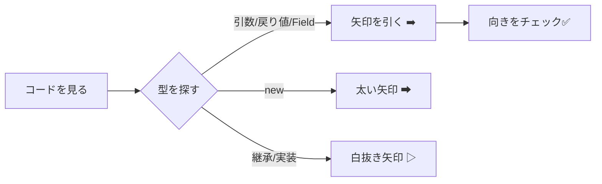

# 第07章：依存の矢印（依存グラフ）読み方トレーニング🧭📉

この章は「DIPを“正しくやる前に”、まず依存の向きを読めるようになる」回だよ〜！😄💪
矢印が読めると、**どこが“変更に弱い”のか**が一気に見えるようになるよ👀✨

---

## 今日のゴール🎯😊

できるようになりたいのはこの3つ！

* **「AがBを使う＝A→B」** を迷わず判断できる➡️
* コードを見て、**依存の矢印をサクサク描ける**🖊️
* 「DIPで逆転させるべき矢印」がどれか、**当たりが付く**🔎✨

---

## 1) 依存の矢印ルール：いちばん大事な1行📌➡️


**依存（dependency）**って、超ざっくり言うと…

> **AがBを知らないとコンパイルできないなら、AはBに依存してる（A→B）** 🧠✨

ポイントは「実行時に呼ぶか」じゃなくて、まずは **“知ってる（参照してる）か”** だよ🙂

---

## 2) 依存が生まれる「よくある5パターン」🧷✨

### ① 型名を書いたら、だいたい依存！📝➡️

* 変数の型
* 引数の型
* 戻り値の型
* フィールド / プロパティの型

```csharp
public class UserService
{
    private readonly SqlUserRepository _repo; // ← ここで依存が発生！ UserService → SqlUserRepository
}
```

✅ **UserService → SqlUserRepository** だね！➡️

---

### ② `new` したら依存が濃いめ🔥

```csharp
var repo = new SqlUserRepository(); // 呼び出し元 → SqlUserRepository
```

`new` は「その具体クラスをガッチリ固定」しがちで、DIP的には“あとで直したい矢印”になりやすいよ😵‍💫

---

### ③ 継承 / 実装は依存（しかも強い）🧱➡️

```csharp
public class SqlUserRepository : IUserRepository
{
}
```

✅ **SqlUserRepository → IUserRepository** だよ！
（実装側も `IUserRepository` を知ってないと書けないからね🙂）

---

### ④ 静的メソッド呼び出しも依存📞➡️

```csharp
Logger.Log("hi"); // 呼び出し元 → Logger
```

---

### ⑤ “見えにくい依存” もある（属性・ジェネリクス）👻➡️

**属性（Attribute）**

```csharp
[Obsolete("old")]
public void Foo() {}
```

→ このクラス（またはメソッド）が **ObsoleteAttribute** に依存してるよ🧷

**ジェネリクス制約**

```csharp
public class Service<T> where T : IUserRepository
{
}
```

→ **Service<T> → IUserRepository** 依存が発生！⚠️

---

## 3) 依存グラフの描き方（ミニ手順）🗺️✍️


### ✅ 手順A：コードから矢印を抜く👀➡️



1. **型名**を探す（引数・戻り値・フィールド・new）
2. **継承/実装**を探す（`: Base, IInterface`）

3. **属性/制約/拡張メソッド**も一応チェック（ひっかけ枠😆）

---

### ✅ 手順B：ノードの粒度を決める📦

最初はこれでOK！

* **クラス単位**：学習に最適🧠✨
* 慣れたら **プロジェクト単位**（Domain / Infra など）に拡大🎯

---

## 4) 例題で筋トレ💪😄（矢印を描こう）

### 例題1：new 直書き（よくある）😈

```csharp
public class UserService
{
    public string GetName(int id)
    {
        var repo = new SqlUserRepository();
        return repo.FindName(id);
    }
}
```

**矢印は？**
✅ **UserService → SqlUserRepository** ➡️
（`new` で固定してるから強い依存だね🔥）

---

### 例題2：interface を挟む（DIPの準備）☁️✨

```csharp
public interface IUserRepository
{
    string FindName(int id);
}

public class UserService
{
    private readonly IUserRepository _repo;
    public UserService(IUserRepository repo) => _repo = repo;

    public string GetName(int id) => _repo.FindName(id);
}
```

**矢印は？**
✅ **UserService → IUserRepository** ➡️
（具体クラスを知らない！えらい！👏🥳）

---

### 例題3：実装側はどうなる？🧱🔌

```csharp
public class SqlUserRepository : IUserRepository
{
    public string FindName(int id) => "Alice";
}
```

**矢印は？**
✅ **SqlUserRepository → IUserRepository** ➡️

ここが超大事で、DIPの形はこうなる👇😍

* UserService → IUserRepository
* SqlUserRepository → IUserRepository

**両方が “抽象” に向いてる**✨（これが「逆転した」感じ！🙃🔁）

---

## 5) よくある混乱ポイント（ひっかけ集）⚠️😆

### ① `using` がある＝依存？🤔

`using Xxx;` は「名前解決を楽にする」だけで、**それ単体だと依存の本体じゃない**ことも多いよ🙂
でも、実際に `Xxx.SomeType` を使った瞬間に依存が発生する感じ！

---

### ② 拡張メソッドは“どこに依存してるの？”🪄

```csharp
text.ToJson(); // 拡張メソッドっぽい
```

呼び出し側は、実は **拡張メソッドを定義している static クラス**に依存してるよ👀
「定義元どこ？」は IDE の *定義へ移動* で追いかけるのが早い🐾✨

---

### ③ 文字列で呼ぶやつ（Reflection）🧩

```csharp
Type.GetType("SqlUserRepository");
```

これは **コンパイル時の依存**としては薄い（型名は文字列だから）けど、
**実行時に壊れやすい依存**になりがち😱
※DIPの“矢印”だけ見てると見落とすやつ！

---

## 6) 小テスト📝😄（答え付き！）

### Q1️⃣

```csharp
public class A
{
    public B Foo(B b) => b;
}
```

**依存は？**
✅ **A → B**（引数・戻り値で型を知ってる）➡️

---

### Q2️⃣

```csharp
public class A : B { }
```

✅ **A → B**（継承）🧱➡️

---

### Q3️⃣

```csharp
public class A
{
    private readonly IB _b;
    public A(IB b) { _b = b; }
}
```

✅ **A → IB**（抽象へ依存）☁️➡️

---

### Q4️⃣

```csharp
public class C : IB { }
```

✅ **C → IB**（実装側も抽象を知る）🔌➡️

---

### Q5️⃣（ひっかけ）

```csharp
public class A
{
    public void Foo() { Console.WriteLine("x"); }
}
```

✅ **A → Console**（静的クラス呼び出し）📞➡️
（正確には `System.Console` ね🙂）

---

## 7) IDEで「依存の矢印」を秒速で見つける👀⚡

### Visual Studio：これだけ覚えればOK🛠️✨

* **定義へ移動（F12）**：その型はどこ？🔍
* **すべての参照を検索（Shift+F12）**：誰が依存してる？🕸️
* **ソリューション内検索（Ctrl+Shift+F）**：型名で一網打尽🧲

「依存グラフ」を手で描く前に、IDEで依存点をサッと拾うのがコツだよ😄✨

---

## 8) Copilot / Codexに“矢印抽出”させるプロンプト例🤖🗺️

そのまま貼ってOKなやつ置いとくね💡

* 「このコードから **依存の矢印（A→B）** を列挙して。根拠も1行ずつ書いて」
* 「クラスごとに、**コンパイル時依存**（型参照・継承・属性・new）を箇条書きにして」
* 「DIP観点で、**逆転候補の矢印**（直 new / 具体クラス参照）に⭐を付けて」

AIは「見えにくい依存（属性・制約）」の拾い漏れを減らすのに相性いいよ👍😊

---

## まとめ🧁✨（この章で一番言いたいこと）

* **依存の矢印は「AがBを知ってるか（コンパイルできるか）」で決める**🧠➡️
* `new` や具体クラス型は **DIPで直したい矢印**になりやすい🔥
* interface を挟むと、矢印が **抽象へ集まる**☁️✨

そして次の第8章で、みんなが絶対つまずく👇を気持ちよくほどくよ〜！🧶💖
**「依存の向き」と「実行の流れ」は別モノ」**⚠️🏃‍♀️

---

※最新状況として、**C# 14 が最新で .NET 10 上でサポート**され、Visual Studio 2026 には .NET 10 SDK が含まれる旨が案内されています。([Microsoft Learn][1])
※また .NET 10 は 2025年11月リリースの LTS とされ、2026年1月13日に .NET 10 の更新情報が公開されています。([github.com][2])

[1]: https://learn.microsoft.com/en-us/dotnet/csharp/whats-new/csharp-14?utm_source=chatgpt.com "What's new in C# 14"
[2]: https://github.com/dotnet/core/blob/main/release-notes/10.0/README.md?utm_source=chatgpt.com "core/release-notes/10.0/README.md at main · dotnet/ ..."
