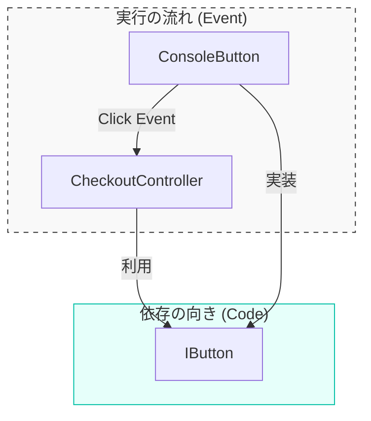

# 第08章：「依存の向き」と「実行の流れ」は別モノ⚠️🏃‍♀️

この章、DIPでいちばん「えっ？どういうこと？」ってなりやすい所だよ〜！😵‍💫💦
でもここをほどけると、一気に気持ちよくなるから一緒にいこっ💪🌷

---

## 今日のゴール🎯✨

章末までに、これがスッと言えるようになれば勝ち🏆💕

* 「**依存の向き**」＝ **コードが“知ってる”方向（参照してる方向）** 🧠➡️
* 「**実行の流れ**」＝ **実際に“呼ばれる”順番（呼び出し順）** 📞➡️
* DIPの“逆転”って **実行の順番を逆にする話じゃない** 🙅‍♀️⚠️

---

## まず混乱ポイント😵‍💫💥

DIPでよく言うやつ👇

> 上位（業務）は下位（DB/HTTPなど）に依存しない
> 抽象（interface）に依存する

ここで「でもさ…業務コードって結局DB呼ぶよね？🤔」ってなるの。
そう！**“呼ぶ”のはOK**。問題は **“知ってる（依存してる）”** かどうかなんだよ〜🧶✨

---

## 依存＝「知ってる」🧠 / 実行＝「呼ぶ」📞

超ざっくり言うと👇

* **依存（Dependency）**：このクラスは「あの型を知ってる」「あのメソッド名を知ってる」🧠🔗

  * 例：`new SqlUserRepository()` と書いた瞬間、**SqlUserRepository を知っちゃう**
  * 例：引数やフィールドの型に `SqlUserRepository` が出たら、もう知ってる
* **実行の流れ（Call Flow）**：プログラムが動いたときに「どの順で呼ばれたか」🏃‍♀️💨

  * 例：`A()` の中で `B()` を呼んだら、実行は A→B

ここめっちゃ大事な合言葉👇💡
**「DIPが変えるのは“依存（知ってる方向）”。“実行順”じゃない」** ✅✨

---

## 例①：実行は下位を呼ぶ。でも依存は抽象へ🤔➡️✨

たとえば「メール送信」を差し替えたい話📧🔁

### まずは抽象（interface）を用意🤝✨

```csharp
public interface IEmailSender
{
    void Send(string to, string subject, string body);
}
```

### 下位の実装（SMTPとか）📮

```csharp
public sealed class SmtpEmailSender : IEmailSender
{
    public void Send(string to, string subject, string body)
    {
        Console.WriteLine($"SMTP送信: {to} / {subject}");
    }
}
```

### 上位（業務）側：interface だけ知ってる🛡️💕

```csharp
public sealed class OrderService
{
    private readonly IEmailSender _email;

    public OrderService(IEmailSender email) => _email = email;

    public void PlaceOrder()
    {
        // 実行時には「何かのEmailSender」を呼ぶ（ここはOK！）
        _email.Send("a@example.com", "注文確定", "ありがとうございます！");
    }
}
```

### どこか1か所で組み立てる（差し替え地点）🔧✨

```csharp
public static class Program
{
    public static void Main()
    {
        IEmailSender email = new SmtpEmailSender();   // ここで具体を選ぶ
        var service = new OrderService(email);

        service.PlaceOrder();
    }
}
```

---

## 「依存の向き」と「実行の流れ」を図で分ける🧭✨


同じコードでも、**2種類の矢印**があるよ👇

### ✅ 依存の向き（知ってる方向）🧠➡️

* `OrderService` → `IEmailSender`（上位は抽象だけ知る）
* `SmtpEmailSender` → `IEmailSender`（下位も抽象を実装する）

つまりこう👇
**上位 → 抽象 ← 下位** 😍✨

### ✅ 実行の流れ（呼び出し順）🏃‍♀️➡️

* `Program.Main()` → `service.PlaceOrder()` → `_email.Send(...)`
* そして実体は `SmtpEmailSender.Send(...)` が動く

つまりこう👇
**上位（業務）が下位（実装）を呼ぶ** 📞✅

ここでポイント！📌
**実行は下位を呼んでいい。依存は抽象へ向ける。**
この2つは同時に成立するよ〜🙆‍♀️💕

---

## じゃあ「逆転」って何が逆転してるの？🙃🔁

「呼ぶ順番」が逆転じゃないなら何？ってなるよね😆

逆転してるのはここ👇
**“上位が下位の具体クラスを知ってる状態”をやめる**こと！

* 逆転前（つらい😵）
  上位（業務） → 下位（具体クラス）
  例：`new SmtpEmailSender()` を業務側が直接やっちゃう
* 逆転後（すっきり😍）
  上位（業務） → 抽象（interface） ← 下位（具体クラス）

これ、IoC（Inversion of Control）って言い方もするよ〜💡
.NETのDI（依存性注入）も「IoCを実現するテクニック」として説明されてるよ。([Microsoft Learn][1])

---

## 例②：さらに混乱する「コールバック／イベント」🎛️😵‍💫➡️✨


ここが次の罠！🪤
「実行の流れが下位→上位っぽく見える」ケースがある！

### ボタンが押されたら業務が動く（イベント）🔘➡️📣

```csharp
public interface IButton
{
    event Action Clicked;
}
```

```csharp
public sealed class ConsoleButton : IButton
{
    public event Action? Clicked;

    public void SimulateClick()
    {
        // 下位側がイベントを発火（実行は下位→上位っぽい！）
        Clicked?.Invoke();
    }
}
```

```csharp
public sealed class CheckoutController
{
    public CheckoutController(IButton button)
    {
        button.Clicked += OnClicked; // 上位は抽象だけ知る
    }

    private void OnClicked()
    {
        Console.WriteLine("購入処理を開始します！");
    }
}
```

```csharp
public static class Program
{
    public static void Main()
    {
        IButton button = new ConsoleButton();
        _ = new CheckoutController(button);

        ((ConsoleButton)button).SimulateClick();
    }
}
```

### ここで何が起きてる？👀✨

* **実行の流れ**：`ConsoleButton`（下位）が `CheckoutController`（上位）の処理を呼ぶっぽい
  → 「えっ、上位が下位を呼ぶんじゃないの？😵‍💫」
* **依存の向き**：`CheckoutController` は `IButton` だけ知ってる
  `ConsoleButton` も `IButton` を実装してるだけ
  → 依存はちゃんと **上位→抽象←下位** の形を守れてる✨

つまり結論👇
**実行の流れがどっち向きでも、依存の向きが抽象へ向いてればDIP的にOK** 🙆‍♀️🌸



---

## デバッグで「2つの矢印」を見分けるコツ🐞👀✨


### 実行の流れ（Call Flow）を見る🧵

* ブレークポイント置く👉実行👉**呼び出し履歴（コールスタック）**を見る
* 「今どこから呼ばれた？」が分かるよ📞🧠

### 依存（Dependency）を見る🧷

* 「このクラスが知ってる型は何？」を見る

  * フィールド・引数・戻り値の型
  * `new` してる具体クラス
  * `using` で参照してる名前空間（目安）
* IDEの「定義へ移動」「参照の検索」もめちゃ効く🔎✨

---

## ミニテスト📝😄（3問）

### Q1：これは依存してる？（Yes/No）🤔

`private readonly SqlUserRepository _repo;`
→ **Yes**（型名を知ってる＝依存！）😵‍💫

### Q2：これは依存してる？（Yes/No）🤔

`private readonly IUserRepository _repo;`
→ **No（具体には依存してない）**😍

### Q3：実行は誰が誰を呼ぶ？🏃‍♀️💨

`_repo.Save(user);`
→ **この行では “上位→下位（実体）” が呼ばれる**（でも依存は interface だけ✨）

---

## 章末演習🎮✨（手を動かすと一発で腹落ちするよ！）

1. `IEmailSender` に `FakeEmailSender` を追加してみてね🧪
2. `Program` で `SmtpEmailSender` ↔ `FakeEmailSender` を差し替える🔁
3. `OrderService` 側は **一切変更しない**のが成功条件🎯✨

（できたら最高〜！DIPの「実行は同じ、依存だけ変える」を体感できるよ🎉）

---

## AI活用コーナー🤖✨（この章に効くやつ）

Copilot / Codex にこれ投げると理解が加速するよ〜💨

* 「このコードの **依存関係の矢印** を箇条書きで出して。`new`/フィールド/引数/戻り値を根拠にして」🧠🔗
* 「このコードの **実行順（コールフロー）** を Main から順に説明して」🏃‍♀️📞
* 「依存矢印と実行矢印が混同されやすいポイントを、初心者向けに例え話で」🧶🌷

---

## まとめ💖✨

* **依存＝知ってる方向（コンパイル時のつながり）** 🧠➡️
* **実行＝呼ばれる順番（ランタイムの流れ）** 🏃‍♀️➡️
* DIPは **“実行順を変える話”じゃなくて、“知ってる相手を抽象にする話”** 🙅‍♀️➡️☁️✨
* .NETのDIはIoCを実現するための仕組みとして整理されてるよ。([Microsoft Learn][1])
* 今の環境だと、C# 14 は .NET 10 / Visual Studio 2026 で試せる形で整理されてるよ。([Microsoft Learn][2])

---

次の第9章は、いよいよ「interfaceを道具としてちゃんと握る」章だよ〜🧰🌟
この第8章が分かった状態で入ると、ほんとスイスイ進むはず！😄💨

[1]: https://learn.microsoft.com/en-us/dotnet/core/extensions/dependency-injection?utm_source=chatgpt.com "Dependency injection - .NET"
[2]: https://learn.microsoft.com/en-us/dotnet/csharp/whats-new/csharp-14?utm_source=chatgpt.com "What's new in C# 14"
