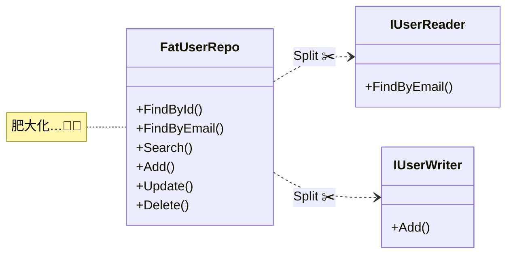

# 第09章：interface入門（DIPの道具を準備）🧰🌟

この章は **「DIPで使う“道具”＝interface」** を、いちばんやさしく・実戦寄りで身につける回だよ〜！😄💕

---

## 9.0 この章のゴール🎯✨

読み終わったら、こんな状態になれるよ👇

* interface を **「できることの約束🤝」** として説明できる
* 「どんな interface を切ればいいか（責務の決め方）」が分かる📦
* **interface が肥大化🐘💦** しないための考え方が分かる
* 最小の `IUserRepository` を自分で設計できる✨

---

## 9.1 interfaceってなに？（超シンプルに言うと…）🤝✨

interface は **「これができるよ！」っていう “できることリスト”** だよ📋😊
使う側（上位）のコードは **“中身” を知らなくてOK**。**約束（interface）だけ** 見て使えるのが強み💪

Microsoft の公式ドキュメントでも、interface は **契約（contract）** で、実装クラスはそのメンバーを実装する…って整理されてるよ。([Microsoft Learn][1])

---

## 9.2 interfaceで「できる／できない」こと（C# 14の今どき事情）🧠✨

いまのC#（C# 14）では interface はかなり強化されてて、**デフォルト実装** や **static メンバー** も書けるようになってるよ〜！😳✨
ただし！DIPの入門では **まず “王道の使い方” だけ** でOK🙆‍♀️

### ✅ まず覚えるルール（入門セット）🌷

* interface は **「メソッド・プロパティの宣言」** が中心
* interface 自体は **状態（フィールド）を持てない**（= データを抱え込まない）([Microsoft Learn][2])
* **実装は class 側が持つ**（ここが “差し替え” を可能にする✨）

> ちなみに C# 14 は .NET 10 でサポートされる “最新” のC#だよ。([Microsoft Learn][3])

---

## 9.3 DIP目線でのinterface：決めるのは「使う側」👑➡️📄

DIPの世界で大事なのはここ👇✨

> interface は **「実装したい側（DB担当）」が決めるものじゃなくて、
> 「使う側（業務ロジック）」が欲しい操作を表現するもの** 😍

だから、interface名やメソッド名も **DB都合にしない** のがコツ！🧼✨
例：

* ❌ `ISqlUserRepository`（DBが名前に入ってる＝下位都合っぽい）
* ✅ `IUserRepository`（業務が欲しい “ユーザーの保存・取得” の約束）

---

## 9.4 例：`IUserRepository` の責務を決める📦✨（最小でいこう！）

ここでは「ユーザー登録」を例にするよ〜！🧁
要件はこんな感じ👇

* 既に同じメールがあったら登録NG🙅‍♀️
* なければ登録OK👌

この要件に必要な操作って、実は **2つだけ** なんだよね✨

1. メールで探す
2. 追加する

だから interface も最小でこうなる👇（気持ちいい〜！😆）

```csharp
using System.Threading;
using System.Threading.Tasks;

public interface IUserRepository
{
    Task<User?> FindByEmailAsync(string email, CancellationToken ct = default);
    Task AddAsync(User user, CancellationToken ct = default);
}

public sealed record User(string Email, string DisplayName);
```

ポイント🌟

* **“登録” に必要な操作だけ** に絞ってる（＝肥大化しにくい）
* `CancellationToken` は “今どきの非同期の礼儀” くらいの感覚でOK👌（慣れたらで大丈夫！）

---

## 9.5 実装は何個あってもOK（差し替えの土台）🔁✨

interface があると、実装は好きに増やせるよ😄
例えばメモリ版（テスト用）👇

```csharp
using System.Collections.Generic;
using System.Linq;
using System.Threading;
using System.Threading.Tasks;

public sealed class InMemoryUserRepository : IUserRepository
{
    private readonly List<User> _users = new();

    public Task<User?> FindByEmailAsync(string email, CancellationToken ct = default)
    {
        var user = _users.FirstOrDefault(u => u.Email == email);
        return Task.FromResult(user);
    }

    public Task AddAsync(User user, CancellationToken ct = default)
    {
        _users.Add(user);
        return Task.CompletedTask;
    }
}
```

DB版も作れる（ここは中身がゴリゴリになってOK😈🗄️）
でも **上位（業務ロジック）は interface だけ見てればOK** になるのがDIPの美味しいところ🍰✨

---

## 9.6 罠：interfaceが肥大化する🐘💦（あるある！）


DIPを学びはじめると、みんな一度はこうなる🤣👇

「RepositoryってCRUD全部いるよね？」
→ `GetAll / Search / Update / Delete / BulkImport / Count / ...`
→ いつの間にか **巨大interface** に…😇

### 🧨 肥大化interfaceの例（悪い見本）

```csharp
using System;
using System.Collections.Generic;
using System.Threading;
using System.Threading.Tasks;

public interface IUserRepository
{
    Task<User?> FindByIdAsync(Guid id, CancellationToken ct = default);
    Task<User?> FindByEmailAsync(string email, CancellationToken ct = default);
    Task<List<User>> SearchAsync(string keyword, CancellationToken ct = default);

    Task AddAsync(User user, CancellationToken ct = default);
    Task UpdateAsync(User user, CancellationToken ct = default);
    Task DeleteAsync(Guid id, CancellationToken ct = default);

    Task<int> CountAsync(CancellationToken ct = default);
    Task BulkImportAsync(IEnumerable<User> users, CancellationToken ct = default);
}
```

### 😱 何が困るの？

* 使わないメソッドが増えて **読むだけで疲れる** 😵‍💫
* 実装クラスが「全部実装しろ」になって **地獄** 🔥
* 変更が入ると、影響範囲がでかくなる（DIPの逆効果！）💥

---

## 9.7 肥大化を防ぐコツ（初心者に効く3つ）🛡️✨


### コツ①：**“ユースケース起点”** で切る🎬

「登録に必要な操作は何？」
「ログインに必要な操作は何？」
この問いが最強💪✨

### コツ②：読み取りと書き込みで分割する📖✍️

まずはこの分け方が分かりやすいよ〜！



```csharp
using System.Threading;
using System.Threading.Tasks;


public interface IUserReader
{
    Task<User?> FindByEmailAsync(string email, CancellationToken ct = default);
}

public interface IUserWriter
{
    Task AddAsync(User user, CancellationToken ct = default);
}
```

実装クラスは両方を実装してもOK👌

```csharp
public sealed class InMemoryUserRepository : IUserReader, IUserWriter
{
    // 中身はさっきの実装を流用できるよ
}
```

### コツ③：「名前」に下位都合を入れない🚫🗄️

* ❌ `IFileUserRepository`（ファイル都合が見えてる）
* ✅ `IUserRepository` / `IUserReader`（業務の言葉）

---

## 9.8 interfaceの命名ルール（迷ったらこれ）🧾✨

C#の世界では **interfaceは `I` プレフィックス** が基本だよ〜！😊
Microsoft の設計ガイドラインでも推奨されてる✨([Microsoft Learn][4])

* `IUserRepository`（名詞）
* `IUserReader`（名詞）
* `IPersistable`（形容詞）みたいなのもOK（慣れたらで🙆‍♀️）

そして **実装クラスは `I` を外す** のが王道👇

* `IUserRepository` ←→ `UserRepository`
* `IUserReader` ←→ `UserReader`

---

## 9.9 ちょい発展：デフォルト実装はいつ使う？🧩✨

interface には **デフォルト実装** を入れられる（＝後からメンバー追加しても壊しにくい）という強い技があるよ。([Microsoft Learn][5])
ただ、最初はこう覚えてOK👇

* ✅ チーム/自分のアプリ内：**そもそもinterfaceを小さく保つ**（今回の方針）
* ✅ 外部に配布するライブラリ：デフォルト実装が役立つ場面がある
* 🔰 入門のうちは：**使わなくてOK**（混乱しやすいからね🌀）

---

## 9.10 Visual Studioの“楽する機能”🪄✨（覚えると超気持ちいい）

### ✅ クラスからinterfaceを切り出す（Extract Interface）

* クラス名にカーソル
* ショートカットで **リファクタリング**
* 「このメソッドだけinterfaceにしたい」を選べる✨

### ✅ interfaceを実装させてスタブ自動生成（Implement Interface）

* `: IUserRepository` って書く
* 自動でメソッド骨組みが出る（神🥹✨）

（この2つは、手で書くよりミスが減るし速いよ〜！🏎️💨）

---

## 9.11 演習（手を動かすと一気に分かるよ）✍️😆

### 演習A：最小interfaceを設計してみよう🧠✨

次のユースケースで、**必要なメソッドを2つ以内** にしてみてね👇

* 「パスワード再発行」

  * メールでユーザーを探す
  * 再発行トークンを保存する

👉 あなたの答え（例）

* `FindByEmailAsync`
* `SaveResetTokenAsync`

### 演習B：肥大化interfaceを分割しよう🐘➡️🧩

巨大な `IUserRepository` を見つけたら、まず

* `IUserReader`
* `IUserWriter`
  に割ってみる（それだけで世界が平和になること多いよ🕊️✨）

---

## 9.12 Copilot / Codexに手伝わせるプロンプト例🤖💡（安全運転つき）

### ✅ 1) “最小interface案”を出させる

「**メソッドは最大2〜3個**」って縛るのがコツ！🎀

* 「ユーザー登録のユースケースに必要な最小C# interfaceを提案して。メソッドは最大2つ。命名は業務寄りで、DBやHTTPなど実装都合の単語は入れないで。」

### ✅ 2) 肥大化を検知して分割案を出させる

* 「このinterfaceが肥大化しているかチェックして、分割案（IUserReader/IUserWriterなど）を3案出して。分割理由も1行ずつ。」

### ✅ 3) Fake実装（テスト用）を作らせる

* 「このinterfaceのInMemory実装を作って。例外条件（重複メール）も再現できるようにして。」

---

## まとめ🎀✨（この章で一番大事！）

* interface は **「できることの約束」** 🤝
* DIPでは interface は **使う側（業務）が欲しい操作** で決める👑
* まずは **最小メソッド数** で作る（肥大化を防ぐ）🧼✨
* 肥大化したら **Reader/Writer分割** が効く📖✍️
* 命名は `I` プレフィックスが王道🧾([Microsoft Learn][4])

---

次の第10章では、いよいよこの `IUserRepository` を使って **“最小DIP” を完成** させるよ〜！🎉🔁💖

[1]: https://learn.microsoft.com/en-us/dotnet/csharp/language-reference/keywords/interface?utm_source=chatgpt.com "interface keyword - C# reference"
[2]: https://learn.microsoft.com/en-us/dotnet/csharp/fundamentals/types/interfaces?utm_source=chatgpt.com "Interfaces - define behavior for multiple types - C#"
[3]: https://learn.microsoft.com/en-us/dotnet/csharp/whats-new/csharp-14?utm_source=chatgpt.com "What's new in C# 14"
[4]: https://learn.microsoft.com/en-us/dotnet/standard/design-guidelines/names-of-classes-structs-and-interfaces?utm_source=chatgpt.com "Names of Classes, Structs, and Interfaces"
[5]: https://learn.microsoft.com/en-us/dotnet/csharp/advanced-topics/interface-implementation/default-interface-methods-versions?utm_source=chatgpt.com "Safely update interfaces using default interface methods - C#"
