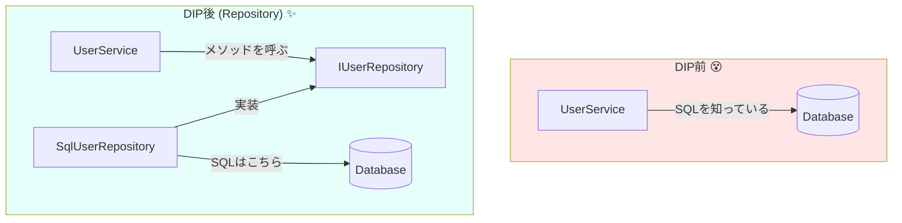

# 第10章：最小DIPを実装①（Repositoryを切り出す）🔁💖

この章は「**1機能だけ**DIP化して、成功体験を作る回」だよ〜！🎉
いきなり全体をキレイにしようとしないで、**“最小で効く”やり方**でいくのがコツ😊✨

※いまの最新は **.NET 10（LTS）＋C# 14**、IDEは **Visual Studio 2026** が中心だよ🪟🛠️✨（VS 2026は2026/1/13更新も出てるよ） ([Microsoft][1])

---

## 0. この章のゴール🎯✨

### できるようになること💪🌸

* 「業務ロジック（大事）」から「DB都合（変わりやすい）」を**押し出す**🚪
* `new SqlUserRepository()` みたいな“下位の具体”を、**中心から消す**🧹✨
* **依存点（new）を1箇所に集める**🧲（まずはここまででOK！）

### 今日の完成イメージ（依存の矢印）➡️

* ✅ `UserService → IUserRepository ← SqlUserRepository`

---

## 1. 今日の題材：ユーザー登録（超ミニ）👤📝

やることはこれだけ👇😊

* メールが重複してないかチェック
* 新規ユーザーを登録

「DBに問い合わせる」部分が変わりやすいから、そこを **Repository** に押し出すよ🗄️➡️🚪✨

---

## 2. まずは“DIP前”のつらい状態を確認😵🧱




こんな感じのコード、見覚えあるはず…！👀💦

`UserService` の中に **SQLや接続**が混ざってるパターンね。

```csharp
public sealed class UserService
{
    public async Task RegisterAsync(string email)
    {
        // ❌ 下位都合（DB）を上位（業務）が直に知ってる
        using var conn = new SqlConnection("...");
        await conn.OpenAsync();

        // ❌ SQLが業務ロジックに混ざる
        using var cmd = conn.CreateCommand();
        cmd.CommandText = "SELECT COUNT(*) FROM Users WHERE Email = @Email";
        cmd.Parameters.AddWithValue("@Email", email);

        var count = (int)await cmd.ExecuteScalarAsync();
        if (count > 0) throw new InvalidOperationException("もう登録されてるよ😢");

        // Insertもここに…（地獄のはじまり）🔥
    }
}
```

### 何がイヤか😢

* DBが変わったら `UserService` を直すことになる🌀
* テストしたくてもDBが必要になりがち🧪💦
* SQLや例外処理が増えて、業務ルールが見えなくなる🙈

だから次で、**DB都合を外へ**押し出すよ〜！🚪✨

---

## 3. Step1：Repositoryの「やること」を言語化しよう🗣️📦

ここ、めちゃ大事！🌟
Repositoryは「DBを触るクラス」じゃなくて、**業務から見た“欲しい能力”**を定義するのがコツだよ🤝

今回の業務が欲しいのは👇

* メールでユーザーを探す（存在チェック）🔍
* 新規ユーザーを追加する➕

---

## 4. Step2：interface（抽象）を切り出す☁️✨

`IUserRepository` を作るよ😊
“上位（UserService）が知るのはここまで” がゴール！

```csharp
public interface IUserRepository
{
    Task<bool> ExistsByEmailAsync(string email, CancellationToken ct = default);
    Task AddAsync(User user, CancellationToken ct = default);
}
```

ついでに `User` も用意（recordでOKだよ）✨

```csharp
public sealed record User(Guid Id, string Email);
```

### ここでの気持ち🧠💡

* `UserService` は「ユーザーがいるか」「追加して」って言いたいだけ
* “どうやってDBで実現するか” は知らなくていい🙆‍♀️✨

---

## 5. Step3：DB実装（具体）を `SqlUserRepository` として外へ🚪🗄️

ここが「外側の都合」だよ〜🌊
SQL ServerでもSQLiteでも、APIでもファイルでも、**ここに押し込む**イメージ！

```csharp
using Microsoft.Data.SqlClient;

public sealed class SqlUserRepository : IUserRepository
{
    private readonly string _connectionString;

    public SqlUserRepository(string connectionString)
        => _connectionString = connectionString;

    public async Task<bool> ExistsByEmailAsync(string email, CancellationToken ct = default)
    {
        await using var conn = new SqlConnection(_connectionString);
        await conn.OpenAsync(ct);

        await using var cmd = conn.CreateCommand();
        cmd.CommandText = """
            SELECT COUNT(1)
            FROM Users
            WHERE Email = @Email
            """;
        cmd.Parameters.AddWithValue("@Email", email);

        var count = (int)await cmd.ExecuteScalarAsync(ct);
        return count > 0;
    }

    public async Task AddAsync(User user, CancellationToken ct = default)
    {
        await using var conn = new SqlConnection(_connectionString);
        await conn.OpenAsync(ct);

        await using var cmd = conn.CreateCommand();
        cmd.CommandText = """
            INSERT INTO Users (Id, Email)
            VALUES (@Id, @Email)
            """;
        cmd.Parameters.AddWithValue("@Id", user.Id);
        cmd.Parameters.AddWithValue("@Email", user.Email);

        await cmd.ExecuteNonQueryAsync(ct);
    }
}
```

### ポイント💡

* `SqlUserRepository` は `IUserRepository` を実装してるだけ😄
* `UserService` はこのクラス名を知らなくていい✅

---

## 6. Step4：UserServiceを“抽象だけ”に寄せる🛡️❤️

さっきまでDB直結だった `UserService` を、`IUserRepository` だけ知ってる状態にするよ！

```csharp
public sealed class UserService
{
    private readonly IUserRepository _users;

    public UserService(IUserRepository users) // ここが超重要🎉
        => _users = users;

    public async Task RegisterAsync(string email, CancellationToken ct = default)
    {
        if (await _users.ExistsByEmailAsync(email, ct))
            throw new InvalidOperationException("もう登録されてるよ😢");

        var user = new User(Guid.NewGuid(), email);
        await _users.AddAsync(user, ct);
    }
}
```

### 最高ポイント🎉

* `UserService` から SQL が消えた✨
* 依存は `IUserRepository`（抽象）だけ☁️
* ここまでで **DIPの核**はもうできてるよ〜！👏💖

---

## 7. Step5：「new」を1箇所に集める（とりあえずProgramだけ）🧲✨

まだDIコンテナの話は“次以降”でいいよ🙂
この章では、**newを1箇所に閉じ込める**だけで十分えらい！💯

```csharp
// Program.cs（コンソール想定）
var cs = "Server=(localdb)\\MSSQLLocalDB;Database=DipDemo;Trusted_Connection=True;";

IUserRepository repo = new SqlUserRepository(cs); // ✅ newがここに集まった
var service = new UserService(repo);

await service.RegisterAsync("mika@example.com");
Console.WriteLine("登録できたよ〜🎉");
```

> ✅ これが「依存点を1箇所に集める」ってことだよ🧲
> “中心（業務）” には `new SqlUserRepository` がいない！最高！✨

---

## 8. ここまでで何が嬉しいの？😆🌟

### ✅ 変更に強くなる

DBが変わっても、直すのは `SqlUserRepository` 側だけになりやすい🛠️✨

### ✅ テストしやすくなる（次章で本気出す🧪）

今はまだFake作ってないけど、`IUserRepository` がある時点で勝ち🏆

### ✅ “業務”が読みやすい

`UserService` が「登録ルール」だけになってスッキリ📘✨

---

## 9. よくある失敗あるある🐘💦（先に潰そ！）

### ❶ interfaceがデカくなる

「Usersの全部機能入れとこ！」ってやると爆発する💥
➡️ **“今回の業務が必要な分だけ”**でOK👌✨

### ❷ Repositoryが“何でも屋”になる

ユーザー以外のSQLも突っ込み始めるとカオス🌀
➡️ **責務で分ける**（UserならUserだけ）📦

### ❸ UserServiceにSQLが戻ってくる

「ちょっとだけSQL書いちゃお…」が再発ポイント😈
➡️ DBの話が出たら、反射でRepositoryへ🚪✨

---

## 10. ミニ理解チェック📝😄

**Q1.** `UserService` が依存していいのはどっち？
A) `SqlUserRepository`　B) `IUserRepository`

**Q2.** `new SqlUserRepository(...)` は、まずどこに置くのが安全？
A) `UserService` の中　B) `Program.cs` などアプリ起動側

**Q3.** Repositoryにメソッドを追加するとき、最初に考えるのは？
A) DBでできるか　B) 業務が何をしたいか

<details>
<summary>答えを見る👀✨</summary>

* A1: **B**（抽象に依存！）
* A2: **B**（依存点を1箇所へ🧲）
* A3: **B**（業務が欲しい能力から決める🗣️）

</details>

---

## 11. 演習（手を動かすと一気に理解進むよ〜！🎮✨）

### 演習1：メソッド名を業務寄りにしてみよう✍️

`ExistsByEmailAsync` を、もっと業務っぽくするとしたら？🤔
例：`IsEmailAlreadyRegisteredAsync` みたいにしてみる（好みでOK）💕

### 演習2：Repositoryに“SQL以外”を入れないルール作り🧼

`UserService` にSQLっぽい文字列が出てきたら、即Repositoryへ移動🚪

### 演習3：AIにリファクタ案を出させる🤖✨（おすすめ）

Copilot / Codexにこう投げてみてね👇

* 「この `UserService` のDBアクセスを `IUserRepository` に抽出して。必要最小のメソッドで」
* 「`UserService` が `SqlConnection` を参照しない形にして」
* 「抽象化しすぎないように、interfaceは2メソッド以内で提案して」

> コツ：**“最小で”**って言葉を入れると、過剰抽象化が減るよ🛑😄

---

## 12. まとめ✨🎀（この章でできたこと）

* Repositoryを切り出して、DB都合を外へ🚪🗄️
* `UserService` は `IUserRepository` だけ知る☁️
* `new` を `Program.cs` に集めて、依存点を1箇所に🧲✨

次の第11章では、ここからさらに気持ちよくしていくよ〜！
**Fakeに差し替えて「差し替え可能」を体感**する回だよ😄🧪⚡

[1]: https://dotnet.microsoft.com/ja-jp/platform/support/policy/dotnet-core?utm_source=chatgpt.com ".NET および .NET Core の公式サポート ポリシー"
