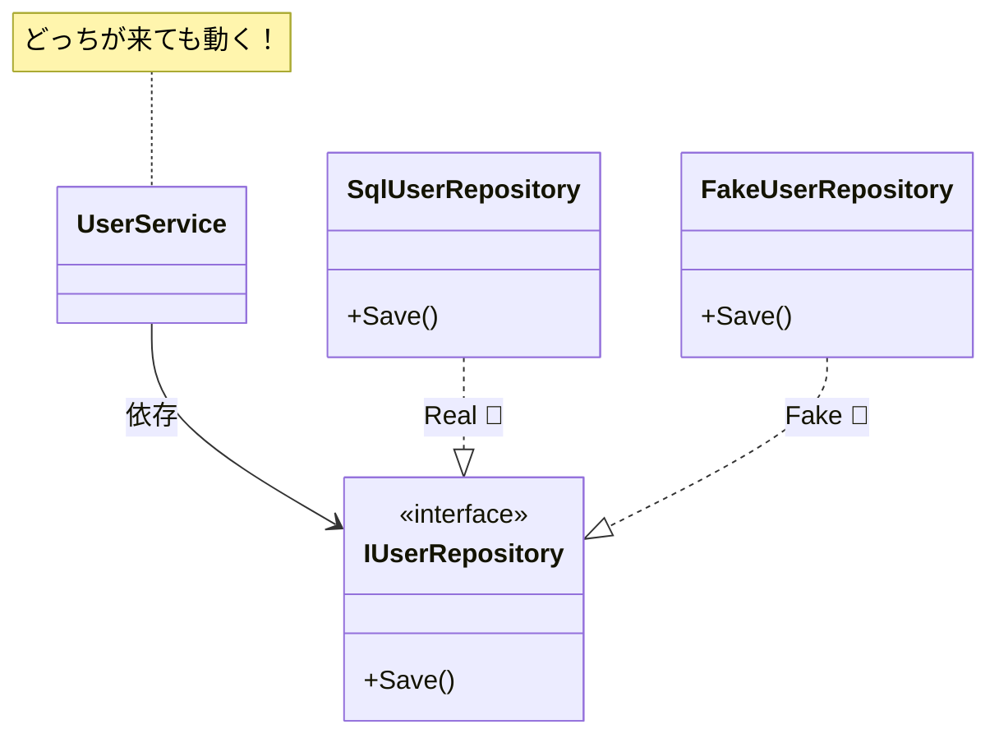

# 第11章：最小DIPを実装②（Service側を抽象へ寄せる）🧱✨

この章は **「Serviceが“具体クラス”じゃなくて“interface”だけを知る」** 状態にするよ〜！🎯💕

---

## 0. この章のゴール🎯✨


* Serviceが `SqlUserRepository` を **知らない**（= 依存しない）🙅‍♀️
* Serviceは `IUserRepository` だけ知ってればOK👌
* `Sql` を `Fake` に **差し替え**できる（デモするよ！）🔁😄
* 「どこまでDIPにする？」の感覚をつかむ🎯🧠

---

## 1. ありがちな “惜しい状態” 😵（前章の続きイメージ）

Repositoryを切り出して `IUserRepository` を作ったのに…

* `UserService` の中で `new SqlUserRepository()` してる
* あるいは `UserService` が `SqlUserRepository` 型を受け取ってる

これだと…

* DBを変えたい（or テストしたい）→ Serviceまで巻き込まれる😇🔥
* “差し替え可能”になりきってない！💦

---

## 2. 依存の矢印を「こう」する🧭✨


### ❌ 逆転前（つらい）

* `UserService → SqlUserRepository`

### ✅ 逆転後（DIPっぽい！）

* `UserService → IUserRepository`
* `SqlUserRepository → IUserRepository`（implementsしてるだけ）

つまり **Serviceは「約束（interface）」だけを見る** 👀✨
「実際にSQLで保存するかどうか」は **外側が決める** 🚪🪄

---

## 3. 実装してみよう！🛠️（最小構成でいくよ）

ここからのコードは **“ファイル分割”風** に書くね（コピペしやすい形）📄✨
（実際に分けても、1ファイルでもOKだよ〜）

---

### 3-1. ドメイン（User）👤

```csharp
namespace DipChapter11.Domain;

public sealed record User(int Id, string Name);
```

---

### 3-2. 抽象（IUserRepository）☁️🤝

ポイントはこれ👇
**Serviceが欲しいのは「保存できること」「取得できること」だけ**！

```csharp
using DipChapter11.Domain;

namespace DipChapter11.Application;

public interface IUserRepository
{
    User? FindById(int id);
    void Save(User user);
}
```

---

### 3-3. Serviceは “interfaceだけ” を見る🧱✨（ここが本章の主役！）


✅ **コンストラクタで `IUserRepository` を受け取る**
✅ Service内で `new` しない

```csharp
using DipChapter11.Domain;

namespace DipChapter11.Application;

public sealed class UserService
{
    private readonly IUserRepository _repo;

    public UserService(IUserRepository repo)
    {
        _repo = repo;
    }

    public void RegisterUser(int id, string name)
    {
        // 例：同じIDがいたら登録しない（超ざっくり業務ルール）
        var existing = _repo.FindById(id);
        if (existing is not null)
        {
            Console.WriteLine($"❌ 既にID={id}のユーザーがいます: {existing.Name}");
            return;
        }

        var user = new User(id, name);
        _repo.Save(user);
        Console.WriteLine($"✅ 登録しました: {user.Name}");
    }
}
```

ここで大事なのは…

* `UserService` の頭の中には **「SQL」も「DB」も「接続文字列」も存在しない**🧠🫧
* “外の都合” が入ってこないから **業務ルールが守られる** 🛡️❤️

---

## 4. “差し替え可能” を実演するよ🔁😄


### 4-1. 本物っぽいRepository（SQL版のつもり）🗄️

※本章はDIPが主役だから、DBアクセスは雰囲気だけにするね😄（後で本物にしてもOK）

```csharp
using DipChapter11.Application;
using DipChapter11.Domain;

namespace DipChapter11.Infrastructure;

public sealed class SqlUserRepository : IUserRepository
{
    private readonly Dictionary<int, User> _db = new(); // 仮DB

    public User? FindById(int id) => _db.GetValueOrDefault(id);

    public void Save(User user)
    {
        _db[user.Id] = user;
        Console.WriteLine("🗄️ (SQLっぽい) 保存しました");
    }
}
```

---

### 4-2. FakeRepository（テスト用の偽物）🧪✨

Fakeは **「速い」「安全」「意図が明確」** 💕

```csharp
using DipChapter11.Application;
using DipChapter11.Domain;

namespace DipChapter11.TestsDoubles;

public sealed class FakeUserRepository : IUserRepository
{
    private readonly Dictionary<int, User> _store = new();

    public User? FindById(int id) => _store.GetValueOrDefault(id);

    public void Save(User user)
    {
        _store[user.Id] = user;
        Console.WriteLine("🧪 (Fake) 保存したことにしました");
    }
}
```

---

### 4-3. どっちを使うか決めるのは「外側」🚪✨（Program.cs）


ここが超重要！
**Serviceの外で組み立てる場所**を（仮に）“組み立て係”と呼ぶね🧩

```csharp
using DipChapter11.Application;
using DipChapter11.Infrastructure;
using DipChapter11.TestsDoubles;

Console.WriteLine("== DIP Chapter 11 Demo ==");

// ★差し替えポイント（ここだけ変更すればOK！）
// IUserRepository repo = new SqlUserRepository();
IUserRepository repo = new FakeUserRepository();

var service = new UserService(repo);

service.RegisterUser(1, "Aki");
service.RegisterUser(1, "Mina"); // 同じIDをもう一回
```

✅ これで **Serviceコード1行も触らずに**
`Sql` ⇄ `Fake` が切り替わるよ〜！🎉🎉🎉



---

## 5. ありがちなミスに注意💥
する？「境界だけでOK」感覚🎯✨


DIPって聞くと、つい…

* 「全部interfaceにしなきゃ！」😱
* 「全部注入しなきゃ！」😵

ってなりがちなんだけど、初心者がまず勝つコツはこれ👇

### ✅ まずは「外部I/Oの境界」だけDIPで守る🚪🛡️

* DB 🗄️
* HTTP/API 🌐
* ファイル📄
* 時刻⌚（地味に変わりやすい！）
* ランダム🎲

### ❌ “変わりにくい純粋な処理” まで全部DIPにしない🙅‍♀️

* 文字列整形
* 計算ロジック
* ちょっとした変換

> **変わりやすいところ**だけを“外側”に追い出す
> **変わりにくい核（業務ルール）**はスッキリ保つ
> この順番が気持ちいいよ〜🌷✨

---

## 6. よくあるミス集（先に踏んでおこう😄）🧯

### ミス①：Serviceに `SqlConnection` とか渡しちゃう🚫🗄️


それ、結局 **下位都合が上位に侵入**してるよ〜💦
Serviceは **「保存できる」** が欲しいだけ！

### ミス②：interfaceがデカくなる🐘💥

`IUserRepository` に
`SearchByNameAndAgeAndPrefectureAnd...` みたいなのが増え始めたら黄色信号🟡
まずは **Serviceが本当に必要な操作だけ**に絞ろう✂️✨

### ミス③：Fakeが本物と違いすぎる😇


Fakeは便利だけど、
**「振る舞いがズレる」**と事故るので、最低限だけ寄せるのがコツ👌

---

## 7. ミニ演習（手を動かすと一気に定着🧠🔥）

### 演習A：Fakeに「保存された回数」を数える機能を追加🧪🔢

* `SaveCount` プロパティを作って
* `Save()` のたびに `++` してみてね！

### 演習B：Repositoryを「ログ付き」にする🪵✨（差し替えの気持ちよさ体験）

* `LoggingUserRepository : IUserRepository` を作って
* 中で “本物repo” を包む（ラップする）
* `FindById` と `Save` の前後でログ出す

これできると「差し替え設計」めっちゃ強くなるよ💪🔥

---

## 8. AI（Copilot / Codex系）に手伝わせるコツ🤖💡

### 使える指示例①：Serviceから `new` を消してDIP化して！

* 「`UserService` が `SqlUserRepository` に依存しているので、`IUserRepository` に依存する形へリファクタして。`Program.cs` 側で組み立てて。」

### 使える指示例②：Fakeを作って！

* 「`IUserRepository` を満たす `FakeUserRepository` を作って。内部は `Dictionary<int, User>` でOK。`SaveCount` も付けて。」

### 使える指示例③：過剰抽象化を止める🛑😄

* 「interfaceを増やしすぎないで。今回の境界は `Repository` だけ。Service内部の小さい処理は抽象化しないで。」

---

## 9. 章まとめ✨📌

* Serviceは **interfaceだけ**を知る（具体を知らない）☁️✅
* `new` は **外側**に追い出す🚪✨
* Fakeに差し替えると **爆速で動作確認**できる🧪⚡
* DIPはまず **外部I/O境界**からでOK🎯

---

## 🧠 2026年1月時点の“最新”メモ（ちょい豆知識）📅✨

* 現行のLTSとして **.NET 10** が提供されていて、ダウンロードページ上の最新パッチは **10.0.2（2026-01-13）**だよ。 ([Microsoft][1])
* 最新C#として **C# 14** が案内されていて、**.NET 10** でサポートされてるよ。 ([Microsoft Learn][2])
* Visual Studioも **Visual Studio 2026** のリリースノートが公開されていて、2026-01-13 の更新（18.2.0）も載ってるよ。 ([Microsoft Learn][3])
* Copilot側は、タスクをまとめて進める **Agent mode** が公式ドキュメントに載ってる（複数ファイル変更やコマンド提案までやってくれる系）。 ([GitHub Docs][4])

---

次は第12章で、DIPが **SoC（関心の分離）** と合体すると整理がさらに加速する話に行けるよ〜🧩🔥

[1]: https://dotnet.microsoft.com/en-US/download/dotnet/10.0 "Download .NET 10.0 (Linux, macOS, and Windows) | .NET"
[2]: https://learn.microsoft.com/en-us/dotnet/csharp/whats-new/csharp-14?utm_source=chatgpt.com "What's new in C# 14"
[3]: https://learn.microsoft.com/en-us/visualstudio/releases/2026/release-notes "Visual Studio 2026 Release Notes | Microsoft Learn"
[4]: https://docs.github.com/en/copilot/get-started/features "GitHub Copilot features - GitHub Docs"
