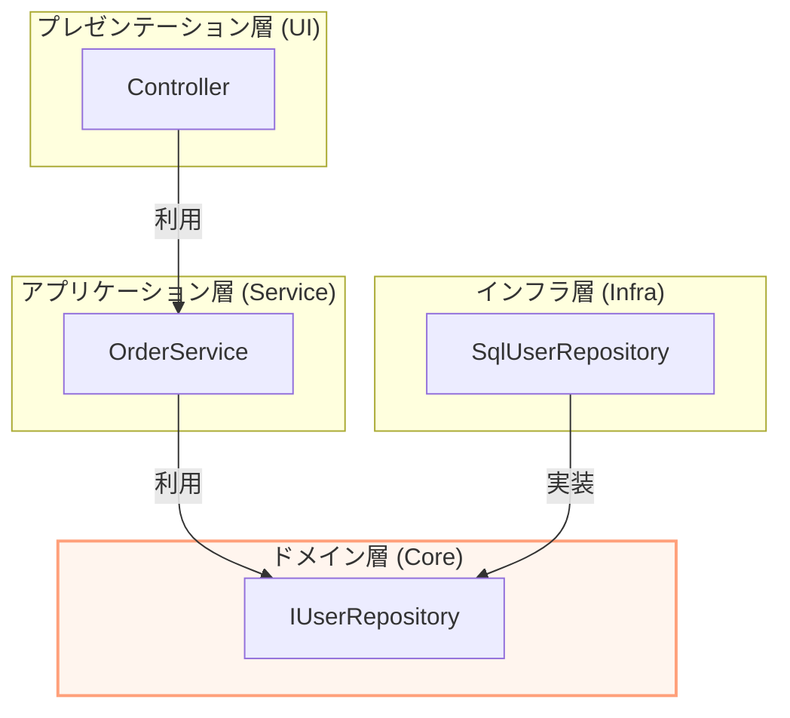

# 第12章：DIPとSoC（関心の分離）で整理が加速🧩🔥

この章はひとことで言うと、**「DIPを“境界線のガードマン”にして、コードの担当エリア（関心）をきれいに分けようね」**って回です👮‍♀️✨
SoC（Separation of Concerns＝関心の分離）は、アプリが大きくなるほど効いてきます💪🌱
（Microsoftの設計ガイドでも、責務（concern）で分けると整理しやすくなるよ〜って話が出てきます📚）([Microsoft Learn][1])

---

## 12.1 まずSoCってなに？🧠🌷

SoCは、「**種類の違う仕事は混ぜない**」っていう考え方だよ🙅‍♀️🌀
代表例だとこんな感じ👇

* 画面（UI）：入力を受け取る／表示する🖥️✨
* 業務（ルール）：何がOKで何がNGか決める⚖️💡
* インフラ（外部I/O）：DB・HTTP・ファイル・メール送信など📦🌐

これを混ぜるとどうなるかというと…

* ちょっとUI変えたい → 業務ロジックまで巻き添え😱
* DB変えたい → 画面やルールにも修正が飛び火🔥
* テストしたい → DBや外部APIがないと動かない🥲

SoCは、こういう**“変更が伝染する事故”**を減らすための整理術だよ🧯✨
（レイヤーで責務を分けるのが有効、っていうのも公式ガイドに出てくるよ📚）([Microsoft Learn][1])

---

## 12.2 SoCだけだと“混ざりやすい”問題が残る😵‍💫➡️🧱

「よし！UI/業務/インフラを分けるぞ！」ってフォルダ分けしても…

* 業務層の中で `new SqlUserRepository()` してしまう
* 業務層が `HttpClient` を直に触ってしまう
* 業務層がEF Coreの型や属性に寄りかかってしまう

こうなると、**“名前は分かれてるのに依存が混ざってる”**状態になりがち😇💦

そこで登場するのが **DIP（依存性逆転）** だよ🦸‍♀️✨
DIPは「関心の分離」を**ルールとして守らせる**武器になります🗡️
（DIPでインフラ層と他の層を疎結合にできる、という説明も公式のアーキテクチャ資料に出てきます📚）([Microsoft Learn][2])

---

## 12.3 “中心”と“外側”を決めよう🎯🧅

SoCで整理するときの超大事なコツはこれ👇

### ✅ 中心（守りたいもの）🏰❤️

* 業務ルール（ドメイン・ユースケース）
* アプリの「こうあるべき」を表すコード

### ✅ 外側（変わりやすいもの）🌊🌀

* DB、HTTP、ファイル、メール、UIフレームワーク、ログ基盤…など

**変わりやすい外側が、中心にくっつくと、中心が壊れやすくなる**んだよね😢
だから、中心は外側を知らないようにしたい。

---

## 12.4 DIPで“境界線”を作る✍️🚧

DIPの基本ムーブはこれ👇

1. **中心側が「欲しい能力」を interface で宣言する**（抽象）☁️
2. 外側がそれを実装する（具体）🔧
3. 中心は interface だけを見る👀✨

これができると、中心は **「DBが何か」** を知らなくてOKになる🙆‍♀️
SoCの「混ぜない」を、**依存関係の方向**で守れるようになるよ🔁✅

（MicrosoftのDIガイドでも「依存先を直接 new しちゃうと結合が強くなるよ」って注意が出てるよ📌）([Microsoft Learn][3])

---

## 12.5 例：混ざってるコード（SoCが崩壊）🧨😵

ありがちな“全部入り”の例（イメージ）👇

```csharp
public class RegisterUserController
{
    public string Post(string email)
    {
        // UIっぽい：入力チェック
        if (!email.Contains("@")) return "bad";

        // インフラ直結：DBを直に new
        var conn = new SqlConnection("...");
        conn.Open();

        // 業務っぽい：重複禁止ルール
        var cmd = new SqlCommand("SELECT COUNT(*) ...", conn);
        var exists = (int)cmd.ExecuteScalar() > 0;
        if (exists) return "already";

        // 表示もここで決めちゃう
        return "ok";
    }
}
```

これ、関心が**ぐっちゃぐちゃ**だよね😂💦
UI/業務/DB/表示が1か所に混ざってる。

---

## 12.6 SoC＋DIPで“担当エリア”を分け直す🧩✨




### ステップA：関心を3つに分ける🔪🍰


* UI：コントローラ（入力→出力の形を整える）🖥️
* 業務：ユースケース（登録のルールと流れ）🧠
* インフラ：DBアクセス（SQL/EFなど）🗄️

### ステップB：境界にinterface（抽象）を置く🚪✨

中心（業務）が「DBに保存して」「検索して」ってお願いする窓口を作る感じだよ📮

```csharp
public interface IUserRepository
{
    bool ExistsByEmail(string email);
    void Add(User user);
}
```

### ステップC：業務はinterfaceだけを見る👀🌟

```csharp
public sealed class RegisterUserUseCase
{
    private readonly IUserRepository _users;

    public RegisterUserUseCase(IUserRepository users)
        => _users = users;

    public Result Execute(string email)
    {
        if (!email.Contains("@")) return Result.Bad("形式が違うよ");

        if (_users.ExistsByEmail(email)) return Result.Bad("もう登録済みだよ");

        _users.Add(new User(email));
        return Result.Ok();
    }
}
```

### ステップD：インフラが実装する🔧🗄️

```csharp
public sealed class SqlUserRepository : IUserRepository
{
    public bool ExistsByEmail(string email) { /* SQL... */ }
    public void Add(User user) { /* SQL... */ }
}
```

これで、**業務（中心）はDBを知らない**✨
UIもDBを直に触らない✨
SoCがめっちゃ守りやすくなるよ〜🥳🎉

---

## 12.7 「依存の向き」チェック表✅🧭


迷ったら、この質問で仕分けしてね👇

* それは「画面にどう見せるか？」 → UI🖥️✨
* それは「何が正しいか／ルールは何か？」 → 業務（中心）⚖️🧠
* それは「外部と通信・保存・取得してる？」 → インフラ🌐🗄️
* それは「流れを組み立てて指揮してる？」 → ユースケース（中心寄り）🎬✨

そして、中心がインフラを呼びたくなったら…
**interface を中心側に置いて、依存を逆転！**🙃🔁

---

## 12.8 よくある事故パターン（超あるある）😇💥

### ❌ 境界を越えて“便利”を持ち込む

* 業務層で `SqlConnection` / `HttpClient` / EFのDbContextを直に使う
  → 外側に引っ張られて、SoCが崩壊😭

### ❌ interfaceを“なんでも屋”にする🐘💦

* `IUserRepository` に「検索・保存・通知・ログ・キャッシュ」全部入れる
  → 抽象が太りすぎて、逆に変更に弱くなる😵

### ❌ UIで業務ルールを判断する🙅‍♀️

* UIで「重複チェック」や「割引ルール」を持つ
  → 画面が増えた瞬間に同じロジックが増殖🌱🌱🌱

---

## 12.9 章末ミニ演習📝🎮

### 演習1：仕分けゲーム🧩

次の関心を、UI / 業務 / インフラに分けてみてね👇😄

* メールアドレスの「@」チェック
* 登録済みユーザーの確認
* DBにINSERT
* 「登録完了！」メッセージ文言の整形
* 例外ログを外部に送信

（答え：@チェックと登録済み判断は“業務寄り”、DB保存とログ送信は“インフラ”、メッセージ文言は“UI寄り”になりやすいよ😉✨）

### 演習2：境界interfaceを1つ作ろう🚪

「外側の都合」っぽいものを1つ選んで、中心側にinterfaceを作ってみてね💡
おすすめ：`IEmailSender` / `ITimeProvider` / `IPasswordHasher` あたり🎁✨

---

## 12.10 Copilot / Codexに頼むときのプロンプト例🤖💬✨

### 例：関心の分離案を出してもらう

```text
次のC#コードを、UI/ユースケース/インフラに関心分離してください。
ルール：
- 業務（ユースケース）はDBやHTTPの具体クラスを参照しない
- 外部I/Oはinterface越しに呼ぶ
- interfaceは中心側（ユースケース側）に置く
- まず最小分割でOK
コード：
（ここに貼る）
```

### 例：依存の矢印を文章で説明させる

```text
この構成の依存関係（参照の向き）を、矢印付きで説明して。
「実行の流れ」と「依存の向き」が違う点も一緒に説明して。
```

AIは勢いで抽象を増やしがちだから、**「最小で！」**って言うのがコツだよ😉🛑✨

---

## 12.11 まとめ🌈✨

* **SoC**：仕事の種類ごとに分ける（混ぜない）🧩
* でも分けただけだと、依存が混ざって崩れがち😇
* **DIP**：中心は抽象に依存、外側が実装する🙃🔁
* するとSoCが**設計ルールとして守りやすくなる**🛡️✨
* レイヤ分けや責務分割は、公式ガイドでも有効って扱いだよ📚([Microsoft Learn][1])

---

次の第13章では「DIP（原則）」と「DI（実装テク）」を混同しないように、スッキリ整理していくよ〜🤝🧠✨

[1]: https://learn.microsoft.com/en-us/dotnet/architecture/modern-web-apps-azure/common-web-application-architectures?utm_source=chatgpt.com "Common web application architectures - .NET"
[2]: https://learn.microsoft.com/en-us/dotnet/architecture/microservices/microservice-ddd-cqrs-patterns/microservice-application-layer-web-api-design?utm_source=chatgpt.com "Designing the microservice application layer and Web API"
[3]: https://learn.microsoft.com/en-us/dotnet/core/extensions/dependency-injection-guidelines?utm_source=chatgpt.com "Dependency injection guidelines - .NET"
