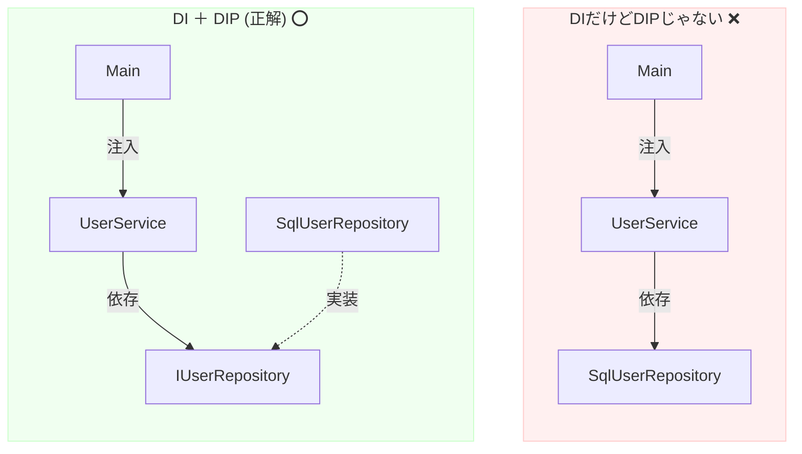

# 第13章：DIPとDIの関係①（原則と手段を分ける）🤝🧠

この章のテーマはこれだけ👇
**DIP＝「依存の向きのルール（設計原則）」**／**DI＝「依存を外から渡すやり方（実装テクニック）」**です😊🌷

---

## 1. まずは一言でスッキリ！🧼✨

### DIP（依存性逆転）って？🙃🔁

「**大事なロジック（上位）が、変わりやすい詳細（下位）に振り回されない**」ための設計ルールだよ🛡️
有名な言い回しはこの2つ👇（Robert C. Martinの文章にそのまま出てきます）

* 上位は下位に依存しない。**両方とも抽象に依存する**
* 抽象は詳細に依存しない。**詳細が抽象に依存する** 

### DI（依存性注入）って？💉🏗️

「**必要な部品（依存オブジェクト）を、自分の中で new せず、外から渡してもらう**」やり方だよ🙂
.NET公式ドキュメントでも、DIは依存関係を組み立てるための仕組みとして説明されてるよ ([Microsoft Learn][1])

---

## 2. いちばん大事：DIPとDIは“別カテゴリ”🧠📦


混ざりやすいから、ここで仕分けしようね😊✨

* **DIP（原則）**：
  「どの方向に依存したら安全か？」
  👉 **設計のルール（考え方）** 🧭

* **DI（手段）**：
  「じゃあ、その依存をどうやって実装で実現する？」
  👉 **具体的なやり方（テクニック）** 🔧

> 例えるなら…
> DIP：**“交通ルール”** 🚦
> DI：**“ハンドル操作”** 🚗

---

## 3. ありがちな混同パターンを先に潰す🧯😆


### 混同①「DIコンテナを入れた＝DIPできてる」🤖❌

**違うよ〜！**
コンテナはDIを助ける道具。
でも、もし上位コードが `SqlUserRepository` みたいな**具体クラス**に依存してたら、DIPは達成できてない可能性が高いよ😵‍💫

---

### 混同②「interfaceを作った＝DIPできてる」🧩❌

interfaceを作っても、上位がこうだったらアウト👇

```csharp
// 上位のはずのServiceが、下位の具体に依存してる😢
public sealed class UserService
{
    private readonly SqlUserRepository _repo = new SqlUserRepository(); // ここが直結⚡

    public User Get(int id) => _repo.Find(id);
}
```

* `SqlUserRepository` が変わると上位も影響を受ける
* テストで差し替えもしにくい
  👉 DIPの狙い（上位を守る🛡️）に逆行しがち💦

---

### 混同③「DIP＝DI」🙃❌

DIPとDIは親戚だけど同一人物じゃないよ🤣

* DIP：**設計原則**（どう依存すべきか）
* DI：**実装手法**（依存をどう渡すか）

---

## 4. “DIはしてるけどDIPじゃない”例（地味に多い）😇💥

「外から渡してるからOKでしょ？」って思いがちだけど…👇



```csharp
// 依存は注入してる（DI）✅
// でも依存先が具体クラス（SqlUserRepository）なのでDIPは弱い❌
public sealed class UserService
{
    private readonly SqlUserRepository _repo;

    public UserService(SqlUserRepository repo) => _repo = repo;

    public User Get(int id) => _repo.Find(id);
}
```

これだと、上位が下位の詳細（SQL実装）を知っちゃってる😢
差し替え耐性が弱いよ〜💦

---

## 5. “DIPはできてるけどDIしてない”ってあり得る？🙂

あり得るよ！ただし、たとえば👇みたいに**自分で探しに行く（Service Locator / 反射でロード）**方式は、DI（注入）とは別物になりやすいのね。

```csharp
public interface IUserRepository
{
    User Find(int id);
}

// DIP的には「上位はIUserRepositoryだけ知ってる」のでOK寄り✅
// でも依存を「注入」されてなくて、自分で探しに行ってる😵
public sealed class UserService
{
    private readonly IUserRepository _repo;

    public UserService()
    {
        // 例：設定値やプラグインから実装を探して作る（説明用の簡略）
        var typeName = "MyApp.SqlUserRepository, MyApp";
        var type = Type.GetType(typeName, throwOnError: true)!;
        _repo = (IUserRepository)Activator.CreateInstance(type)!;
    }

    public User Get(int id) => _repo.Find(id);
}
```

この形は、**DIPの方向性（抽象に依存）**は守れてても、

* 生成ロジックが散らばる
* どこで何が使われてるか追いづらい
* テストがやりにくい
  …ってなりやすいの🥺

だから一般的には、**DIPの設計＋DIで注入（組み立ては入口に寄せる）**が気持ちよくまとまることが多いよ✨

---

## 6. ここで覚える“超重要ワード”🪄✨

### IoC（Inversion of Control：制御の反転）🔁

DIは、IoCを実現する代表的なやり方だよ〜、って.NETの説明でも触れられてるよ ([Microsoft Learn][1])

---

## 7. 実務で迷わないための“判定法”✅👀

### DIPできてる？チェック🧠

* 上位（業務ロジック）が、DB/HTTP/ファイル等の**具体クラス**を参照してない？
* 上位が知ってるのは `IUserRepository` みたいな**抽象（interface等）**だけ？
* 実装側（詳細）がその抽象を実装してる？ 

### DIできてる？チェック💉

* `new` があちこちに散らばってない？（特に業務ロジックの中）
* 依存が **コンストラクタ引数**などで外から渡ってきてる？

> そして理想は…
> **DIP（設計）＋DI（注入）＋組み立ては入口に寄せる** 🎯✨

---

## 8. ミニクイズ（3問）📝😄

### Q1：これはDIP？DI？

「`UserService` が `IUserRepository` を参照してる」
👉 **DIP寄り**（抽象に依存）✅

### Q2：これはDI？

「`UserService` のコンストラクタで依存が渡される」
👉 **DI** ✅

### Q3：これはDIしたのにDIPが弱いのはどれ？

A. `UserService(IUserRepository repo)`
B. `UserService(SqlUserRepository repo)`
👉 **B**（具体に依存してる）💥

---

## 9. AI（Copilot / Codex）に頼むときの“いい聞き方”🤖💡

そのまま貼って使えるやつ置いとくね😉✨

* 「このコードは **DIP** を満たしていますか？満たしていないなら、**依存の向き**がどこで崩れているか指摘して、最小の修正案をください。」
* 「この設計で **DI（注入）** を入れるなら、`new` をどこに寄せるのが自然？（入口＝Composition Root的な場所を提案して）」
* 「interfaceを増やしすぎずにDIPを達成する“境界”を提案して。過剰抽象化になってたら止めて！」

---

## 10. 章まとめ（ここだけ持ち帰ればOK）🎁✨

* **DIP＝設計原則**：上位を下位詳細から守る🛡️（両方抽象へ） 
* **DI＝実装テク**：依存を外から渡して、`new` を散らさない💉
* **DIしただけではDIPにならない**（具体クラス注入は罠）😇
* いちばん気持ちいいのは **DIP（抽象依存）＋DI（注入）** のセット🤝✨

---

### ちょい最新メモ🆕✨（開発中に見かける用）

* Visual Studio 2026 の更新が出てるよ（2026年1月のアップデート情報あり） ([Microsoft Learn][2])
* .NETのDIは標準機能としてドキュメントがまとまってる（ガイドラインもあるよ） ([Microsoft Learn][3])
* C# 14 と .NET 10 の対応関係も公式に整理されてるよ ([Microsoft Learn][4])

---

次の第14章では、ここで分けた「DI（手段）」を **コンストラクタ注入💉** でスッと形にしていくよ〜😄✨

[1]: https://learn.microsoft.com/en-us/dotnet/core/extensions/dependency-injection?utm_source=chatgpt.com "Dependency injection - .NET"
[2]: https://learn.microsoft.com/en-us/visualstudio/releases/2026/release-notes?utm_source=chatgpt.com "Visual Studio 2026 Release Notes"
[3]: https://learn.microsoft.com/en-us/dotnet/core/extensions/dependency-injection-guidelines?utm_source=chatgpt.com "Dependency injection guidelines - .NET"
[4]: https://learn.microsoft.com/en-us/dotnet/csharp/language-reference/language-versioning?utm_source=chatgpt.com "Language versioning - C# reference"
