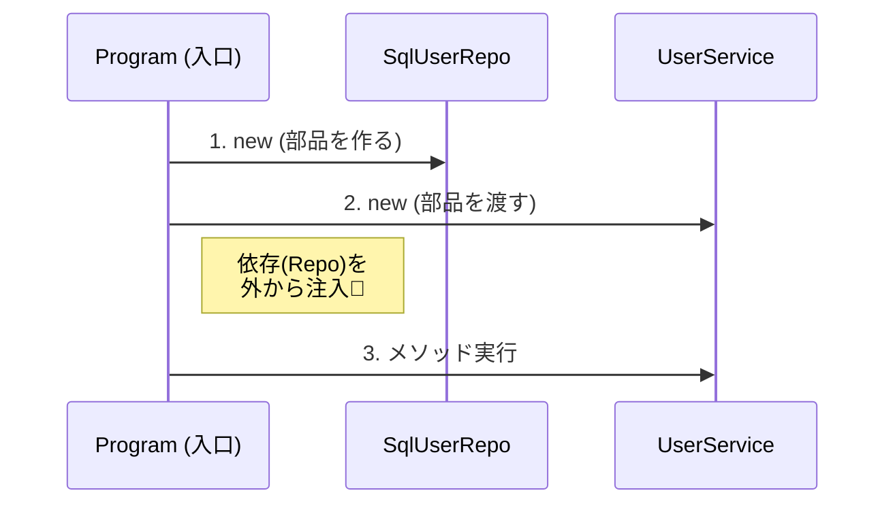

# 第14章：DIPとDIの関係②（コンストラクタ注入から）💉🏗️

この章は「DI（依存性注入）」の中でも、いちばん基本でいちばん強い **コンストラクタ注入** を、ちゃんと手で書けるようになる回だよ〜！😊💕

---

## この章でできるようになること🎯✨

* 「コンストラクタ注入」って何かを、コードで説明できる📘✨
* 「`new` はどこでやるの？」問題に答えられる📍😆
* **手動DI（コンテナ無し）**で、依存を組み立てられる🧩🔧
* Fake差し替えが一瞬でできる（テストがラク）🧪💖

---

## まず復習：DIPとDIは別モノだよ🙃🧠

* **DIP**：設計の原則（依存の向きを“抽象”へ向ける）🧭✨
* **DI**：実装のテクニック（依存を“外から渡す”）📦➡️🧩

つまり…
**DIP（こう設計しようね）を、DI（こう実装しようね）で実現する**って感じ！🤝💕

ちなみに、いまの .NET は **.NET 10（LTS）**が最新で、C# は **C# 14** が最新だよ（2026年1月時点の公開情報）✨🆕
([Microsoft][1])

---

## コンストラクタ注入ってなに？💉🙂




**「必要な道具を、作るとき（コンストラクタ）に受け取る」** それだけ！✨


* ✅ 依存（必要な部品）を **コンストラクタ引数でもらう**
* ✅ クラスの中で勝手に `new` しない
* ✅ そのクラスは「抽象（interface）」だけ知ってればOK

---

## “newはどこでするの？”問題の答え📍😆

答え：**アプリの入口（組み立てる場所）でやる！** 🏗️✨
この「組み立て場所」をよく **Composition Root（合成ルート）** と呼ぶよ〜🧩🌳

.NETのDIでも、最終的には **依存関係のグラフ（オブジェクトグラフ）** を解決して動かすんだけど、手動DIだとそれを自分で書く感じ！🗺️✨
([Microsoft Learn][2])

---

## 例題：悪いコード（Serviceの中が `new` だらけ）😈🧱

「業務ロジック」が「DB都合」にベッタリくっつく典型だよ〜😵‍💫

```csharp
public class UserService
{
    public void Register(string name)
    {
        // ❌ Serviceの中で具体クラスをnewしちゃう
        var repo = new SqlUserRepository("Server=...;Database=...;");
        repo.Save(new User(name));
    }
}
```

これ、何がツラいかというと…😭💦

* DBを差し替えたい時に Service を直すハメ😱
* Fakeにできない（テストが痛い）🧪💥
* “Serviceが太る”方向に進みがち🐘💦

---

## 正解：コンストラクタ注入で「外から渡す」💉✨

### ① 抽象（interface）を用意する🧩☁️

```csharp
public interface IUserRepository
{
    void Save(User user);
}

public record User(string Name);
```

### ② Serviceは抽象だけを見る👀✨

```csharp
public class UserService
{
    private readonly IUserRepository _repo;

    // ✅ 依存をコンストラクタで受け取る（注入）
    public UserService(IUserRepository repo)
    {
        ArgumentNullException.ThrowIfNull(repo);
        _repo = repo;
    }

    public void Register(string name)
    {
        _repo.Save(new User(name));
    }
}
```

### ③ 具体実装（下位）は外側に置く🚪🗄️

```csharp
public class SqlUserRepository : IUserRepository
{
    private readonly string _connectionString;

    public SqlUserRepository(string connectionString)
    {
        _connectionString = connectionString;
    }

    public void Save(User user)
    {
        Console.WriteLine($"[SQL] Save {user.Name} with {_connectionString}");
        // 本当はここでDB保存するイメージ
    }
}
```

---

## じゃあ `new` はどこ？➡️ Program.cs（合成ルート）🏗️✨

ここが超だいじ！！！💥
**newしていい場所**を「ここ」に寄せると、全体がキレイになるよ〜🧼✨

```csharp
public static class Program
{
    public static void Main()
    {
        // ✅ ここ（入口）で組み立てる
        IUserRepository repo = new SqlUserRepository("Server=.;Database=App;");
        var service = new UserService(repo);

        service.Register("Alice");
    }
}
```

これで、Serviceは「SQLの存在」を忘れられる🥳💖
＝ **DIPが守れる**し、実装もラクになる！

---

## 手動DIのコツ3つ🧠✨

### コツ1：依存は「必須」ならコンストラクタにまとめる💉✅

* 必須なものはコンストラクタ
* “あとから入れる”は基本しない（不完全なオブジェクトが生まれやすい）😵‍💫

### コツ2：`new` を“奥”に持ち込まない🚫🧱

* Serviceの中に `new Sql...` が見えたら赤信号🚨
* “組み立て”は入口で！

### コツ3：依存が増えすぎたら設計の見直しサイン🐘⚠️

コンストラクタがこうなったら…
`UserService(IUserRepository, ILogger, IEmailSender, IClock, IValidator, ...)` 😇💦
それは「Serviceが責務持ちすぎ」かも！

---

## うれしさ：Fake差し替えが秒でできる🧪💖

```csharp
public class FakeUserRepository : IUserRepository
{
    public List<User> Saved { get; } = new();

    public void Save(User user) => Saved.Add(user);
}
```

```csharp
public static class DemoTest
{
    public static void Run()
    {
        var fake = new FakeUserRepository();
        var service = new UserService(fake);

        service.Register("Bob");

        Console.WriteLine(fake.Saved.Count); // 1
        Console.WriteLine(fake.Saved[0].Name); // Bob
    }
}
```

「DB無しでテストできる」って、ほんと革命だよ〜🥹✨

---

## ありがちな落とし穴コーナー🕳️😵‍💫

### 落とし穴1：Service Locator（`IServiceProvider` を渡すやつ）📦😇

* “何でも取れる箱”を渡すと、依存が見えなくなる🙈💦
* テストもしんどくなる（結局何が必要なの？ってなる）😵

### 落とし穴2：依存を隠すためのstatic/Singleton乱用🧨

* “ラクだから”で逃げると、後から地獄🔥😇
* 「差し替え」と「並列実行」で事故りがち💥

### 落とし穴3：Disposeの管理を忘れる🧹

手動DIだと **誰が破棄するか**も自分で決める必要があるよ〜！
（このへんは次の章以降で、もう少し現場寄りに扱うね🙂✨）

---

## ミニ演習（この章のゴールチェック）📝✨


### 演習14-1：`new` を追放しよう🏃‍♀️💨

* Serviceの中にある `new Xxx()` を全部消して
* コンストラクタ引数でもらう形にしてね💉✨

### 演習14-2：Fakeに差し替えよう🔁🧪

* `SqlUserRepository` を `FakeUserRepository` に差し替えて
* 実行結果が変わるのを確認してみてね😄✨

### 演習14-3：依存が3つになったら？🐘⚠️

* `IClock`（現在時刻）を追加してみて
* コンストラクタが長くなった時の「気持ち悪さ」を観察しよう👀💦

---

## AI（Copilot / Codex）に頼るときのおすすめ声かけ🤖💡

* 「このクラスの `new` を無くして、コンストラクタ注入にリファクタして」🔧✨
* 「依存の候補を列挙して、interface案を2〜3個出して」🧠🧩
* 「Fake実装も一緒に作って。保存したデータをListで保持する簡単版で」🧪📦

※ただし、AIは **抽象を増やしすぎ**ることあるから、
「今は境界だけでOK！」ってブレーキも忘れずにね🛑😆

---

## まとめ🎉✨

* コンストラクタ注入＝「必要なものを作るときに受け取る」💉
* `new` は **入口（合成ルート）** に寄せる🏗️
* すると、差し替え・テスト・変更が一気にラクになる🧪💖
* DIP（原則）とDI（実装）が、ここでガッチリ噛み合う🤝✨

---

次の章では、この手動DIを **実際に最小プロジェクトで一周**して、「依存が流れる感じ」をデバッグで追いかけるよ〜🐞👀✨

[1]: https://dotnet.microsoft.com/en-us/download/dotnet?utm_source=chatgpt.com "Browse all .NET versions to download | .NET"
[2]: https://learn.microsoft.com/en-us/dotnet/core/extensions/dependency-injection?utm_source=chatgpt.com "Dependency injection - .NET"
