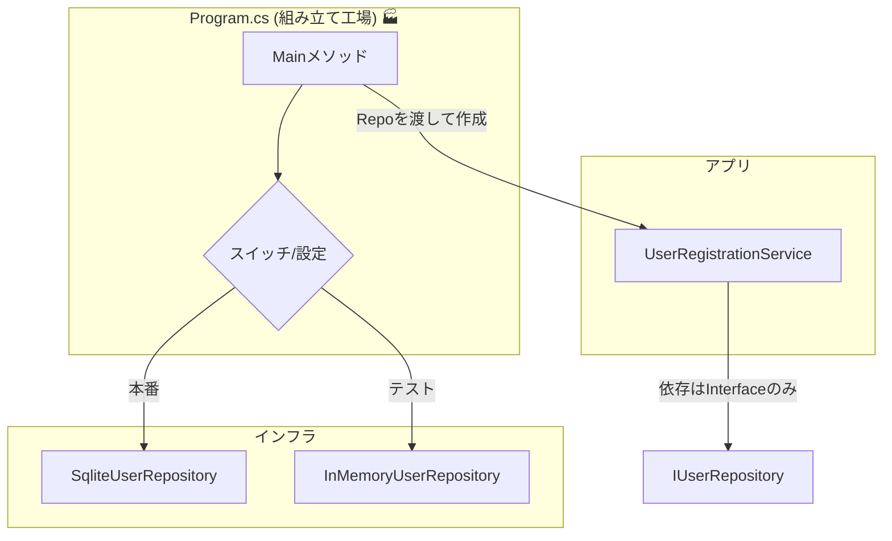

# 第15章：Visual Studioで作る！Windows最小プロジェクト🪟🛠️

（Console AppでDIPを“1周”体験するよ〜🔄💖）

まず「今の最新版」だけ、サクッと押さえるね🧠✨

* .NETは **.NET 10（LTS）**（2025/11/11リリース）だよ📦✨ ([Microsoft for Developers][1])
* C#は **C# 14**（.NET 10 SDK/VS 2026で利用）🌟 ([Microsoft Learn][2])
* Visual Studioは **Visual Studio 2026** が提供開始＆**2026/1/13に18.2.0アップデート**が出てるよ🛠️ ([Microsoft Learn][3])
  （VS 2022側も 17.14 系が継続で更新されてるよ） ([Microsoft Learn][4])

---

## 15.0 この章で作るもの🎯✨

**「ユーザー登録」だけの超ミニConsoleアプリ**を作って、DIPを一周するよ🔄

✅ この章のゴール

* `new` が散らばらない「組み立て地点（Composition Root）」を体感する📍✨
* 上位（業務：登録ルール）が、下位（DB：SQLiteとか）に引きずられないのを体験する🛡️❤️
* **デバッグで“依存の流れ”を追える**ようになる🐞👀

---

## 15.1 Visual StudioでConsoleプロジェクトを作る🧰✨

1. Visual Studio を起動して「新しいプロジェクトの作成」
2. **Console App（.NET）** を選ぶ💻
3. フレームワークは **.NET 10** を選択（選べるはず）📦✨ ([Microsoft Learn][5])
4. プロジェクト名：`DipChapter15`（好きでOK💕）

---

## 15.2 フォルダ構成（最小で気持ちよく）📁✨

ソリューションエクスプローラーでフォルダを作ってね👇

* `Domain`（業務の中心：データとかルールの核）🏰
* `Application`（ユースケース：登録する、一覧する）🎮
* `Infrastructure`（外側：DB/ファイルなど）🌊

「中心ほど大事、外ほど変わる」ってイメージでOKだよ〜🌷

---

## 15.3 まず“中心”を作る：Domain（User）👤✨

`Domain/User.cs` を作成👇

```csharp
namespace DipChapter15.Domain;

public sealed record User(
    Guid Id,
    string Name,
    DateTimeOffset CreatedAt
);
```

---

## 15.4 次に“抽象”を作る：Application（IUserRepository）☁️🤝

`Application/IUserRepository.cs` を作成👇
ここが **「上位が頼っていい窓口」** だよ🪟✨

```csharp
using DipChapter15.Domain;

namespace DipChapter15.Application;

public interface IUserRepository
{
    Task<bool> ExistsByNameAsync(string name, CancellationToken ct = default);
    Task SaveAsync(User user, CancellationToken ct = default);
    Task<IReadOnlyList<User>> GetAllAsync(CancellationToken ct = default);
}
```

---

## 15.5 “業務ロジック”を書く：UserRegistrationService🛡️❤️

`Application/UserRegistrationService.cs` を作成👇
ポイントはこれ👇
✅ **ServiceはDBを知らない**（`IUserRepository` しか知らない）
✅ “登録ルール”がここに集まる

```csharp
using DipChapter15.Domain;

namespace DipChapter15.Application;

public sealed class UserRegistrationService
{
    private readonly IUserRepository _repo;

    public UserRegistrationService(IUserRepository repo)
        => _repo = repo;

    public async Task RegisterAsync(string name, CancellationToken ct = default)
    {
        if (string.IsNullOrWhiteSpace(name))
            throw new ArgumentException("名前が空だよ〜🥺", nameof(name));

        if (await _repo.ExistsByNameAsync(name, ct))
            throw new InvalidOperationException($"'{name}' は既に登録済みだよ〜😵");

        var user = new User(
            Id: Guid.NewGuid(),
            Name: name.Trim(),
            CreatedAt: DateTimeOffset.UtcNow
        );

        await _repo.SaveAsync(user, ct);
    }

    public Task<IReadOnlyList<User>> ListAsync(CancellationToken ct = default)
        => _repo.GetAllAsync(ct);
}
```

ここまでで、中心（Domain）＋上位（Application）が完成🎉
まだDBは一切出てこないよね？これが気持ちいいの😌💖

---

## 15.6 実装その①：まずはInMemory（擬似DB）で動かす🧠✨

いきなりSQLiteに行くと“DB準備”で疲れちゃうから、最初はメモリ版で成功体験しよ〜🎉

`Infrastructure/InMemoryUserRepository.cs` を作成👇

```csharp
using DipChapter15.Application;
using DipChapter15.Domain;

namespace DipChapter15.Infrastructure;

public sealed class InMemoryUserRepository : IUserRepository
{
    private readonly List<User> _users = new();

    public Task<bool> ExistsByNameAsync(string name, CancellationToken ct = default)
    {
        var exists = _users.Any(u => string.Equals(u.Name, name, StringComparison.OrdinalIgnoreCase));
        return Task.FromResult(exists);
    }

    public Task SaveAsync(User user, CancellationToken ct = default)
    {
        _users.Add(user);
        return Task.CompletedTask;
    }

    public Task<IReadOnlyList<User>> GetAllAsync(CancellationToken ct = default)
        => Task.FromResult<IReadOnlyList<User>>(_users.ToList());
}
```

---

## 15.7 Composition Rootを作る：Program.csに“newを集める”📍✨


ここがこの章の主役の1つ！🌟
**newしていい場所は基本ここだけ**（体感してほしい！）💡

`Program.cs`（トップレベルのままでOK）をこんな感じに👇

```csharp
using DipChapter15.Application;
using DipChapter15.Infrastructure;

var repo = new InMemoryUserRepository();
var service = new UserRegistrationService(repo);

Console.WriteLine("ユーザー登録はじめるよ〜💖");

await service.RegisterAsync("Alice");
await service.RegisterAsync("Bob");

var users = await service.ListAsync();
Console.WriteLine("登録済み一覧👇✨");
foreach (var u in users)
{
    Console.WriteLine($"- {u.Name} ({u.CreatedAt:O})");
}

Console.WriteLine("おしまいっ🐣");
```

▶ 実行してみてね（Ctrl + F5）🎮✨
ちゃんと動けばOK〜！

---

## 15.8 実装その②：SQLite版を追加して“本物DB”に差し替え🔁🗄️✨


ここで **差し替えの気持ちよさ** を出すよ😎✨

### ① NuGetでSQLiteプロバイダを入れる📦

パッケージは `Microsoft.Data.Sqlite` を使うよ（軽量ADO.NET）🪶

* NuGet: `Microsoft.Data.Sqlite` ([nuget.org][6])
* 公式の概要＆インストール例もこの通りだよ ([Microsoft Learn][7])

Visual Studioなら

* 「プロジェクト」→「NuGet パッケージの管理」→ `Microsoft.Data.Sqlite` を検索→インストール🔎✨
  （CLI派なら `dotnet add package Microsoft.Data.Sqlite` でもOK） ([Microsoft Learn][7])

### ② SQLite実装を書く（テーブルも自動作成）🧱✨

`Infrastructure/SqliteUserRepository.cs` を作成👇

```csharp
using DipChapter15.Application;
using DipChapter15.Domain;
using Microsoft.Data.Sqlite;

namespace DipChapter15.Infrastructure;

public sealed class SqliteUserRepository : IUserRepository
{
    private readonly string _connectionString;

    public SqliteUserRepository(string dbPath)
    {
        var fullPath = Path.Combine(AppContext.BaseDirectory, dbPath);
        _connectionString = $"Data Source={fullPath}";
    }

    private async Task EnsureTableAsync(CancellationToken ct)
    {
        await using var con = new SqliteConnection(_connectionString);
        await con.OpenAsync(ct);

        var cmd = con.CreateCommand();
        cmd.CommandText =
            """
            CREATE TABLE IF NOT EXISTS Users (
                Id TEXT PRIMARY KEY,
                Name TEXT NOT NULL,
                CreatedAt TEXT NOT NULL
            );
            CREATE INDEX IF NOT EXISTS IX_Users_Name ON Users(Name);
            """;

        await cmd.ExecuteNonQueryAsync(ct);
    }

    public async Task<bool> ExistsByNameAsync(string name, CancellationToken ct = default)
    {
        await EnsureTableAsync(ct);

        await using var con = new SqliteConnection(_connectionString);
        await con.OpenAsync(ct);

        var cmd = con.CreateCommand();
        cmd.CommandText = "SELECT 1 FROM Users WHERE lower(Name) = lower($name) LIMIT 1;";
        cmd.Parameters.AddWithValue("$name", name);

        var result = await cmd.ExecuteScalarAsync(ct);
        return result is not null;
    }

    public async Task SaveAsync(User user, CancellationToken ct = default)
    {
        await EnsureTableAsync(ct);

        await using var con = new SqliteConnection(_connectionString);
        await con.OpenAsync(ct);

        var cmd = con.CreateCommand();
        cmd.CommandText =
            """
            INSERT INTO Users (Id, Name, CreatedAt)
            VALUES ($id, $name, $createdAt);
            """;

        cmd.Parameters.AddWithValue("$id", user.Id.ToString());
        cmd.Parameters.AddWithValue("$name", user.Name);
        cmd.Parameters.AddWithValue("$createdAt", user.CreatedAt.ToString("O"));

        await cmd.ExecuteNonQueryAsync(ct);
    }

    public async Task<IReadOnlyList<User>> GetAllAsync(CancellationToken ct = default)
    {
        await EnsureTableAsync(ct);

        await using var con = new SqliteConnection(_connectionString);
        await con.OpenAsync(ct);

        var cmd = con.CreateCommand();
        cmd.CommandText = "SELECT Id, Name, CreatedAt FROM Users ORDER BY CreatedAt;";

        var list = new List<User>();
        await using var reader = await cmd.ExecuteReaderAsync(ct);
        while (await reader.ReadAsync(ct))
        {
            var id = Guid.Parse(reader.GetString(0));
            var name = reader.GetString(1);
            var createdAt = DateTimeOffset.Parse(reader.GetString(2));

            list.Add(new User(id, name, createdAt));
        }

        return list;
    }
}
```

---

## 15.9 “差し替えスイッチ”をProgram.csに付ける🔁🎛️✨



ここで超大事ポイント！
✅ **上位（Service）は1ミリも変更しない**

✅ 変えるのは **Program.cs（組み立て）だけ** 🎉

`Program.cs` をこうしてみて👇（引数で切り替え）

```csharp
using DipChapter15.Application;
using DipChapter15.Infrastructure;

var useMemory = args.Any(a => a.Equals("--memory", StringComparison.OrdinalIgnoreCase));

IUserRepository repo =
    useMemory
        ? new InMemoryUserRepository()
        : new SqliteUserRepository("users.db");

var service = new UserRegistrationService(repo);

Console.WriteLine(useMemory ? "InMemoryで動かすよ〜🧠✨" : "SQLiteで動かすよ〜🗄️✨");

Console.Write("登録する名前を入れてね👉 ");
var name = Console.ReadLine() ?? "";

try
{
    await service.RegisterAsync(name);
    Console.WriteLine("登録できたよ〜🎉💖");
}
catch (Exception ex)
{
    Console.WriteLine($"失敗😵: {ex.Message}");
}

var users = await service.ListAsync();
Console.WriteLine("登録済み一覧👇✨");
foreach (var u in users)
{
    Console.WriteLine($"- {u.Name} ({u.CreatedAt:O})");
}
```

実行例👇

* SQLiteで：そのまま実行
* InMemoryで：デバッグ引数に `--memory` を付けて実行（プロパティ→デバッグで設定できるよ）🎛️✨

---

## 15.10 デバッグで“依存の流れ”を追う🐞👀✨（ここ超たのしい）

### ブレークポイントおすすめ場所📍

1. `UserRegistrationService.RegisterAsync` の先頭（業務の入口）🚪
2. `IUserRepository.ExistsByNameAsync` の呼び出し行（ここで“抽象に飛ぶ”）🪄
3. `SqliteUserRepository.ExistsByNameAsync` の中（下位実装に到達）🗄️

### 見ると気持ちいいポイント💖

* **Call Stack**（呼び出し履歴）で
  `Program → Service → Repository(実装)` の順に見える👀✨
* “ServiceはIUserRepositoryしか知らない”のに、実装にちゃんと到達する
  → これが「依存の向き」と「実行の流れ」は別って感覚に繋がるよ⚠️🏃‍♀️

---

## 15.11 章末演習（ここが本番🔥😆）

### 演習A：DB実装を“もう1種類”増やして切り替え🔁🎯

今は `InMemory` と `SQLite` の2択だよね✨
ここに **第3の実装**を追加してみて！おすすめは👇

* `JsonFileUserRepository`（`users.json` に保存）📄✨

  * ヒント：`System.Text.Json` でOK👌

目標：`--json` みたいな引数で切り替えられたら勝ち🎉

---

### 演習B：Composition Root以外の`new`を探して撲滅ゲーム🧹😈

🔎 ソリューション全体検索で `new ` を探してみて

* **Program.cs以外**に `new SqliteUserRepository` みたいなのが出てきたらアウト🙅‍♀️
* 「なぜそれがダメか」一言で説明できたら優勝🏆✨

---

### 演習C：例外メッセージを“ユーザー向け”に整える💬🌷

今は例外がそのまま出ちゃうので、

* 既に登録済みなら「別の名前にしてね🙏」みたいに優しい表示にする
* 空文字は「1文字以上入れてね🥺」
  みたいにしてみてね✨

---

## 15.12 Copilot / Codexに頼ると爆速になるポイント🤖⚡

（使いどころだけ、章15向けに厳選ね😉）

* 「`IUserRepository` を満たす `JsonFileUserRepository` を作って。読み書きは `System.Text.Json` で」🧠
* 「Program.csの切り替えロジックを、引数→列挙型→switchで読みやすくして」🎛️
* 「例外を握りつぶさず、ユーザー向け表示とログ向け詳細を分けたい」🧾

⚠️ 注意：AIは“やたら抽象化”しがちだから、まずはこの章みたいに**最小**で止めるのがコツだよ🛑😄

---

次の第16章で、同じものをVS Code側でも動かして「ツール違っても設計は同じ✅」を確認しよ〜💻🌈

[1]: https://devblogs.microsoft.com/dotnet/announcing-dotnet-10/?utm_source=chatgpt.com "Announcing .NET 10"
[2]: https://learn.microsoft.com/en-us/dotnet/csharp/whats-new/csharp-14?utm_source=chatgpt.com "What's new in C# 14"
[3]: https://learn.microsoft.com/en-us/visualstudio/releases/2026/release-notes?utm_source=chatgpt.com "Visual Studio 2026 Release Notes"
[4]: https://learn.microsoft.com/ja-jp/visualstudio/releases/2022/release-history?utm_source=chatgpt.com "Visual Studio 2022 リリース履歴"
[5]: https://learn.microsoft.com/en-us/dotnet/core/whats-new/dotnet-10/overview?utm_source=chatgpt.com "What's new in .NET 10"
[6]: https://www.nuget.org/packages/microsoft.data.sqlite/?utm_source=chatgpt.com "Microsoft.Data.Sqlite 10.0.2"
[7]: https://learn.microsoft.com/en-us/dotnet/standard/data/sqlite/?utm_source=chatgpt.com "Microsoft.Data.Sqlite overview"
