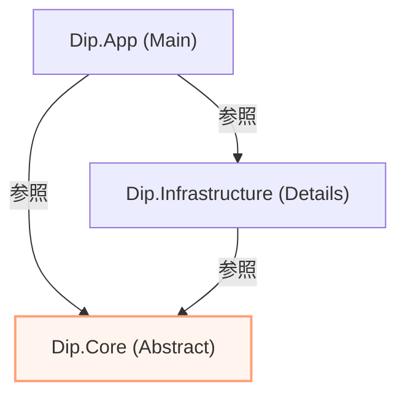

# 第16章：VS CodeでもOK（.NET SDKで同じ設計）💻🌈

この章はね、「エディタがVSでもVS Codeでも、DIPの設計は同じだよ〜😊」を**体で理解する回**だよ✨
コマンドでプロジェクトを作って、VS Codeで**実行▶️**と**デバッグ🐞**まで一気にやるよ〜！

---

## 1) 今日のゴール🎯✨

* VS Code＋.NET SDK だけで、**DIP構成のサンプル**を作れるようになる🧩
* **依存の向き（参照関係）**を、プロジェクト分割で“見える化”できる👀🔁
* VS Codeで **ブレークポイント停止→変数確認**までできる🐞🧠

---

## 2) まず「最新版」を入れて確認しよ🧰✨


現時点の最新版は **.NET 10.0.2（SDK 10.0.102 / C# 14.0）**だよ📦✨（2026-01-13リリース） ([Microsoft][1])

### ✅ SDKが入ってるかチェック（ターミナル）

```bash
dotnet --version
dotnet --info
```

まだ入ってなければ、Windowsは**インストーラ**でも**WinGet**でもOK👍
Microsoft Learnでも「WinGetで入れられるよ」って案内されてるよ🪟✨ ([Microsoft Learn][2])

---

## 3) VS Codeに入れる拡張はこれだけ🧩💡

VS Code側は、基本この2つでOK：

* **C# Dev Kit**（ソリューションエクスプローラやテスト実行が強い✨）
* **C# extension（v2以上）**（Dev Kitが依存してるよ！）

C# Dev Kitは **C# extension（2.0+）が必須**で、さらに **.NET Install Tool**にも依存するよ〜ってFAQに書いてある🧠📌 ([Visual Studio Code][3])
（つまり「拡張を入れたら、足りないものは案内されやすい」って感じでラク😙）

---

## 4) DIPが“目でわかる”プロジェクト構成を作る🏗️✨


フォルダを作って、そこでターミナル開いてね😊
（VS Codeの画面下のターミナルでもOKだよ〜）

### ✅ 作るもの（3プロジェクト）

* `Dip.Core`：上位（業務）💎
* `Dip.Infrastructure`：下位（DBなど）🧱
* `Dip.App`：起動する場所（Composition Root）🚪✨

### ✅ コマンドで一気に作成（Solution＋Project）

```bash
mkdir DipSample
cd DipSample

dotnet new sln -n DipSample

dotnet new classlib -n Dip.Core
dotnet new classlib -n Dip.Infrastructure
dotnet new console  -n Dip.App

dotnet sln add Dip.Core/Dip.Core.csproj
dotnet sln add Dip.Infrastructure/Dip.Infrastructure.csproj
dotnet sln add Dip.App/Dip.App.csproj
```

### ✅ 参照関係（ここがDIPのキモ！）🔁🧠


* `Dip.Core` は **どこにも依存しない**（最強の上位）🛡️
* `Dip.Infrastructure` は `Dip.Core` に依存する（下位→抽象へ）⬅️
* `Dip.App` は両方参照して“組み立てる”（newする場所）🧩

```bash
dotnet add Dip.Infrastructure/Dip.Infrastructure.csproj reference Dip.Core/Dip.Core.csproj
dotnet add Dip.App/Dip.App.csproj reference Dip.Core/Dip.Core.csproj
dotnet add Dip.App/Dip.App.csproj reference Dip.Infrastructure/Dip.Infrastructure.csproj
```



* `Dip.Core` は **どこにも依存しない**（最強の上位）🛡️
* `Dip.Infrastructure` は `Dip.Core` に依存する（下位→抽象へ）⬅️
* `Dip.App` は両方参照して“組み立てる”（newする場所）🧩

---

## 5) コードを書くよ✍️✨（最小DIPサンプル）

### (1) Dip.Core：抽象（interface）と業務（Service）💎


**Dip.Core/User.cs**

```csharp
namespace Dip.Core;

public sealed record User(int Id, string Name);
```

**Dip.Core/IUserRepository.cs**

```csharp
namespace Dip.Core;

public interface IUserRepository
{
    User? FindById(int id);
}
```

**Dip.Core/UserService.cs**

```csharp
namespace Dip.Core;

public sealed class UserService
{
    private readonly IUserRepository _repo;

    public UserService(IUserRepository repo) => _repo = repo;

    public string GetDisplayName(int id)
    {
        var user = _repo.FindById(id);
        return user is null ? "ユーザーが見つからないよ😢" : $"こんにちは、{user.Name}さん🌸";
    }
}
```

> ✅ここがDIPの気持ちいい所：
> `UserService`（上位）は **IUserRepository（抽象）しか知らない**✨
> DBがSQLでもファイルでも、上位は守られる🛡️💕

---

### (2) Dip.Infrastructure：具体（InMemory実装）🧱


**Dip.Infrastructure/InMemoryUserRepository.cs**

```csharp
using Dip.Core;

namespace Dip.Infrastructure;

public sealed class InMemoryUserRepository : IUserRepository
{
    private static readonly List<User> _users =
    [
        new(1, "さくら"),
        new(2, "みゆ"),
        new(3, "あかり")
    ];

    public User? FindById(int id) => _users.FirstOrDefault(x => x.Id == id);
}
```

---

### (3) Dip.App：組み立て（newするのはここだけ）🚪✨


**Dip.App/Program.cs**

```csharp
using Dip.Core;
using Dip.Infrastructure;

IUserRepository repo = new InMemoryUserRepository();
var service = new UserService(repo);

Console.WriteLine(service.GetDisplayName(2));
```

---

## 6) 実行してみよ▶️✨

```bash
dotnet run --project Dip.App/Dip.App.csproj
```

「こんにちは、みゆさん🌸」みたいに出たら成功🎉✨

---

## 7) VS Codeでデバッグする🐞🪄（ここが楽しい！）


### ✅ まずやること

1. VS Codeで `DipSample` フォルダを開く📂
2. `Program.cs` の `Console.WriteLine(...)` の行の左をクリックして赤丸（ブレークポイント）🔴
3. **F5**でデバッグ開始▶️🐞

C# Dev Kitを使う場合、VS Code側の公式ドキュメントでは「launch.jsonを直接いじるデバッグは基本おすすめしないよ（必要ならOK）」ってスタンスだよ📌 ([Visual Studio Code][4])
（だからまずは **Dev KitのRun/Debug体験**に乗っかるのがラク！😆）

---

## 8) もし詰まったら（あるある集）🧯😄

### ❓C# Dev Kitのコマンドが出ない／動かない

* **C# extension が v2以上じゃない**とDev Kitが動かないことがあるよ⚠️
  FAQでも明記されてる📌 ([Visual Studio Code][3])

### ❓.NET SDKが見つからないと言われる

* `dotnet --version` が通るか確認✨
* Dev Kit側が必要に応じて .NET を案内・自動導線にしてくれる説明もあるよ🧰 ([Microsoft Learn][5])

### ❓launch.jsonが欲しい！

* もっと複雑なデバッグでは `launch.json` が必要になることもあるよ🧩
  そのときは、VS Code公式で「Copilotがlaunch.json生成を助けられるよ」って案内もある🥳 ([Visual Studio Code][6])
  （ただしDev Kit流で回るなら、まずはそっち優先がスムーズ！）

---

## 9) 章末ミニ演習📝🌟（10〜20分）

### 演習A：実装差し替えごっこ🔁😆

* `InMemoryUserRepository` をもう1個作って、名前を変えてみてね
* `Program.cs` の `repo = new ...` を変えるだけで挙動が変わるのを確認🎛️✨

### 演習B：依存の向きを言葉で説明🗣️💖

* 「`Dip.Core` が `Dip.Infrastructure` を参照しないのはなぜ？」を3行で説明してみて✍️
  （“上位を守るため”が言えたら満点💯）

### 演習C：ブレークポイントで観察🐞👀

* `UserService.GetDisplayName` の中にブレークポイント置いて、
  `user` が `null` かどうかをデバッグで見てみよ〜✨

---

次の第17章は、ここで作った構成をベースに「AI拡張でDIP設計を加速する」やつに入れるよ🤖🚗✨
もし第16章をさらに“授業っぽく”するなら、章末に**小テスト（○×/選択式）**も付けられるよ〜😙📘

[1]: https://dotnet.microsoft.com/en-US/download/dotnet/10.0 "Download .NET 10.0 (Linux, macOS, and Windows) | .NET"
[2]: https://learn.microsoft.com/en-us/dotnet/core/install/windows "Install .NET on Windows - .NET | Microsoft Learn"
[3]: https://code.visualstudio.com/docs/csharp/cs-dev-kit-faq "C# Dev Kit FAQ"
[4]: https://code.visualstudio.com/docs/csharp/debugging "Debugging"
[5]: https://learn.microsoft.com/ja-jp/dotnet/core/install/windows "Windows に .NET をインストールする - .NET | Microsoft Learn"
[6]: https://code.visualstudio.com/docs/debugtest/debugging "Debug code with Visual Studio Code"
