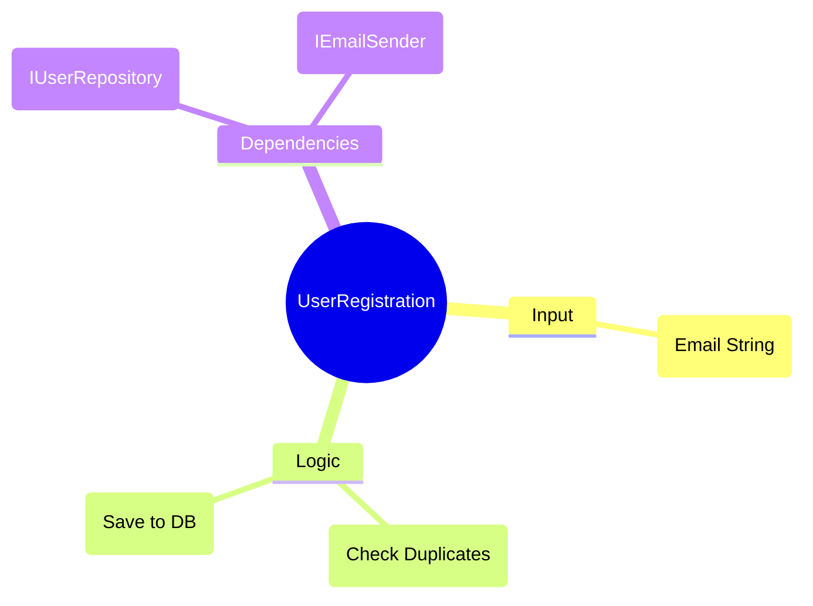

# 第17章：AI拡張でDIP設計を加速（用途別で安全運転）🤖🚗✨

この章は「DIPそのもの」よりも、**DIPを“速く・安全に・迷いにくく”実装するためのAIの使い方**がテーマだよ〜！💖
（AIは魔法じゃないけど、うまく使うと“設計の迷子”が激減するよ🧭✨）

---

## 17-1. この章のゴール🎯✨

できるようになること👇😊

* AIに「依存関係の図」を作らせて、どこがグチャグチャか一瞬で把握🗺️🔍
* AIに「interface候補」を複数案出させて、良い抽象を選べる🧠🌷
* AIに「Fake実装＆テスト」を作らせて、DIPの効果（差し替え）を秒速で体験🧪⚡
* AIがやりがちな「過剰抽象化」を止められる🛑😄

---

## 17-2. まず最重要！AI “安全運転” ルール🚦🧡

AIを使うと速いけど、**事故りやすいポイント**もあるよ〜🥹💦
先にここだけ押さえよっ！

### ルール①：お願いは「小さく」出す🧩

* いきなり「全部DIPにして！」は危険⚠️
* 「このクラスだけ」「このメソッドだけ」「この依存だけ」みたいに小さく切る✂️✨

### ルール②：必ず「方針→差分→実行」順にする🧾➡️🧾➡️▶️

AIにいきなり書かせるより、

1. 変更方針（設計の意図）

2. 変更差分（どこをどう変えるか）
3. 実装（コード）
   の順が安定するよ👍✨

### ルール③：秘密は貼らない🔐🙅‍♀️

APIキー、接続文字列、社内URL、個人情報は入れない！🫶

---

## 17-3. まずはAIに「依存図」を描かせよう🗺️✨

DIPで一番つらいのって、「どこが依存してるか目で追えない」ことなんだよね😵‍💫
そこでAIの出番！

### 依存図プロンプト例（コピペ用）📝✨

> 次のコード（またはプロジェクト構成）について、コンパイル時の依存関係を矢印で表してください。
> どの依存が “上位（業務）→下位（DB/HTTP/ファイル）” になっていてDIP違反っぽいかも指摘して、直すならどこに境界（interface）を置くべきか提案して。
> 出力は「依存一覧」「DIP違反候補」「修正案（最小）」の3つで。

💡ポイント：AIは「実行順」じゃなくて「参照してる型・using・new」から依存を推理するよ🔍
だから、**該当ファイルを開いた状態**で聞くと精度が上がるよ〜📂✨（IDE内チャットが強い）

---

## 17-4. Visual Studioでの「最速AI導線」まとめ🪟⚡

### ① Copilot Chatを開く💬

Visual Studioでは Copilot Chat を開いて質問できるよ✨（メニューから開ける）([Microsoft Learn][1])

### ② 右クリックの「Copilot Actions」が神😇✨

Visual Studio 2026 では、エディタ右クリックのメニューから **Explain / Optimize Selection / Generate Comments / Generate Tests / Add to Chat** みたいな“即実行”が使えるよ🪄✨([Microsoft Learn][2])

* Explain：このクラス/選択範囲を説明して〜📚
* Optimize Selection：選択したコードを改善案つきで最適化🛠️✨
* Generate Tests：テスト雛形を作る🧪
* Add to Chat：選択範囲をチャットに渡す📩

### ③ Cloud Agent（プレビュー）で「複数ファイル作業」を投げられる🤖📦

Visual Studio 2026 では Cloud Agent がプレビューで使えて、リファクタや複数ファイル編集を“下書き”してくれるよ✨
ただし「GitHubのリポジトリにつながったソリューション」が必要＆有効化後に再起動が要るよ🔁([Microsoft for Developers][3])

---

## 17-5. VS Code派の人はここ！Copilot Chat / Codex の使い分け💻🌈

### Copilot Chat（VS Code）

VS Codeでもチャットで「説明」「修正」「テスト生成」みたいな支援ができるよ💬✨([Visual Studio Code][4])

### Codex IDE extension（VS Code）

Codex拡張は「読む・編集する・実行する」タイプのコーディングエージェントだよ🤖🔧
IDE横で使えたり、タスクをクラウドに投げられる、って公式に書いてあるよ([OpenAI Developers][5])

ただし注意！⚠️
**Windowsは“experimental（実験的）”で、快適に使うならWSLワークスペース推奨**って公式に書かれてるよ🪟➡️🐧([OpenAI Developers][5])

### Codexのスラッシュコマンド（便利！）✨

Codex拡張には /review（変更レビュー）や /cloud（クラウド実行）などがあるよ🧰✨([OpenAI Developers][6])

---

## 17-6. AIに「interface候補」を複数案出させる🧠✨

DIPで一番悩むのが「どんなinterface切ればいいの？」問題だよね🥹
AIに**複数案**を出させると、判断がラクになるよ〜！

### interface候補プロンプト例📝🌷

> このクラス（または機能）は、DB/HTTP/ファイルに依存しています。
> DIPのために境界となるinterfaceを作りたいです。
> interface案を3つ出して、それぞれ
>
> * 責務（何を約束する？）
> * メソッド例（最小）
> * 良い点/悪い点
> * どんな時に採用すべきか
>   を比較してください。
>   注意：メソッドを増やしすぎないで、最小から始めたいです。

### その後の“選び方”チェック✅

* interface名が「技術」じゃなく「やりたいこと」寄り？（例：Sql〜 より UserRepository っぽい）🙂
* メソッド数が少ない？（最初は1〜3個くらいが気持ちいい）🧸
* “差し替えたい理由”がある？（テスト、DB差し替え、API差し替え）🔁

---

## 17-7. AIに「DIP違反を探させる」👀⚡

DIP違反って、だいたいこういう形で潜むよ👇😈

* 業務Serviceの中に、DBやHTTPの具体クラス名が出てくる
* Service内で new してる
* 業務層プロジェクトがインフラ層プロジェクトを参照してる

### 違反検出プロンプト例🕵️‍♀️📝

> このプロジェクト（またはコード）で、DIP違反になりそうな点を列挙して。
> 「上位層が下位層の具体に依存している箇所」を優先して、
>
> 1. 具体的にどの行/型が問題か
> 2. どう直すか（最小修正）
> 3. 直した後の依存の向き（矢印）
>    を出して。

---

## 17-8. AIに「Fake実装＆テスト」を作らせる🧪✨

DIPの気持ちよさって、**Fakeに差し替えてテストが一瞬で通る**ところなの🥹💖

### Fake生成プロンプト例🧸📝

> この interface（例：UserRepository）に対して、メモリ上で動くFake実装を作って。
>
> * 追加、取得、更新、削除の最低限ができる
> * テストで扱いやすいように状態を保持する
> * 例外ケースも最低1つ入れる
>   さらに、このFakeを使ったユニットテストも作って。

💡ここでの狙いは「AIに全部任せる」じゃなくて、
**“差し替えが簡単”って感覚を体に入れる**ことだよ〜💪✨

---

## 17-9. AIがやりがちな「過剰抽象化」を止める🛑😄

AIって親切だから、すぐこうしがち👇💦

* interface作りすぎ（IServiceFactoryFactory…みたいな地獄😇）
* まだ必要ない拡張ポイントを先に作る
* “きれい”だけど、読みにくい

### 止め方の合言葉（プロンプト）🗣️✨

> 抽象化は最小にしたいです。
> 今回、実装差し替えが必要なのは「外部I/O境界」だけです。
> interfaceは必要最低限（まず1つ、メソッドも最小）にしてください。
> もし複数の抽象が必要だと言うなら「なぜ必要か」を具体例で説明して。

### 判断チェック（人間が最終決定👩‍💻🌷）

* そのinterface、実装が2つ以上ある（or 近い将来ありそう）？
* テストで差し替えたい？
* それが無いなら、今は抽象にしない勇気も大事🫶

---

## 17-10. おまけ：依存（NuGet）もAIに見てもらえる📦🤖✨

Visual Studio 2026 のアップデートでは、Copilot Chat のツール（MCP）として NuGet 関連を有効化して、脆弱性対応や更新提案を助ける仕組みも案内されてるよ📦✨([Microsoft Learn][7])

DIPの「依存」って“コードの依存”だけじゃなくて、ライブラリ依存も地味に効くからね〜！🥹

---

## 17-11. 最終まとめ：DIPを入れる順番（AI時代の鉄板）🚪🌟

最後に、AIを使うときの最強手順を置いとくね😊✨

1. 外部I/O境界を1つ選ぶ（DB/HTTP/ファイル）🚪
2. AIに依存図を描かせる🗺️
3. interface候補を3案出させる🧠
4. 最小のinterfaceで切る✂️
5. Fake＋テストを作って「差し替え成功」を確認🧪✅
6. うまくいったら次の境界へ（1個ずつ！）🔁✨

---

[1]: https://learn.microsoft.com/en-us/visualstudio/ide/visual-studio-github-copilot-chat?view=visualstudio&utm_source=chatgpt.com "About GitHub Copilot Chat in Visual Studio"
[2]: https://learn.microsoft.com/en-us/visualstudio/releases/2026/release-notes?utm_source=chatgpt.com "Visual Studio 2026 Release Notes"
[3]: https://devblogs.microsoft.com/visualstudio/visual-studio-november-update-visual-studio-2026-cloud-agent-preview-and-more/ "Visual Studio 2026 November 2025 Update"
[4]: https://code.visualstudio.com/docs/copilot/chat/copilot-chat?utm_source=chatgpt.com "Get started with chat in VS Code"
[5]: https://developers.openai.com/codex/ide/ "Codex IDE extension"
[6]: https://developers.openai.com/codex/ide/slash-commands "Codex IDE extension slash commands"
[7]: https://learn.microsoft.com/en-us/visualstudio/releases/2026/release-notes "Visual Studio 2026 Release Notes | Microsoft Learn"
