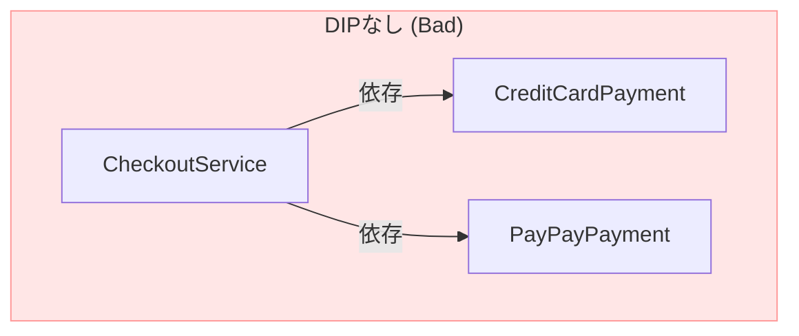

# 第01章：はじめに｜DIPってどんな子？🤝🌱

この章は「DIPを“雰囲気”じゃなくて、ちゃんとイメージできる」状態になるのがゴールだよ〜！💖
（ガチガチ理論はまだ後でOK！まずは *DIPの気持ち* をつかもう🥳）

---

## 1) この章でできるようになること🎯✨

* 「DIPって結局なに？」を**一言で説明**できるようになる🗣️💕
* 「変更に強い設計」ってどういうことか、**支払い例**でわかる💳➡️📱
* コードを見たときに「ここ、DIPなしでツラくなりそう…」って**匂い**に気づける👃⚠️

---

## 2) DIPの一言まとめ（超だいじ）💡🧠

**DIP：上位（やりたいこと・ルール）が、下位（道具・詳細）に振り回されないようにする考え方**🙅‍♀️✨

もうちょい“ちゃんとした言い方”だと、DIPには有名な2つのルールがあるよ📜

* 上位モジュールは下位モジュールに依存しない（どっちも抽象に依存する）
* 抽象は詳細に依存しない（詳細が抽象に依存する） ([Stackify][1])

この「依存の向き」を整えるのがDIPの本体〜！🔄🏹

---

## 3) ざっくり例：支払い方法変更でも中身を守る💳➡️📱


### 状況：最初はクレカだけでOKだった🙂

でもある日…

* 「PayPayも追加して！」📱✨
* 「やっぱり楽天Payも！」🧧✨
* 「決済会社のAPIが変わった！」😇🔥

こういう変更、めちゃくちゃ“あるある”だよね…！

---

## 4) DIPなしの世界：上位が下位にベッタリ😵‍💫🧷

たとえば「注文して支払いする」みたいな上位の処理が、決済の実装を直に知ってると…👇

```ts
// ❌ DIPなし：上位が下位を直接 new してる
class CheckoutService {
  async checkout(amount: number) {
    const payment = new CreditCardPayment(); // ←ここがベッタリ依存😵
    await payment.pay(amount);
  }
}

class CreditCardPayment {
  async pay(amount: number) {
    // クレカ決済の詳細（外部API呼び出しとか）
  }
}
```




### これの何がツラいの？😢


* PayPayを入れたら、**CheckoutServiceを直接いじる**ことになる🛠️💥
* テストしたいのに、決済の実処理が絡んで**テストがしんどい**🧪💦
* 「変更の波」が、上位ロジックまで**ドーン！**って来る🌊💣

---

## 5) DIPの世界：上位は“約束（抽象）”だけを見る🤝🧩

DIPでは、上位（Checkout）は「決済のやり方」じゃなくて、
**“決済してね”という約束（interface）**だけ見るようにするよ✨

```ts
// ✅ 抽象（約束）
interface PaymentGateway {
  pay(amount: number): Promise<void>;
}

// ✅ 上位：抽象だけ知ってる（実装は知らない）
class CheckoutService {
  constructor(private payment: PaymentGateway) {}

  async checkout(amount: number) {
    await this.payment.pay(amount);
  }
}

// ✅ 下位：詳細（実装）が抽象を満たす
class CreditCardPayment implements PaymentGateway {
  async pay(amount: number) { /* ... */ }
}

class PayPayPayment implements PaymentGateway {
  async pay(amount: number) { /* ... */ }
}
```

### 何がうれしいの？🎉

* 支払い方法を増やしても、**CheckoutServiceは基本そのまま**🙆‍♀️✨
* テストでは「偽物の決済」を差し込めて、**テストが一気にラク**🧪🧸
* 変更の影響が「下位の中」で止まりやすい🧯🔥

---

## 6) 図で見る：依存の矢印がポイント🏹🔄


### ❌ DIPなし（上位 → 下位に直依存）

* CheckoutService → CreditCardPayment（詳細）
  「上位が下位の詳細を知ってる」状態😵‍💫

### ✅ DIPあり（上位も下位も “抽象” へ）

* CheckoutService → PaymentGateway（抽象）
* CreditCardPayment → PaymentGateway（抽象）
* PayPayPayment → PaymentGateway（抽象）

これが「依存が逆転した」って言われる理由だよ〜！🔄✨
（上位が“詳細”じゃなくて“抽象”に向くのがキモ！）

---

## 7) ここでの“上位/下位”の感覚（ふんわり予告）🧠🪜

* **上位**：アプリがやりたいこと・ルール（例：注文を確定する）📦✨
* **下位**：外部API・DB・ファイル・時間などの道具（例：決済サービス）🧰🌐

下位は変更が起きやすい（仕様変更、障害、乗り換え…）から、
**上位が下位にベッタリだと事故りやすい**って感じ💥🚑

---

## 8) DIPとDIは別モノだよ（ここ大事）⚠️🤝

* **DIP**：設計のルール（依存の向きをどうするか）🧭
* **DI**：実装テク（依存を外から渡すやり方）💉

この章では「へぇ〜DIPって“向き”の話なんだ！」って分かればOK🙆‍♀️✨
（DIは後の章で、ちゃんとやるよ〜！）

---

## 9) ミニ最新メモ（2026/1/15 時点）🗓️✨

開発まわりは日々更新されるので、今日の時点の“目安”だけ置いとくね💡

* TypeScriptの最新安定版タグは **5.9.3**（GitHub Releases） ([GitHub][2])
* TypeScript 5.9 の新要素として `import defer` が紹介されてるよ（必要になったら後で触れる！） ([TypeScript][3])
* VS Code の 1.108（December 2025）リリース日は **2026/1/8** ([Visual Studio Code][4])
* Node.js は v24 が Active LTS として掲載されてるよ ([Node.js][5])

（教材は“考え方”が中心だから、ここは「へ〜」くらいでOK😊）

---

## 章末の固定セット🍀📌

### まとめ（3行）🧾✨

* DIPは「上位が下位の詳細に振り回されない」ための考え方🙅‍♀️
* コツは「上位も下位も抽象（interface）に依存する」🧩
* 支払い方法みたいな“差し替えが起きる場所”で効きまくる💳➡️📱

### ミニ演習（1〜2問）✍️💡

1. 次のうち、DIPなしの匂いが強いのはどれ？🤔

   * A: 上位が `interface` を受け取って使う
   * B: 上位が `new PayPayPayment()` を直接して使う
2. 「支払い」以外で、差し替えが起きそうな“道具”を2つ考えてみて🧰✨（例：通知、保存、時間…）

### AIに聞く用プロンプト例🤖💬（比較させる系）

* 「このコードの依存関係を説明して。上位/下位を分けて、DIP違反っぽい点があれば指摘して」
* 「支払い処理をDIPっぽくしたい。`interface` を作るならメソッド名と責務はどうする？」
* 「クレカ決済をPayPayに差し替える要望が来た。影響範囲が最小になる設計にリファクタ案を2つ出して、メリデメ比較して」

---

次の章では「そもそも依存って何？（import / new / 直接呼び出し）」を、コードの“匂い探し”としてやっていくよ〜🔗👀✨

[1]: https://stackify.com/dependency-inversion-principle/?utm_source=chatgpt.com "SOLID Design Principles Explained: Dependency Inversion"
[2]: https://github.com/microsoft/typescript/releases "Releases · microsoft/TypeScript · GitHub"
[3]: https://www.typescriptlang.org/docs/handbook/release-notes/typescript-5-9.html "TypeScript: Documentation - TypeScript 5.9"
[4]: https://code.visualstudio.com/updates "December 2025 (version 1.108)"
[5]: https://nodejs.org/en/about/previous-releases "Node.js — Node.js Releases"
