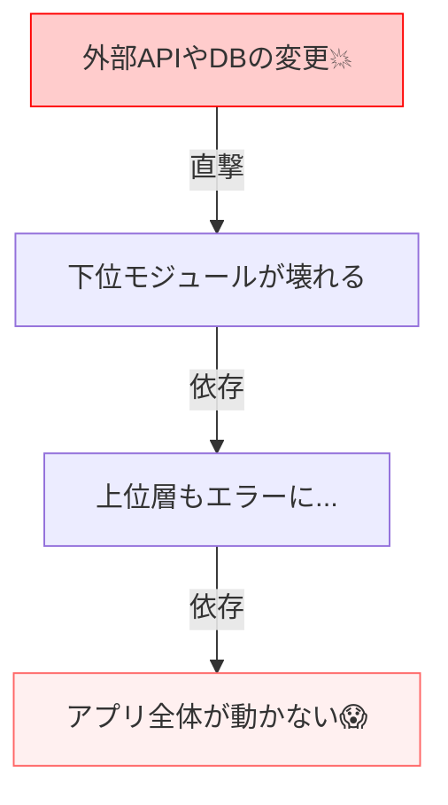

# 第02章：そもそも「依存」って何？🔗👀✨

「依存」って、めちゃ雑に言うと…

> **Aのコードが、Bがないと動けない／変えにくい状態** 🧷
> （Bの都合でAが振り回される感じ🥺）

DIPに入る前に、まずはこの“依存”を**見つけられる目👀**を作るのがこの章のゴールだよ〜！💪✨

---

## 1) import / new / 直接呼び出しが作る依存🧷🧩


## 1-1. `import` が作る依存📦➡️📦

`import`した瞬間、**「そのモジュールの存在・形」に縛られる**よ〜！🔗

```ts
import { sendEmail } from "./emailSender";
```

これだけで、今このファイルは **`./emailSender` に依存**してる状態📌
もし `emailSender` の関数名が変わったり、引数が変わったり、場所が移動したら…こっちも修正が必要😵‍💫

> ✅ ちなみに TypeScript は最近だと **5.9.x（5.9.3 が Latest）**が出てるよ。型まわりの挙動やツールも更新され続けるので、教材コードも「今のTSの前提」で組むのが大事。 ([GitHub][1])

---

## 1-2. `new` が作る依存🆕🏗️


`new` すると、**「この具体クラスで決め打ち！」**になるのがポイント⚠️

```ts
class OrderService {
  private mailer = new RealEmailSender(); // ←ここで決め打ち依存😵
}
```

これ、`OrderService` が「メール送信のやり方」まで知っちゃってるのね📩
だから将来「Slack通知にしたい！」ってなった時に、上位側まで巻き込まれがち🌀

---

## 1-3. “直接呼び出し” が作る依存📞⚡


`import` や `new` 以外にも、**直接呼んでる時点で依存**が生まれるよ〜！

よくあるのはこれ👇

* `Date.now()` / `new Date()`（時間）⏰
* `Math.random()`（乱数）🎲
* `process.env...`（環境変数）🌱
* `fetch(...)` / `axios(...)`（外部API）🌐
* `fs.readFile...`（ファイル）📁
* `localStorage...`（ブラウザ保存）🗃️

たとえば時間は超わかりやすい敵👇

```ts
export function isCampaignActive(): boolean {
  return Date.now() < new Date("2026-02-01").getTime(); // ⏰に依存
}
```

これ、**テストで「今が何時か」をコントロールできない**から、地味につらい💦
（ここは後の章で “Clockを抽象化” で救うよ〜！🦸‍♀️）

---

## 2) 依存が増えると何が困る？（修正が怖い・テストがつらい）😢🧪

依存が多いと、ざっくりこの2つが発生しやすいよ👇

## 2-1. 修正が怖い😱💥（変更の波及）


1ヶ所変えただけで、**あちこちが壊れる**やつ…😭



* import先の関数シグネチャ変更で大量修正✍️
* newしてるクラスが増えるほど差し替え不能🧱
* 直接呼び出し（API/DB/時間/環境）が散らばると、把握が地獄🌀

「変えたいのは1つだけなのに、改修範囲が読めない」＝恐怖😇

---

## 2-2. テストがつらい😵‍💫🧪（本物が必要になる）


依存が強いと、テストのたびに本物が必要になりがち👇

* 外部APIが必要 → ネットワーク不安定で落ちる🌐💥
* DBが必要 → 準備・片付けが面倒🗄️🧹
* 時間に依存 → たまに落ちるテストが爆誕⏰🔥
* 環境変数に依存 → PC環境で結果が変わる🪟🌀

結果：
**「テストしない文化」が育つ**（最悪パターン）🙈

> ✅ Node.js も 2026年1月にセキュリティ更新が出てて、依存ライブラリ（undici など）も更新されてる。つまり “外部” は普通に揺れる🌪️ ([Node.js][2])

---

## 3) 「依存を見つけるチェックポイント」📝👀✨

ここからが超大事！💖
DIPは“依存の向き”の話だけど、その前にまず **依存を発見できないと始まらない**のだ〜！🔎

## 3-1. コード上で一撃で見つかるやつ🧷


* `import ... from ...` 📦
* `new Something()` 🆕
* `Something.staticMethod()`（静的呼び出し）🧱
* `singleton.getInstance()`（シングルトン）👑
* `process.env` 🌱
* `Date` / `Math.random` ⏰🎲
* `fetch` / `axios` / `fs` / `path` 🌐📁

---

## 3-2. VS Codeでの探し方（超実戦）🪟⌨️🔍


**Ctrl+Shift+F**（全体検索）で、まずこれ打つのが強いよ💪✨

* `new `（newのあと半角スペース）🆕
* `from "`（importのfrom）📦
* `process.env` 🌱
* `Date(` / `Date.` ⏰
* `Math.random` 🎲
* `fetch(` 🌐
* `axios` 🌐
* `fs.` 📁

見つけたら、コメントでこう分類しちゃうのがコツ👇

* 🧠 **方針（ビジネス）**：本質。変えにくい（変えたくない）
* 🧰 **道具（外部I/Oや詳細）**：変わりやすい。揺れる🌪️

（この分類感覚は次章でさらに育てるよ〜！🪜✨）

---

## 3-3. 依存が“危険かも”なサイン🚨

見つけた依存が、こうなってたらDIPの出番が近いかも👇

* 同じ種類の依存が **いろんな場所に散らばってる** 🌀
  （例：あちこちで `fetch` してる）
* 上位っぽいロジックが **DB/HTTP/ファイルに触ってる** 🧠💥
* テストを書こうとすると **環境準備が必要** 😵‍💫
* 置き換えたいのに **newが邪魔して差し替え不能** 🧱

---

## 🌸ミニ体験：このコード、何に依存してる？👀🧩

```ts
import { readFileSync } from "node:fs";

export function loadApiKey(): string {
  const json = JSON.parse(readFileSync("./config.json", "utf-8"));
  return json.apiKey;
}
```

依存ポイントはここ👇

* `node:fs`（ファイルI/O）📁
* `./config.json`（パス・ファイル存在）🪟
* JSONの形（`apiKey` がある前提）🧩

つまり、テストするには「config.jsonを用意する」みたいな準備が必要になりやすいのが分かるね🧪💦

---

## おまけ：最近の開発環境の流れ（さらっと）🤖🧰✨

* VS Code は **1.108（December 2025 / リリース日 2026-01-08）**が案内されてるよ。 ([Visual Studio Code][3])
* VS Code のAIまわりも変化中で、GitHub Copilot 拡張が“統合されていく/整理されていく”流れが明言されてる（早期にMarketplaceから外す予定の話も出てるよ）。 ([Visual Studio Code][4])

教材的には「AIに依存発見を手伝わせる」やり方が今っぽくて強い✌️🤖

---

## 章末の固定セット🍀📌

## まとめ（3行）🧾

* 依存＝「それがないと動けない／変えにくい」状態🔗
* `import / new / 直接呼び出し` は依存を生みやすい🧷
* 依存が増えると、修正が怖くなってテストがつらくなる😢🧪

## ミニ演習（1〜2問）✍️

1. 自分のプロジェクトで **Ctrl+Shift+F → `new `** を検索して、`new` の数を数えてみてね🆕🔍
2. `fetch(` または `process.env` を検索して、見つけた場所を「道具（外部）」としてマークしてみてね🌐🌱✅

## AIに聞く用プロンプト例🤖💬

* 「このフォルダ内の TypeScript コードで、`new` や `fetch`、`Date.now()` のような“外部依存”がある箇所を列挙して、依存の種類ごとに分類して😊」
* 「この関数のテストがつらい理由を“依存”の観点で説明して、改善案を3つ出して🙌」
* 「依存が散らばってる箇所を見つけた。境界（interface）を作るなら、どんな名前とメソッドが良さそう？候補を出して✨」

---

次の第3章では、この依存を **“上位/下位” の感覚で仕分け**できるようにして、DIPの土台を固めるよ〜🪜🧠✨

[1]: https://github.com/microsoft/typescript/releases "Releases · microsoft/TypeScript · GitHub"
[2]: https://nodejs.org/en/blog/vulnerability/december-2025-security-releases "Node.js — Tuesday, January 13, 2026 Security Releases"
[3]: https://code.visualstudio.com/updates?utm_source=chatgpt.com "December 2025 (version 1.108)"
[4]: https://code.visualstudio.com/blogs/2025/11/04/openSourceAIEditorSecondMilestone?utm_source=chatgpt.com "Open Source AI Editor: Second Milestone"
