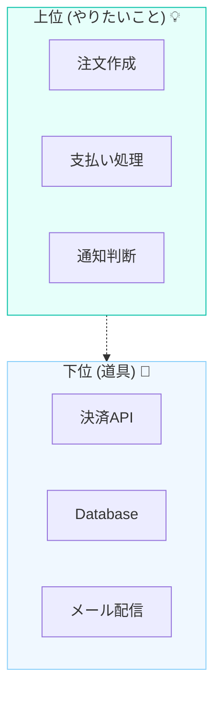

# 第03章：設計の超ミニ前提｜“上位”と“下位”の感覚🧠🪜✨

## この章でつかむこと🎯💖

* 「上位＝やりたいこと（方針）」と「下位＝道具（詳細）」を**感覚で仕分け**できるようになるよ🙌
* 「変わりやすいのは下位」っていう**超重要あるある**を、自分のコードに当てはめられるようになるよ🌪️
* 次章（DIPが必要になる地獄🔥）に向けて、**“依存のヤバさ”を見抜く目**が育つよ👀✨

---

## 1) まずは超ざっくり！上位と下位ってなに？🤝🌱

## 上位（High-level）＝「目的」や「ルール」💡📜

* アプリが**達成したいこと**
* ビジネス的なルール（業務ルール）
* 例：

  * 「注文できたら在庫を減らす」📦
  * 「支払いが成功したら注文確定」💳✅
  * 「ユーザー登録はメール重複NG」📩🙅‍♀️

➡️ **“何をしたいか”** が中心だよ🎯

## 下位（Low-level）＝「手段」や「仕組み」🧰⚙️

* 上位の目的を叶えるための**道具**
* 例：

  * DB（PostgreSQL/SQLiteなど）🗄️
  * HTTP通信（外部API）🌐
  * ファイル、OSのパス、環境変数📁
  * 現在時刻⏰
  * ライブラリやSDKの細かい仕様📚

➡️ **“どうやってやるか”** が中心だよ🛠️

---

## 2) なぜ分けるの？答え：変わる場所が違うから😵‍💫➡️😌

## “変更されやすいのは下位”あるある🌪️

* DBが変わる：SQLite→PostgreSQL🗄️🔁
* 外部APIが変わる：レスポンス形式が変わる🌐💥
* 認証方式が変わる：APIキー→OAuth🔐
* 保存先が変わる：ファイル→クラウド📁☁️
* 時刻の扱いが変わる：タイムゾーン、夏時間…⏰🌍

こういうのって、**上位（業務ルール）とは別の都合**で起きがちなの🥺
だから、上位が下位にベタ依存してると…
👉 **下位の変更が上位を巻き込んで爆発💥** しやすい、ってわけ🔥

---

## 3) イメージで理解しよ！上位＝“脚本”、下位＝“小道具”🎬🎭

* 上位：ストーリー（脚本）📖✨
* 下位：カメラ、照明、マイク、小道具🎥💡🎙️

脚本（上位）は、カメラ機種が変わっても基本は変えたくないよね？🥹
でも、脚本が「SONYの型番○○のカメラを直接操作する」って書かれてたら…
カメラ変えただけで脚本を書き直し😇（地獄）

これがコードでも起きるよ〜〜って話だよ🔥😵

---

## 4) 具体例：注文処理を“上位/下位”に仕分けしてみる📦💳✨

題材：**注文を確定する**🛒✅

## 上位（やりたいこと）💡

* 注文を作る
* 支払いをする
* 成功なら注文確定、失敗ならキャンセル
* 必要なら通知する

## 下位（道具）🧰

* 支払いAPIにHTTPで投げる（通信）🌐
* 注文をDBへ保存する（永続化）🗄️
* いまの時刻を取る（時間）⏰
* ログを出す（仕組み）🪵

---

## 5) “依存の矢印”の感覚だけ先に入れよう🏹💘

ここでのポイントは1つだけ👇

## 上位が「下位の具体」を知りすぎると危険⚠️😵

* 上位の中に `fetch(...)` が直書きされてる🌐
* 上位の中に `new SqliteClient(...)` がある🗄️
* 上位の中に `Date.now()` が散らばってる⏰

こうなると、下位が変わった時に上位が巻き添え😇
だから次の章で、「DIPで依存の向きを整えようね」って流れになるよ🔄✨

---

## 6) 仕分けのコツ：迷ったらこの3問で判定📝💡

## Q1：それって“業務ルール”？それとも“手段”？🤔

* ルールなら上位📜
* 手段なら下位🧰

## Q2：それ、来月変わる可能性ある？🌪️

* 変わりやすいなら下位寄り
  （DB、API、ファイル、時間、外部サービス…）🗄️🌐📁⏰

## Q3：それが壊れたら「ビジネス的に困る」？それとも「技術的に困る」？😵

* 「注文できない」は上位の問題
* 「HTTPがタイムアウト」は下位の問題
  （もちろん影響はするけど、**種類が違う**のが大事だよ✨）

---

## 7) ちょい最新メモ（2026年1月時点）🆕✨

* TypeScript は **5.9.3 が Latest** として公開されてるよ📌 ([GitHub][1])
* VS Code は **December 2025 release（v1.108）が 2026-01-08 リリース**になってるよ🧡 ([Visual Studio Code][2])
* Node.js は **v24 が Active LTS** として案内されてるよ（安定系を選ぶ時の目安になるやつ）🟢 ([Node.js][3])

（ここは“覚えなくてOK”！ただ「道具側はこうやって更新が起きる＝下位は変わりやすい」の実例だよ〜って意味🤭）

---

## まとめ（3行）🧾✨

* 上位＝**目的/業務ルール**、下位＝**道具/詳細**💡🧰
* **変わりやすいのは下位**（DB/HTTP/ファイル/時間など）🌪️
* 上位が下位の具体にベタ依存すると、変更で一緒に爆発しやすい💥😵

---

## ミニ演習（1〜2問）✍️🎀

1. 次のうち「下位っぽい」ものに✅してね👇

* 「注文合計が1万円以上なら送料無料」🚚
* 「PostgreSQLにINSERTする」🗄️
* 「外部の決済APIにHTTPで投げる」🌐
* 「購入完了メールを送る」📩

2. あなたが最近書いたコード（小さくてOK）を思い出して、
   「上位の中に下位が混ざってそうな行（`fetch`/`new DB`/`Date.now` など）」を1つ探してみてね👀🔍

---

## AIに聞く用プロンプト例🤖💬（比較させる系✨）

* 「この処理を“上位（業務ルール）”と“下位（技術詳細）”に仕分けして、理由もつけて」🧠🪜
* 「この関数の中にある `下位の匂い`（DB/HTTP/時間/ファイルなど）を指摘して、上位から分離する案を3つ出して」🧹✨
* 「“変わりやすさ”の観点で、どれが下位に寄ってるかランキングして」🌪️🏆

---

次の第4章は、この仕分けができた状態で読むと「うわ…これ自分もやってる…😇」ってなって超効くよ🔥😵‍💫
この章の内容を、あなたの“よくある題材”（たとえばブログ更新、データ取得、バッチ処理、ゲーム系ツール等）に置き換えたミニ例も作れるよ〜！📦🎮✨

[1]: https://github.com/microsoft/typescript/releases "Releases · microsoft/TypeScript · GitHub"
[2]: https://code.visualstudio.com/updates "December 2025 (version 1.108)"
[3]: https://nodejs.org/en/about/previous-releases?utm_source=chatgpt.com "Node.js Releases"
