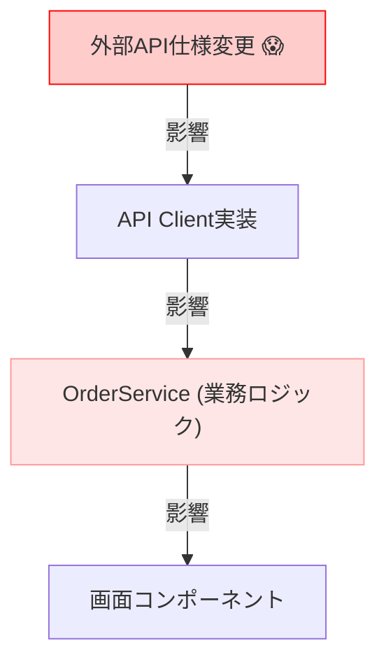

# 第04章：DIPが必要になる「あるある地獄」🔥😵

ここは **「DIPを知らないまま頑張ると、どんな“つらさ”が起きるのか」** を体感する章だよ〜！🫠✨
（次の第5章で、ちゃんと“失敗コード”を読んでいく準備ね💪）

---

## この章でわかるようになること🎯💖

* 「あ、これ…DIPいるやつだ😇」って **危険信号** を見分けられる👀⚠️
* 変更が起きたときに **どこまで巻き添え爆発するか** を想像できる💥
* テストが無理ゲーになる理由を **言語化** できる🧪🙈

---

## まず結論：地獄の正体は「上位が下位の都合に振り回される」こと😵‍💫🌀

* 上位（やりたいこと・業務ルール）💡
* 下位（DB・HTTP・ファイル・時間・外部サービス）🧰

この「下位」は **変更が起きやすい** のに、
上位が直で握ってると、変更のたびに上位が壊れるの…😭🔧

---

## 地獄①：DB変更で業務ロジックが壊れる🗄️💥


### ありがちなストーリー📖✨

最初は “とりあえず” で DB を直に叩くよね😌
でもある日…

* DBを Postgres → SQLite に変えたい
* ORMを変えたい（or ライブラリ更新で書き方が変わった）
* テーブル構造が変わった（列名変更・正規化など）

…みたいなイベントが来る🌪️

### 何が地獄？😵

**業務ロジック（上位）** の中に SQL や DBライブラリの都合（下位）が混ざってると、
DB変更が「業務ロジックの修正」になっちゃうの💥

#### “巻き添えが起きる”コードの雰囲気（まだ失敗例の本編は次章！）👇

```ts
// OrderService（本来は「注文のルール」を書きたい場所）なのに…
import { Client } from "pg";

export class OrderService {
  async placeOrder(userId: string, itemId: string) {
    const client = new Client({ connectionString: process.env.DB_URL });
    await client.connect();

    // ここにSQL直書き + DBの都合がベッタリ😭
    const r = await client.query(
      "SELECT stock FROM items WHERE id = $1",
      [itemId]
    );

    if (r.rows[0].stock <= 0) throw new Error("在庫なし");

    await client.query(
      "INSERT INTO orders(user_id, item_id) VALUES($1, $2)",
      [userId, itemId]
    );

    await client.end();
  }
}
```

### この状態でDBを変えると…💥

* `Client` の作り方が変わる
* SQL方言が違う
* トランザクションの扱いが変わる
* 接続方法・設定（環境変数含む）が変わる

結果：**OrderService（業務）も一緒に修正** 😭🧯
「DBの都合」が「業務ルール」に侵入してるのが問題だよ〜！

---

## 地獄②：外部API仕様変更でアプリ全体が巻き添え🌐💥


### ありがちなストーリー📦➡️🚚

外部の配送API、決済API、認証API…便利だけど **相手が変わる** 😇

* レスポンスのフィールド名が変わった
* エラー形式が変わった
* 認証方式が変わった（ヘッダやトークン更新）
* バージョンアップで非推奨が消えた

### 何が地獄？😵

上位が “APIの生レスポンス” を直接使いまくってると、
仕様変更が「コード全域の大改修」になる💣

```ts
// 業務ロジック内で外部APIのレスポンス構造に依存しちゃう例
type ShippingResponse = {
  status: "ok" | "ng";
  price: number;
  etaDays: number;
};

export async function calcShipping(userId: string) {
  const res = await fetch("https://example-shipping/api/quote");
  const data = (await res.json()) as ShippingResponse;

  // ここ以外にも data.price とか data.etaDays を全体で使い始めると…😇
  return data.price;
}
```

もし `etaDays` が `estimatedDays` に変わったら？
**参照箇所ぜんぶ探して修正祭り** 🔍🔥
しかも “仕様変更” のたびに、業務側のコードがザクザク壊れる💥




---

## 地獄③：テストが無理ゲーになって諦める🙈🧪


### “テスト無理”の原因、だいたいコレ😇

* 本物DBに繋いじゃう🗄️
* 本物APIを叩いちゃう🌐
* `Date.now()` / `new Date()` に依存しちゃう⏰
* `process.env` やファイルを直読みしちゃう📁

すると…

* テストが遅い🐢
* ネットワークで落ちる⚡
* 時刻で結果が変わる🕰️
* “再現できないバグ” が増える👻

```ts
export async function isCampaignActive(): Promise<boolean> {
  // 時間が直で入ってくると、テストで固定できない😵
  const now = new Date();

  const res = await fetch("https://example.com/campaign");
  const data = await res.json();

  return now < new Date(data.endsAt);
}
```

### 2026の現場感メモ📝✨（最新）

いまのテスト環境は、たとえば **Vitest 4**（2025年10月に4.0発表）みたいに進化してて、書きやすさも上がってるよ〜🧪🎉 ([Vitest][1])
一方で **「そもそも差し替えできない設計」** だと、どのテストツールでも苦しいのは変わらない…！😇
Jestも **v30がStable** として案内されてるよ📌 ([Jest][2])

---

## ここまでの“地獄”を1つにまとめると…🧠🌀


**変更が起きるたびに、業務コードが巻き込まれる**
**テストができなくて、安心して直せない**
→ だから “怖くて触れないコード” になっていく…😢🧨

---

## DIPが必要になる「危険信号チェックリスト」🚨✅


1つでも「うっ…」ってなったら、DIPの出番が近いよ👀⚠️

* [ ] 業務ロジックの中に `fetch` / DB操作 / ファイル操作が直書きされてる🌐🗄️📁
* [ ] “変更”が来ると、関係なさそうなファイルまで直す羽目になる💥
* [ ] `new XxxClient()` があちこちに散らばってる🆕🕸️
* [ ] 例外が「下位の都合」すぎて、業務側が振り回される😵‍💫
* [ ] テストで本物DB/APIが必要になってる🧪😭
* [ ] テストが遅い＆不安定で、だんだん回さなくなる🐢💔
* [ ] “差し替え”ができなくて、実験が怖い😱
* [ ] ライブラリ更新が恐怖イベントになってる📦💣
* [ ] 変更があるたび「全文検索→手修正祭り」になりがち🔍🔥
* [ ] 「この処理、どこで何に依存してるの？」が説明できない🫠

---

## ミニ演習（1〜2問）✍️🧸

### 演習1📝

次のうち「変更が来たら地獄になりやすい依存」を3つ選んでね👇

* A: `fetch()` を業務関数の中で直に呼ぶ
* B: `interface` で外部I/Oを隠して渡す（※まだ後でやるやつ！）
* C: `new Date()` をロジックの中で直に使う
* D: 純粋な計算（税計算とか）だけを関数にする

### 演習2🧩

「DBを変える」「APIが変わる」「時間が絡む」
この3つのうち、あなたの今の開発で **一番起きそう** なのはどれ？🤔💭
それが起きたとき、どこが壊れそうか **想像でOK** でメモしてみて📝✨

---

## AIに聞く用プロンプト例🤖💬（丸投げじゃなく“診断”させる）


そのままコピペで使ってOKだよ〜！✨

1. 依存の洗い出し🔍

```text
次のTypeScriptコードについて、上位（業務ロジック）と下位（I/Oや外部都合）を分類し、
「変更が来たら壊れやすい依存ポイント」を箇条書きで指摘してください。
また、DIPの観点で“後で抽象化すべき境界”候補を3つ提案してください。
```

2. 巻き添え範囲の予測🧨

```text
このコードで「DBを別実装に差し替える」と仮定したとき、
修正が必要になりそうな箇所を“理由つき”で列挙してください。
さらに、修正範囲を最小化する設計方針を短く提案してください。
```

---

## まとめ（3行）🧾✨

* DB/API/時間みたいな「変わりやすい下位」を、上位が直で握ると地獄🔥
* 変更が巻き添え爆発して、テストもできず、コードが触れなくなる😇
* 次章で「DIPなし失敗コード」を読んで、どこが怖いか言語化していこう💪📘✨

---

次は第5章いく？それとも、この章のミニ演習を一緒に答え合わせする？😊💞

[1]: https://vitest.dev/blog/vitest-4?utm_source=chatgpt.com "Vitest 4.0 is out!"
[2]: https://jestjs.io/versions?utm_source=chatgpt.com "Jest Versions"
