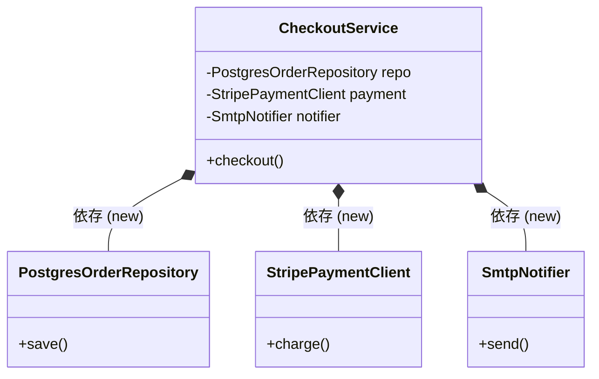

# 第05章：まずは失敗例を読む（DIPなし）🙅‍♂️📉

今日はあえて「ダメなやつ」を読みます😂✨
DIPを理解する近道って、実は「DIPが無いと何がつらいのか」を体験することなんだよね🧠💡

---

## この章でできるようになること🎯✨

* 「上位（やりたいこと）」が「下位（道具）」に振り回されてるコードを見抜ける👀⚡
* `import` / `new` / `process.env` / `Date` みたいな“依存の匂い”を言語化できる🗣️🧩
* 変更がどこまで波及するか（地雷原👣💣）を追跡できる🔍🏃‍♀️

---

## 1) お題：注文処理（Checkout）📦💳📩

やりたいこと（上位の関心）👇

* 「注文を作る」
* 「支払いする」
* 「レシート通知する」

でも現実の道具（下位の事情）って👇

* DB（例：Postgres / SQLite / クラウドDB…）🗄️
* 決済API（例：Stripe / PayPay…）🌐
* メール送信（SMTP / 外部サービス…）📩
* 環境変数（キー管理）🔑
* 時間（`Date`）⏰

ここが混ざると地獄の始まり😇🔥

---

## 2) 失敗例：上位が下位を直 `new` してる😵‍💫🆕


まずは「あるある」なダメ例をドン！👇

```ts
// src/CheckoutService.ts
import { PostgresOrderRepository } from "./infra/PostgresOrderRepository";
import { StripePaymentClient } from "./infra/StripePaymentClient";
import { SmtpNotifier } from "./infra/SmtpNotifier";

type Item = { sku: string; price: number; qty: number };

export class CheckoutService {
  // ❌ 上位のはずなのに、下位の具体クラスを直newしてる
  private repo = new PostgresOrderRepository();
  private payment = new StripePaymentClient(process.env.STRIPE_SECRET_KEY!);
  private notifier = new SmtpNotifier(process.env.SMTP_URL!);

  async checkout(userId: string, items: Item[]) {
    // ❌ 時間も直取り（テストがしんどくなる）
    const now = new Date();

    const order = await this.repo.createOrder(userId, items, now);
    const charge = await this.payment.charge(order.total, order.id);

    await this.repo.markPaid(order.id, charge.transactionId);
    await this.notifier.sendReceipt(order.email, order.id);

    return order.id;
  }
}
```



「やりたいこと」を書いてるはずの `CheckoutService` が、
**DBも決済も通知も環境変数も時間も**ぜーんぶ握ってる🤝💥

---

## 3) どこが“怖い”の？を言語化しよう🗣️😱

## 怖いポイント①：変更が“上位”に刺さる🏹💥

たとえば…

* 決済が Stripe → PayPay に変更💳➡️📱
  → `CheckoutService` の import / new / 呼び出しが全部変わる可能性
* DBが Postgres → SQLite / クラウドDB に変更🗄️➡️☁️
  → `repo` のクラスやメソッド都合が変わる
* メールが SMTP → SendGrid みたいな外部サービスへ📩➡️🚀
  → 通知実装の都合が `CheckoutService` に漏れる

つまり、**“業務ロジック”が “道具の都合” に巻き込まれる**🌪️😵‍💫
これがDIPが必要になる匂いだよ〜！

---

## 怖いポイント②：テストが「無理ゲー」化する🙈🧪

ユニットテストって本来はこうしたい👇

* DBなし
* ネットワークなし
* メール送信なし
* 時間も固定

でもこのコードは…

* `new PostgresOrderRepository()` でDB前提🗄️😇
* `StripePaymentClient` が外部API前提🌐😇
* `SmtpNotifier` がネットワーク前提📩😇
* `new Date()` で時間が毎回変わる⏰😇

結果：
「テストするにはDB立てて、外部APIのキー用意して…」
👉 それ、**ユニットテストじゃなくて結合テスト寄り**だよね🥲🧩

---

## 怖いポイント③：依存が“見えにくい形”で増殖する🧟‍♀️🧷

特にやばいのがこのへん👇

* `process.env.STRIPE_SECRET_KEY!` 🔑
  → **設定がコードに埋まる**（変更や検証がつらい）
* `new Date()` ⏰
  → **時間が固定できない**（テストで再現できない）
* `import ... from "./infra/..."` 📦
  → **上位が下位の場所と名前を知ってる**（構造変更に弱い）

---

## 4) 変更点がどこまで波及するか追跡してみる👣🔍

ここ、めっちゃ大事！「怖さ」を体でわかるやつ✨

## 追跡ルール（超カンタン）✅

次の文字列を見つけたら「依存ポイント」だよ👇

* `new `（直new）🆕
* `import { ... } from "./infra/...";`（下位を直参照）📦
* `process.env`（設定直読み）🔑
* `Date` / `new Date()`（時間直取り）⏰
* `fetch(`（外部通信直叩き）🌐

## “波及”の見え方（ざっくり図）🏹

```text
CheckoutService（上位：やりたいこと）
  ├─ PostgresOrderRepository（下位：DB詳細）
  ├─ StripePaymentClient（下位：外部API詳細）
  ├─ SmtpNotifier（下位：通知詳細）
  ├─ process.env（下位：環境/設定）
  └─ Date（下位：時間）
```

この状態だと、下位が変わるたびに上位に修正が発生しやすい😵‍💫💥
（しかも複数方向から刺さる…！）

---

## 5) 「このコード、何が一番ダメ？」チェックリスト✅😈

この章はここを言えるようになったら勝ち🏆✨

* [ ] 上位が下位を `new` してる（差し替え不能）🙅‍♀️
* [ ] 上位が下位の“具体クラス名”を知ってる（変更に弱い）🙅‍♀️
* [ ] `process.env` が上位に出てくる（設定が漏れてる）🙅‍♀️
* [ ] `Date` が上位に出てくる（テスト再現性が落ちる）🙅‍♀️
* [ ] テストを書こうとすると「本物（DB/通信）」が必要になる🙅‍♀️

---

## 6) 小さい「手直し欲」が湧いたら正解👍✨

この章ではまだ直さないよ！😂
でも、読みながらこんな気持ちになったら最高👇

* 「`CheckoutService` が repo/payment/notifier を知らなければ…？」🤔
* 「`new` をやめて外から渡せば…？」💉
* 「時間も外から固定できたら…？」⏰🧪

次章以降で、この“直したい欲”をちゃんと形にしていくよ〜！🚀✨

---

## 🧾 まとめ（3行）✨

* DIPなしコードは「上位（やりたいこと）」が「下位（道具）」に巻き込まれがち😵‍💫
* `new / import / process.env / Date` は依存の匂いポイント👃🧷
* 依存が増えると「変更が怖い」「テストが無理」になりやすい🥲🧪

---

## ✍️ ミニ演習（1〜2問）🧠💪

1. さっきの `CheckoutService` から、**下位依存を5個**探して箇条書きしてみて👀📝
   （ヒント：`new` と `process.env` と `Date`）

2. 「PayPayに変えたい！」って言われたら、**どの行が変わりそうか**丸つけしてみて🔴💳➡️📱

---

## 🤖 AIに聞く用プロンプト例（比較させる系）💬✨

```text
この TypeScript コードを読んで、
1) 上位が下位に依存している箇所（import/new/process.env/Date/fetchなど）を列挙して
2) それぞれが「変更に弱い理由」を1行で説明して
3) 依存が波及する変更例（決済変更、DB変更、通知変更）を3つ挙げて
```

```text
「CheckoutServiceが抱えすぎている責務」を指摘して、
“やりたいこと（業務）” と “道具の都合（I/O）” に分けて整理して。
各要素に「なぜテストが難しくなるか」も添えて。
```

---

## 📌 おまけ：2026-01-15時点の“今どき”メモ🗓️✨

* TypeScript の最新安定版は **5.9.3**（GitHub Releasesで Latest）だよ📌 ([GitHub][1])
* TypeScript 5.8 では `--module node18` が安定オプションとして案内されてるよ🔧 ([TypeScript][2])
* Node.js は **v24 が Active LTS**、v25 が Current として整理されてるよ🟢 ([Node.js][3])
* テストは Vitest が「Viteネイティブなテストランナー」として説明されてて、v4も出てるよ🧪⚡ ([Vitest][4])

---

次の第6章で、いよいよ **DIPのルール（2つ）**を“やさしく”言語化するよ📜✨
この章で感じた「うわ、怖い…😱」が、そのまま学習の燃料になるからね🔥😊

[1]: https://github.com/microsoft/typescript/releases "Releases · microsoft/TypeScript · GitHub"
[2]: https://www.typescriptlang.org/docs/handbook/release-notes/typescript-5-8.html?utm_source=chatgpt.com "Documentation - TypeScript 5.8"
[3]: https://nodejs.org/en/about/previous-releases?utm_source=chatgpt.com "Node.js Releases"
[4]: https://vitest.dev/?utm_source=chatgpt.com "Vitest | Next Generation testing framework"
