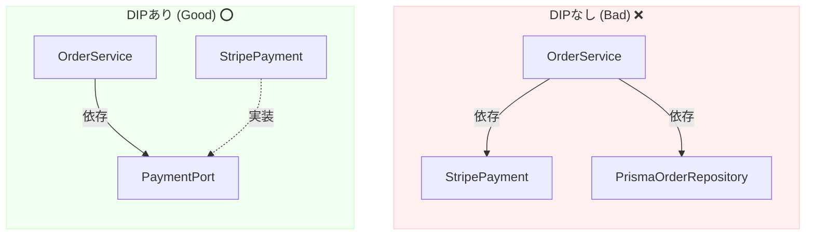

# 第06章：DIPの定義をやさしく（2つのルール）📜✨

ここからがDIPの“本体”だよ〜！💪😆
でも大丈夫、ルールはたった2つだけだし、言い方をやさしくすると一気にスッと入ります🌸

---

## 0. 今日のゴール🎯✨

* DIPの「2つのルール」を、自分の言葉で説明できるようになる🗣️💖
* 「上位」「下位」「抽象」「詳細」が、コードのどれに当たるかザックリ判別できる👀✅
* “依存の矢印”を、なんとなくでも描けるようになる🏹🎨

---

## 1. DIPの定義（そのまま読むとこう）📌

DIP（依存性逆転の原則）は、ざっくり言うと **「大事なルール（上位）を、道具の都合（下位）に振り回させない」** ための原則だよ🙅‍♀️🧰➡️🧠

そしてルールは2つ👇（有名な定義）

1. **上位モジュールは下位モジュールに依存してはいけない。どちらも抽象に依存すべき。**
2. **抽象は詳細に依存してはいけない。詳細が抽象に依存すべき。** 

---

## 2. まず言葉を“かわいく翻訳”しよう🐣💬

### ✅ 上位モジュールってなに？🪜

「やりたいこと（方針）」を持ってる側だよ✨
例：

* 注文を確定する🛒✅
* 会員登録する👤✨
* 決済する（のルール）💳📱

つまり **業務ルール・アプリの目的** が上位🍰

### ✅ 下位モジュールってなに？🧰

「どうやってやるか（手段）」の側だよ✨
例：

* DBに保存する🗄️
* 外部APIを呼ぶ🌐
* ファイルに書く📁
* 現在時刻を取る⏰

つまり **外部I/Oやツール、変更されやすい部品** が下位🌪️

---

## 3. ルール①：上位は下位に依存しない🙅‍♀️

### ❌ ありがちなダメ例（気持ちの話）

上位（注文確定ロジック）が、下位（DBや決済サービス）をベタに呼ぶと…

* DBを変えたら上位も壊れる🗄️💥
* 決済サービスを変えたら上位も巻き添え💳💥
* テストで外部が絡んで詰む🧪😵

### ✅ ルール①の正体

**上位が“具体的な道具の名前”を知ってる状態がダメ**なの。

なので、上位はこう考えるのがコツ👇
「私は“保存して”ってお願いしたいだけ」
「相手がMySQLかSQLiteかは知らん！」😤（知らなくてOK！）

---

## 4. ルール②：抽象は詳細に依存しない🙅‍♀️

ここ、最初つまずきポイント〜！でも超大事！🔥

### ✅ 抽象ってなに？🧩

“約束（契約）”だよ✍️✨
たとえば「保存する人は、saveができること！」みたいな感じ。

TypeScriptだと、この“約束”は **interface/typeで表現できる**よね🧩
そしてTypeScriptは **「形（shape）」でチェックする（構造的型付け）** のが基本！
つまり「implementsって書いてなくても、形が合ってればOK」な世界🌟 ([TypeScript][1])

### ✅ 詳細ってなに？🧱

抽象を満たす“現実の担当者”だよ👩‍🔧👨‍🔧
例：

* 「保存する」約束を満たす、Postgres保存の実装🗄️
* 「決済する」約束を満たす、Stripe実装💳
* 「通知する」約束を満たす、メール実装📩

### ✅ ルール②の正体

**約束（抽象）を、特定の道具（詳細）に合わせて作っちゃダメ**ってこと！

* 「Stripe向けの決済インターフェース」←これ、抽象じゃなくてStripe依存の詳細っぽい😵‍💫
* 「支払いを実行する」←これが抽象としてキレイ✨💖

---

## 5. “依存の矢印”で見ると一発🔄🏹

依存の矢印は「知ってる/参照してる/取り込んでる（importしてる）」方向だと思うと分かりやすいよ👀✨

### ❌ DIPなし（上位→下位に直依存）

* OrderService（上位） → StripePayment（下位）
* OrderService（上位） → PrismaOrderRepository（下位）

上位が道具名を知っちゃってる😵💦

### ✅ DIPあり（上位→抽象、下位→抽象）

* OrderService（上位） → PaymentPort（抽象）
* StripePayment（詳細） → PaymentPort（抽象）

こうすると、上位は「PaymentPortさんよろしくね🙏✨」で済む！
詳細は「はい、私がその約束を満たします🙋‍♀️」って感じ🌸

---

## 6. TypeScript視点のワンポイント（いまの最新状況も添えて）🧠✨

* TypeScriptは引き続き「型で意図を表現して、ツールで守る」方向が強いよ🛡️
* 2026年1月時点では、TypeScriptは **5.9系が最新安定版ライン（npmで5.9.3）** として流通してるよ📦✨ ([npmjs.com][2])
* さらに先の話として、TypeScript 6.0/7.0（ネイティブ化）の進捗も公式から定期的に出てる感じ！🚀 ([Microsoft for Developers][3])

※でもね、DIPの考え方はバージョンに左右されにくい“設計の基礎体力”だから安心してOKだよ😊💕

---

## 7. ここでの結論（覚え方）🌟🧠

DIPはこう覚えると強い👇

* **上位（やりたいこと）は、下位（道具）を直接知らない🙈**
* **両者は“約束（抽象）”でつながる🤝**
* **約束（抽象）は安定、道具（詳細）は入れ替わる🔁**

この3つが腹落ちすると、次の章の「TypeScriptで抽象（interface/type）をどう書くの？」がめっちゃ気持ちよく進むよ〜！🎉🧩

---

## 章末の固定セット🍀📌

### まとめ（3行）🧾

* DIPは「大事なロジック（上位）を、道具（下位）の変更から守る」原則だよ🛡️✨
* ルールは2つ：「上位↔下位は抽象に依存」「抽象は詳細に依存しない」📜
* TypeScriptでは“抽象＝契約（interface/type）”として考えると入りやすい🧩💖

### ミニ演習（1〜2問）✍️

1. 次のうち「下位モジュール」っぽいものを選んでね：
   A. 注文合計の計算ロジック 🧾 / B. DBへの保存 🗄️ / C. 割引ルール 🎟️
2. 「抽象」として良さそうな名前はどっち？
   A. StripePaymentService / B. PaymentPort（または PaymentGateway）💳✨

### AIに聞く用プロンプト例🤖💬

* 「このコードの“依存の矢印（import/参照関係）”を列挙して、DIP違反っぽい箇所を3つ指摘して。次に、上位側に置くべき抽象（interface/type）の候補名とメソッド案を提案して。最後に、差し替え可能性が上がる理由を初心者向けに説明して。」

[1]: https://www.typescriptlang.org/docs/handbook/interfaces.html "TypeScript: Handbook - Interfaces"
[2]: https://www.npmjs.com/package/typescript?utm_source=chatgpt.com "TypeScript"
[3]: https://devblogs.microsoft.com/typescript/progress-on-typescript-7-december-2025/?utm_source=chatgpt.com "Progress on TypeScript 7 - December 2025"
