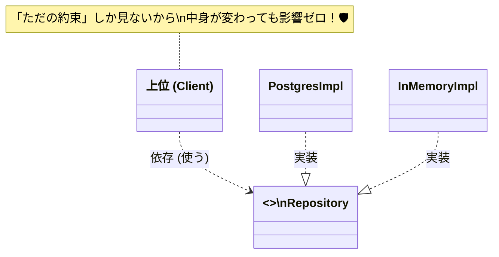

# 第07章：TypeScriptでの「抽象」入門（interface / type 超基礎）🧩📘✨

この章は、DIPで出てくる「抽象ってなに？🤔」を **TypeScriptの `interface` / `type` で“書ける”ようになる** のがゴールだよ〜！🎯💕

---

## 7.1 抽象ってなに？いきなり結論🧠✨

**抽象 =「約束（契約）」** だよ🤝
「この機能を使う側（上位）」が、「どんな形で呼べばいいか」だけを知っていればOKにするためのやつ！

* ✅ “何ができるか（What）” を決める
* ❌ “どうやってやるか（How）” は後回し（実装側の自由）

そしてTypeScriptでは、これを **`interface` / `type`** で書けるよ🧩

---

## 7.2 TypeScriptの強み：「形（構造）」で縛れる💪🧩


TypeScriptは **構造的型付け（Structural Typing）** が基本だよ〜！
つまり「名前」じゃなくて **中身の形（プロパティやメソッド）** が合ってればOKになることが多いの✨
（公式ドキュメントでも、型互換性は構造に基づくって説明されてるよ）([TypeScript][1])

これ、DIPと相性が最高で、

* 「この約束（抽象）を満たすなら、誰でも差し替えOK」🔁✨
  がやりやすいんだ〜！

---

## 7.3 `interface` と `type`：ざっくり役割👀✨

まずは「この教材で使う範囲」で、超ざっくり覚えよう！😊

### `interface`：オブジェクトの“契約”を書きやすい📜

* 例：Repository / Client / Gateway みたいな「外部との境界」🚪
* クラスに `implements` しやすい🏗️

### `type`：もっと何でもできる万能選手🧰✨

* ユニオン（`A | B`）が作れる（これが超便利！）🔀
* 交差（`A & B`）もできる🧩
* 「値の種類」や「結果型」みたいな表現が得意🎁

---

## 7.4 いちばん大事：この章で覚える“最小セット”✅✨

この教材では、まずこれだけでOKだよ〜！🥳

### ✅ 1) メソッド（ふるまい）を書く

```ts
interface PaymentGateway {
  pay(amountYen: number): Promise<void>;
}
```

### ✅ 2) 引数・戻り値に型をつける

```ts
type UserId = string;

interface UserRepository {
  findById(id: UserId): Promise<User | null>;
}

type User = {
  id: UserId;
  name: string;
};
```

### ✅ 3) 任意プロパティ `?`

```ts
type User = {
  id: string;
  name: string;
  nickname?: string; // あってもなくてもOK
};
```

### ✅ 4) 読み取り専用 `readonly`

```ts
type User = {
  readonly id: string; // 途中で書き換え不可にしたいとき
  name: string;
};
```

---

## 7.5 `interface` と `type` の“違い”はここだけ押さえよう🧷✨


### 🌟 違い1：`interface` は「同名で合体（マージ）」できる

TypeScriptは `interface` を **後から足して合体** できる仕組みがあるよ（Declaration Merging）🧩
公式に「interface merging」が説明されてる✨([TypeScript][2])

```ts
interface Box {
  width: number;
}

interface Box {
  height: number;
}

// Box = { width: number; height: number } みたいに合体する
```

アプリ開発だと「え、勝手に増えた😵」になりやすいので、ここは注意ポイント⚠️

### 🌟 違い2：`type` はユニオン（`|`）ができる（めっちゃ使う）

```ts
type PayResult =
  | { ok: true }
  | { ok: false; reason: string };
```

この「成功 or 失敗」みたいな表現、あとでテストにも強くなるよ🧪✨

---

## 7.6 DIPにつながる例：支払いを“差し替え可能”にする💳➡️📱✨

ここで「抽象（契約）」の気持ちよさを体験しよ〜！🥰

### ① 抽象（契約）を作る

```ts
interface PaymentGateway {
  pay(amountYen: number): Promise<void>;
}
```

### ② 実装（詳細）を作る

```ts
class CardPaymentGateway implements PaymentGateway {
  async pay(amountYen: number): Promise<void> {
    console.log(`💳 Cardで ${amountYen} 円を支払い`);
  }
}

class PayPayPaymentGateway implements PaymentGateway {
  async pay(amountYen: number): Promise<void> {
    console.log(`📱 PayPayで ${amountYen} 円を支払い`);
  }
}
```

### ③ 上位（業務側）は “抽象だけ” 知っていればOK

```ts
class CheckoutService {
  constructor(private readonly gateway: PaymentGateway) {}

  async checkout(amountYen: number): Promise<void> {
    // 💡 ここは「payできる」ことだけ知ってればいい
    await this.gateway.pay(amountYen);
    console.log("✅ 注文確定！");
  }
}
```

### ④ 組み立て（差し替え）が超ラクになる🎉

```ts
const gateway: PaymentGateway = new PayPayPaymentGateway(); // ←ここ変えるだけ
const service = new CheckoutService(gateway);

await service.checkout(1200);
```

**これがDIPの準備運動！**
上位（CheckoutService）が下位（PayPayやCardの実装）に振り回されにくくなるの✨

---

## 7.7 もう1個：Repository（保存先を隠す）🗄️🚪✨

「DBが変わっても業務ロジックは守りたい」ってときの定番！

```ts
type User = { id: string; name: string };

interface UserRepository {
  save(user: User): Promise<void>;
  findById(id: string): Promise<User | null>;
}
```

* DBがPostgreSQLでも🗄️
* API経由でも🌐
* ファイルでも📁

**上位は `UserRepository` だけ見てればOK** って形にできるよ🙆‍♀️✨



---


## 7.8 “どっち使う？”迷ったときの早見👀📝

* ✅ **オブジェクトの契約（〜Repository / 〜Client / 〜Gateway）** → まず `interface` が気持ちいい
* ✅ **結果がAかBか、みたいな分岐（成功/失敗、種類）** → `type` のユニオンが強い
* ✅ **アプリ内の普通のデータ形（DTO的なやつ）** → `type` でも `interface` でもOK（チーム方針で統一しよ〜）
* ⚠️ **「勝手に合体」されたくない** → `type` の方が安心寄り（`interface` はマージがあるので）([TypeScript][2])

---

## 7.9 VS Codeでミニ実験（最短で動かす）🧪💻✨

### ① フォルダ作って初期化

```bash
mkdir dip-ch7
cd dip-ch7
npm init -y
npm i -D typescript
npx tsc --init
```

### ② `src/index.ts` を作って貼る

```ts
interface Greeter {
  greet(name: string): string;
}

class FriendlyGreeter implements Greeter {
  greet(name: string): string {
    return `こんにちは、${name}さん😊`;
  }
}

const g: Greeter = new FriendlyGreeter();
console.log(g.greet("ボビー"));
```

### ③ ビルドして実行

```bash
npx tsc
node ./index.js
```

※ `tsconfig.json` の設定次第で出力先が変わるから、慣れてきたら `rootDir/outDir` を使って `dist/` に出すのが定番だよ〜📁✨

---

## 7.10 今のTypeScript事情：どれ見とけば安心？📌✨

いまは TypeScript の最新版系列として **5.9系（npmのlatestが 5.9.3 と表示）** が案内されてるよ。([npm][3])
あと、TypeScriptチームは **“TypeScript 7” に向けてネイティブ（Go）移植** の進捗も公式ブログで公開してる（性能改善が大きい話）よ〜🚀([Microsoft for Developers][4])

この教材では、まずは **`interface/type` を “設計の道具” として使える** ことが最優先ね🧩✨

---

## 章末セット 🍀📌

## まとめ（3行）🧾✨

* 抽象は「契約」🤝
* TypeScriptは「形」で契約を守らせやすい（構造的型付け）🧩([TypeScript][1])
* `interface` は契約向き、`type` はユニオンなど表現力が強い🔀✨

## ミニ演習（1〜2問）✍️😊

1. `Notifier` を作ってみよう📩

* `send(message: string): Promise<void>` を持つ `interface Notifier` を作る
* `ConsoleNotifier`（consoleに出すだけ）を `implements` してみてね

2. `Result` を `type` で作ろう🎁

* 成功 `{ ok: true }` と失敗 `{ ok: false; reason: string }` のユニオン型を作ってみて〜！

## AIに聞く用プロンプト例🤖💬（比較させる系）

* 「次の要件に合う `interface` を提案して。メソッド名と引数・戻り値の型の理由も説明して：◯◯◯」
* 「この `type` ユニオン、将来拡張しやすい形に直す案を2つ出して。メリット・デメリットも🙏」
* 「`interface` と `type` のどちらが向くか、今回のコード（貼る）で判断して。宣言マージのリスクも触れて🥺」

---

次の第8章では、この「抽象（契約）」を **どういう粒度・命名で作るとキレイになるか**（Whatを先に決めるやつ🎯）をやっていくよ〜！🧠✨

[1]: https://www.typescriptlang.org/docs/handbook/type-compatibility.html "TypeScript: Documentation - Type Compatibility"
[2]: https://www.typescriptlang.org/docs/handbook/declaration-merging.html "TypeScript: Documentation - Declaration Merging"
[3]: https://www.npmjs.com/package/typescript?utm_source=chatgpt.com "TypeScript"
[4]: https://devblogs.microsoft.com/typescript/progress-on-typescript-7-december-2025/?utm_source=chatgpt.com "Progress on TypeScript 7 - December 2025"
