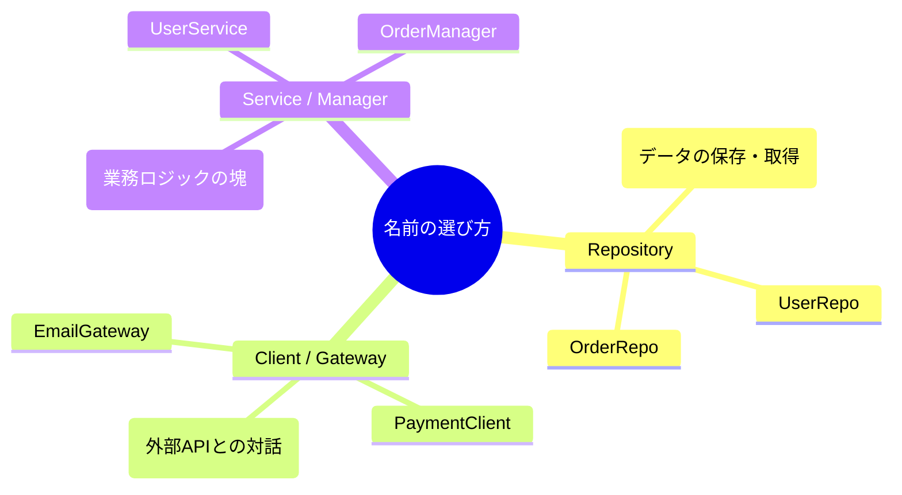

# 第08章：抽象の作り方｜「ふるまい」を先に決める🧠🧩✨

この章はね、**DIPのいちばん大事な準備運動**だよ〜！🏃‍♀️💨
「実装（How）を考える前に、**やりたいこと（What）**を“契約（＝抽象）”として先に決める」ってやつ✍️✨

---

## 0) 今日のゴール🎯🌟

この章が終わると、こんなことができるようになるよ👇😊

* 「外の世界（DB/HTTP/ファイル）」に触れる部分を見つけられる🔍🌍
* **“欲しいふるまい”だけ**を `interface` / `type` で先に決められる🧩
* 命名がそれっぽくなる（Repository / Client / Gateway）📛✨
* 抽象が **デカすぎ・細かすぎ** をうっすら判断できる⚖️👀

---

## 1) 抽象ってなに？超ざっくり言うと…🍙💡

抽象＝「こうしてね！」っていう**約束（契約）**だよ🤝✨
TypeScriptは“形が合えばOK”の文化（構造的型付け）だから、
「この形で呼べるなら、誰でもいいよ〜」ってできます🦆✅
（“duck typing / structural typing”ってやつ！） ([TypeScript][1])

---

## 2) いきなり核心：HowじゃなくWhatで決める🎯🧠✨


## ❌ダメな決め方（How先行）😵‍💫

* 「SQLで `INSERT` したい」
* 「AxiosでGETしたい」
* 「Prismaで…」

これ、実装の話が先に来ちゃってる〜😢💦
**DIP的には“下位の都合”が上位に侵入してる状態**になりがち。

## ✅いい決め方（What先行）🥳

* 「ユーザーを保存したい」
* 「支払いを確定したい」
* 「配送状況を問い合わせたい」

こういう “やりたいこと” を先に固定すると、実装をあとで差し替えやすいよ🔁✨

---

## 3) 抽象を作る手順（これだけでOK）🧭✨

迷ったらこの手順でいこ〜！😊🫶

## Step 1：上位（業務）から「外の世界へのお願い」を探す🔍🌍

例：会員登録の業務ってこんな感じ👇

* すでに同じメールがあるか確認したい📮
* ユーザーを保存したい💾
* ウェルカムメール送りたい📩

この「〜したい」が **抽象の材料**だよ🍳✨

---

## Step 2：「名詞」を決める（何係？）📛🧸

* ユーザー保存係 → `UserRepository`
* メール送信係 → `MailClient` / `MailSender`
* 外部決済係 → `PaymentGateway`

ここで “係名” を決めると、メソッドがスッキリするよ😊✨

---

## Step 3：「動詞」をメソッドにする（何してほしい？）🧠➡️✍️

* `findByEmail`
* `save`
* `sendWelcome`

**ポイント：実装の匂いを混ぜない**🙅‍♀️💦
たとえば `insertUserRow()` とかにしない（SQL臭がする）🧄😵

---

## Step 4：引数・戻り値は「業務の言葉」で💬📦

* DBの行（Row）とか、HTTPレスポンス丸ごととかを返さない🙈💦
* 返すなら、上位が欲しい情報だけ🎁✨

---

## Step 5：失敗も“契約”に含める⚠️🙂/😢

「失敗したら例外！」でもいいけど、
境界（外の世界）って失敗しやすいから、**失敗の形を設計に出す**のもアリ👌✨
（ここは第14章あたりでさらにやるよ〜！）

---

## 4) まずは作ってみよ！抽象（interface）🧩✨

会員登録の例で、**実装の前に契約だけ作る**よ〜😊

```ts
// ドメイン側（上位）が使う「業務の型」
export type UserId = string;

export interface User {
  id: UserId;
  email: string;
  passwordHash: string;
}

// ① 保存・取得したい（永続化）
export interface UserRepository {
  findByEmail(email: string): Promise<User | null>;
  save(user: User): Promise<void>;
}

// ② メールを送りたい（外部サービスでもいいしSMTPでもいい）
export interface MailSender {
  sendWelcome(email: string): Promise<void>;
}
```

ここで大事なのは👇😍

* `UserRepository` は **“保存したい”** だけ言ってる（DBの種類は言ってない）🗄️🚫
* `MailSender` も **“送りたい”** だけ（どのサービスか言ってない）📩🚫

---

## 5) 命名のコツ：Repository / Client / Gateway ざっくり辞典📛📘✨

抽象の名前って迷うよね〜！😵‍💫
とりあえずこの感覚でOK👌

* **Repository** 🗄️：保存・検索（永続化）担当

  * 例：`UserRepository`, `OrderRepository`
* **Client** 🌐：外部APIに話しかける担当

  * 例：`PaymentClient`, `ShippingClient`
* **Gateway** 🚪：境界の“出入口”。外部I/Oをまとめて吸収する感じ

  * 例：`PaymentGateway`（業務→決済世界への扉）

※チームの流派があるから、揺れても大丈夫だよ😊🫶

---

## 6) 「抽象が大きすぎ/小さすぎ」問題⚖️🐣

ここ、みんな通るやつ〜！😂

## 抽象が大きすぎ（太りすぎ）🍔😵

* メソッドが10個以上…
* いろんな責務が混ざって説明できない…

✅判断のコツ
**「一言で説明できないインターフェース」はデカすぎ疑い**👀⚠️

---

## 抽象が小さすぎ（分裂しすぎ）🧩🧩🧩

* 1メソッドだけのinterfaceが大量…
* 呼び出し側が注入だらけで読みにくい…

✅判断のコツ
**“同じユースケースで一緒に使うもの”は、まとめてもOK**👌✨



（ここは第18章で「やりすぎ注意」としてちゃんと整理するよ！）


---

## 7) TypeScript的なポイント：interface と type どっち？🤔🧩

## 基本方針（この教材のおすすめ）🍀

* **オブジェクトの契約**：`interface` を優先✨

  * TypeScript公式ドキュメントでも「可能ならinterface推奨」って書かれてるよ📘 ([TypeScript][2])
* **Union（A or B）とか高度な型遊び**：`type` が得意🎮✨

> どっちでも作れるけど、DIPの“契約”って意味では `interface` が相性いいよ😊

---

## 8) TSの強み：形が合えば差し替えできる（構造的型付け）🦆✨

TypeScriptは「名前」より「形」を見る子です👀✨ ([TypeScript][1])
だから、クラスじゃなくても、オブジェクトでも実装できるよ〜！

```ts
const fakeMailSender: MailSender = {
  async sendWelcome(email: string) {
    console.log("FAKE welcome mail to:", email);
  },
};
```

これ、テストでめちゃくちゃ便利になるやつ🧪🧸（第17章で爆発する💥✨）

---

## 9) 2026っぽい小技：`satisfies` で“契約チェックだけ”する✅✨

`as` みたいに無理やり型をねじ込むんじゃなくて、
「ちゃんと満たしてる？」をチェックできるのが `satisfies` 😊✨ ([TypeScript][3])

```ts
const fakeRepo = {
  async findByEmail(email: string) {
    return null;
  },
  async save(user: User) {
    // 何もしない
  },
} satisfies UserRepository;
```

* ✅ 契約は満たしてるかチェックされる
* ✅ でも `fakeRepo` 自体の型は “自然なまま” で扱える（変に潰れにくい）✨

---

## 10) AI（Copilot/Codex）と一緒に抽象を作るコツ🤖💬✨

AIに投げるときは「実装を作れ」より、**観察→抽象化**の順がうまくいくよ😊

* ① いま上位コードが外部にお願いしてる行を貼る
* ② 「やりたいこと（What）に名前を付けて」って頼む
* ③ 「最小のinterfaceにして」って頼む
* ④ 「メソッド名の候補を3つ」って頼む

---

## 章末セット🍀📌

## まとめ（3行）🧾✨

* 抽象は **HowじゃなくWhat** で決める🎯
* 「〜したい」を集めて、**係名（Repository/Client/Gateway）**にする📛
* TypeScriptは形を見るから、抽象があると差し替えが超やりやすい🔁🦆

---

## ミニ演習（1〜2問）✍️😊

## 問1📝

次の「〜したい」から、`interface` を作ってみてね👇✨

* 「注文を保存したい」
* 「注文IDで注文を取り出したい」

（ヒント：`OrderRepository` っぽいよ〜🗄️）

## 問2📝

次の命名、どこが “How臭い” か指摘してみてね👃💦

* `insertOrderRow()`
* `callStripeApi()`

---

## AIに聞く用プロンプト例🤖💬✨

* 「このユースケースから “What” ベースの interface を最小で作って。メソッド名候補も3つずつ出して」
* 「このinterface、責務が大きすぎない？一言で説明できる？分割案も出して」
* 「戻り値にインフラ型（AxiosResponse/DB Row）を混ぜないように、ドメイン寄りの型設計に直して」

---

## おまけ：いまのTypeScript状況（“最新に追いついてる感”）📣✨

* npmの `typescript` 最新安定版は **5.9.3**（公開情報ベース） ([GitHub][4])
* そしてTypeScriptチームは **TypeScript 6.0 → 7.0（ネイティブ化）** の流れを進めてるよ（進捗は公式ブログで公開） ([Microsoft for Developers][5])

この章の「抽象を先に決める」考え方は、こういう変化が来てもずっと効くやつだよ〜😊🧩✨

[1]: https://www.typescriptlang.org/play/typescript/language/structural-typing.ts?utm_source=chatgpt.com "Playground Example - Structural Typing"
[2]: https://www.typescriptlang.org/docs/handbook/advanced-types.html?utm_source=chatgpt.com "Documentation - Advanced Types"
[3]: https://www.typescriptlang.org/docs/handbook/release-notes/typescript-4-9.html?utm_source=chatgpt.com "Documentation - TypeScript 4.9"
[4]: https://github.com/microsoft/typescript/releases "Releases · microsoft/TypeScript · GitHub"
[5]: https://devblogs.microsoft.com/typescript/progress-on-typescript-7-december-2025/ "Progress on TypeScript 7 - December 2025 - TypeScript"
