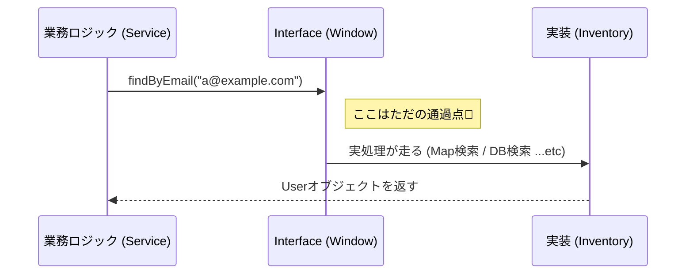

# 第09章：ポート（境界）を作ろう｜Repositoryパターン入門🚪🗄️✨

## 0) 今日のゴール🎯💖

今日はね、**「外の世界（DBとか）に触る部分」を、アプリの中心から追い出す**練習をするよ〜！🚚💨
そのために使うのが **Repository（リポジトリ）** ＝「保存や取得の窓口（ポート）」だよ🚪🗄️

---

## 1) そもそも「外の世界」ってなに？🌍⚡

アプリの中には、だいたい2種類あるよ😊

* **内側（中心）**：やりたいこと（ルール・手順・判断）🧠✨
  例：ユーザー登録の手順、重複チェック、権限判定 など
* **外側（外の世界）**：道具や環境（変わりやすい）🧰🌪️
  例：DB、HTTP API、ファイル、時間、環境変数 など

ここで超大事ポイント👇
**外側って、仕様変更しやすいし、障害も起きやすい**の😵‍💫⚠️
だから、中心のコードが外側にベタ依存すると「巻き添え地獄」になりやすい🔥

---

## 2) Repositoryって何者？（一言で！）🗄️💬


Repositoryは、

> **「保存・取得のやり方は隠して、アプリが必要な操作だけを約束する窓口」** 🚪✨

だよ😊
つまり、アプリ中心はこう言えるようになる：

* 「ユーザーを保存して！」💾
* 「メールアドレスでユーザー探して！」🔎
* 「存在するかチェックして！」✅

**でも「DBはSQLで〜」みたいな話は中心が知らない**🙈✨
ここが最高にDIPっぽいところ！🔄

---

## 3) まずは“あるある地獄”を見よ🔥😵（DIPなしの例）

「登録処理の中で、DBを直接たたく」みたいなコードってありがちだよね😅
こうなると…

* DBの都合（SQL/ORM/接続）に中心が巻き込まれる🌀
* テストしたいのにDBが必要でつらい😢🧪
* DBを変えると登録処理まで修正💥

今日はこれを、Repositoryでスッキリさせるよ〜🧹✨

---

## 4) 例題：ユーザー登録をRepositoryで作るよ👩‍💻🎀

今回のミニ題材はこれ👇

* 「メールアドレスが既に存在したら登録NG」🙅‍♀️
* そうでなければ新規ユーザーを保存💾

### フォルダ構成（イメージ）📁✨

```text
src/
  domain/
    User.ts
    UserRepository.ts   ← ここがポート（境界）🚪
  app/
    RegisterUserService.ts
  infra/
    InMemoryUserRepository.ts  ← 仮の保存先（あとでDBに差し替えOK）🧸
  main.ts
```

---

## 5) ポートを作る：UserRepository（契約）🧩✍️

まずは「中心が欲しい操作」だけを書くよ😊
**How（どうやるか）じゃなく What（何ができるか）** ね🎯✨

## `src/domain/User.ts` 👤

```ts
export type User = {
  id: string;
  email: string;
  name: string;
  createdAt: Date;
};
```

## `src/domain/UserRepository.ts` 🚪🗄️（ここがポート！）

```ts
import type { User } from "./User";

export interface UserRepository {
  findByEmail(email: string): Promise<User | null>;
  save(user: User): Promise<void>;
}
```

💡ポイント😊

* `UserRepository` は **“保存先がDBかファイルかAPIか”を一切言ってない**🙈✨
* でも中心は **必要な操作だけ** 使える🎁

---

## 6) 外側の実装：まずは InMemory（仮）を作る🧸💾

いきなりDB実装に行くと話が重くなるから、まずは **メモリ保存（Map）** にするよ〜😊
（これが後でテストにも強い！💪🧪）

## `src/infra/InMemoryUserRepository.ts`

```ts
import type { User } from "../domain/User";
import type { UserRepository } from "../domain/UserRepository";

export class InMemoryUserRepository implements UserRepository {
  private byEmail = new Map<string, User>();

  async findByEmail(email: string): Promise<User | null> {
    return this.byEmail.get(email) ?? null;
  }

  async save(user: User): Promise<void> {
    this.byEmail.set(user.email, user);
  }
}
```

✅ここが最高ポイント
中心（アプリ本体）は **このクラスの存在を知らなくてOK**🙆‍♀️✨
知ってるのは `UserRepository` という“窓口”だけ🚪



---


## 7) 中心のユースケース：登録処理はRepositoryにお願いする🤝✨

## `src/app/RegisterUserService.ts`

```ts
import type { User } from "../domain/User";
import type { UserRepository } from "../domain/UserRepository";

export class RegisterUserService {
  constructor(private readonly users: UserRepository) {}

  async register(email: string, name: string): Promise<User> {
    const existing = await this.users.findByEmail(email);
    if (existing) {
      throw new Error("このメールアドレスは既に登録済みです🥲");
    }

    const user: User = {
      id: crypto.randomUUID(),
      email,
      name,
      createdAt: new Date(),
    };

    await this.users.save(user);
    return user;
  }
}
```

🎉できた！

* 登録処理は **DBのことを1行も知らない**🙈✨
* でも「探す」「保存する」はできる🗄️✅

---

## 8) “組み立て場所”で合体させる🔧🎀（main.ts）

最後に「本物はどれ使う？」を決めて注入するよ💉✨

## `src/main.ts`

```ts
import { RegisterUserService } from "./app/RegisterUserService";
import { InMemoryUserRepository } from "./infra/InMemoryUserRepository";

const userRepo = new InMemoryUserRepository();
const register = new RegisterUserService(userRepo);

const run = async () => {
  const u1 = await register.register("a@example.com", "Aiko");
  console.log("登録OK✅", u1);

  try {
    await register.register("a@example.com", "Aiko2");
  } catch (e) {
    console.log("重複NG🙅‍♀️", (e as Error).message);
  }
};

run();
```

---

## 9) これが「ポート（境界）に押し出す」ってこと🚧✨

## ✅やったこと（超まとめ）

* 中心は「保存・取得の窓口（UserRepository）」だけ知ってる🚪
* 外側は「それをどう実現するか（InMemoryUserRepository）」を持つ🧰
* “接続”は最後にまとめてやる（main.ts）🔧

こうするとね…
**DBをPrismaにしようが、別のORMにしようが、中心は基本ノーダメ**🎉✨
（Prismaも最近のリリースが続いてるけど、こういう変更の波を中心に入れないのが狙いだよ〜🌊🛡️）([Prisma][1])

---

## 10) Repositoryの責務（ここだけ守ると綺麗✨）🧼🗄️

Repositoryは基本これだけ👇😊

* ✅ **保存する / 取ってくる / 存在チェック**
* ✅ 「DBの行」じゃなく「アプリのモデル（User）」で返す
* ✅ 例外や失敗は、中心が扱いやすい形に整える（やりすぎ注意だけどね⚠️）

---

## 11) よくあるミスあるある😵‍💫⚠️

* ❌ Repositoryが巨大化（何でも詰める）📦💥
  → まずは「ユースケースが必要な操作だけ」からでOK😊
* ❌ ORMの型をそのまま返す（中心に漏れる）🧨
  → “中心の言葉”で返すのがコツ👑
* ❌ なんでもRepositoryに押し込む（ビジネス判断まで入れる）🙅‍♀️
  → 判断は中心、保存は外側🧠🗄️

---

## 12) ちょい最新ネタ（2026年1月時点）📌✨

* TypeScriptは **5.9.3 が “Latest” 扱い**になってるよ🧡([GitHub][2])
* Node.jsは **v24 が Active LTS**、v25 が Current のラインだよ〜🟩🟨([Node.js][3])
* あと最近もセキュリティ更新が出てるから、LTS運用なら“更新はこまめに”が安心💖🔐([Node.js][4])
* TypeScript 5.9 のリリースノートには Node向けの安定オプション（`--module node20`）みたいな話もあるよ🧩([TypeScript][5])

（こういう“環境側の変化”があるほど、中心を守るDIPが効いてくるのだ…！😎🛡️）

---

## 章末の固定セット🍀📌

## ✅ まとめ（3行）🧾✨

* Repositoryは「保存/取得の窓口（ポート）」だよ🚪🗄️
* 中心は“窓口”だけ知って、実装（DBなど）は外側に追い出す🚧✨
* 最後に組み立てて注入すれば、差し替えが超ラクになる🔁🎉

## ✍️ ミニ演習（1〜2問）🎀

1. `UserRepository` に `existsByEmail(email)` を追加して、登録処理を少しスッキリさせてみて😊✅
2. `InMemoryUserRepository` の代わりに、`FileUserRepository`（JSONファイル保存）を“同じinterfaceのまま”作れる？📁✨（中身は自由でOK！）

## 🤖 AIに聞く用プロンプト例（比較させる系）💬✨

* 「今の `UserRepository` のメソッド設計、`findByEmail` と `existsByEmail` どっちが読みやすい？理由も含めて比較して📌」
* 「`RegisterUserService` がRepository以外の詳細に依存してないかチェックして、依存の漏れがあったら指摘して🥺」
* 「この構成で `FileUserRepository` を実装したい。`UserRepository` は変えずに、最小の実装案を出して（例外設計も）🧠✨」

---

次の章（第10章）は、いよいよ **依存の矢印を図でバチッと理解**して「どっち向きが正解？」を固めるよ〜🔄🏹✨

[1]: https://www.prisma.io/blog/announcing-prisma-orm-7-2-0 "Prisma ORM 7.2.0 Released: CLI Improvements, Bug Fixes & Better Configs"
[2]: https://github.com/microsoft/typescript/releases "Releases · microsoft/TypeScript · GitHub"
[3]: https://nodejs.org/en/about/previous-releases?utm_source=chatgpt.com "Node.js Releases"
[4]: https://nodejs.org/en/blog/vulnerability/december-2025-security-releases?utm_source=chatgpt.com "Tuesday, January 13, 2026 Security Releases"
[5]: https://www.typescriptlang.org/docs/handbook/release-notes/typescript-5-9.html "TypeScript: Documentation - TypeScript 5.9"
