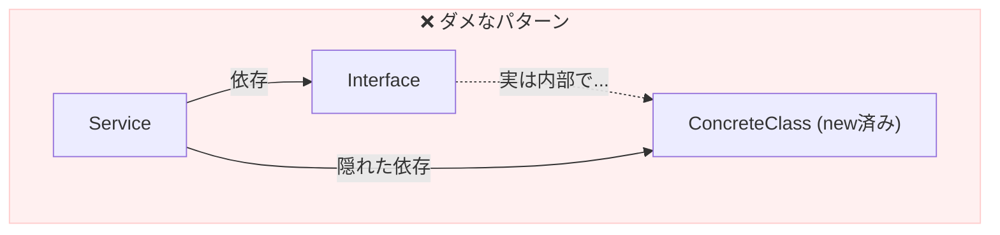

# 第10章：依存の向きを逆転させる（図で理解）🔄📈✨

この章は「DIPって結局、**矢印（依存）がどっち向き？**」を、図でスッキリさせる回だよ〜！🥳🧠
（ここが腹落ちすると、あとがめっちゃ楽になる👍）

---

## 10-0. まず“最新情報メモ”🆕📝

* **TypeScriptの最新安定版は 5.9.3（npm）** だよ（2026年1月時点）。([NPM][1])
* **TypeScript 5.9 のリリースノート**も公開されてるよ。([TypeScript][2])
* さらに将来に向けて **TypeScript 7 “native preview”** みたいな大きい動きも進行中（コンパイラの高速化など）。([Microsoft Developer][3])

（※この章のDIPの理解自体は、TSのバージョンに左右されにくいけど「今どうなってる？」を押さえておくね☺️）

---

## 10-1. この章でできるようになること🎯✨

* 「依存の矢印」＝何を見ればいいか分かる🏹👀
* **内側＝方針（業務ルール）／外側＝詳細（DB・通信・ファイルなど）** の感覚がつかめる🏠🌍
* 「抽象（interface/type）」を **どこに置けば矢印が逆転するか** 分かる🧩🔄

---

## 10-2. そもそも「依存の矢印」って何？🏹🤔


超ざっくり言うと、矢印（依存）はだいたいコレで発生するよ👇

* `import ... from ...` してる📦
* `new ...()` してる🆕
* 具体クラス/具体モジュールの関数を直接呼んでる📞
* 具体モジュールの型（具体DTOとか）を受け取っちゃってる🧷

つまり、**矢印＝「その相手がいないと自分が書けない/動かない」方向**だと思ってOK！✅✨

---

## 10-3. DIPなし（典型）：“内側（方針）”が“外側（詳細）”に吸い付く😵‍💫🧲

例：注文処理（方針）をやりたいのに、Stripe決済（詳細）を直で呼んじゃうパターン💥

```ts
// ❌方針（OrderService）が、詳細（Stripe）に依存してる
import { StripePaymentGateway } from "../infra/StripePaymentGateway";

export class OrderService {
  private gateway = new StripePaymentGateway();

  async placeOrder() {
    // ...注文のルール...
    await this.gateway.charge(/*...*/);
  }
}
```

このときの依存の矢印はこう👇

```text
[内側：方針] OrderService  ─────►  [外側：詳細] StripePaymentGateway
```

これ、何がつらいかというと…😢

* 決済が **PayPayに変わった** → OrderServiceにまで修正が波及💳➡️📱💥
* テストで **本物のStripe呼びたくない** → でも差し替えがしにくい🧪😵

---

## 10-4. DIPあり：矢印を“内側に向ける”🔄🏠✨


ここでDIPの2ルールを思い出すよ〜📜💡

* 上位（方針）は下位（詳細）に依存しない🙅‍♀️
* どっちも抽象に依存する🧩
  （よく引用される定義の「2つの文」だよ）([Stackify][4])

## ✅やることは超シンプル！

**方針側（内側）に “こうしてほしい” という抽象（interface）を置く** 👉 それだけ！🧩✨

```ts
// ✅内側（方針）の「抽象」＝ポート（Port）
export interface PaymentGateway {
  charge(amountYen: number): Promise<void>;
}
```

そして方針は **抽象だけ**を見る👀

```ts
import type { PaymentGateway } from "./PaymentGateway";

export class OrderService {
  constructor(private gateway: PaymentGateway) {}

  async placeOrder(amountYen: number) {
    // ...注文の業務ルール...
    await this.gateway.charge(amountYen);
  }
}
```

最後に外側（詳細）が、その抽象を実装する👇

```ts
import type { PaymentGateway } from "../core/PaymentGateway";

export class StripePaymentGateway implements PaymentGateway {
  async charge(amountYen: number) {
    // Stripeの具体処理（詳細）
  }
}
```

矢印はこうなるよ👇🎉

```text
[内側：方針] OrderService  ───►  [内側：抽象] PaymentGateway  ◄───  [外側：詳細] StripePaymentGateway
```

ポイントはこれ！！👇✨
**詳細が抽象に依存する（右から左に矢印が向く）**＝“依存の向きが逆転”🔄🏹

---

## 10-5. 「内側＝方針」「外側＝詳細」ってどう見分ける？🕵️‍♀️🧠

迷ったら、この質問でOKだよ👇

## ✅内側（方針）チェック🏠

* 「注文とはこうだよね」「ポイントはこう付くよね」みたいな**業務ルール**？📦📏
* DBやAPIが変わっても、基本は変えたくない？🧘‍♀️
  → それ内側！

## ✅外側（詳細）チェック🌍

* DB/HTTP/ファイル/時間/外部サービスに触ってる？🗄️🌐📁⏰
* “実装の都合”で変わりやすい？🌪️
  → それ外側！

---

## 10-6. TypeScriptならではの注意点（ここ、地味に大事）⚠️🧠✨

## ① `import type` を使うと「型だけ依存」になってスッキリ🧼📦

TypeScriptの型は **実行時には消える（eraseされる）** んだよね。([TypeScript][5])
だから「型だけ参照したい」時に `import type` を使うと、

* **ランタイムの循環参照事故**を減らせる💥🌀
* “依存の意図”が読みやすい👀✨

```ts
import type { PaymentGateway } from "./PaymentGateway";
```

## ② TypeScriptは「構造的型付け」だから、`implements`なしでも成立しがち🧩🧱

TypeScriptは「形が合ってればOK」っていう考え方（構造的）なんだ〜！([TypeScript][6])
なので、実装側は `implements` を書かなくても動くことがある（でも教材では **書いた方が親切**だよ☺️）

---

## 10-7. よくある配置ミス（ここで事故る😵‍💫💥）


## ❌ミス1：抽象（interface）を外側に置いちゃう

```text
infra/PaymentGateway.ts  ← ここに置くのは事故りやすい
```

こうすると、方針がそれを `import` するために **外側へ依存**しちゃう…本末転倒〜😭

✅抽象は基本、**方針側（内側）**に置こう🏠🧩

---

## ❌ミス2：抽象が“詳細の型”を返してしまう（漏れてる〜😱）

```ts
// ❌抽象の返り値が「Stripe専用型」みたいになってる
export interface PaymentGateway {
  charge(req: StripeChargeRequest): Promise<StripeChargeResponse>;
}
```

これだと、方針がStripeを知っちゃう🙈💥
✅抽象は「業務が欲しい形」で返す（例：`PaymentResult` とか）🧠✨

---

## ❌ミス3：方針の中で `new Stripe...()` しちゃう

せっかく抽象があっても、**中でnewしたら終わり**😇🆕
✅「組み立て（newする場所）」は、外側（entry/main）へ🚪🧱




---


## ❌ミス4：抽象が巨大すぎる（なんでも屋インターフェース）🐘💦

```text
IAppServices { charge(); sendMail(); readFile(); now(); ... }
```

✅「用途ごとに小さく」分けるのが基本（でも細かすぎもダメ！バランス⚖️）

---

## 10-8. まとめ（3行）🧾✨

* 依存の矢印は「import/new/直接呼び出し」の方向🏹
* 抽象（interface）は **内側（方針）**に置く🏠🧩
* 詳細（外側）が抽象に依存する形になると、矢印が内側へ向く🔄🎉

---

## 10-9. ミニ演習（1〜2問）✍️😊

1. 次のうち「外側（詳細）」っぽいものに✅をつけてね：

* A. 注文金額が1万円以上なら送料無料📦
* B. Stripeで決済する💳
* C. ユーザー登録時にWelcomeメールを送る📩
  （ヒント：変わりやすいのはどれ？🌪️）

2. いまのあなたのプロジェクトで、`import` を辿って
   **「方針ファイルが外側に依存してる場所」**を1箇所だけ見つけてみよう👀🔎

---

## 10-10. AIに聞く用プロンプト例（比較させる系）🤖💬✨

* 「このコードの依存の矢印を図にして。どこがDIP違反かも説明して」
* 「`core`（方針）から `infra`（詳細）への import をゼロにしたい。最小の手順を提案して」
* 「この interface は大きすぎる？小さすぎる？責務の分け方を2案出して」

---

次の第11章では、ここで作った“矢印が内側に向いた設計”を **コードとして完成形にする**よ〜🔁🧱✨
（差し替え可能性が「うわ、ほんとに入れ替えできる！」って体験になるはず🥳🧪）

[1]: https://www.npmjs.com/package//typescript?activeTab=versions&utm_source=chatgpt.com "typescript"
[2]: https://www.typescriptlang.org/docs/handbook/release-notes/typescript-5-9.html?utm_source=chatgpt.com "Documentation - TypeScript 5.9"
[3]: https://developer.microsoft.com/blog/typescript-7-native-preview-in-visual-studio-2026?utm_source=chatgpt.com "TypeScript 7 native preview in Visual Studio 2026"
[4]: https://stackify.com/dependency-inversion-principle/?utm_source=chatgpt.com "SOLID Design Principles Explained: Dependency Inversion"
[5]: https://www.typescriptlang.org/docs/handbook/2/classes.html?utm_source=chatgpt.com "Documentation - Classes"
[6]: https://www.typescriptlang.org/docs/handbook/typescript-in-5-minutes-oop.html?utm_source=chatgpt.com "Documentation - TypeScript for Java/C# Programmers"
