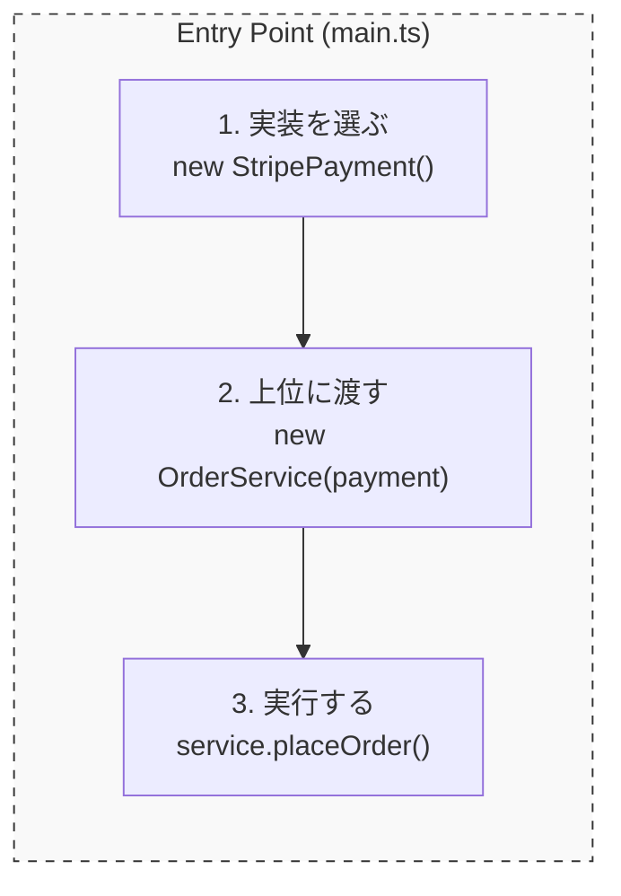

# 第11章：DIPをコードで完成させる（差し替えできる形）🔁🧱✨

この章のゴールはこれだよ〜！🎯  
**「上位（業務ロジック）が、下位（外部サービスやDBなど）の実装に触れずに、あとから差し替えできる状態」**を **TypeScriptで完成**させます🧸💕

---

## 0) まずイメージ🍩（依存の矢印はこう！）🏹

- ✅ **上位（方針）**：`OrderService`（注文を確定する、合計金額を出す、ルールを守る）
- ✅ **抽象（契約）**：`PaymentGateway`（支払う、という「やりたいこと」だけ決める）
- ✅ **下位（詳細）**：`StripePaymentGateway` / `PayPayPaymentGateway`（実際の支払い方法の都合）

依存の向きはこう👇

- `OrderService` → **PaymentGateway（interface）**
- `StripePaymentGateway` → **PaymentGateway（interface）** を実装する  
  （＝詳細が抽象に依存する✨）

---

## 1) “差し替え可能”の最小セットを作ろう🧩✨

ここでは「支払い」を題材にします💳📱  
（第19章のミニPJにもそのまま使える形！）

### フォルダ構成（わかりやすさ優先）📁
- `src/domain/...`：上位（業務）と抽象（契約）
- `src/adapters/...`：下位（実装）
- `src/main.ts`：組み立て（どの実装を使うか選ぶ場所）

---

## 2) Step1：抽象（interface）を **上位側に置く** 🧩📌

### `src/domain/payment/PaymentGateway.ts`
````ts
export type Money = {
  amount: number;
  currency: "JPY" | "USD";
};

export type ChargeRequest = {
  orderId: string;
  customerId: string;
  total: Money;
};

export type ChargeResult =
  | { ok: true; paymentId: string }
  | { ok: false; reason: "DECLINED" | "NETWORK" | "UNKNOWN"; message?: string };

export interface PaymentGateway {
  charge(req: ChargeRequest): Promise<ChargeResult>;
}
````

ポイントだよ〜🧁

* ✅ **interfaceは“契約書”**：上位が「これさえできればOK」と言える状態にする📜✨
* ✅ **抽象は“やりたいこと（What）”だけ**：Stripeの都合、PayPayの都合は書かない🙅‍♀️

---

## 3) Step2：上位（業務）を “interfaceだけ” 見るようにする👀✨

### `src/domain/OrderService.ts`

```ts
import { PaymentGateway } from "./payment/PaymentGateway.js";

export type OrderItem = { sku: string; qty: number; price: number };
export type Order = {
  id: string;
  customerId: string;
  currency: "JPY" | "USD";
  items: OrderItem[];
};

export class OrderService {
  constructor(private readonly payment: PaymentGateway) {}

  async placeOrder(order: Order): Promise<{ orderId: string; paymentId: string }> {
    const totalAmount = order.items.reduce((sum, i) => sum + i.price * i.qty, 0);

    const result = await this.payment.charge({
      orderId: order.id,
      customerId: order.customerId,
      total: { amount: totalAmount, currency: order.currency },
    });

    if (!result.ok) {
      // ここでは単純に例外にしてるけど、実務だと Result を返す設計もよくやるよ🙂
      throw new Error(`支払い失敗😢 reason=${result.reason} msg=${result.message ?? ""}`);
    }

    return { orderId: order.id, paymentId: result.paymentId };
  }
}
```

ここがDIPの“完成ポイント”🌟

* ✅ `OrderService` が **Stripe/PayPay という名前を一切知らない**
* ✅ `import` も `new Stripe...()` も **上位側には存在しない** 🙌

---

## 4) Step3：下位（詳細）＝実装クラスを作る👩‍🔧🔧


### `src/adapters/StripePaymentGateway.ts`

```ts
import type {
  PaymentGateway,
  ChargeRequest,
  ChargeResult,
} from "../domain/payment/PaymentGateway.js";

export class StripePaymentGateway implements PaymentGateway {
  constructor(private readonly apiKey: string) {}

  async charge(req: ChargeRequest): Promise<ChargeResult> {
    // 本物はHTTP呼び出しになる想定（この章は形を学ぶのが目的💡）
    // 例：fetch(...) / SDK呼び出し / リトライ など

    if (!this.apiKey) {
      return { ok: false, reason: "UNKNOWN", message: "APIキーがないよ😿" };
    }

    return { ok: true, paymentId: `stripe_${req.orderId}` };
  }
}
```

### `src/adapters/PayPayPaymentGateway.ts`

```ts
import type {
  PaymentGateway,
  ChargeRequest,
  ChargeResult,
} from "../domain/payment/PaymentGateway.js";

export class PayPayPaymentGateway implements PaymentGateway {
  constructor(private readonly merchantId: string) {}

  async charge(req: ChargeRequest): Promise<ChargeResult> {
    if (!this.merchantId) {
      return { ok: false, reason: "UNKNOWN", message: "加盟店IDがないよ😿" };
    }

    return { ok: true, paymentId: `paypay_${req.orderId}` };
  }
}
```

ここで大事なのはね🍓

* ✅ **下位が抽象（interface）に合わせる**（＝詳細が抽象に依存する）
* ✅ 上位はノーダメージで差し替え可能になる🎉




---

## 5) Step4：組み立て場所で “どの実装を使うか” を決める🧩🚪


### `src/main.ts`

```ts
import { OrderService } from "./domain/OrderService.js";
import { StripePaymentGateway } from "./adapters/StripePaymentGateway.js";
// import { PayPayPaymentGateway } from "./adapters/PayPayPaymentGateway.js";

async function main() {
  // ✅ ここが「組み立て場所」：上位と下位を“握手”させる🤝
  const payment = new StripePaymentGateway(process.env["STRIPE_KEY"] ?? "dummy");
  // const payment = new PayPayPaymentGateway(process.env["PAYPAY_MERCHANT_ID"] ?? "dummy");

  const orderService = new OrderService(payment);

  const receipt = await orderService.placeOrder({
    id: "order_001",
    customerId: "cus_123",
    currency: "JPY",
    items: [
      { sku: "cake", qty: 2, price: 450 },
      { sku: "tea", qty: 1, price: 300 },
    ],
  });

  console.log("完了🎉", receipt);
}

main().catch((e) => console.error("エラー😵", e));
```

---

## 6) ほんとに差し替えできる？✅ “確認ポイント”5つ🌈

1. ✅ **上位コード（domain）が adapters を import してない？**
2. ✅ 上位が持つのは `PaymentGateway` だけ？（具象クラスの型を持ってない？）
3. ✅ `new Stripe...` してるのは **mainだけ**？
4. ✅ 追加の支払い方法を増やしても、`OrderService` を触らずに済む？
5. ✅ 下位の事情（HTTP/SDK/例外の細部）が上位に漏れすぎてない？（漏れると差し替えにくい😿）

---

## 7) よくあるミスあるある😵‍💫（この章で潰す！）

### ❌ ミス1：interfaceを adapters 側に置いちゃう

* そうすると上位が「adaptersにある型」を参照しがち → 依存が逆戻りしやすい💥
* ✅ **抽象は上位側に置く**のが安全だよ〜🛡️

### ❌ ミス2：interfaceが“実装の都合”だらけになる

例：`chargeStripe(token: string, ...)` みたいにしちゃう

* ✅ “支払う” という **業務の言葉**で契約を作るのがコツ💬✨

### ❌ ミス3：上位でこっそり `new` しちゃう

* `OrderService` の中で `new StripePaymentGateway()` した瞬間、差し替え不可🙅‍♀️
* ✅ `main`（組み立て）に追い出す！

---

## 8) AI（Copilot / Codex）を使うと爆速になる使い方🤖💨

### その1：interfaceから実装のひな型を作らせる🧩

**プロンプト例💬**

* 「`PaymentGateway` を実装する `PayPayPaymentGateway` の雛形を作って。失敗は `ChargeResult` で返して。」

### その2：差し替えチェックをレビューさせる🔍

**プロンプト例💬**

* 「domain層がadapters層をimportしてないか、依存方向の観点でレビューして。改善案も。」

### その3：命名を“業務の言葉”に寄せる📛

**プロンプト例💬**

* 「このinterface名とメソッド名、支払い業務の言葉として自然？Repository/Gateway/Clientのどれが適切？」

---

## 9) （最新情報メモ🗞️✨）TypeScriptまわり

* npmの `typescript` パッケージは **5.9.3 が Latest**（2025-09-30公開）だよ📦✨ ([NPM][1])
* TypeScriptチームは **6.0を“橋渡し（bridge）”にして、7.0（ネイティブ移行）へ**という方針を明言してるよ🌉🚀 ([Microsoft for Developers][2])
* ネイティブ版のプレビュー（Visual Studio向け）も案内が出てるよ👀✨ ([Microsoft Developer][3])

---

## 章末の固定セット🍀📌

## まとめ（3行）🧾

* 上位は **具象クラスじゃなく interface（抽象）だけを見る**👀✨
* 下位は **interfaceを実装して差し替え可能**にする🔁
* `new` する場所は **組み立て（main）に隔離**する🚪🧩

## ミニ演習（1〜2問）✍️

1. `LinePayPaymentGateway`（架空でOK）を追加して、**`OrderService` を一切変更せず**に動くようにしてみてね🎀
2. `PaymentGateway` の `ChargeResult` に `errorCode` を足したくなった！
   どこに影響が出る？「上位／下位／両方」どれ？理由も書いてみよう📝✨

## AIに聞く用プロンプト例🤖💬

* 「新しい `LinePayPaymentGateway` を追加したい。`OrderService` は触らず、mainだけで差し替えできる形でコード案を出して。差し替えポイントも説明して。」

---

[1]: https://www.npmjs.com/package/typescript?utm_source=chatgpt.com "TypeScript"
[2]: https://devblogs.microsoft.com/typescript/progress-on-typescript-7-december-2025/?utm_source=chatgpt.com "Progress on TypeScript 7 - December 2025"
[3]: https://developer.microsoft.com/blog/typescript-7-native-preview-in-visual-studio-2026?utm_source=chatgpt.com "TypeScript 7 native preview in Visual Studio 2026"
