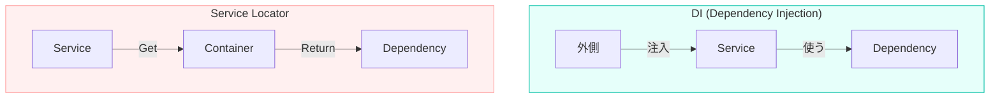

# 第12章：DIってなに？DIPとの関係を整理🤝💉✨

## この章でできるようになること🎯

* 「DIP（設計ルール）」と「DI（実装テク）」をスッキリ言い分けられる🧠✨
* 「じゃあDIは何のためにあるの？」が腹落ちする😌💡
* よくある混同ポイント（IoC/DIコンテナ/Service Locator）を回避できる🧯😵‍💫

---

## 12-1. まず結論！DIPとDIは“別物”だよ🙋‍♀️✨

### ✅ DIP（依存性逆転）＝設計のルール🧭

「上位（やりたいこと・業務ロジック）が、下位（DB/HTTP/時間/ファイル）に振り回されないようにしようね」っていう**設計の約束**だよ📜✨
→ “依存の向き”を整える話🔄🏹

### ✅ DI（依存性注入）＝実装のテク（配線のやり方）🧺

DIPを守るために、依存する相手（実体）を **外から渡す**やり方💉✨
→ “newをどこでする？” “どう渡す？”の話🏗️🚪

この2つ、仲良しだけど双子じゃない！👭❌

> 「DIはDIPを実現しやすくする手段」って覚えると超スッキリするよ😊✨
> （DIという用語の有名な整理はFowlerの解説が定番だよ） ([martinfowler.com][1])

---

## 12-2. そもそも“依存”って、何が問題なの？🔗😢

たとえば上位コードがこうなってるとするね👇

```ts
// ❌ 上位が下位を直newしてる（依存がベタ付け）
class OrderService {
  private payment = new StripePayment(); // 直結😭

  async placeOrder() {
    return this.payment.charge(1000);
  }
}
```

これだと…

* 決済をPayPayに変えたい💳➡️📱 → 上位を直修正😵
* テストで決済だけ偽物にしたい🧪🧸 → できないor超しんどい😭
* 下位の都合（API変更/障害/遅延）に上位が巻き込まれる🌪️

ここを救うのがDIPで、その実装を助けるのがDIだよ🦸‍♀️✨

---

## 12-3. DIPとDIの関係を“たとえ”で掴む🔌📦✨

### 🎀 たとえ：スマホ充電器

* **DIP**：スマホ本体が「特定メーカーの充電器」に依存しないようにする
  → 「USB-Cという“規格（抽象）”に依存しようね」🔌✨
* **DI**：充電器（具体物）を“外から”挿して使う
  → 今日は純正、明日はモバイルバッテリー…差し替え自由🔁✨

**抽象＝規格（約束）**、**具体＝実物（道具）**って感じ😊💡

---

## 12-4. 1枚で整理！DIP/DI/IoCの立ち位置🗺️✨


| 用語  | 正体        | 何の話？    | ざっくり一言           |
| --- | --------- | ------- | ---------------- |
| DIP | 設計原則🧭    | 依存の向き🏹 | 上位は下位に依存しない🙅‍♀️ |
| DI  | パターン/テク💉 | 渡し方🧺   | 依存を外から渡す✨        |
| IoC | もっと広い概念🔄 | 主導権👑   | “自分で全部やらない”思想    |

IoC（Inversion of Control）は「制御の主導権を外に渡す」っていう広い考え方で、DIはその代表例だよ🔄
（IoCの説明はこういう意味だよ、って定義がまとまってる） ([ウィキペディア][2])

---

## 12-5. DIPだけだと“配線問題”が残る→そこでDI💉🧩

DIPの基本はこうだったよね👇

* 上位も下位も**抽象（interface/type）に依存**する🧩
* 抽象は上位側に置く（上位が必要な形を決める）📌

でも…
「抽象はできた！じゃあ実体（具体クラス）はどこで選ぶの？」ってなる😵

ここでDIの出番💉✨
**“どの実装を使うか”を上位の外で決めて、上位には渡すだけ**にするよ🚪🧺

---

## 12-6. 具体例：DIP（抽象）とDI（注入）を分けて見る👀✨

### ① 抽象（DIPの土台）🧩

```ts
// ✅ 上位が必要な“約束”を定義（抽象）
export interface PaymentGateway {
  charge(yen: number): Promise<"ok" | "failed">;
}
```

### ② 上位（抽象だけを見る）🧠

```ts
import { PaymentGateway } from "./PaymentGateway";

export class OrderService {
  constructor(private payment: PaymentGateway) {} // ✅ DI（受け取る）

  async placeOrder(totalYen: number) {
    const result = await this.payment.charge(totalYen);
    if (result === "failed") throw new Error("決済失敗😢");
    return "注文できたよ📦✨";
  }
}
```

### ③ 下位（詳細実装）🧰

```ts
import { PaymentGateway } from "./PaymentGateway";

export class StripePaymentGateway implements PaymentGateway {
  async charge(yen: number) {
    // 本当はAPI呼び出し…のイメージ🌐
    return "ok" as const;
  }
}
```

### ④ “組み立て役”（ここでnewして差し替える）🏗️🚪

```ts
import { OrderService } from "./OrderService";
import { StripePaymentGateway } from "./StripePaymentGateway";

const payment = new StripePaymentGateway();     // 下位の選択はここ✅
const orderService = new OrderService(payment); // DIで注入💉

await orderService.placeOrder(1200);
```

ポイントはここ👇

* **DIP**：`OrderService` は `StripePaymentGateway` を知らない🙈✨
* **DI**：`OrderService` に `payment` を外から渡してる💉✨

---

## 12-7. 「DIコンテナ」って必要？🧺🤖（結論：最初は不要でOK🙆‍♀️）

DIにはさらに「DIコンテナ（IoCコンテナ）」という道具があるよ🧺
これは **依存関係の組み立てを自動化**してくれるやつ✨

たとえばNestJSみたいなフレームワークはDIが中心にある設計だよ（“依存の生成をコンテナに任せる”って説明がある） ([NestJS ドキュメント][3])

TypeScript界隈だと、軽量コンテナとして **tsyringe** が有名で、デコレータやメタデータ設定が必要だったりするよ🧩⚙️ ([GitHub][4])
**InversifyJS** も有名で、大きめのアップデート計画（v8）を進めてる話も出てるよ🧱🛠️ ([inversify.io][5])

でもね…！
この教材の流れ的には **まず手動DI（次章）で“本質”を体で理解**した方が最強だよ💪✨
コンテナは、仕組みが分かってから使うと「便利〜😍」ってなるけど、先に触ると「魔法すぎて怖い😵‍💫」ってなりがち💦

---

## 12-8. よくある混同＆地雷ポイント🚧😵‍💫


### ❌ 混同1：「DI＝DIP」

違うよ〜！🙅‍♀️

* DIP：設計の方向（ルール）🧭
* DI：配線テク（やり方）💉

### ❌ 混同2：「DI＝DIコンテナ」

DIは“外から渡す”こと全般✨
コンテナは“自動で配線する道具”🧺
**手動DIも立派なDI**だよ😊

### ⚠️ 地雷：Service Locator（探しに行く）🕵️‍♀️

「必要になったら自分でコンテナに取りに行く」方式は、依存が隠れて読みにくくなりがち😵
FowlerもDIとService Locatorを対比して説明してるよ📚 ([martinfowler.com][1])

ざっくり感覚：




* **DI**：レストランで「お水ください」って言わなくても、最初から置いてある💧（Give）
👀✨
* Locator：どこで何取ってるか追跡ゲームになりがち🎮💦

---

## 12-9. ミニまとめ（3行）🧾✨

* DIPは「依存の向きを整える設計ルール」🧭
* DIは「依存を外から渡して差し替え可能にする実装テク」💉
* コンテナは便利だけど、まずは手動DIで本質を掴むのが近道🏃‍♀️💨

---

## ミニ演習（1〜2問）✍️😊

### 問1🧩：これはDIP？DI？

A. 「上位は下位のクラスに依存せず、interfaceに依存する」
B. 「OrderServiceのコンストラクタにPaymentGatewayを渡す」
C. 「依存の生成をフレームワークに任せる（自分でnewしない）」

### 問2🔎：次のコードの“痛いところ”を1つ言語化してみよう😵

```ts
class ReportService {
  private repo = new SqlReportRepository();
  async generate() {
    return this.repo.fetch();
  }
}
```

---

## AIに聞く用プロンプト例🤖💬（比較させる系✨）

1. **用語整理**
   「DIP / DI / IoC の違いを、TypeScript初心者向けに“たとえ話つき”で説明して。混同しやすいポイントも3つ挙げて」

2. **コード診断（怖さを言語化）**
   「このTypeScriptコードの依存関係の問題点を、DIP観点で“どこが怖いか”を箇条書きで説明して。修正方針も提案して」

3. **リファクタ案（手動DIで）**
   「このコードを“手動DI（コンストラクタ注入）”で書き換えて。interfaceは上位側に置いて、テストでFakeに差し替えできる形にして」

---

## おまけ：最新情報ちょいメモ📌✨

* TypeScriptは現時点の安定版が **5.9.3**（npmのlatest）だよ🧡 ([NPM][6])
* さらに先の大きい動きとして、TypeScriptチームが **6.0（橋渡し）→7.0（ネイティブ化）** みたいな計画を公式に語ってるよ🚀 ([Microsoft for Developers][7])

---

次の第13章では、今日整理したDIを **手動DI（コンストラクタ注入）で実際にガッツリ書いて**、差し替えの気持ちよさを体験するよ〜💉🧱✨

[1]: https://martinfowler.com/articles/injection.html?utm_source=chatgpt.com "Inversion of Control Containers and the Dependency ..."
[2]: https://en.wikipedia.org/wiki/Inversion_of_control?utm_source=chatgpt.com "Inversion of control"
[3]: https://docs.nestjs.com/fundamentals/custom-providers?utm_source=chatgpt.com "Custom providers | NestJS - A progressive Node.js ..."
[4]: https://github.com/microsoft/tsyringe?utm_source=chatgpt.com "microsoft/tsyringe: Lightweight dependency injection ..."
[5]: https://inversify.io/blog/planning-inversify-8-0-0/?utm_source=chatgpt.com "Planning InversifyJS 8 - Feedback Needed!"
[6]: https://www.npmjs.com/package/typescript?utm_source=chatgpt.com "TypeScript"
[7]: https://devblogs.microsoft.com/typescript/progress-on-typescript-7-december-2025/?utm_source=chatgpt.com "Progress on TypeScript 7 - December 2025"
