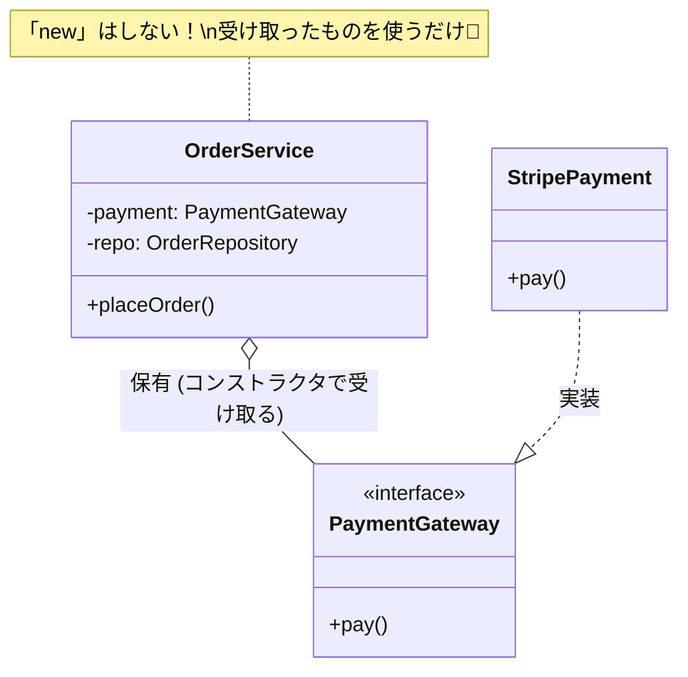

# 第13章：手動DI（コンストラクタ注入）をやってみよう💉🧱✨

この章は「DIPを“ちゃんと動く形”にする」ための超定番スキル回だよ〜！😊
ポイントはこれ👇

* クラスの中で依存先を **new しない** 🚫🆕
* 代わりに、外から **コンストラクタで渡す** 🧺💖
* 「組み立て担当（newする場所）」を **入口（entry）に寄せる** 🚪🧩

---

## 1) まず“何がイヤなの？”を1分で💥😵


## ❌ 悪い例：クラスの中で new しちゃう

* 上位（業務ロジック）が、下位（外部I/Oや実装詳細）をガッチリ握る🤝💦
* 支払い方法や保存先を変えると、上位コードまで巻き添えで修正が飛ぶ🌀
* テストで差し替えができなくて詰む🙈🧪

この「ガッチリ握ってる状態」をほどくのが、手動DI（コンストラクタ注入）だよ〜！💉✨

---

## 2) コンストラクタ注入ってなに？🏗️💕


**依存する道具（下位）を、外から受け取る** だけ！シンプル！😊

* ✅ クラスは「自分で道具を買わない」
* ✅ 「道具は入口で用意して渡す」
* ✅ だから「道具の差し替え」が一瞬でできる🔁✨

---

## 3) サンプル題材：注文処理をちょい実務っぽく📦💳

ここでは、注文を作って支払いして保存する流れにするよ😊

* 上位：OrderService（業務ルール）🧠✨
* 下位：PaymentGateway（外部決済）💳🌐
* 下位：OrderRepository（保存先）🗄️
* 下位：Clock（時間）⏰

---

## 4) ❌ DIP/DIなし：OrderService が new してる版🔥


```ts
// 下位の詳細（例）
class StripePaymentGateway {
  async charge(amountYen: number): Promise<string> {
    // 外部APIに通信する想定…🌐
    return "pay_123";
  }
}

class SqlOrderRepository {
  async save(order: { id: string; paidAt: Date; paymentId: string }) {
    // DBに保存する想定…🗄️
  }
}

// 上位（業務ロジック）
class OrderService {
  async placeOrder(amountYen: number) {
    // 👇 ここが問題！ 上位が下位を直newして握ってる😵
    const payment = new StripePaymentGateway();
    const repo = new SqlOrderRepository();

    const paymentId = await payment.charge(amountYen);

    const order = {
      id: crypto.randomUUID(),
      paidAt: new Date(),
      paymentId,
    };

    await repo.save(order);
    return order.id;
  }
}
```

## 何が困る？😢

* 決済を PayPay に変えたい → OrderService を編集する羽目😵‍💫
* テストで「通信しない決済」を使いたい → できない🙈
* 時間（new Date）も固定できない → テストが地獄⏰🧪

---

## 6) ✅ 本題：コンストラクタ注入で「newを追い出す」💉🚪


TypeScriptは「形（構造）」で合わせられるのが強み💪



つまり **interface（契約）さえ合えば差し替えOK**！

```ts
// ① 決済の契約（ポート）
export interface PaymentGateway {
  charge(amountYen: number): Promise<{ ok: true; paymentId: string } | { ok: false; reason: string }>;
}

// ② 保存の契約（ポート）
export interface OrderRepository {
  save(order: { id: string; paidAt: Date; paymentId: string }): Promise<void>;
}

// ③ 時間の契約（ポート）
export interface Clock {
  now(): Date;
}
```

---

## 6) ✅ 本題：コンストラクタ注入で「newを追い出す」💉🚪

```ts
export class OrderService {
  // 👇 依存をコンストラクタで受け取る（これがコンストラクタ注入）
  constructor(
    private readonly payment: PaymentGateway,
    private readonly repo: OrderRepository,
    private readonly clock: Clock,
  ) {}

  async placeOrder(amountYen: number) {
    const charged = await this.payment.charge(amountYen);
    if (!charged.ok) {
      throw new Error(`支払い失敗: ${charged.reason}`);
    }

    const order = {
      id: crypto.randomUUID(),
      paidAt: this.clock.now(),
      paymentId: charged.paymentId,
    };

    await this.repo.save(order);
    return order.id;
  }
}
```

## ここが最高ポイント🎉✨

* OrderService は「決済がStripeかどうか」知らない🙈
* OrderService は「DBがSQLかどうか」知らない🙈
* OrderService は「時間が本物か固定か」知らない🙈
  → だから差し替え・テストが最強になる💪🧪

---

## 7) 実装（下位）は“契約を満たすだけ”でOK🔧🌐🗄️

```ts
export class StripePaymentGateway implements PaymentGateway {
  async charge(amountYen: number) {
    // ここで外部決済APIに通信する想定
    return { ok: true as const, paymentId: "pay_123" };
  }
}

export class SqlOrderRepository implements OrderRepository {
  async save(order: { id: string; paidAt: Date; paymentId: string }) {
    // ここでDB保存する想定
  }
}

export class SystemClock implements Clock {
  now() {
    return new Date();
  }
}
```

---

## 8) “組み立て場所”はどこが良い？👉 入口（entry）だよ🚪✨


ここが超大事！
**new していいのは、基本的に入口だけ**（組み立て担当）👏

```ts
import { OrderService } from "./OrderService";
import { StripePaymentGateway } from "./StripePaymentGateway";
import { SqlOrderRepository } from "./SqlOrderRepository";
import { SystemClock } from "./SystemClock";

async function main() {
  // 👇 入口で組み立て（ここはnewしてOK！）
  const payment = new StripePaymentGateway();
  const repo = new SqlOrderRepository();
  const clock = new SystemClock();

  const service = new OrderService(payment, repo, clock);

  const orderId = await service.placeOrder(1200);
  console.log("注文完了:", orderId);
}

main().catch(console.error);
```

この「入口で組み立てる場所」をよく **Composition Root（コンポジションルート）** って呼ぶよ🌱✨
（言葉は難しいけど、やってることは“組み立て係”ね😊）

---

## 9) よくあるミスあるある😵‍💫⚠️

## ミス①：途中でまた new しちゃう

* 「ちょっとだけなら…」が増殖するやつ🥲
* 迷ったら「それは入口で作れない？」って考えるのがコツ💡

## ミス②：依存が増えすぎてコンストラクタが長い


* あるある！でも焦らないでOK😊
* 対策は次のどれか👇

  * 依存が多い原因（責務過多）を疑う🧠
  * 近いものをまとめた“小さな依存の塊”を作る🧺
  * 「設定値」は ConfigProvider 的にまとめる⚙️

---

## 10) TypeScript/周辺の“いま”メモ（2026/01時点）🗓️✨

* TypeScriptの安定版は 5.8.3 が確認できて、5.9はRC/プレリリース情報も出てるよ📌 ([GitHub][1])
* Node.jsは v24 がActive LTSとして案内されてる（開発・運用で選ばれやすいライン）🟢 ([Node.js][2])
* VS Codeのリリースノートも 2026年1月の更新が出てるよ📝✨ ([Visual Studio Code][3])

（この章の内容自体はバージョンが変わっても強い基本だよ〜💪😊）

---

## 章末セット🍀📌

## まとめ（3行）🧾✨

* クラスの中で new すると、依存が固定されて差し替えできなくなる😵
* コンストラクタ注入は「外から依存を渡す」だけの最強テク💉
* new は入口（entry）に寄せて、業務ロジックをキレイに保つ💖

## ミニ演習（1〜2問）✍️🧸

1. さっきの「DIP/DIなしコード」を、PaymentGateway / OrderRepository / Clock を使う形に書き換えてみてね😊
2. 入口（main）で “Stripe→FakePayment” に差し替えても OrderService を一切変更しないで動く状態にしてみてね🔁✨

## AIに聞く用プロンプト例🤖💬

* 「このTypeScriptコードのクラス内でnewしている依存を、コンストラクタ注入にリファクタして。入口で組み立てるmainも一緒に提案して」
* 「依存が増えてコンストラクタが長い。責務分割の観点で、どこが“やりすぎ”か指摘して、改善案を2パターン出して」
* 「Fake実装（通信しないPaymentGateway）を作って、OrderServiceのテストがしやすい形にして。差し替えの例も見せて」

---

次の第14章（HTTP/外部APIクライアント）に行くと、この“入口で組み立てる”がさらに気持ちよく効いてくるよ〜🌐📡✨

[1]: https://github.com/microsoft/typescript/releases?utm_source=chatgpt.com "Releases · microsoft/TypeScript"
[2]: https://nodejs.org/en/about/previous-releases?utm_source=chatgpt.com "Node.js Releases"
[3]: https://code.visualstudio.com/updates?utm_source=chatgpt.com "December 2025 (version 1.108)"
