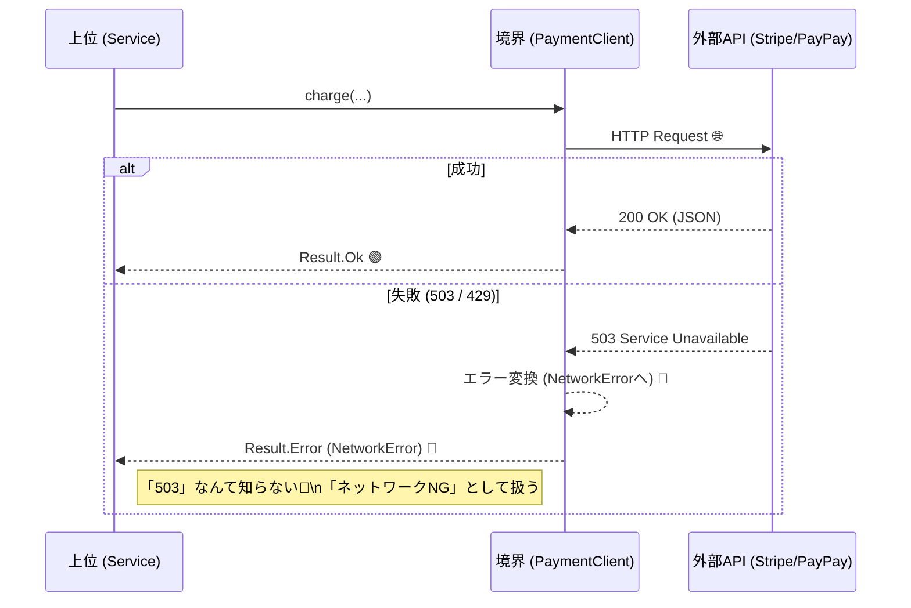

# 第14章：境界の種類①｜HTTP / 外部APIクライアント🌐📡

外部APIって、便利だけど…突然落ちたり仕様変わったりして気まぐれです😇💥
この章は「外部APIの気まぐれを、アプリの中心（上位ロジック）に漏らさない」ための設計を、TypeScriptでやさしく作っていきます🧸✨

---

## 0) この章でできるようになること🎯✨

* 外部APIを呼ぶ部分を「境界（ポート）」として切り出せる🚪🌐
* 通信失敗・タイムアウト・HTTPエラーを“いい感じの失敗”に変換できる🙂➡️😢
* 上位ロジックを **API差し替え可能** ＆ **テストしやすい** 形にできる🧪🎉

（最新状況メモ：TypeScriptは「5.9」が最新として案内されています🧩✨）([TypeScript][1])
（Node.jsは v24 がActive LTS、v25 がCurrentになっています🟢⚡）([Node.js][2])

---

## 1) まず「外部API直叩き」が生むツラさ😵‍💫💣

外部APIを上位ロジックの中で `fetch()` 直書きすると…

* **通信失敗**（ネットワーク切れ📶💥）が上位ロジックに侵入
* **タイムアウト**（いつ返ってくるの？😇）が上位ロジックに侵入
* **ステータスコード地獄**（401/429/500…）が上位ロジックに侵入
* テストが「外部APIが生きてる前提」になってつらい🧪🥲

ここでDIPの出番です🧭✨
「外部API＝下位の詳細」なので、上位はそこに振り回されないようにします🙅‍♀️🌪️

---

## 2) 目標の形（依存の向き）🔄🏹

上位は **“外部APIそのもの”** を知らない。
知っていいのは **「支払いができる」という約束（抽象）」** だけです🧩💕

```text
🧠 上位（方針）              🌍 外側（詳細）
CheckoutService  --->  PaymentClient(抽象)  <---  HttpPaymentClient(実装) ---> 外部API
```

---

## 3) 境界（Port）を作る：PaymentClient 🧩💳

ポイントはこれ👇✨

* 上位が欲しいのは「支払いできた？できなかった？」
* 通信の事情（HTTP/タイムアウト/URL/ヘッダー）は **上位に見せない** 🙈

## ✅ Result型（成功/失敗を返す）🙂/😢


「例外 throw で上位が爆発💥」しないように、**成功/失敗を戻り値で表す**のが扱いやすいです🧸✨

```ts
// Result型（小さくて便利🙂✨）
export type Result<T, E> =
  | { ok: true; value: T }
  | { ok: false; error: E };
```

## ✅ 上位が扱いやすい失敗の種類（ドメイン寄り）🧠✨

```ts
// 上位に見せていい「失敗」だけを厳選する🧹✨

export type PaymentError =
  | { kind: "timeout" }                        // 時間切れ⏰
  | { kind: "network" }                        // ネットワーク不調📶
  | { kind: "unauthorized" }                   // 認証系🔑
  | { kind: "rate_limited"; retryAfterSec?: number } // 混雑🚦
  | { kind: "declined"; reason?: string }      // 支払い拒否🙅‍♀️
  | { kind: "unexpected"; message: string };   // 想定外😵
```




## ✅ 境界（Port）インターフェース🧩🚪

```ts
export type ChargeRequest = {
  amountJPY: number;
  customerId: string;
  paymentMethodToken: string;
};

export type ChargeReceipt = {
  receiptId: string;
  paidAtISO: string;
};

export interface PaymentClient {
  charge(req: ChargeRequest): Promise<Result<ChargeReceipt, PaymentError>>;
}
```

これで上位は「支払いの約束」だけ知っていればOKになります🙆‍♀️✨

---

## 4) 実装（Adapter）：HTTPで外部APIを呼ぶ🌐🛠️

Nodeの `fetch()` は **undiciベースの実装**として提供されていて、Node 18以降でグローバルに使える流れが案内されています🌊✨([Node.js][3])
公式ガイドにも `fetch` の説明があります📘([Node.js][4])

## 3) 境界（Port）を作る：PaymentClient 🧩💳


```ts
import type { PaymentClient, ChargeRequest, ChargeReceipt, Result, PaymentError } from "./payment-port";

type HttpPaymentClientOptions = {
  baseUrl: string;
  apiKey: string;
  timeoutMs?: number;
};

export class HttpPaymentClient implements PaymentClient {
  constructor(private readonly opt: HttpPaymentClientOptions) {}

  async charge(req: ChargeRequest): Promise<Result<ChargeReceipt, PaymentError>> {
    const timeoutMs = this.opt.timeoutMs ?? 5000;

    try {
      // ✅ AbortSignal.timeout は主要環境で利用可能になっています⏰✨
      // （古い環境向けに AbortController 方式にしてもOK）
      const res = await fetch(`${this.opt.baseUrl}/charges`, {
        method: "POST",
        headers: {
          "content-type": "application/json",
          "authorization": `Bearer ${this.opt.apiKey}`,
        },
        body: JSON.stringify(req),
        signal: AbortSignal.timeout(timeoutMs),
      });

      // まずは成功/失敗をHTTPから判定
      if (res.ok) {
        const body = (await safeJson(res)) as any;

        // 外部APIのレスポンスを「上位が欲しい形」に整形🧼✨
        const receipt: ChargeReceipt = {
          receiptId: String(body.receiptId ?? body.id ?? ""),
          paidAtISO: String(body.paidAtISO ?? new Date().toISOString()),
        };

        if (!receipt.receiptId) {
          return { ok: false, error: { kind: "unexpected", message: "Missing receiptId" } };
        }
        return { ok: true, value: receipt };
      }

      // ❌ ここからは「失敗の翻訳」タイム🈶✨
      return { ok: false, error: await mapHttpError(res) };

    } catch (e: any) {
      // タイムアウト / 中止 / ネットワークなどを “上位向け” に変換する
      if (e?.name === "TimeoutError") return { ok: false, error: { kind: "timeout" } };
      if (e?.name === "AbortError") return { ok: false, error: { kind: "timeout" } };

      return { ok: false, error: { kind: "network" } };
    }
  }
}

async function safeJson(res: Response): Promise<unknown> {
  try {
    return await res.json();
  } catch {
    return {};
  }
}

async function mapHttpError(res: Response): Promise<PaymentError> {
  const body = (await safeJson(res)) as any;

  if (res.status === 401 || res.status === 403) {
    return { kind: "unauthorized" };
  }
  if (res.status === 429) {
    const retryAfter = Number(res.headers.get("retry-after") ?? "");
    return { kind: "rate_limited", retryAfterSec: Number.isFinite(retryAfter) ? retryAfter : undefined };
  }
  if (res.status >= 400 && res.status < 500) {
    // 4xxは「ユーザー操作/入力/カード」などの可能性が高い
    return { kind: "declined", reason: String(body?.message ?? body?.error ?? "declined") };
  }
  // 5xxは相手側の障害が多い
  if (res.status >= 500) {
    return { kind: "network" };
  }
  return { kind: "unexpected", message: `HTTP ${res.status}` };
}
```

### ⏰ タイムアウトの書き方メモ

`AbortSignal.timeout()` はWeb標準側で追加され、MDNでも説明されています📘([MDNウェブドキュメント][5])

---

## 5) 上位ロジック側：外部の事情ゼロで書ける🎀✨

上位は `PaymentClient` だけ知っていればOK💕

```ts
import type { PaymentClient } from "./payment-port";

export class CheckoutService {
  constructor(private readonly payment: PaymentClient) {}

  async checkout() {
    const result = await this.payment.charge({
      amountJPY: 1200,
      customerId: "C001",
      paymentMethodToken: "tok_xxx",
    });

    if (!result.ok) {
      // 上位は「意味のある失敗」だけ見て分岐できる🙂✨
      switch (result.error.kind) {
        case "timeout":
          return "時間がかかりすぎたので、もう一回押してね⏰💦";
        case "rate_limited":
          return "いま混んでるみたい…ちょっと待ってね🚦🥺";
        case "declined":
          return "支払いが通らなかったみたい🙅‍♀️💳";
        default:
          return "ごめんね、うまくいかなかった…😢";
      }
    }

    return `支払いOK！レシート=${result.value.receiptId} 🎉`;
  }
}
```

---

## 6) “組み立て場所”で差し替える（手動DI）🧺✨

```ts
import { HttpPaymentClient } from "./http-payment-client";
import { CheckoutService } from "./checkout-service";

const paymentClient = new HttpPaymentClient({
  baseUrl: "https://api.example-pay.com",
  apiKey: process.env.PAY_API_KEY ?? "",
  timeoutMs: 5000,
});

const service = new CheckoutService(paymentClient);
console.log(await service.checkout());
```

「差し替えたい時」はここだけ触ればOKです🔁✨
（上位ロジックは無傷🧸💖）

---

## 7) よくある設計ミスあるある⚠️🐣

## ❌ 上位がHTTPステータスを知ってる

上位が `if (res.status === 429)` とか書き始めたら黄色信号🚥😵
→ **HTTPは下位の事情**。境界の実装側で“翻訳”しよう🧑‍🏫✨

## ❌ 外部APIのレスポンス形を上位にそのまま返す

外部APIが `receipt_id` → `receiptId` に変えた瞬間、上位が爆発💥
→ **上位が必要な形に整形して返す**（Adapterの仕事）🧼✨

## ❌ タイムアウトが雑（永遠待ち）♾️😇

タイムアウトの考え方は `AbortController/AbortSignal` の流れが基本になっています⏰✨([MDNウェブドキュメント][6])
（Nodeの `fetch` は undici が土台で、カスタムdispatcherなど拡張ポイントもあります🔧）([Node.js][7])

---

## まとめ（3行）🧾✨

* 外部APIは「境界」に押し出す🚪🌐
* 上位は `PaymentClient` という抽象だけに依存する🧩
* 失敗はHTTPじゃなく“意味のある失敗”に翻訳する🙂➡️😢

---

## ミニ演習（1〜2問）✍️🧸

1. `PaymentError` に `{ kind: "maintenance" }` を追加して、HTTP 503 のときに返すようにしてみてね🛠️✨
2. `ChargeReceipt` の `paidAtISO` を **外部APIの項目名が変わっても** 上位が壊れないように、変換ロジックを強化してみてね🧼🔁

---

## AIに聞く用プロンプト例🤖💬（“比較させる”がコツ✨）

* 「`PaymentClient` の設計として、メソッド名と引数/戻り値の型を3案出して。上位ロジック目線で一番読みやすい案も理由つきで」🧠📘
* 「HTTPの `401/429/500` を、ドメインエラーに変換する設計パターンを提案して。throw例外型とResult型のメリデメ比較も」⚖️✨
* 「`HttpPaymentClient` に“リトライ（最大2回、指数バックオフ）”を入れる案を2通り。①クライアント内に実装 ②Decoratorで実装。どっちがDIP的に気持ちいい？」🔁💡

---

次は、同じノリで「時間（Clock）」を敵から味方に変える章に行けるよ⏰✨

[1]: https://www.typescriptlang.org/download/?utm_source=chatgpt.com "How to set up TypeScript"
[2]: https://nodejs.org/en/about/previous-releases?utm_source=chatgpt.com "Node.js Releases"
[3]: https://nodejs.org/en/blog/announcements/v18-release-announce?utm_source=chatgpt.com "Node.js 18 is now available!"
[4]: https://nodejs.org/en/learn/getting-started/fetch?utm_source=chatgpt.com "Node.js Fetch"
[5]: https://developer.mozilla.org/ja/docs/Web/API/AbortSignal/timeout_static?utm_source=chatgpt.com "AbortSignal: timeout() 静的メソッド - Web API | MDN"
[6]: https://developer.mozilla.org/ja/docs/Web/API/AbortSignal?utm_source=chatgpt.com "AbortSignal - Web API | MDN"
[7]: https://nodejs.org/api/globals.html?utm_source=chatgpt.com "Global objects | Node.js v25.3.0 Documentation"
