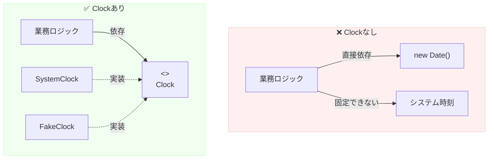

# 第15章：境界の種類②｜Clock（時間）を抽象化する⏰✨

## この章でできるようになること🎯✨

* `new Date()` がコードのあちこちに散らばる“時間地獄”を回避できる😵‍💫
* **Clock（時間）を境界として抽象化**して、DIPっぽい形にできる🧩
* **テストで時間を固定**できて、テストがサクサク＆安定する🎉🧪
* 「今この瞬間」じゃなくて「再現できる時間」を扱えるようになる⏳✅

---

## 1) なぜ「時間」が敵になるの？😵🧪⏰

時間って、コード的にはめちゃくちゃ“外の世界”なんだよね🌍💦
だから、業務ロジック（上位）が **システム時間（下位）に直接つながる** と…

* テストが**明日になったら落ちる**（期限切れとか）😇
* 夜中だけ失敗する（0:00跨ぎ）🌙💥
* タイムゾーンや夏時間で「え、今日って何！？」になる🌀
* 「たまたま通る」テストが爆誕して信頼ゼロへ…🙈💣

つまり時間は、**変更されやすい下位の事情**そのもの！
だから **境界（ポート）にして外へ押し出す** のが相性バツグンだよ💖🚪

---

## 2) ありがちな失敗例（Clockなし）🙅‍♀️📉

「期限チェック」みたいな超あるあるを例にするね🧁✨

```ts
// ❌ Clockなし：業務ロジックがシステム時間に直結
export function isCouponValid(expireAtIso: string): boolean {
  const now = new Date(); // ← ここが敵！！😵
  const expireAt = new Date(expireAtIso);
  return now < expireAt;
}
```

これ、動くけどテストがつらい…🥲
「今」を固定できないから、

* テスト実行が遅いと期限を超えて落ちる⏳💥
* 日付またぎで突然落ちる🌙💥

ってなるの、あるあるすぎる😭

---

## 3) 解決：Clockという“境界”を作る🧩⏰✨


やることはシンプル！

✅ **上位（業務）側が欲しいのは「今の時刻」**
✅ だから「今」を返す **Clock interface** を上位側に置く

ポイントは「最小の抽象」にすることだよ🌱
（最初から盛りすぎると、使いにくくなる🙈）

### まずは最小でOK：`now()` だけ✨

```ts
// ✅ 上位（domain/usecase）側に置く：抽象（契約）🧩
export interface Clock {
  now(): Date;
}
```

---

## 4) 実装：SystemClock と FakeClock 🛠️🧸

### SystemClock（本番で使うやつ）🖥️⏰




```ts
import { Clock } from "./Clock";


export class SystemClock implements Clock {
  now(): Date {
    return new Date();
  }
}
```

### FakeClock（テストで使うやつ）🧸🧪

テストでは **“今”を固定**したいし、場合によっては **時間を進めたい** よね🎮⏩

```ts
import { Clock } from "./Clock";

export class FakeClock implements Clock {
  private currentMs: number;

  constructor(initial: Date | number) {
    this.currentMs = initial instanceof Date ? initial.getTime() : initial;
  }

  now(): Date {
    // Dateはミュータブル寄りなので、毎回 new して返すのが安心🛡️
    return new Date(this.currentMs);
  }

  set(date: Date | number) {
    this.currentMs = date instanceof Date ? date.getTime() : date;
  }

  advanceBy(ms: number) {
    this.currentMs += ms;
  }
}
```

---

## 5) 使い方：上位（業務）に注入する💉✨

さっきのクーポン判定を、ClockでDIPっぽくするよ💖

```ts
import { Clock } from "./Clock";

export class CouponService {
  constructor(private readonly clock: Clock) {}

  isValid(expireAtIso: string): boolean {
    const now = this.clock.now();         // ✅ “今”はClockに聞く
    const expireAt = new Date(expireAtIso);
    return now < expireAt;
  }
}
```

### 依存関係のイメージ（矢印が大事🏹✨）

* `CouponService（上位）` → `Clock（抽象）`
* `SystemClock（下位の詳細）` → `Clock（抽象）`

つまり「上位が下位を知らない」😍

### “組み立て場所”（entry）で差し込む🚪🧩

```ts
import { CouponService } from "./CouponService";
import { SystemClock } from "./SystemClock";

const clock = new SystemClock();
const service = new CouponService(clock);

// ここからアプリを動かす✨
```

---

## 6) テストが一気に楽になる！🎉🧪✨

FakeClockがあると、**時間が固定できる**からテストが安定するよ💖

```ts
import { describe, it, expect } from "vitest";
import { CouponService } from "./CouponService";
import { FakeClock } from "./FakeClock";

describe("CouponService", () => {
  it("期限前ならOK🎫✨", () => {
    const clock = new FakeClock(new Date("2026-01-01T00:00:00Z"));
    const service = new CouponService(clock);

    expect(service.isValid("2026-01-02T00:00:00Z")).toBe(true);
  });

  it("期限後ならNG💔", () => {
    const clock = new FakeClock(new Date("2026-01-03T00:00:00Z"));
    const service = new CouponService(clock);

    expect(service.isValid("2026-01-02T00:00:00Z")).toBe(false);
  });

  it("時間を進める⏩🧸", () => {
    const clock = new FakeClock(new Date("2026-01-01T00:00:00Z"));
    const service = new CouponService(clock);

    clock.advanceBy(1000 * 60 * 60 * 24); // 1日進める📅✨

    expect(service.isValid("2026-01-02T00:00:00Z")).toBe(false);
  });
});
```

### 「fake timers（テスト側の機能）」との違いは？🤔⏰

もちろん、Jest/Vitestには「システム時間そのものを偽装する」仕組みもあるよ✅

* JestのTimer Mocks（`jest.useFakeTimers()`）📦⏱️ ([jestjs.io][1])
* Vitestも `@sinonjs/fake-timers` ベースで日付モックできるよ🧪🕰️ ([vitest.dev][2])

でもね…！
**アプリ設計としてはClock境界を作っておく方が強い**よ💪✨
（テストフレームワーク依存が減るし、読みやすいし、差し替えしやすい💕）

---

## 7) よくある質問（つまずきポイント）🙋‍♀️💬

### Q1. `now(): Date` じゃなくて `number`（epoch ms）でもいい？🧠

ぜんぜんOK！むしろ `number` の方が比較がラクなことも多いよ✨
ただ初心者さんには `Date` の方が直感的だから、この章では `Date` にしたよ😊

### Q2. タイムゾーンどうするの？🌏🌀

まずは基本：

* **保存・比較はUTC（ISO文字列 or epoch）**寄りだと事故りにくい✅
* 表示だけローカルに寄せる（UI側）🎀

「業務ルールが“日本時間の0時”」みたいな要件が出たら、その時に作戦会議しよ😊📌

### Q3. `Temporal` って使わないの？🕰️✨

Temporalはめっちゃ期待されてる次世代APIで、**Stage 3（仕様かなり固い段階）**だよ📈 ([TC39][3])
でも **ブラウザ標準としてはまだ“広くは使えない”** 状態（MDNでもLimited availability）なので、今すぐ全面移行は様子見が多いよ👀 ([MDNウェブドキュメント][4])

とはいえ、Clock境界を作っておくと…
将来 `Date` → `Temporal` に変える時も、差し替えが超ラクになるのが最高🎉✨

---

## 8) コラム：本日時点の“最新”メモ📰⏳✨

* **Temporal**：ProposalはStage 3で、2026-01-13付近の更新が反映されてるよ📅 ([TC39][3])
* **TemporalのPolyfill**：`@js-temporal/polyfill` がnpmで案内されてるよ🧩 ([NPM][5])
* **TypeScript**：GitHubのReleases上では **TypeScript 5.9.3** がLatest表示だよ（2025-10-01）📦 ([GitHub][6])
* **Node.js**：v24がActive LTS、v25がCurrentになってるよ（Node公式のreleases表）🚀 ([Node.js][7])

（この章の結論：だからこそ “Clock境界” は2026でも鉄板💘）

---

## 9) まとめ（3行）🧾✨

* `new Date()` 直呼びは、上位（業務）を下位（時間）に縛ってしまう😵‍💫
* `Clock` を境界にして、上位は抽象にだけ依存させる🧩
* FakeClockで時間を固定できて、テストが速い＆安定する🎉🧪

---

## 10) ミニ演習（1〜2問）✍️🧁

1. 「ログインから30分でセッション切れ」機能を作ってみて✨

* `SessionService` を作って `isExpired(loginAtIso)` を実装
* `Clock` を注入して、FakeClockでテスト🧸🧪

2. FakeClockに `advanceTo(date)` を追加してみよう📅

* 「指定日時までジャンプ」できると、テストがもっと書きやすくなるよ⏩✨

---

## 11) AIに聞く用プロンプト例🤖💬✨

（“丸投げ”じゃなくて、比較させるのがコツだよ〜😊）

* 「`new Date()`直呼びの問題点を、テストの観点で3つ挙げて。改善としてClock抽象の例もコードで」
* 「Clock interfaceの設計を `now(): Date` と `nowMs(): number` で比較して。メリット/デメリットと、初心者におすすめも」
* 「この `CouponService` に対して、FakeClockを使ったVitestテストを3ケース書いて（期限前/期限後/時間経過）」
* 「将来Temporalに移行する可能性を考えて、Clock境界をどう設計しておくと移行が楽？段階的移行案も」

---

必要なら次は「Clock境界を使ったミニプロジェクト（注文処理の“時間”部分だけ先取り）」みたいに、実務っぽい形でも一緒にやろうね🏁📦⏰✨

[1]: https://jestjs.io/docs/timer-mocks?utm_source=chatgpt.com "Timer Mocks"
[2]: https://vitest.dev/guide/mocking/dates?utm_source=chatgpt.com "Mocking Dates"
[3]: https://tc39.es/proposal-temporal/?utm_source=chatgpt.com "Temporal"
[4]: https://developer.mozilla.org/en-US/docs/Web/JavaScript/Reference/Global_Objects/Temporal?utm_source=chatgpt.com "Temporal - JavaScript - MDN Web Docs"
[5]: https://www.npmjs.com/package/%40js-temporal/polyfill?utm_source=chatgpt.com "js-temporal/polyfill"
[6]: https://github.com/microsoft/typescript/releases "Releases · microsoft/TypeScript · GitHub"
[7]: https://nodejs.org/en/about/previous-releases?utm_source=chatgpt.com "Node.js Releases"
