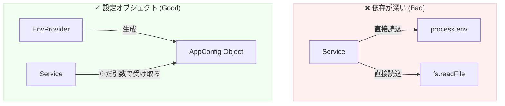

# 第16章：境界の種類③｜ファイル/設定/環境変数📁⚙️

この章は、「設定」と「ファイル」を **“外の世界（＝変わりやすい詳細）”** として扱って、上位（業務ロジック）を守る練習だよ〜！🛡️✨
DIPって「DBやHTTPだけの話じゃない」のがポイント☺️

---

## 1) まず結論：ここが“境界”だよ🚪✨


* **環境変数**：`process.env`（実行環境の都合がモロに出る）🌪️
* **設定ファイル**：JSON/YAML/ini…（形式、置き場所、文字コードが変わる）🗂️
* **ファイルパス**：Windows特有の癖（区切り、ドライブ、バックスラッシュ）🪟🌀


なので **上位のコードが直接触ると壊れやすい** → 境界で吸収するのがDIP的に強い💪✨

---

## 2) ありがちNG例🙅‍♀️（直読み・直書き地獄）

「上位」がこういうのをやると、変更とテストがつらくなる…😵‍💫💦

```ts
// ❌ 上位（業務）なのに、環境変数・ファイル・パスに直で触ってる例

import { readFileSync } from "node:fs";

export class ReportService {
  generate(): string {
    const mode = process.env.APP_MODE; // string | undefined 😇
    const filePath = "C:\\app\\config\\report.json"; // Windows固定パス 😇
    const json = readFileSync(filePath, "utf8"); // ファイルI/O直
    return `${mode}:${json}`;
  }
}
```

**どこが痛い？😢**

* `process.env` は **未設定だと `undefined`** で落ちる（か、謎の挙動）
* Windows固定パスが混ざると移植も難しい
* テストで毎回ファイル準備が必要になって地獄🧪🔥

---

## 3) DIPの形にする：境界を3つに分ける🧩🧩🧩


ここでは超シンプルに、こんな“扉”を用意するよ🚪✨

* **EnvProvider**：環境変数を読む係🌿
* **ConfigProvider**：設定（型付き）を返す係⚙️
* **FileSystem**：ファイルを読む/書く係📁

「上位」は **これらの“契約（interface）”だけ** 知ってればOK🙆‍♀️

---

## 4) まずは最小の“契約”を書く✍️🧩

```ts
// Env（環境変数）を読む境界 🌿
export interface EnvProvider {
  get(key: string): string | undefined;
}

// ファイル操作の境界 📁
export interface FileSystem {
  readText(path: string): Promise<string>;
  writeText(path: string, content: string): Promise<void>;
}

// 上位が依存していい「ただの型（値）」
// （よく引用される定義の「2つの文」だよ）([Stackify][4])

// 上位が欲しい「設定」の形（型付き）⚙️
export type AppConfig = {
  appMode: "dev" | "prod";
  reportPath: string;
};
```



---

## 5) 下位の実装：Node標準で env を読み込む（最新）🌱✨

最近のNodeは、**`.env` をCLIオプションで読み込める** ようになってるよ！
`--env-file` / `--env-file-if-exists` で `process.env` に流し込める👌 ([Node.js][1])

（つまり「dotenv入れる前に」まず標準で足りるか確認できる感じ！）

---

## 6) dotenvを使う場合（まだ現役）🧪🌿

プロジェクトによってはdotenvも普通に使うよ〜。npmのdotenvは **v17系** が最新として配布されてるよ。 ([NPM][2])

ポイントはひとつだけ👇
**dotenvの読み込みは“上位”に置かない**（entry側でやる）🚪✨

---

## 7) 実装例：Node向けの境界クラスを作る👩‍🔧🧰


```ts
import * as fs from "node:fs/promises";
import * as path from "node:path";
import { env as processEnv } from "node:process";

import type { EnvProvider, FileSystem, AppConfig } from "./ports";

// EnvProvider（下位実装）🌿
export class NodeEnvProvider implements EnvProvider {
  get(key: string): string | undefined {
    return processEnv[key];
  }
}

// FileSystem（下位実装）📁
export class NodeFileSystem implements FileSystem {
  async readText(p: string): Promise<string> {
    return await fs.readFile(p, "utf8");
  }
  async writeText(p: string, content: string): Promise<void> {
    await fs.writeFile(p, content, "utf8");
  }
}

// Config組み立て（entryで一回だけ）⚙️
export async function buildConfig(env: EnvProvider, file: FileSystem): Promise<AppConfig> {
  const modeRaw = env.get("APP_MODE") ?? "dev";

  // Windowsパス問題は path で吸収しよ🪄
  // pathはWindowsだと区切りを「\」で作ってくれる性質があるよ :contentReference[oaicite:2]{index=2}
  const defaultReportPath = path.resolve("config", "report.json");

  const reportPath = env.get("REPORT_PATH") ?? defaultReportPath;

  const appMode = (modeRaw === "prod" ? "prod" : "dev") as AppConfig["appMode"];

  // 「設定ファイルがあるなら読む」みたいな拡張も、ここでできる☺️
  // 例: reportPath の内容を読んで検証するとかね
  void file; // 今回は未使用でもOK

  return { appMode, reportPath };
}
```

---

## 8) 上位（業務）は“設定オブジェクト”だけ見て生きる🌸

```ts
import type { AppConfig, FileSystem } from "./ports";

export class ReportService {
  constructor(private readonly config: AppConfig, private readonly file: FileSystem) {}

  async generate(): Promise<string> {
    // ✅ process.env も fs も見てない！上位がスッキリ✨
    const raw = await this.file.readText(this.config.reportPath);
    return `[${this.config.appMode}] ${raw}`;
  }
}
```

---

## 9) Windowsあるあるは「境界で封印」🪟🔒

### 9-1) パス結合は文字列連結しない🙅‍♀️

Windowsは `\` が混ざるし、`"C:\new"` みたいな書き方はエスケープ事故しがち😇
`path.join/resolve` を使うのが安定！
さらに、Nodeの`path`はWindowsでは`/`も受け付けるけど、生成は基本`\`になるよ。 ([Node.js][3])

### 9-2) 環境変数名の“大文字小文字”はWindowsで罠🌀

Windowsでは環境変数名が **大小文字を区別しない**（`TEST` と `test` が同じ扱い）って明記されてるよ。 ([Node.js][4])
PowerShellの解説でも「Windowsとそれ以外で違う」って注意があるね。 ([Microsoft Learn][5])
➡️ だからキーは **大文字固定**（例：`APP_MODE`）にしちゃうのが安全😌

### 9-3) `.env` / 設定ファイルをGitに入れる時の注意⚠️

フロント（Vite）だと `.env.*.local` はローカル専用で、Gitに入れない推奨が明確だよ。 ([v2.vitejs.dev][6])
さらにクライアントへ露出する変数の注意もあるので、**秘密は混ぜない**のが基本〜🫣

---

## 10) “設定の型安全”をちょい足し（Zodで検証）🧪✅


`process.env` は全部文字列なので、**数値・真偽値・必須チェック**が必要になりがち。
Zodで「起動時にまとめて検証」すると気持ちいいよ〜！✨ ([Zod][7])

```ts
import * as z from "zod";

const envSchema = z.object({
  APP_MODE: z.enum(["dev", "prod"]).default("dev"),
  REPORT_PATH: z.string().optional(),
});

export function parseEnv(raw: NodeJS.ProcessEnv) {
  return envSchema.parse(raw);
}
```

---

## 11) VS Codeデバッグ時のenv注入（便利）🐞🌿

デバッグで「この時だけ環境変数変えたい！」ってなるよね☺️
VS Codeは `launch.json` で `env` を渡せる（デバッグ構成の王道）🧩 ([Visual Studio Code][8])

---

## 章末まとめ（3行）🧾✨

* `process.env` / 設定ファイル / パスは **変わりやすい“外の世界”** 🌍
* 上位が直で触ると壊れやすいので、**境界（interface）で吸収** 🚪
* 設定は **entryで一回組み立てて型付きで渡す** と超ラク🎁

---

## ミニ演習（1〜2問）✍️😊

1. `AppConfig` に `maxItems: number` を追加して、`MAX_ITEMS` 環境変数（未設定なら100）から作ってみよう📦
2. `reportPath` が存在しない場合に、上位が落ちないように「わかりやすいエラー」を境界側で作って返してみよう🚨

---

## AIに聞く用プロンプト例🤖💬

* 「`AppConfig`を増やしたい。必須/任意、default値、検証（Zod）まで含めた設計案を3パターン出して。上位が`process.env`を見ない条件で！」
* 「Windowsのパス問題を避けるために、`PathResolver`みたいな境界を作るなら、最小のinterfaceと実装例を出して！」
* 「この構成がDIPになってるかレビューして。依存の矢印（上位→抽象←下位）が崩れてる場所があったら指摘して！」

---

次の第17章では、今日作った境界たちを **Fake/Stub** に差し替えて「テストが急に楽になる感動」までつなげるよ〜！🧪🧸✨

[1]: https://nodejs.org/api/environment_variables.html?utm_source=chatgpt.com "Environment Variables | Node.js v25.3.0 Documentation"
[2]: https://www.npmjs.com/package/dotenv?utm_source=chatgpt.com "dotenv"
[3]: https://nodejs.org/api/path.html?utm_source=chatgpt.com "Path | Node.js v25.3.0 Documentation"
[4]: https://nodejs.org/api/process.html?utm_source=chatgpt.com "Process | Node.js v25.3.0 Documentation"
[5]: https://learn.microsoft.com/en-us/powershell/module/microsoft.powershell.core/about/about_environment_variables?view=powershell-7.5&utm_source=chatgpt.com "about_Environment_Variables - PowerShell"
[6]: https://v2.vitejs.dev/guide/env-and-mode?utm_source=chatgpt.com "Env Variables and Modes"
[7]: https://zod.dev/api?utm_source=chatgpt.com "Defining schemas"
[8]: https://code.visualstudio.com/docs/debugtest/debugging-configuration?utm_source=chatgpt.com "Visual Studio Code debug configuration"
