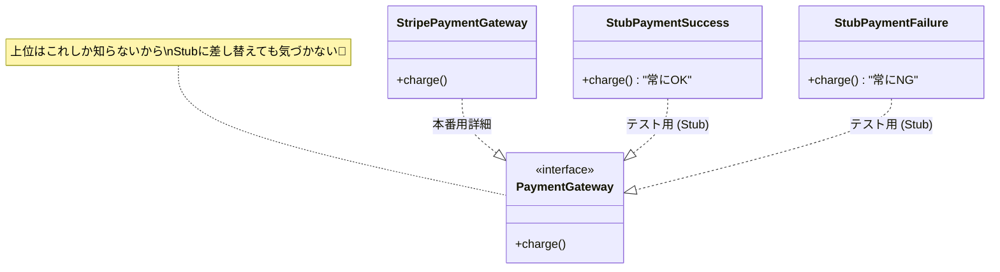

# 第17章：テストが簡単になる！Fake/Stubで体験🧪🧸✨

## この章でできるようになること🎯

* 「DIPするとテストがラクになる理由」を体感できる💡
* Fake / Stub を作って、**“本物なし”**でユースケースをテストできる🧸✨
* テストの目的が「バグ探し」じゃなくて **“仕様を守る契約書”**だとわかる📌📝

---

## 1) まず結論：DIPは「テストしやすさ」を爆上げする💪🧪

DIPが効くと、上位（業務ロジック）が **DB / HTTP / 時間 / ファイル**みたいな“下位の事情”に振り回されなくなるよね🌪️
するとテストで…

* DBを立てなくていい🙅‍♀️🗄️
* 外部APIを叩かなくていい🙅‍♀️🌐
* 現在時刻に左右されない🙅‍♀️⏰

つまり、**速い・安定・怖くない**テストになる🎉

---

## 2) Fake / Stub / Mock をゆるく理解しよう🧸🧪

ここ、最初はざっくりでOK〜！😊

* **Stub（スタブ）**：決まった返事を返すだけの子📨

  * 例：支払い処理は常に「成功」を返す、とか👍
* **Fake（フェイク）**：動くけど簡易版の“代用品”🧸

  * 例：DBの代わりに、メモリ配列に保存するRepository📦
* **Mock（モック）**：呼び出し回数や引数を“監視”する子👀

  * 例：通知が1回送られたことを確認する、とか🔔

この章は **Fake と Stub** を中心に「うわ、テスト簡単！」を体験するよ✨

---

## 3) 例題：注文確定ユースケースを“本物なし”でテストする📦✅

## やりたい仕様（これがテストで守る対象）📌

**PlaceOrder（注文確定）**の仕様を、テストで守るよ！

* 支払いが成功したら ✅

  * 注文が保存される（Repositoryに保存）💾
  * `CONFIRMED` になる🎉
* 支払いが失敗したら ❌

  * 注文は保存されない🙅‍♀️💾

---

## 4) まずは「抽象（ポート）」を用意する🧩🚪

上位（ユースケース）が頼る先は “interface” にするよ〜✨

```ts
// src/ports/PaymentGateway.ts
export interface PaymentGateway {
  charge(amountYen: number): Promise<{ ok: true } | { ok: false; reason: string }>;
}

// src/ports/OrderRepository.ts
export interface OrderRepository {
  save(order: Order): Promise<void>;
  findById(id: string): Promise<Order | null>;
}

// src/ports/Clock.ts
export interface Clock {
  nowIso(): string; // 例: "2026-01-15T12:00:00.000Z"
}

// src/domain/Order.ts
export type OrderStatus = "PENDING" | "CONFIRMED";

export type Order = {
  id: string;
  amountYen: number;
  status: OrderStatus;
  createdAtIso: string;
};
```

---

## 5) ユースケース（上位）は“抽象だけ”を見る👑✨

ここがDIPの主役だよ〜！
DBもAPIも時刻も、**知らない**（＝依存してない）💪

```ts
// src/app/PlaceOrder.ts
import type { PaymentGateway } from "../ports/PaymentGateway";
import type { OrderRepository } from "../ports/OrderRepository";
import type { Clock } from "../ports/Clock";
import type { Order } from "../domain/Order";

export class PlaceOrder {
  constructor(
    private readonly payment: PaymentGateway,
    private readonly orders: OrderRepository,
    private readonly clock: Clock
  ) {}

  async execute(input: { id: string; amountYen: number }): Promise<Order> {
    const createdAtIso = this.clock.nowIso();

    const order: Order = {
      id: input.id,
      amountYen: input.amountYen,
      status: "PENDING",
      createdAtIso,
    };

    const result = await this.payment.charge(order.amountYen);

    if (!result.ok) {
      // 仕様：失敗時は保存しない
      throw new Error(`PAYMENT_FAILED: ${result.reason}`);
    }

    const confirmed: Order = { ...order, status: "CONFIRMED" };

    await this.orders.save(confirmed);
    return confirmed;
  }
}
```

---

## 6) テスト用の Stub / Fake を作る🧸🧪✨


## Stub：支払いを“成功/失敗”させたいだけ🙂/😢



```ts
// test_doubles/StubPaymentGateway.ts

import type { PaymentGateway } from "../src/ports/PaymentGateway";

export class StubPaymentGatewaySuccess implements PaymentGateway {
  async charge(_: numberYen: number) {
    return { ok: true } as const;
  }
}

export class StubPaymentGatewayFail implements PaymentGateway {
  constructor(private readonly reason = "card_declined") {}
  async charge(_: numberYen: number) {
    return { ok: false, reason: this.reason } as const;
  }
}
```

## Fake：Repositoryを“メモリで動く簡易DB”にする📦💾

```ts
// test_doubles/FakeOrderRepository.ts
import type { OrderRepository } from "../src/ports/OrderRepository";
import type { Order } from "../src/domain/Order";

export class FakeOrderRepository implements OrderRepository {
  private store = new Map<string, Order>();

  async save(order: Order): Promise<void> {
    this.store.set(order.id, order);
  }

  async findById(id: string): Promise<Order | null> {
    return this.store.get(id) ?? null;
  }

  // テストで便利な“のぞき見”🫣✨
  count(): number {
    return this.store.size;
  }
}
```

## FixedClock：時刻を固定してテストを安定させる⏰🧊

```ts
// test_doubles/FixedClock.ts
import type { Clock } from "../src/ports/Clock";

export class FixedClock implements Clock {
  constructor(private readonly fixedIso: string) {}
  nowIso(): string {
    return this.fixedIso;
  }
}
```

---

## 7) Vitestでテストを書く（動く体験パート）🧪⚡

テストランナーは **Vitest v4系**がサクサクで扱いやすいよ⚡（v4.0.x が公開されてる）([Vitest][1])
（もちろん Jest 30 も現役だよ〜）([Jest][2])

## インストール（例）

```sh
npm i -D vitest
```

`package.json` の例：

```json
{
  "type": "module",
  "scripts": {
    "test": "vitest"
  },
  "devDependencies": {
    "vitest": "^4.0.0"
  }
}
```

---

## 8) テスト本体：本物ゼロでユースケースを検証する🎉🧸

```ts
// tests/PlaceOrder.test.ts
import { describe, it, expect } from "vitest";
import { PlaceOrder } from "../src/app/PlaceOrder";

import { StubPaymentGatewaySuccess, StubPaymentGatewayFail } from "../test_doubles/StubPaymentGateway";
import { FakeOrderRepository } from "../test_doubles/FakeOrderRepository";
import { FixedClock } from "../test_doubles/FixedClock";

describe("PlaceOrder", () => {
  it("支払い成功なら、注文が保存されてCONFIRMEDになる✅", async () => {
    const payment = new StubPaymentGatewaySuccess();
    const repo = new FakeOrderRepository();
    const clock = new FixedClock("2026-01-15T00:00:00.000Z");

    const usecase = new PlaceOrder(payment, repo, clock);

    const result = await usecase.execute({ id: "order-1", amountYen: 1200 });

    expect(result.status).toBe("CONFIRMED");
    expect(result.createdAtIso).toBe("2026-01-15T00:00:00.000Z");

    const saved = await repo.findById("order-1");
    expect(saved?.status).toBe("CONFIRMED");
    expect(repo.count()).toBe(1);
  });

  it("支払い失敗なら、保存されない＆例外になる❌", async () => {
    const payment = new StubPaymentGatewayFail("network_error");
    const repo = new FakeOrderRepository();
    const clock = new FixedClock("2026-01-15T00:00:00.000Z");

    const usecase = new PlaceOrder(payment, repo, clock);

    await expect(usecase.execute({ id: "order-2", amountYen: 500 }))
      .rejects.toThrow("PAYMENT_FAILED");

    expect(repo.count()).toBe(0);
  });
});
```

## ここが気持ちいいポイント😍✨

* DBもAPIも不要！なのに仕様が守れる🧸
* テストが速い（だから回せる）⚡
* 失敗したとき原因がわかりやすい🔍

これが **DIPのごほうび**だよ〜🎁💕

---

## 9) ありがちなミスとコツ🧠🪄

* **テストで本物を使い始める**（DB/HTTP直叩き）→ 遅い・不安定になりがち😵
* **時間を固定しない** → 日付またぎで落ちる、環境でズレる⏰💥
* **テストが“実装”に寄りすぎる** → 仕様（期待する振る舞い）に寄せよう📌✨

---

## 章末まとめ（3行）🧾✨

* DIPで上位は「抽象」にだけ依存する🧩
* だからテストでは Fake/Stub に差し替えできる🧸
* 結果、速くて安定した“仕様を守るテスト”が作れる🧪✅

---

## ミニ演習（1〜2問）✍️😊

1. `PlaceOrder` に「amountYen が 0 以下なら例外」を追加して、テストも1本足してみてね💥🧪
2. `FakeOrderRepository` に `all()` を作って「保存された注文一覧」を検証するテストを書いてみよう📚✨

---

## AIに聞く用プロンプト例🤖💬（比較させる系✨）

* 「このユースケースのテストで、Stub と Fake をどう分けるのが自然？理由もセットで3パターン出して」🧠🧸
* 「このテストが“実装寄り”になってる部分を指摘して、“仕様寄り”に書き換える案を提案して」🔍📌
* 「Mock を使うべき場面にしたい。通知ポートを追加して“呼び出し回数を検証するテスト”例を作って」🔔👀

---

次の第18章では「やりすぎ注意⚠️」へ進んで、**どこまでDIPするのがちょうどいいか**を身につけるよ〜🐍⚖️😊

[1]: https://vitest.dev/blog/vitest-4?utm_source=chatgpt.com "Vitest 4.0 is out!"
[2]: https://jestjs.io/versions?utm_source=chatgpt.com "Jest Versions"
