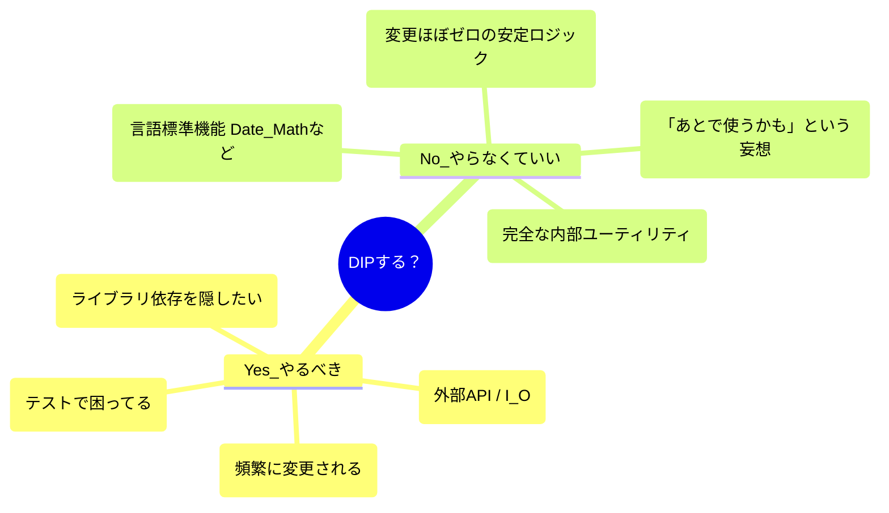

# 第18章：やりすぎ注意！DIPの落とし穴と適用判断⚠️🐍

## この章のゴール🎯✨

* DIPを“やりすぎたコード”を見分けられる👀
* 「ここはDIP入れるべき？やめるべき？」を判断できる🧭
* KISS / YAGNI と仲良くしながら、ちょうど良い設計にできる⚖️😊 ([martinfowler.com][1])

---

## 18-1. DIPの「やりすぎ」あるある5連発😵‍💫🌀

## あるある①：何でもかんでもinterface化して、読むのがつらい📚💥

**症状**

* `FooService` のために `FooService` / `FooServiceImpl` / `FooServiceMock` …みたいにファイル増殖🌱🌱🌱
* 追いかけるだけで疲れる😇

**言いたいこと**

* DIPは“抽象を増やす”技じゃなくて、**変更に強くする**ためのルールだよ🧠✨ ([ウィキペディア][2])

---

## あるある②：「将来差し替えるかも」で先に作り込み（YAGNI破り）🔮🧱

**症状**

* まだ要件にないのに「そのうち○○対応するかも」で抽象が太る🐷
* 結局差し替えないまま、複雑さだけ残る🫠

**対処**

* 迷ったら「本当に必要になってから」作るのが正義👍（YAGNI） ([martinfowler.com][1])

---

## あるある③：抽象が“漏れる”（上位が下位の事情を知っちゃう）🫗😢


**症状**

* 上位（業務ロジック）が `HTTP 404` とか `DBのエラーコード` を直接扱ってる🌐🗄️
* 結局「下位の都合」に引っ張られてる（DIPの敗北）🥲

**コツ**

* 上位が知りたいのは「見つからない」「一時的に失敗した」みたいな**業務的な意味**だけにする🎁✨
  （通信やDBの事情は“境界の外”に寄せる🚧）

---

## あるある④：抽象がデカすぎ（God Interface化）👑💣


**症状**

* `UserRepository` に「検索・保存・削除・通知・ログ…」全部入り😇
* Fake作るのが地獄＝テストしたい気持ちが消える🧪🔥

**合言葉**

* **Fakeがサクッと書けない抽象は、だいたいデカすぎ**🧸✍️

---

## あるある⑤：抽象の置き場所ミス（“内側”にない）🏠↔️🌍

**症状**

* interface（抽象）が “外側（インフラ側）” に置かれて、上位が参照しに行く📦➡️📦
* 依存の向きがぐちゃぐちゃ🌀

**原則**

* 抽象（契約）はできるだけ「方針側（内側）」に寄せるのが王道🧭✨ ([ウィキペディア][2])

---

## 18-2. 「DIPを入れるべき？」判断の3つの軸🧭👀

## 軸A：変更頻度（変わりやすい？）🌪️

* 外部API、DB、ファイル形式、認証方式、通知先…は変わりやすい😵
* こういうのは境界を作る価値が高い💎

## 軸B：外部I/Oか？（不確実性がある？）🌐🗄️⏰

* ネットワーク、DB、ファイル、時間は“敵”になりがち😈
* テストが一気に難しくなるから、DIPで隔離すると楽になる🎉

## 軸C：テストしたいか？（仕様を守りたい？）🧪📌

* 「ここはバグったら困る」＝Fake/Stubで守りたい
* その場所はDIPが効く💪✨

---

## 18-3. 迷ったらこのルールでOK✅✨（実務で強い）

## ルール1：まず“シンプル”に作る（でも逃げ道は残す）🚪😊

いきなり大量interfaceを作らず、**後から抜ける構造**にしておくのが最強💡

* `new` を奥深くに埋めない
* 依存はコンストラクタ引数で受け取れる形にしておく（手動DI）💉

---

## ルール2：外部I/Oは「境界」を作りやすい🏁

「外の世界」は変わるし壊れるし遅い…だから境界が効く🚧✨

* `PaymentClient`（外部決済）
* `UserRepository`（DB）
* `Clock`（時間）

---

## ルール3：差し替え“予定”じゃなく、差し替え“必要”で作る🔁

「今テストでFakeにしたい」
「今APIが頻繁に変わって困ってる」
この “今” が来たら、DIPの出番👏✨



---


## 18-4. TypeScriptなら“軽量DIP”ができる🧩🧡（構造的型付けの強み）

TypeScriptは「形が同じならOK」な発想（構造的型付け）だから、**interfaceを別ファイルで量産しなくても**成立しやすいよ✨ ([TypeScript][3])

たとえば、通知を送る依存を「形」だけで受け取る👇

```ts
type Notifier = {
  send(to: string, message: string): Promise<void>;
};

class WelcomeUseCase {
  constructor(private notifier: Notifier) {}

  async execute(email: string) {
    await this.notifier.send(email, "ようこそ〜！🎉");
  }
}
```

テストでは“その場でFake”を渡せる👇🧸

```ts
const fakeNotifier: Notifier = {
  async send() { /* 何もしない */ }
};

const usecase = new WelcomeUseCase(fakeNotifier);
```

✅ このやり方のいいところ

* ファイル増えにくい📄✨
* でも依存は外から差し替えできる🔁
* テストがラク🧪🎉

---

## 18-5. DIコンテナは“強いけど重い”🏋️‍♀️🎒

DI（依存を外から渡す）は便利だけど、**コンテナ導入**は別の難しさも連れてくるよ🌀
（仕組み理解・デバッグ難度・設定地獄…など）

「まずは手動DI」が安定💉✨
コンテナは「規模が大きい」「生成が複雑」「横断的な依存が多い」時に検討でOK🙆‍♀️
DIの考え方自体は昔から整理されてるよ📚 ([martinfowler.com][4])

---

## 18-6. KISS / YAGNI とDIPの“ちょうどいい関係”⚖️😊


* **KISS**：シンプルにしよ〜🧼✨ ([Baeldung on Kotlin][5])
* **YAGNI**：必要になるまで作らない🙅‍♀️🔮 ([martinfowler.com][1])

DIPは「将来のために複雑にする」のではなく、
**“困ってる部分”を切り離して、今をラクにする**ために使うと相性最高だよ🌸

---

## 18-7. 最終チェックリスト✅📝（ここがYESならDIP寄り）

* [ ] 外部I/O（HTTP/DB/ファイル/時間）に触れてる🌐🗄️📁⏰
* [ ] 変更が起きやすい場所（仕様が揺れる・差し替えが現実的）🌪️
* [ ] テストで本物を使いたくない（遅い・壊れる・準備が面倒）🧪😵
* [ ] Fakeが作れたらめっちゃ楽になる予感がする🧸✨
* [ ] 逆に、interfaceを作ると“読む負担”が増えすぎそうじゃない？📚💦

---

## 18-8. ミニ演習✍️🐣

## 問1：これはDIPやりすぎ？それとも必要？🤔

「ログ出力のためだけに `Logger` interface を作り、実装は1種類、テストも特にしない」
👉 どうする？理由も一言で✨
ヒント：変更頻度・外部I/O・テスト欲しいか、で判断🧭

## 問2：境界を作るならどこ？🚧

「注文処理が、内部で `fetch()` を直接呼んで外部APIに配送依頼してる」
👉 どんな名前の抽象にする？（例：`ShippingClient` とか）📛✨

---

## 18-9. AIに聞く用プロンプト例🤖💬（比較させるのがコツ✨）

* 「このコード、DIPを入れるべき場所と、入れない方がいい場所を分けて理由も説明して」
* 「interfaceを増やしすぎずにテストしやすくする“軽量なやり方”をTypeScriptで3案出して」
* 「この依存は ‘外部I/O’ として境界化した方がいい？変更頻度とテスト観点で判断して」
* 「YAGNI/KISSの観点で、この抽象は過剰かレビューして」 ([martinfowler.com][1])

---

## まとめ（3行）🧾✨

* DIPは万能薬じゃなくて、**困ってる場所に効く薬**💊
* **外部I/O・変更頻度・テスト**の3軸で判断するとブレない🧭
* TypeScriptは“形で契約”できるから、**interface量産せず軽量に**いける🧩🎉 ([TypeScript][3])

---

おまけ小ネタ📌：もし型が増えて「ホバーが長すぎて読めない〜😭」ってなったら、TypeScript 5.9でホバーの最大長を調整できる設定もあるよ（VS Code側の設定）👀✨ ([TypeScript][6])

[1]: https://martinfowler.com/bliki/Yagni.html?utm_source=chatgpt.com "Yagni"
[2]: https://en.wikipedia.org/wiki/Dependency_inversion_principle?utm_source=chatgpt.com "Dependency inversion principle"
[3]: https://www.typescriptlang.org/docs/handbook/interfaces.html?utm_source=chatgpt.com "Handbook - Interfaces"
[4]: https://martinfowler.com/articles/injection.html?utm_source=chatgpt.com "Inversion of Control Containers and the Dependency ..."
[5]: https://www.baeldung.com/cs/kiss-software-design-principle?utm_source=chatgpt.com "KISS Software Design Principle"
[6]: https://www.typescriptlang.org/docs/handbook/release-notes/typescript-5-9.html?utm_source=chatgpt.com "Documentation - TypeScript 5.9"
