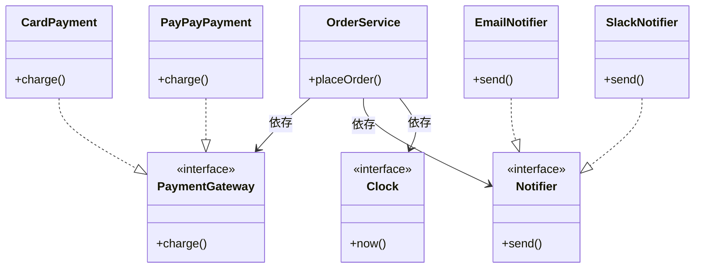

# 第19章：ミニプロジェクトで総復習（実務っぽく）🏁🎁✨

題材：**注文処理（Order）**📦

* 支払い：**Card / PayPay** を差し替え 💳📱
* 通知：**Email / Slack** を差し替え 📩💬
* 時間：**Clock** で固定 ⏰
* 流れ：**DIPなし → 問題発見 → DIP化 → テスト** まで一気に🛠️✨

---

## 0) “今日の最新メモ”📌（リサーチ済み✅）

* TypeScriptは **5.9** 系のリリースノートが公開されています（`import defer` など） ([TypeScript][1])
* Node.jsは **v24 が Active LTS / v25 が Current** として更新されています ([Node.js][2])
* テストは **Vitest 4.0** が公開され、**4.0.17** まで更新されています ([Vitest][3])
* VS Code は **v1.108**（2026-01-08公開）などのリリースノートが更新されています ([Visual Studio Code][4])
* さらに先の話として、TypeScript の “Native Preview” や TypeScript 7 の進捗共有も出ています（※プレビュー/進捗） ([Microsoft Developer][5])

> ここから先は、**このミニプロジェクトの中でDIPを「体で覚える」**のが目的だよ〜😊💪

---

## 1) ゴール：OrderService を“差し替え可能”にする🎯🔁

最終的にこうなれば勝ち🏆✨

* OrderService（上位）が **Card/PayPay の詳細を知らない** 🙈
* OrderService（上位）が **Email/Slack の詳細を知らない** 🙈
* 時間（Date）に振り回されず **テストで固定できる** ⏰🧪
* 追加要件（PayPay追加、Slack追加）が来ても、**上位はほぼ触らない** 🧡

---

## 2) フォルダ構成（“内側＝方針 / 外側＝詳細”）🏠🌍


```text
src/
  domain/
    order/
      Order.ts
      OrderService.ts
    ports/
      PaymentGateway.ts
      Notifier.ts
      Clock.ts
  adapters/
    payment/
      CardPaymentGateway.ts
      PayPayPaymentGateway.ts
    notify/
      EmailNotifier.ts
      SlackNotifier.ts
    time/
      SystemClock.ts
  main.ts

test/
  OrderService.test.ts
```

* `domain/`：上位（業務ルール）💡
* `ports/`：抽象（契約）🧩
* `adapters/`：下位（道具の実装）🧰
* `main.ts`：組み立て場所（差し替えスイッチ）🔧

---

## 3) まずは “DIPなし地獄” を見よう🔥😵（わざとやる）

「ありがちなやつ」👇（上位が下位を直接 `new` してる）

```ts
// src/domain/order/OrderService.ts（※わざと悪い例）
type PaymentMethod = "card" | "paypay";

export class OrderServiceBad {
  placeOrder(userId: string, amount: number, method: PaymentMethod) {
    // 支払いの詳細に直依存 😵
    const payment =
      method === "card"
        ? new CardPaymentGateway()     // ← 下位new
        : new PayPayPaymentGateway();  // ← 下位new

    const paid = payment.charge(userId, amount);

    // 通知の詳細に直依存 😵
    const notifier = new EmailNotifier(); // ← 下位new

    // 時間にも直依存 😵
    const now = new Date(); // ← テストが地獄

    if (!paid) {
      notifier.send(userId, `支払い失敗… ${now.toISOString()}`);
      return { ok: false as const };
    }

    notifier.send(userId, `注文OK！ ${now.toISOString()}`);
    return { ok: true as const };
  }
}

// ↓ “下位”のクラス（本来は adapters に居るべき）
class CardPaymentGateway { charge(_u: string, _a: number) { return true; } }
class PayPayPaymentGateway { charge(_u: string, _a: number) { return true; } }
class EmailNotifier { send(_u: string, _m: string) {} }
```

### どこがしんどい？😢🌀

* PayPayの仕様変更 → OrderServiceBad まで巻き添え💥
* Slack通知を追加 → OrderServiceBad の if/else が増殖🌱🌱🌱
* `new Date()` が固定できない → テストが不安定😵🧪



---

## 4) “境界（ポート）”を先に作る🧩🚪（ここがDIPの芯）


### 4-1) 支払いのポート💳📱

```ts
// src/domain/ports/PaymentGateway.ts
export interface PaymentGateway {
  charge(userId: string, amount: number): Promise<"paid" | "failed">;
}
```

### 4-2) 通知のポート📩💬

```ts
// src/domain/ports/Notifier.ts
export interface Notifier {
  send(userId: string, message: string): Promise<void>;
}
```

### 4-3) 時間のポート⏰✨

```ts
// src/domain/ports/Clock.ts
export interface Clock {
  nowIso(): string;
}
```

> コツ：**“どうやるか”じゃなくて “何をしたいか”**でメソッドを決める🎯✨
> `charge` / `send` / `nowIso` みたいに、上位の言葉でね😊

---

## 5) OrderService（上位）をDIP化する🧠🔄


ポイントはこれ👇

* OrderService は **port（interface）だけを知る**
* 実装は外から注入（手動DI）💉

```ts
// src/domain/order/OrderService.ts
import type { PaymentGateway } from "../ports/PaymentGateway";
import type { Notifier } from "../ports/Notifier";
import type { Clock } from "../ports/Clock";

export class OrderService {
  constructor(
    private readonly payment: PaymentGateway,
    private readonly notifier: Notifier,
    private readonly clock: Clock,
  ) {}

  async placeOrder(userId: string, amount: number) {
    const result = await this.payment.charge(userId, amount);
    const now = this.clock.nowIso();

    if (result === "failed") {
      await this.notifier.send(userId, `支払い失敗… ${now}`);
      return { ok: false as const };
    }

    await this.notifier.send(userId, `注文OK！ ${now}`);
    return { ok: true as const };
  }
}
```

🎉 これで OrderService は **Card/PayPay/Email/Slack/Date** を一切知らない！
（“方針”だけになった）🏠✨

---

## 6) 下位（adapters）を実装する🧰👩‍🔧

### 6-1) 支払い：Card / PayPay 💳📱

```ts
// src/adapters/payment/CardPaymentGateway.ts
import type { PaymentGateway } from "../../domain/ports/PaymentGateway";

export class CardPaymentGateway implements PaymentGateway {
  async charge(_userId: string, _amount: number) {
    // 本当は決済SDKなど（ここではダミー）
    return "paid" as const;
  }
}
```

```ts
// src/adapters/payment/PayPayPaymentGateway.ts
import type { PaymentGateway } from "../../domain/ports/PaymentGateway";

export class PayPayPaymentGateway implements PaymentGateway {
  async charge(_userId: string, _amount: number) {
    return "paid" as const;
  }
}
```

### 6-2) 通知：Email / Slack 📩💬

```ts
// src/adapters/notify/EmailNotifier.ts
import type { Notifier } from "../../domain/ports/Notifier";

export class EmailNotifier implements Notifier {
  async send(_userId: string, _message: string) {
    // 本当はメール送信
  }
}
```

```ts
// src/adapters/notify/SlackNotifier.ts
import type { Notifier } from "../../domain/ports/Notifier";

export class SlackNotifier implements Notifier {
  async send(_userId: string, _message: string) {
    // 本当はSlack API
  }
}
```

### 6-3) 時間：SystemClock ⏰

```ts
// src/adapters/time/SystemClock.ts
import type { Clock } from "../../domain/ports/Clock";

export class SystemClock implements Clock {
  nowIso() {
    return new Date().toISOString();
  }
}
```

---

## 7) 組み立て（差し替えスイッチ）は main.ts に置く🔧🚪

ここが「PayPayにする？」「Slackにする？」の選択場所✨

```ts
// src/main.ts
import { OrderService } from "./domain/order/OrderService";
import { CardPaymentGateway } from "./adapters/payment/CardPaymentGateway";
import { PayPayPaymentGateway } from "./adapters/payment/PayPayPaymentGateway";
import { EmailNotifier } from "./adapters/notify/EmailNotifier";
import { SlackNotifier } from "./adapters/notify/SlackNotifier";
import { SystemClock } from "./adapters/time/SystemClock";

const payment = Math.random() > 0.5 ? new CardPaymentGateway() : new PayPayPaymentGateway();
const notifier = Math.random() > 0.5 ? new EmailNotifier() : new SlackNotifier();
const clock = new SystemClock();

const service = new OrderService(payment, notifier, clock);

service.placeOrder("user-1", 1200).then(console.log);
```

> 実務だと「設定/環境変数」で切り替えたりするけど、考え方は同じだよ😊⚙️

---

## 8) テストで “DIPの旨み” を体験する🧪🧸✨（Vitest 4.x）

Vitest 4.0 が公開されていて、4.0.17 まで更新されています ([Vitest][3])

### 8-1) Fake を用意（本物いらない！最強💪）

```ts
// test/OrderService.test.ts
import { describe, it, expect } from "vitest";
import { OrderService } from "../src/domain/order/OrderService";
import type { PaymentGateway } from "../src/domain/ports/PaymentGateway";
import type { Notifier } from "../src/domain/ports/Notifier";
import type { Clock } from "../src/domain/ports/Clock";

class FakePayment implements PaymentGateway {
  constructor(private readonly result: "paid" | "failed") {}
  async charge() { return this.result; }
}

class SpyNotifier implements Notifier {
  public sent: Array<{ userId: string; message: string }> = [];
  async send(userId: string, message: string) {
    this.sent.push({ userId, message });
  }
}

class FixedClock implements Clock {
  nowIso() { return "2026-01-15T00:00:00.000Z"; }
}

describe("OrderService", () => {
  it("支払い成功なら ok:true を返して、成功メッセージを送る 🎉", async () => {
    const payment = new FakePayment("paid");
    const notifier = new SpyNotifier();
    const clock = new FixedClock();

    const service = new OrderService(payment, notifier, clock);
    const res = await service.placeOrder("u1", 1200);

    expect(res.ok).toBe(true);
    expect(notifier.sent.length).toBe(1);
    expect(notifier.sent[0].message).toContain("注文OK！");
    expect(notifier.sent[0].message).toContain("2026-01-15");
  });

  it("支払い失敗なら ok:false を返して、失敗メッセージを送る 😢", async () => {
    const payment = new FakePayment("failed");
    const notifier = new SpyNotifier();
    const clock = new FixedClock();

    const service = new OrderService(payment, notifier, clock);
    const res = await service.placeOrder("u1", 1200);

    expect(res.ok).toBe(false);
    expect(notifier.sent.length).toBe(1);
    expect(notifier.sent[0].message).toContain("支払い失敗");
  });
});
```

### 8-2) ここが最高ポイント😍✨

* `new Date()` が消えた → **時間を固定できた**⏰✅
* Email/Slack/決済SDKなし → **Fakeだけでテストできた**🧸✅
* OrderService のテストが **速い・安定**💨🧪✅

---

## 9) “差し替え”確認（実務っぽいチェック）🔁✅

### 追加要件：通知を Slack に変えたい💬

✅ **OrderService は一切変更なし**
→ `main.ts` で `new SlackNotifier()` にするだけ🎉

### 追加要件：PayPayを導入したい📱

✅ **OrderService は一切変更なし**
→ `new PayPayPaymentGateway()` を差すだけ🎉

---

## 10) 最終チェックリスト✅✨（この章のゴール）

* 上位（OrderService）は **詳細を知らない**？🙆‍♀️
* 抽象（ports）は **上位側に置かれている**？📌
* 差し替え（main.ts）で **動作を変えられる**？🔁
* テストが **Fake/Fixed で安定**してる？🧪🧸
* “変更が来やすい場所”が **adapters に隔離**されてる？🧰🚧

---

## まとめ（3行）🧾✨

* DIPは「上位が下位に振り回されない」ための約束🤝
* その鍵は **port（interface）を上位側に置く**こと🧩
* すると **差し替えとテスト**が一気に楽になるよ🎉🧪

---

## ミニ演習（1〜2問）✍️😊

1. `Notifier` に **sendOrderReceipt(orderId)** を増やしたくなった！
   　👉 ports と adapters と domain のどこをどう直す？（最小変更で✨）

2. `PaymentGateway` を「失敗理由つき」にしたい！
   　👉 `Promise<"paid" | "failed">` をどう改善する？（例：Result型）🧠

---

## AIに聞く用プロンプト例🤖💬（“比較させる”系）

* 「この `OrderService` はDIP的にOK？依存の向きと、portsの置き場所をレビューして、改善案を3つ出して」🔍
* 「`PaymentGateway` を Result型にした場合の型定義案を2案（シンプル/拡張）で比較して」⚖️
* 「Fake/Spy/Stub の使い分けを、このテストコードに当てはめて説明して」🧪🧸

---

次は、もしよければこのミニプロジェクトに「設定（ConfigProvider）」も足して、**“本番の差し替え”**をもう一段リアルにしてみよっか？😊⚙️✨

[1]: https://www.typescriptlang.org/docs/handbook/release-notes/typescript-5-9.html?utm_source=chatgpt.com "Documentation - TypeScript 5.9"
[2]: https://nodejs.org/en/about/previous-releases?utm_source=chatgpt.com "Node.js Releases"
[3]: https://vitest.dev/blog/vitest-4?utm_source=chatgpt.com "Vitest 4.0 is out!"
[4]: https://code.visualstudio.com/updates?utm_source=chatgpt.com "December 2025 (version 1.108)"
[5]: https://developer.microsoft.com/blog/typescript-7-native-preview-in-visual-studio-2026?utm_source=chatgpt.com "TypeScript 7 native preview in Visual Studio 2026"
