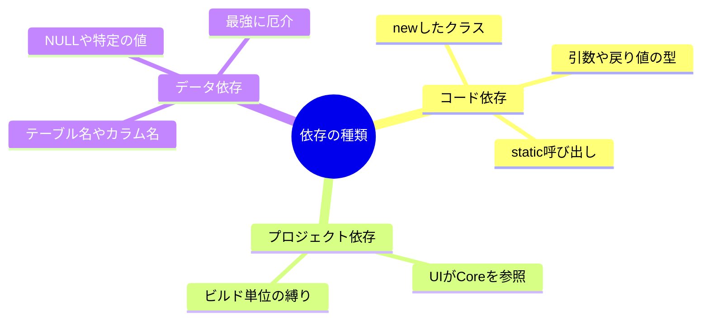
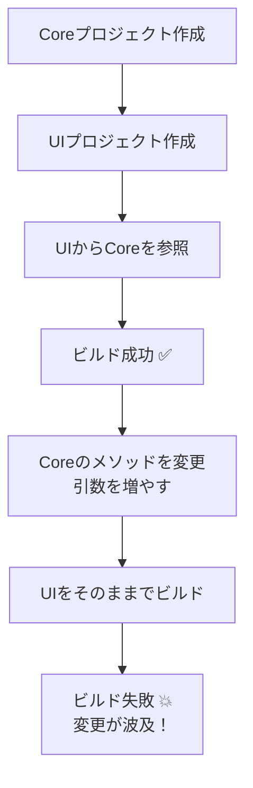

# 第01章：依存ってなに？怖さの正体を知ろう😱🔗

## この章でできるようになること🎯✨

* 「依存＝矢印➡️」の感覚がつかめる
* 依存が増えると何が怖いのか（変更がどう波及するか）を説明できる
* “ありがちな事故”の構造が見えるようになる
* 小さな演習で「壊れ方」を体験して、直感で理解できる👀💥

---

## 1) そもそも「依存」ってなに？🤔➡️


ざっくり言うと…

**依存 = 「AがBのことを知ってる（=Bの都合に左右される）」状態**です🧠🔗
そして、図にすると **矢印➡️** で考えるのがいちばんラクです😊

* AがBの型を使ってる
* AがBのメソッド名・引数・戻り値を前提にしてる
* AがBのルール（例えばDBのカラム名）に合わせて書かれてる

こうなると、**Bが変わったときにAも巻き込まれる**んだよね💥😵

---

## 2) 依存の「怖さ」の正体😱💣


## 怖いポイントはコレ👇

**「変更が連鎖する」こと**です🔁💥

* 1つ直したいだけなのに、修正があちこちに波及する
* 変更の影響範囲が読めなくて、触るのが怖い
* テストが薄いと、さらに地獄😇🔥

これが俗にいう **“変更コストが爆発する”** 状態💣📈

---

## 3) 依存は「悪」じゃないよ☺️🌱

ここ、超大事🫶✨
依存はゼロにできないし、ゼロにする必要もないです。

✅ 依存があってもOK
❌ ただし「方向」と「強さ（固さ）」が問題になる

この教材の中心テーマ（Dependency Rule）は、あとで一言でまとめると
**「矢印➡️の向きを固定して、中心を守る」**って話になるよ🧭➡️
（第2章でやるやつ！）

---

## 4) 依存の種類をざっくり分ける🧺✨

初心者のうちは、まずこの3つだけでOKです😊

## ① コード依存（型・メソッド依存）🧩

* `new` したクラス
* 引数に使った型
* 戻り値の型
* static呼び出し

→ **一番わかりやすい依存**✨

## ② プロジェクト/参照依存（アセンブリ参照）📦

* UIプロジェクトがCoreを参照してる
* CoreがInfraを参照してる

→ **ビルド単位で縛られる依存**🚦

## ③ データ依存（DBの都合）🗃️

* テーブル名・カラム名が前提
* NULL/NOT NULL前提
* “この値は0なら未設定”みたいな暗黙ルール

→ **地味に最強に厄介**😇⚠️



---

## 5) ありがちな事故例😭🚑

## 事故A：UIがDB都合に引きずられる😵🗃️➡️🖥️

UIでこんな感じのコードが出てきたら黄色信号🚥

* 画面が `UserTableRow`（DBっぽい型）を直接扱ってる
* 画面が `UserName` の最大長やNULLをDB仕様で判断してる

📌 何が起こる？
DB変更（カラム名変更、型変更）で **UIが巻き添え**💥
「DB担当がちょい変更」→「画面が壊れる」みたいな地獄が起こる😭

```mermaid
flowchart TD
    DB["DBの仕様変更<br>カラム名や型が変わる"] -->|"直撃"| UI["UIが壊れる😵<br>画面修正が必要に"]
    Note["UIがDBの都合("型やルール")に<br>直接依存しているため巻き込まれる"] -.-> UI
```

---

## 事故B：中心がフレームワークに依存する🧲🧱

例えば、アプリの“中心っぽい”場所が、外の詳細に寄りかかると…

* 業務ルールのクラスがEF Coreの型を直接使う
* 業務ルールがASP.NET Coreの`HttpContext`前提になる

こうなると、中心が「外側の都合」でグニャグニャになります🫠
（Dependency Ruleが守れない典型だよ〜）

※Dependency Ruleの基本説明として「依存は内側へ向く」という考え方は、Clean Architecture文脈でも広く紹介されています。([DeNA Engineering][1])

---

## 事故C：便利Sharedが巨大化して全員が依存する😇📦

“便利だから”ってSharedに何でも入れると…

* 全プロジェクトがShared参照
* Sharedの変更が全員に波及
* しかも誰も責任取れない

👉 **全方位依存爆弾**の完成です💣😇

---

## 6) 演習：using/参照を増やして「壊れ方」を見る👀💥🛠️

ここで “体験” しちゃおう〜！😊✨
（Visual Studio 2026 と .NET 10 / C# 14 は現時点の最新側として扱えるよ📌。([Microsoft Learn][2])）

---

## 演習1：Coreを変えるとUIが壊れる（依存の基本）🔗➡️💥

### 手順🧭

1. 新規ソリューション作成（例：`Deps101`）📦
2. プロジェクトを2つ追加する

   * `Deps101.Core`（クラスライブラリ）🧱
   * `Deps101.Ui`（コンソールアプリ）🖥️
3. `Deps101.Ui` → `Deps101.Core` を **参照追加**🔗

### まずはCoreにクラスを作る🧱

```csharp
// Deps101.Core/GreetingService.cs
namespace Deps101.Core;

public class GreetingService
{
    public string Hello(string name)
        => $"Hello, {name}!";
}
```

### UIから呼ぶ🖥️

```csharp
// Deps101.Ui/Program.cs
using Deps101.Core;

var svc = new GreetingService();
Console.WriteLine(svc.Hello("Komiyanma"));
```

✅ ビルド通るはず！🎉

---

### じゃあ次に「Coreをちょい変更」してみる😈✨

```csharp
// Deps101.Core/GreetingService.cs
namespace Deps101.Core;

public class GreetingService
{
    // 引数を増やしてみる（仕様変更）
    public string Hello(string firstName, string lastName)
        => $"Hello, {firstName} {lastName}!";
}
```

👀 もう一回ビルドすると…
`Deps101.Ui` が **コンパイルエラー**になるよね？💥😵



**これが「依存の波及」**です🔁
UIがCoreに依存してるから、Coreの変更がUIを壊す。

---

## 演習2：依存が“増えるほど”修正が怖くなる📈😱

次は「依存する箇所を増やす」よ〜！

UI側に、同じメソッド呼び出しを10箇所くらい増やしてみてね🧪
（コピペでOK！）

すると Core 側の仕様変更（引数が増えた）だけで、
**修正が10箇所**必要になる…😇💦

📌 ここでの学び

* 依存が増えるほど、変更がつらい
* “型・メソッド”に依存してると、変更の影響が直撃する

---

## 7) 依存を見抜くミニチェック✅👀

コードを見たとき、まずこれを探すと早いよ〜😊✨

* `new 〇〇()` が多い（具体クラス固定）🧨
* 画面（UI）がDBっぽい名前の型を触ってる🗃️
* どのプロジェクトもShared参照してる📦
* “便利メソッド集”が増殖してる🧟‍♀️
* 変更のたびに、同じ修正をあちこちで繰り返してる🔁😭

---

## 8) AI活用：依存関係を「文章＋簡易図」で説明させる🤖✍️➡️🗺️

Copilot / Codex みたいなAIが使える前提なら、こういう使い方が超便利😊✨
（目的は“答えを出す”より、“理解を言語化して固める”ことだよ🧠💪）

## プロンプト例①：矢印図にしてもらう➡️

```text
次のC#コードの依存関係を「A → B」形式の箇条書きで列挙して、
最後に簡易図（テキスト）でまとめてください。初心者にもわかる言葉でお願いします。

(ここにコード貼る)
```

## プロンプト例②：変更が波及する場所を当ててもらう🎯💥

```text
このコードで GreetingService.Hello の引数が増えた場合、
どこが壊れるか（修正が必要になるか）を理由つきで説明して。
```

## プロンプト例③：事故パターン診断🚑

```text
この設計で「UIがDB都合に引きずられる」リスクがあるかチェックして。
もしあるなら、どこが危険で、どんな変更に弱いかを例で説明して。
```

---

## 9) まとめ🧠✨（今日の持ち帰り🎒）

* 依存は **矢印➡️** で考えると一気にわかりやすくなる
* 怖さの正体は **変更の波及💥**
* 依存は悪じゃないけど、増えすぎ＆方向がバラバラだと事故る😇
* 小さい演習でも「壊れ方」を体験すると一生忘れない👀✨
* 次章で **「矢印の向きを固定する」** ルール（Dependency Rule）に入るよ🧭➡️

---

## おまけ：1分クイズ⏱️🧠

**Q：UIがDBのRow型を直接使ってると、何が起きやすい？**
A) UIの変更がDBに波及する
B) DBの変更がUIに波及する
C) 何も起きない

（答えはもちろん…👉 **B** だよ〜！💥😵）

---

必要なら、この章の内容に合わせて「第1章の練習用テンプレ構成（Solution/Project/ファイル一式）」も、コピペで作れる形に整理して出すよ📦✨

[1]: https://engineering.dena.com/blog/2023/06/clean-architecture-for-android-app-reasoning-process/?utm_source=chatgpt.com "Clean Architecture for Android App - Reasoning Process"
[2]: https://learn.microsoft.com/en-us/visualstudio/releases/2026/release-notes?utm_source=chatgpt.com "Visual Studio 2026 Release Notes"
