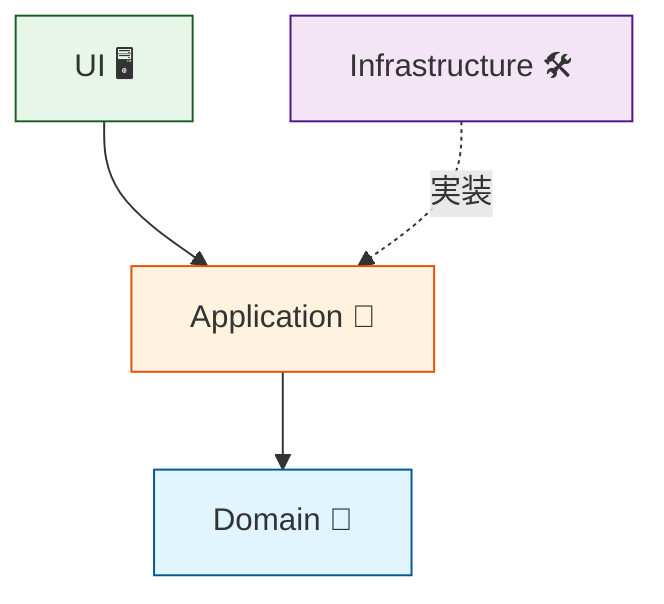

# 第03章：層の考え方入門：中心と外側の地図を作る🧅🗺️

この章はね、「依存関係ルール」を守るための**地図作り**だよ〜😊✨
地図がないまま進むと、あとで「どこに何置くんだっけ…😵‍💫」って迷子になるので、ここでスッキリ整理しよ〜！

※2026年の最新前提として、.NET 10（2025-11-11 リリース）＋C# 14の世界観で進めるよ🧡
（.NET 10 は LTS で、長めに安心して使えるよ〜） ([Microsoft for Developers][1])

---

## 3.0 この章のゴール 🎯💖

読み終わると、こんなことができるようになるよ👇

* 「Domain / Application / Infrastructure / UI」って何？が説明できる📚✨
* “長生きするルール” と “交換されがちな詳細” を分けて考えられる🌱🔁
* クラスを見て「どの層に置くべきか」を判断できる🧠🔍
* AIに分類の理由を説明させて、理解を強化できる🤖💬

---

## 3.1 まず「層」ってなに？🍰✨（超やさしい説明）

層（レイヤー）って、ひとことで言うと…

**「責務の住所（住所分け）」** 🏠📦

* 何でも同じ場所に置くと、探せないし、直すときに巻き込み事故が起きる😇💥
* だから「役割が近いものは近くに置く」っていう整理術だよ〜🧹✨

---

## 3.2 4つの層のざっくり地図 🗺️🧅✨


ここからが本題！この章の主役はこの4層👇

## ✅ Domain（ドメイン）🧠💎

**いちばん中心！**
アプリが何のために存在してるかの「核」だよ。

* 業務ルール（例：注文は合計金額が0円なら作れない、みたいな）🧾🚫
* エンティティ / 値オブジェクト（例：Order, Money）💰📦
* **DBやWebやフレームワークのことは知らない**🙅‍♀️

> Domainは「会社のルールブック📕」みたいなものだよ😊

---

## ✅ Application（アプリケーション）🧭🧩

Domainを使って、**「やりたいこと（ユースケース）」を進行する係**だよ。

* 例：「注文を作る」「会員登録する」「決済を開始する」🛒📝
* ルールはDomainに任せて、**順番を組み立てる**感じ👩‍🍳✨
* 外部（DB/メール/外部API）が必要なら、**インターフェース（窓口）**をここ側に置くのが定番🎯🧷

Microsoftのガイドでも、中心（Application Core）にインターフェースを置いて、外側が実装する形が説明されてるよ📘✨ ([Microsoft Learn][2])

---

## ✅ Infrastructure（インフラ）🛠️🗄️

**外側の“道具箱”**だよ〜！

* DBアクセス（SQL Server / PostgreSQL / SQLite など）🗃️
* ファイル、メール、外部API、メッセージング（RabbitMQ等）📩🌐
* Applicationが定義したインターフェースを**実装**するのが多いよ🔧

---

## ✅ UI（ユーアイ）🖥️📱

**人や外部と接する入口**だよ〜！

* Web API（Controller）、MVC、CLI、WPF、Blazor…などなど🚪✨
* 入力を受け取って、Applicationのユースケースを呼ぶ📞
* 返す（HTTPレスポンス、画面表示）もここ🧾🎀

---

## 3.3 「長生きする」vs「交換されがち」🌱🔁（ここ超重要！）

依存関係ルールで大事なのは、ざっくりこの感覚👇

* **長生きするもの（中心）**：業務ルール、ユースケース、ドメインモデル🧠💎
* **交換されがちなもの（外側）**：DB、UI、フレームワーク、外部API🛠️🔁

たとえばDBって、将来こうなりがちじゃない？😳

* SQLite → SQL Server に変えたい
* 物理DB → クラウドDBに変えたい
* ORM（EF Core）を変えたい

この“外側”に、中心が引っ張られると事故るの…😭💥

---

## 3.4 依存関係ルールと「矢印」➡️🧭


Clean Architectureで有名な言い方だと、

* **依存（ソースコードの参照）は内側に向かう**➡️🧅
* 内側は外側を知らない（名前すら出さない）🙅‍♀️

っていうルールだよ！ ([Clean Coder Blog][3])

## 4層で描くとこんな感じ🗺️✨



ポイントはここだよ👇💕

* UIはApplicationを呼ぶ📞
* ApplicationはDomainを使う🧠
* Infrastructureは「Applicationが決めたI/F」を実装する🔧
* **Domain/ApplicationがInfrastructureを参照しない**🚫

---

## 3.5 ミニ題材で「地図」を作ろう 🛒🗺️✨（Order例）

「注文」を例にすると、置き場所はこんな感じにするとスッキリしやすいよ〜😊

## Domain（中心）🧠💎

* `Order`（注文）
* `Money`（金額）
* `OrderItem`（明細）
* `Order` の不変条件（例：明細が空ならNG）🚫

## Application 🧭🧩

* `PlaceOrderUseCase`（注文作成ユースケース）
* `IOrderRepository`（注文を保存するための窓口）🧷

## Infrastructure 🛠️🗄️

* `SqlOrderRepository : IOrderRepository`（DB実装）
* `EfCoreOrderRepository : IOrderRepository`（ORM実装）

## UI 🖥️📱

* `OrdersController`（Web APIの入口）
* `PlaceOrderRequestDto`（受け取り用の箱）📦

```mermaid
flowchart TD
    subgraph UI["UI ("ユーアイ")"]
        Controller["OrdersController"]
        Dto["PlaceOrderRequestDto"]
    end
    subgraph App["Application ("アプリケーション")"]
        UseCase["PlaceOrderUseCase"]
        IRepo["IOrderRepository"]
    end
    subgraph Dom["Domain ("ドメイン")"]
        Entity["Order"]
        Value["Money"]
    end
    subgraph Infra["Infrastructure ("インフラ")"]
        SqlRepo["SqlOrderRepository"]
        EfRepo["EfCoreOrderRepository"]
    end

    UI --> App
    App --> Dom
    Infra -.->|"実装"| IRepo
```

---

## 3.6 演習：クラスを4分類してみよう📝✨（まずは感覚でOK！）

次のクラスたち、どの層に置く？🤔💭
（今は正解より「理由を言える」が大事だよ〜！）

1. `Order`
2. `Money`
3. `PlaceOrderUseCase`
4. `IOrderRepository`
5. `EfCoreOrderRepository`
6. `OrdersController`
7. `PlaceOrderRequestDto`
8. `ILogger` を直接使う `OrderService`
9. `SqlConnectionFactory`
10. `OrderCreatedDomainEvent`

✅書き方の例（メモでOK）

* `Order` → Domain（業務の中心だから）🧠
* `EfCoreOrderRepository` → Infrastructure（EF Coreは外側の詳細だから）🗄️

---

## 3.7 答え合わせ＆理由 💡🎀

ひとつの「王道回答」だよ〜（プロジェクト事情で多少ズレてもOK！）😊

* 1 `Order` → **Domain** 🧠（業務ルールの主役）
* 2 `Money` → **Domain** 💰（値のルールを持てる）
* 3 `PlaceOrderUseCase` → **Application** 🧭（手順を進行する係）
* 4 `IOrderRepository` → **Application** 🧷（中心側が“必要”を表明する窓口）
* 5 `EfCoreOrderRepository` → **Infrastructure** 🛠️（EF Coreは技術詳細）
* 6 `OrdersController` → **UI** 🖥️（入口・HTTPの都合がある）
* 7 `PlaceOrderRequestDto` → **UI** or **Application境界** 📦（入力の箱。UI寄りが多い）
* 8 `ILogger` を直接使う `OrderService` → **黄色信号**⚠️

  * もし `OrderService` が Domain の中なら、**ログという外側の概念が混ざって汚れやすい**😵
  * 「ログしたい」は外側でやる or DomainはログI/Fすら知らない方が綺麗になりがち✨
* 9 `SqlConnectionFactory` → **Infrastructure** 🗄️（DB接続は外側の詳細）
* 10 `OrderCreatedDomainEvent` → **Domain** 📣（「ドメインの出来事」だから中心に置ける）

---

## 3.8 迷いやすいポイント3つ 👀🧠✨

## ① DTOはどこ？📦

* 画面/HTTP都合の形なら **UI寄り**になりやすい
* “ユースケース入力”として安定させたいなら Application側に置くこともあるよ（ただし最初はUIでOK！）😊

## ② Interface（I/F）はどこ？🧷

基本は

* **中心側（ApplicationやDomain寄り）に置く**
* 実装は外側（Infrastructure）
  ってすると、依存の向きが綺麗になるよ✨ ([Microsoft Learn][2])

## ③ DomainにDBやHTTPの言葉が出たら危険🚨

* `DbContext`
* `HttpContext`
* `Controller`
  このへんがDomainに見えたら「地図が崩れてるかも！」って疑ってOK😆💥

---

## 3.9 AI活用コーナー 🤖💬✨（分類の理由を言語化させる！）

## 🔹プロンプト1：4分類して理由も言って

```text
次のクラスを Domain / Application / Infrastructure / UI に分類して、
それぞれ「なぜそこ？」を初心者向けに1〜2文で説明して。
（題材：注文作成）
Order, Money, PlaceOrderUseCase, IOrderRepository, EfCoreOrderRepository, OrdersController, PlaceOrderRequestDto
```

## 🔹プロンプト2：地図（依存の矢印）を描いて

```text
Domain / Application / Infrastructure / UI の依存関係を、ASCII図で矢印付きで描いて。
「依存関係ルール」を守る配置にして、理由も添えて。
```

## 🔹プロンプト3：違反っぽい点を指摘させる（レビュー）

```text
この設計で「依存関係ルール的に危ない匂い」がする点を3つ挙げて、
それぞれ修正案を1つずつ出して。
（ログ、DTO、DBアクセスの混入に注意して見て）
```

Visual Studio 2026 は .NET 10 / C# 14 に合わせて出ていて、Copilot連携も強化されてる流れなので、こういう“説明させる使い方”が相性いいよ〜😊🧡 ([Microsoft for Developers][4])

---

## 3.10 まとめ（この章で覚える合言葉）🧠✨

* 層は「責務の住所」🏠
* **中心＝長生きするルール**（Domain / Application）🌱
* **外側＝交換されがちな詳細**（Infrastructure / UI）🔁
* 依存の矢印は **内側へ**➡️🧅 ([Clean Coder Blog][3])
* 迷ったら「それ、将来取り替えたくなる？」で判断すると強い💪✨

---

## おまけ：ミニ小テスト（30秒）⏱️📝💕

Q1. `DbContext` を参照していい層はどこ？
Q2. `IOrderRepository` はどこに置くと依存の向きが綺麗？
Q3. `OrdersController` が知っててOKなことは？（HTTP/JSONとか？）

（答え合わせしたければ、そのまま返信してね〜😊💖）

---

次の第4章で、ここで作った「地図」を **実際にプロジェクト分割📦🛠️**して“物理で守る”に進むよ〜！ワクワクだね🥳✨

[1]: https://devblogs.microsoft.com/dotnet/announcing-dotnet-10/?utm_source=chatgpt.com "Announcing .NET 10"
[2]: https://learn.microsoft.com/en-us/dotnet/architecture/modern-web-apps-azure/common-web-application-architectures?utm_source=chatgpt.com "Common web application architectures - .NET"
[3]: https://blog.cleancoder.com/uncle-bob/2012/08/13/the-clean-architecture.html?utm_source=chatgpt.com "Clean Architecture - Clean Coder Blog - Uncle Bob"
[4]: https://devblogs.microsoft.com/dotnet/dotnet-conf-2025-recap/?utm_source=chatgpt.com "Celebrating .NET 10, Visual Studio 2026, AI, Community, & ..."
