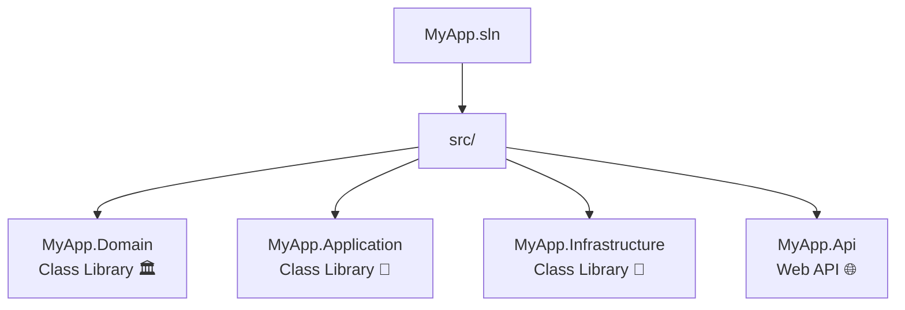
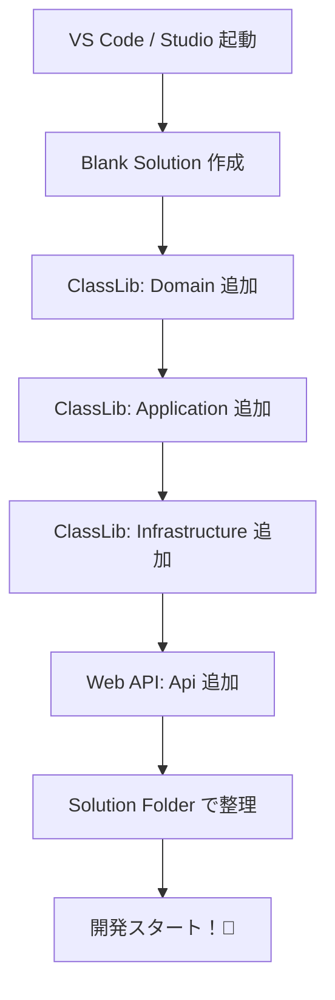

# 第04章：まずは物理で守る：Visual Studioでプロジェクト分割📦🛠️

この章は「依存関係ルールを守れる“形”を先に作る」回だよ〜😊✨
まだ参照ルール（どこがどこを参照してOK/NGか）は深追いしないで、まずは**分けるだけ**やるよ📦🧱

> 2026/01/18 時点だと、Visual Studio 2026 の **January Update 18.2.0（2026/01/13）** が出てるよ🆕✨ ([Microsoft Learn][1])
> .NET は **.NET 10（LTS, 2025/11/11）** が現行で、最新パッチは **10.0.2（2026/01/13）** だよ🧩 ([Microsoft][2])
> C# は **C# 14** を .NET 10 SDK / VS 2026 で試せるよ✍️ ([Microsoft Learn][3])

---

## 4.1 今日のゴール🎯✨


* Solution の中に、**4つのプロジェクト（箱）**を作る📦📦📦📦

  * Domain / Application / Infrastructure / UI（ここでは API で代用）
* 「この箱に入れるものはコレだよね」って**地図ができる**🗺️😊
* まだ参照は最小限（もしくはゼロ）でOK🙆‍♀️

  * 参照の正しい向きは第5章でガッツリやるよ🚦➡️

---

## 4.2 なんで“物理で分ける”と強いの？💪📦


同じプロジェクト内で namespace だけ分けても…

* うっかり `using` 追加でズブズブ混ざる😇🔗
* 「ちょっと便利だから」で UI から DB に直行しがち🚗💨
* チームだとさらに混ざりやすい（レビューで見落ちる）👀💦

でもプロジェクトが分かれてると…

* **参照しない限り触れない**（物理バリア！）🚧✨
* 「置き場所に迷ったら、責務を考える」癖がつく🧠🌱
* 第5章以降の“参照ルール”が効く土台になる🧱😊

---

## 4.3 この章で作るおすすめ構成（例）🧅🏗️

名前は例だよ〜（好きに変えてOK）😊💖

* `MyApp.sln`（ソリューション）
* `src/`

  * `MyApp.Domain`（Class Library）🏛️
  * `MyApp.Application`（Class Library）🧠
  * `MyApp.Infrastructure`（Class Library）🧰
  * `MyApp.Api`（ASP.NET Core Web API）🌐



ポイントはコレ👇✨

* **Domain**：長生きするルール（業務の言葉）📜
* **Application**：ユースケース（やりたいことの手順）🧭
* **Infrastructure**：DB/外部API/ファイルなど実装の詳細🔌
* **Api（UI）**：外界と話す窓口（HTTP）🚪

---

## 4.4 Visual Studio（GUI）で作る手順🖱️✨

### ① まずソリューションを作る📁✨



1. Visual Studio を起動
2. **Create a new project**
3. テンプレで **Blank Solution**（空のソリューション）を選ぶ🧺
4. 名前：`MyApp`（例）
5. 場所：好きな作業フォルダ（例：`C:\dev\MyApp`）📍

> ここで「空の器」を作ってから、プロジェクト（箱）を追加していくよ〜😊📦

---

### ② Domain を追加（Class Library）🏛️📦


1. Solution を右クリック → **Add** → **New Project**
2. **Class Library** を選ぶ
3. 名前：`MyApp.Domain`
4. フォルダ：`src\MyApp.Domain`（後で見やすい！）🧹✨
5. 作成！

---

### ③ Application を追加（Class Library）🧠📦

同じ手順で追加してね😊

* 名前：`MyApp.Application`
* フォルダ：`src\MyApp.Application`

---

### ④ Infrastructure を追加（Class Library）🧰📦

同じく追加😊

* 名前：`MyApp.Infrastructure`
* フォルダ：`src\MyApp.Infrastructure`

---

### ⑤ UI枠として Api を追加（Web API）🌐🚪

1. Solution 右クリック → **Add** → **New Project**
2. **ASP.NET Core Web API** を選ぶ
3. 名前：`MyApp.Api`
4. フォルダ：`src\MyApp.Api`
5. フレームワークは **.NET 10** を選ぶ🧩✨（LTS） ([Microsoft][2])
6. 作成！

---

### ⑥ Solution Explorer を整える（見た目も設計）🧹✨


Solution の下に「Solution Folder」を作ると気持ちいいよ〜😊🎀

* Solution を右クリック → **Add** → **New Solution Folder**

  * `01_Core`（Domain, Application）
  * `02_Adapters`（Infrastructure, Api）

フォルダにドラッグ＆ドロップで移動📦➡️📁

---

### ⑦ 起動プロジェクト設定（Api を起動）▶️✨

* `MyApp.Api` を右クリック → **Set as Startup Project**
* `F5`（デバッグ実行）で起動できたら勝ち🏆🎉

---

## 4.5 “箱”の実感を得るミニコード（まだ依存させない）🧪✨


### Domain に “それっぽい型” を1個だけ置こう🏛️

`MyApp.Domain` に `OrderId.cs` を追加：

```csharp
namespace MyApp.Domain;

public readonly record struct OrderId(Guid Value);
```

* ここは「業務の言葉」っぽい型が置きやすいよ😊🗣️

### Application に “ユースケースの空箱” を1個🧠

`MyApp.Application` に `PlaceOrder.cs`：

```csharp
namespace MyApp.Application;

public sealed class PlaceOrder
{
    // まだ中身なし！この章は「箱を作る」が主役✨
}
```

### Infrastructure に “ここに実装が溜まる予定” を匂わせる🧰

`MyApp.Infrastructure` に `InfrastructureMarker.cs`：

```csharp
namespace MyApp.Infrastructure;

public sealed class InfrastructureMarker { }
```

### Api は起動できればOK🌐

テンプレのままでOKだよ😊
「Swagger が開く」「/weatherforecast が動く」くらいで十分🎉

---

## 4.6 演習：テンプレで土台を作る🧱📝（チェック式✅）

やることはシンプル！

* [ ] 空の Solution を作った📁✨
* [ ] `Domain/Application/Infrastructure/Api` の 4プロジェクトを追加した📦📦📦📦
* [ ] `src` 配下に整理できた🧹
* [ ] Solution Folder で見た目を整えた📁🎀
* [ ] Api を Startup にして起動できた▶️🎉
* [ ] Solution 全体で Build が通った🔨✅

できたらスクショ撮って残すと、次章で効くよ〜📸✨

---

## 4.7 VS Code（CLI）で一気に作る版💻⚡


「操作よりコマンド派！」ならこれが早いよ😊✨
`dotnet sln` でソリューションにプロジェクトを追加できるよ📦➡️🧩 ([Microsoft Learn][4])

PowerShell で（場所は好きに）👇

```powershell
mkdir MyApp
cd MyApp
mkdir src

dotnet new sln -n MyApp

dotnet new classlib -n MyApp.Domain -o src/MyApp.Domain
dotnet new classlib -n MyApp.Application -o src/MyApp.Application
dotnet new classlib -n MyApp.Infrastructure -o src/MyApp.Infrastructure
dotnet new webapi   -n MyApp.Api -o src/MyApp.Api

dotnet sln add src/MyApp.Domain/MyApp.Domain.csproj
dotnet sln add src/MyApp.Application/MyApp.Application.csproj
dotnet sln add src/MyApp.Infrastructure/MyApp.Infrastructure.csproj
dotnet sln add src/MyApp.Api/MyApp.Api.csproj

dotnet build
```

> ちなみに `dotnet sln` には `migrate` もあって、`.sln` → `.slnx` への移行もできるよ（上級者向けの話なので今は「へぇ〜」でOK）😊🧠 ([Microsoft Learn][4])

---

## 4.8 よくあるつまずきポイント集😵‍💫🧯

### ✅ 1) プロジェクト名とフォルダ名がズレて迷子📛🌀

* `MyApp.Domain` が `MyApp.Domain1` とかになってると、後で地味に苦しい😇
  → 早めに整えるのが吉🧹✨

### ✅ 2) Api だけ起動して、他プロジェクトが置き去り🐣

* ちゃんと「Solution 全体で Build」してね🔨✅
* 第5章で参照を貼り始めると、ここが効いてくるよ😊

### ✅ 3) 「とりあえずShared作ろ」欲が出る📦😈

* ここは我慢！✋💦
* Shared の扱いは後半章でちゃんとやるよ（地雷回避）🧨➡️💖

---

## 4.9 AI活用（Copilot / Codex）で“設計の地図”を固める🤖🗺️✨


Visual Studio 2026 は AI 統合が強くなってる流れだよ🧠✨ ([Microsoft Learn][1])
この章では「構成レビュー」と「命名」を AI に手伝わせるのが相性いいよ😊💕

### そのまま投げてOKなプロンプト例🪄💬

1. **ソリューション構成の提案**

* 「`Domain/Application/Infrastructure/Api` の4プロジェクトで、初心者が迷わないフォルダ構成と命名規則を提案して。理由も短く。」

2. **置き場所判定ゲーム（超おすすめ）**

* 「次のクラスはどのプロジェクトに置くべき？理由も：Order、OrderService、OrderRepository、OrderDto、DbContext、OrderController」

3. **README の雛形**

* 「このソリューションの目的、各プロジェクトの責務、禁止事項（例：Domain にDBアクセス書かない）を README.md にまとめて」

4. **Solution Folder の整理案**

* 「Solution Explorer の表示が散らかってる。Solution Folder の切り方を2案出して」

5. **次章への布石**

* 「次に“参照ルール”を決めたい。一般的な依存方向の候補を図（テキストで）で出して」

---

## 4.10 この章のまとめ🎀✨

* 依存関係ルールって、まずは**守れる形を作る**のが近道📦🧱
* Visual Studio でも VS Code でも、**4つの箱を作れたらOK**😊🎉
* 次章でいよいよ「どこがどこを参照していい？」の交通整理をするよ🚦➡️✨

---

次は第5章いく？😊💨
それとも、この第4章の演習を「注文（Order）」題材でフォルダ名まで固定した“完成版テンプレ”として出しちゃおうか？🛒📦✨

[1]: https://learn.microsoft.com/en-us/visualstudio/releases/2026/release-notes?utm_source=chatgpt.com "Visual Studio 2026 Release Notes"
[2]: https://dotnet.microsoft.com/en-us/platform/support/policy/dotnet-core?utm_source=chatgpt.com "NET and .NET Core official support policy"
[3]: https://learn.microsoft.com/en-us/dotnet/csharp/whats-new/csharp-14?utm_source=chatgpt.com "What's new in C# 14"
[4]: https://learn.microsoft.com/en-us/dotnet/core/tools/dotnet-sln?utm_source=chatgpt.com "dotnet sln command - .NET CLI"
