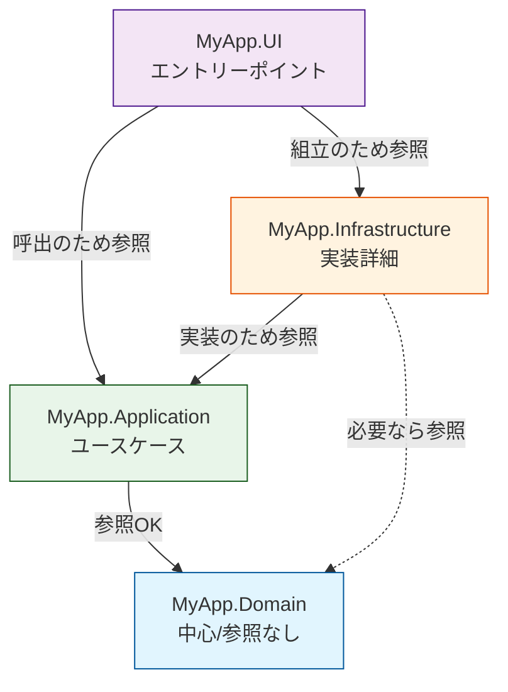

# 第05章：プロジェクト参照ルール：どこがどこを参照していい？🚦➡️

## 0) まずは「今日の最新版」だけサクッと確認📌✨

* Visual Studio 2026 では **.NET 10 と C# 14 が“追加設定なしで”フルサポート**されています🧠💡（IDE側の統合が進んでるよ）([Microsoft Learn][1])
* 2026/01/09 時点の .NET の更新では **.NET 10.0 / 9.0 / 8.0** が並行でメンテされてます🛠️([Microsoft for Developers][2])
* CLIも進化してて、**.NET 10 から `dotnet reference add`（名詞→動詞）**が入り、**.NET 9 以前は `dotnet add reference`（動詞→名詞）**が推奨になってます🧪([Microsoft Learn][3])

---

## 1) この章でできるようになること🎯✨

* ✅ 「参照していい／ダメ」を **図とルール**で言語化できる📜
* ✅ Visual Studio で **正しく Project Reference を貼れる**🔗
* ✅ ルールを破った時に **“ビルドで止める”安全柵**を作れる🚧💥
* ✅ チーム規約っぽく **文章化して共有**できる🧑‍🤝‍🧑📣

---

## 2) まず超大事：依存は “コード” じゃなく “参照” で決まる🧱➡️

依存関係ルールって「書き方の気合」じゃなくて、まず **プロジェクト参照の矢印**で勝負するのが強いです💪✨

## Project Reference ってなに？🤔

* プロジェクトAがプロジェクトBを参照すると、`.csproj` に `<ProjectReference ...>` が入ります🧩
* これは MSBuild 的にも正式な仕組みで、`ProjectReference` はビルド時に参照へ変換されます🔄([Microsoft Learn][4])

例：`.csproj` の中身（イメージ）👇

```xml
<ItemGroup>
  <ProjectReference Include="..\MyApp.Domain\MyApp.Domain.csproj" />
</ItemGroup>
```

---

## 3) 参照ルールの基本形：内側は外側を見ない🧭🧅

（第4章で分けた前提で）典型の4プロジェクトを例にします👇

* **MyApp.Domain**（中心：業務ルール🫀）
* **MyApp.Application**（中心寄り：ユースケース🧠）
* **MyApp.Infrastructure**（外側：DB/外部API/ファイル🧰）
* **MyApp.UI**（外側：画面/CLI/Web/APIの入口🖥️🚪）

## 依存の地図（OKの矢印）🗺️➡️

```text
MyApp.Domain        ← 参照される側（中心）🫀
   ↑
MyApp.Application   ← Domainを参照OK 🧠
   ↑
MyApp.Infrastructure ← Application/Domainを参照OK（実装側）🧰
   ↑
MyApp.UI            ← Application/Infrastructureを参照OK（入口）🖥️
```



---

## 4) 「参照していい/ダメ」早見表🚦✨


> コツ：**中心ほど“何も参照しない”**が正義👑

| From＼To      |      Domain🫀 | App🧠 | Infra🧰 |  UI🖥️ |
| ------------ | ------------: | ----: | ------: | -----: |
| **Domain🫀** |             — |     ❌ |       ❌ |      ❌ |
| **App🧠**    |             ✅ |     — |       ❌ |      ❌ |
| **Infra🧰**  |             ✅ |     ✅ |       — | ❌（※原則） |
| **UI🖥️**    | ✅（※できればApp経由） |     ✅ |       ✅ |      — |

## よくある “事故” 💥😭

* Domain が Infra を参照し始める
  → **Domain が EF Core や HTTP に汚染される**→ 変更の波が中心に侵入😱
* App が UI の型（画面モデルとか）を参照
  → 入口の都合でユースケースが歪む😵

---

## 5) Visual Studioで参照を貼る手順🔗🛠️

Solution Explorer で👇

1. 参照したい側（例：MyApp.Application）を開く
2. `Dependencies`（または `References`）を右クリック
3. **Add Project Reference** を選ぶ
4. 参照したいプロジェクト（例：MyApp.Domain）にチェック✅
5. OK 🎉

この手順自体は Microsoft Learn にも載ってます📚([Microsoft Learn][5])

---

## 6) 演習①：まず “正しい参照” を作る🧪✅

## ゴール🎯

* Application → Domain ✅
* Infrastructure → Application ✅
* UI → Application ✅（必要なら UI → Infrastructure も✅）

### 手順（例）

* `MyApp.Application` に `MyApp.Domain` を参照追加
* `MyApp.Infrastructure` に `MyApp.Application` を参照追加
* `MyApp.UI` に `MyApp.Application` を参照追加

## チェック：`.csproj` に `<ProjectReference>` が入ってる？👀

* 入ってたらOK！🔗✨

---

## 7) 演習②：わざとNG参照して「ビルドで止める」🚧💥

ここがこの章の山場⛰️✨
**“お願いベース”のルール**は破られるので、**仕組みで止めます**😤

## 7-1) まず、わざとNG参照を入れる😈

* `MyApp.Domain` が `MyApp.Infrastructure` を参照するように追加（本当はダメ）🚫
  → まだ何も仕掛けてないと、普通にビルド通っちゃうことが多いです😅

## 7-2) “安全柵” を追加：Directory.Build.targets 🧱🔒


MSBuildは、ソリューション配下に **Directory.Build.targets** を置くと自動で取り込めます📦([Microsoft Learn][6])

✅ ソリューション直下に `Directory.Build.targets` を作って、こう書きます👇
（※超入門向けに「プロジェクト名で判定」するシンプル版だよ🧸）

```xml
<Project>
  <!-- 参照ルール違反をビルドで止める安全柵 🚧 -->
  <Target Name="EnforceProjectReferenceRules" BeforeTargets="Build">
    <!-- Domain は Infrastructure / UI を参照しちゃダメ -->
    <ItemGroup Condition="'$(MSBuildProjectName)' == 'MyApp.Domain'">
      <_ForbiddenRefs Include="@(ProjectReference)"
                      Condition="$([System.String]::Copy('%(ProjectReference.FullPath)').Contains('\MyApp.Infrastructure\'))
                             Or $([System.String]::Copy('%(ProjectReference.FullPath)').Contains('\MyApp.UI\'))" />
    </ItemGroup>

    <Error Condition="'@(_ForbiddenRefs)' != ''"
           Text="❌ Dependency Rule violation: MyApp.Domain must NOT reference Infrastructure/UI. Forbidden: @(_ForbiddenRefs)" />
  </Target>
</Project>
```

### これでどうなる？🥹✨

* Domain に NG 参照が入った瞬間、**ビルドがエラーで止まる**🚨
* 「うっかり追加しちゃった」を最速で検知できる💯

> ここで使ってる “Directory.Build.targets を置けば複数プロジェクトに一括適用できる” って性質が強いです🧠🪄([Microsoft Learn][6])

---

## 8) VS Code派のミニ補足：CLIで参照を貼る🧑‍💻✨

C# のプロジェクト参照は CLI でも追加できます👌

* **.NET 10 以降**：`dotnet reference add`
* **.NET 9 以前**：`dotnet add reference`（旧来の形）([Microsoft Learn][3])

例（.NET 10+ の形）👇

```powershell
dotnet reference add .\MyApp.Domain\MyApp.Domain.csproj --project .\MyApp.Application\MyApp.Application.csproj
```

---

## 9) AI（Copilot/Codex）で爆速に「規約文章」を作る🤖📝✨

チーム共有用の文章、AIに書かせると超ラクです💕

## プロンプト例🍬

```text
次のプロジェクト構成で、依存関係ルール（参照ルール）のチーム規約を
短く・わかりやすく・箇条書きで作ってください。

- MyApp.Domain（中心）
- MyApp.Application（中心寄り）
- MyApp.Infrastructure（外側）
- MyApp.UI（外側）

条件：
- Domain は何も参照しない
- Application は Domain のみ参照可
- Infrastructure は Application/Domain 参照可
- UI は Application を参照し、必要なら Infrastructure も参照可
- 違反例も2つ書く
```

---

## 10) よくあるハマりどころ集🕳️😵‍💫

* 😭 **Domain に “便利だから” と NuGet（EF/Http/Cloud SDK）を入れ始める**
  → “中心が外側の都合で死ぬ” の典型💀
* 😭 **UI から直接 DB を触り出す**
  → 入口が太って、修正が怖い怪物になる👾
* 😭 **参照ルールが口約束で終わる**
  → 人が増えるほど破られる😇（だからビルドで止めるのが正義）

---

## 11) ミニ理解チェック（3問）🧠✨

1. Domain が参照していいのはどれ？
   A. Infrastructure　B. Application　C. 何も参照しない

2. 参照ルールを “物理で守る” 最短の方法は？
   A. 祈る　B. コードレビューだけ　C. プロジェクト参照を制御してビルドで止める

3. `Directory.Build.targets` が便利なのはなぜ？
   A. 1つのファイルで複数プロジェクトに一括適用できる
   B. UIが可愛くなる
   C. DBが速くなる

（答え：1)C 2)C 3)A 🥳）

---

## 12) この章のまとめ🎀🏁

* 依存関係ルールは **“参照（矢印）” を固定するルール**🧭➡️
* **中心（Domain）ほど孤独に**＝何も参照しない🫀✨
* ルールは **お願いじゃなくて仕組み**で守るのが最強🚧💥
* `Directory.Build.targets` で **違反をビルドで止める**ところまでできたら一気に強くなる💪([Microsoft Learn][6])

---

次の第6章（インターフェースの置き場所🧷🎯）では、ここで決めた参照ルールをさらに盤石にする「置き場所の必勝パターン」をやりますよ〜😊✨

[1]: https://learn.microsoft.com/ja-jp/visualstudio/releases/2026/release-notes "Visual Studio 2026 リリース ノート | Microsoft Learn"
[2]: https://devblogs.microsoft.com/dotnet/dotnet-and-dotnet-framework-january-2026-servicing-updates/ ".NET and .NET Framework January 2026 servicing releases updates - .NET Blog"
[3]: https://learn.microsoft.com/en-us/dotnet/core/tools/dotnet-reference-add "dotnet reference add command - .NET CLI | Microsoft Learn"
[4]: https://learn.microsoft.com/en-us/visualstudio/msbuild/common-msbuild-project-items?view=visualstudio "Common MSBuild Project Items - MSBuild | Microsoft Learn"
[5]: https://learn.microsoft.com/en-us/visualstudio/ide/how-to-add-or-remove-references-by-using-the-reference-manager?view=visualstudio "Add references in the Reference Manager - Visual Studio (Windows) | Microsoft Learn"
[6]: https://learn.microsoft.com/en-us/visualstudio/msbuild/customize-by-directory?view=visualstudio "Customize your build by folder or solution - MSBuild | Microsoft Learn"
