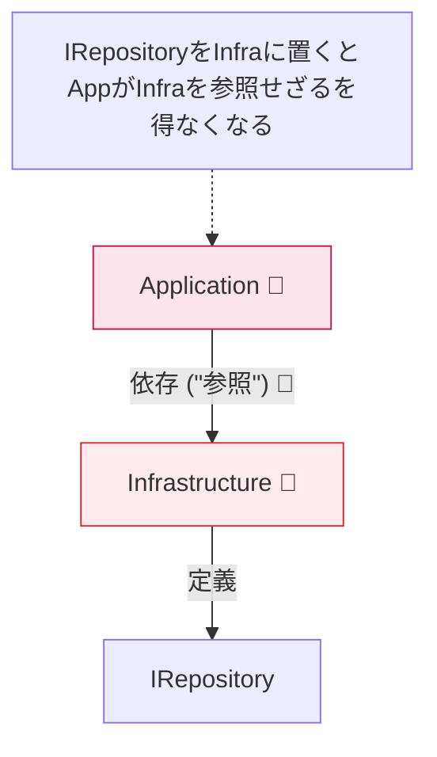
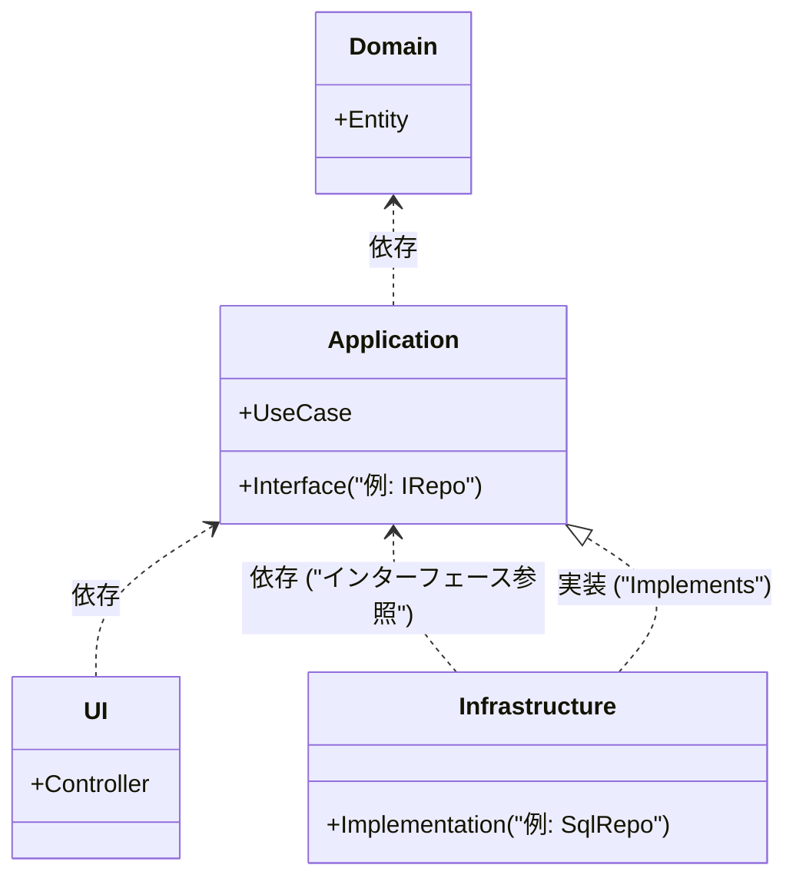

# 第06章：依存を守る最重要テク：インターフェースの置き場所🧷🎯

この章はズバリ… **「Interface（I○○）は“中心側”に置く」** がゴールです😊✨
これができると、Dependency Rule（矢印の向き）をかなり高確率で守れるようになります🧭➡️

---

## 6-1. なんで “置き場所” がそんなに大事なの？😳📦

依存関係ルールは「中心（方針）」が「外側（詳細）」に引っ張られないようにするルールでしたよね🧅✨

ここで超大事なのがこれ👇

* **コンパイル時の依存（参照）** と
* **実行時の呼び出し（動き）**

は別モノ、という感覚です🧠🔁


Microsoftのアーキテクチャ解説でも、**“実行時の流れはそのままでも、コンパイル時の依存はインターフェースで反転できる”** って説明されています📚✨ ([Microsoft Learn][1])

---

## 6-2. 結論：インターフェースは「使う側（中心側）」が持つ🏠🧷


### ✅ ルール（覚え方）💡

> **インターフェースは “呼び出す側（欲しい側）” が定義する**
> 実装は “呼ばれる側（やってあげる側）” が作る

これがそのまま **Ports & Adapters / Clean Architecture** の定番の考え方です🚪🔌
（内側がインターフェースを定義して、外側が実装する） ([Microsoft Learn][2])

---

## 6-3. ダメな置き方（あるある事故）💥😭


「DBアクセスだから…」って **Infrastructure に IRepository を置いちゃう** パターン、めっちゃ多いです😇

すると Application は IRepository を使いたいので…

* Application → Infrastructure（参照しないといけない）

になってしまいます🚫
**中心が外側に依存しちゃった！** 依存関係ルール破れです⚠️



---

## 6-4. 正しい置き方（王道パターン）🏆✨


今回の王道はこれ👇

* **Domain**：業務のルール・エンティティ・値オブジェクト🧠
* **Application**：ユースケース（手順）＋ “必要な口（Interface）” 🧾
* **Infrastructure**：DB/外部API/ファイル等の実装🧰
* **UI**：API/画面/CLIなど。組み立てもここ寄り🏗️

依存の矢印イメージ👇

```text
(UI) ─────────▶ (Application) ─────────▶ (Domain)
  │                 ▲
  │                 │
  └──────▶ (Infrastructure)  (implements interfaces defined in Application)
```



---

## 6-5. ハンズオン：IRepository を中心に置いて、Infra で実装する🔁🛠️

ここでは **Order（注文）** を題材にします🛒✨
（DBは後で本物にしてもOK。まずは形が大事😊）

### ① Domain：注文エンティティ（超ミニ）📦


```csharp
namespace MyApp.Domain;

public sealed class Order
{
    public Guid Id { get; }
    public string ItemName { get; }
    public int Quantity { get; }

    public Order(Guid id, string itemName, int quantity)
    {
        if (string.IsNullOrWhiteSpace(itemName)) throw new ArgumentException("ItemName is required.");
        if (quantity <= 0) throw new ArgumentOutOfRangeException(nameof(quantity));

        Id = id;
        ItemName = itemName;
        Quantity = quantity;
    }
}
```

### ② Application：欲しいもの（Interface）をここに置く🧷🎯


「注文を保存したい」っていう **“欲求”** を Application 側が宣言します👇

```csharp
using MyApp.Domain;

namespace MyApp.Application;

public interface IOrderRepository
{
    Task SaveAsync(Order order, CancellationToken ct = default);
}
```

ポイント✅

* **戻り値や引数に “Infrastructureの型” を混ぜない**（例：DbContext、SqlConnection など）🙅‍♀️
* Application は Application/Domain だけで完結させるのが美しいです🧼✨

### ③ Application：ユースケース（IOrderRepository を使う）📥


```csharp
using MyApp.Domain;

namespace MyApp.Application;

public sealed class PlaceOrderUseCase
{
    private readonly IOrderRepository _repo;

    public PlaceOrderUseCase(IOrderRepository repo)
    {
        _repo = repo;
    }

    public async Task<Guid> ExecuteAsync(string itemName, int quantity, CancellationToken ct = default)
    {
        var order = new Order(Guid.NewGuid(), itemName, quantity);
        await _repo.SaveAsync(order, ct);
        return order.Id;
    }
}
```

ここ、めっちゃ大事💖
**PlaceOrderUseCase は DB のことを一切知らない** のに、保存はできる設計になってます😊✨

### ④ Infrastructure：実装を作る（Interface を実装する側）🧰


まずは簡単に InMemory 実装でOKです（DBは次の章以降で差し替えやすい✨）

```csharp
using MyApp.Application;
using MyApp.Domain;

namespace MyApp.Infrastructure;

public sealed class InMemoryOrderRepository : IOrderRepository
{
    private static readonly List<Order> _orders = new();

    public Task SaveAsync(Order order, CancellationToken ct = default)
    {
        _orders.Add(order);
        return Task.CompletedTask;
    }
}
```

### ⑤ UI：組み立てて呼ぶ（今は手動でOK）🏗️

（DIは第7〜8章で本格的にやるので、ここは “仮” の組み立てでOK👌）

```csharp
using MyApp.Application;
using MyApp.Infrastructure;

namespace MyApp.UI;

internal static class Program
{
    private static async Task Main()
    {
        IOrderRepository repo = new InMemoryOrderRepository();
        var useCase = new PlaceOrderUseCase(repo);

        var id = await useCase.ExecuteAsync("チョコ", 2);
        Console.WriteLine($"注文できたよ〜🍫✨ id={id}");
    }
}
```

---

## 6-6. Visual Studio での “参照” の正解ルート🚦➡️

目安はこんな感じです👇

* Application → Domain ✅
* Infrastructure → Application ✅（＋Domainも必要なら）
* UI → Application ✅
* UI → Infrastructure ✅（“組み立て” 目的）

逆にこれはNG😱

* Application → Infrastructure ❌
* Domain → どこか（基本なにも参照しない）❌

---

## 6-7. どっちに置く？迷った時の判断基準🧭🤔

### ✅ Application に置くことが多い Interface

* DB保存（Repository）
* 外部API呼び出し（PaymentGateway）
* メール送信（EmailSender）
* 時刻取得（Clock）

👉 理由：**ユースケースが「必要」としてる機能**だから💡

### ✅ Domain に置くことがある Interface

* ドメインサービス的な契約（ドメインの言葉で語れるもの）🗣️
  例：値計算、ルール判定など

👉 ただし最初は無理に Domain に置かず、**まずは Application でOK**です😊🌸

---

## 6-8. ミニ演習（超おすすめ）🧪💖

### 演習A：わざと失敗して “怖さ” を体験する😈💥


1. `IOrderRepository` を **Infrastructure** に移動してみる
2. Application から使おうとする
3. **Application → Infrastructure の参照が必要になって詰む** のを体験する

「うわ、中心が外側を見ちゃうじゃん…😇」ってなるはず！

### 演習B：戻して正解にする✨

* `IOrderRepository` を **Application** に戻す
* Infrastructure で実装
* UI で組み立て
  → **矢印が整って安心😌🧭**

---

## 6-9. AI活用（Copilot / Codex）🤖💬✨

### ✅ 依存違反レビューをさせる🔍

例プロンプト👇

```text
このソリューション構成（Domain/Application/Infrastructure/UI）で、
Dependency Rule に違反しそうな参照関係をチェックして、
直し方を提案して。
特に interface の置き場所を重点的に見て。
```

### ✅ “そのユースケースが欲しい契約” を作らせる📜

```text
PlaceOrderUseCase が必要とする外部依存（保存、通知、時刻など）を洗い出して、
Application 層に置く interface を提案して。
戻り値/引数は Infrastructure の型を使わない方針で。
```

---

## 6-10. まとめ（この章で持ち帰ること）🎁✨

* **Interface は中心側（使う側）が定義する** 🧷🏠
* **実装は外側（Infra）が担当する** 🧰
* これで **コンパイル時の依存が反転**して、依存関係ルールが守りやすくなる🧭➡️ ([Microsoft Learn][1])
* そして2026時点は **.NET 10 + C# 14** が最新ラインなので、以降の章もこの前提で書いてOKです😊✨ ([Microsoft Learn][3])

---

次の第7章は、この形をさらに強くする **「new しないで渡す（DI入門）」** に入っていくよ〜📥🧪💕

[1]: https://learn.microsoft.com/en-us/dotnet/architecture/modern-web-apps-azure/architectural-principles?utm_source=chatgpt.com "Architectural principles - .NET"
[2]: https://learn.microsoft.com/en-us/dotnet/architecture/modern-web-apps-azure/common-web-application-architectures?utm_source=chatgpt.com "Common web application architectures - .NET"
[3]: https://learn.microsoft.com/en-us/dotnet/csharp/whats-new/csharp-14?utm_source=chatgpt.com "What's new in C# 14"
