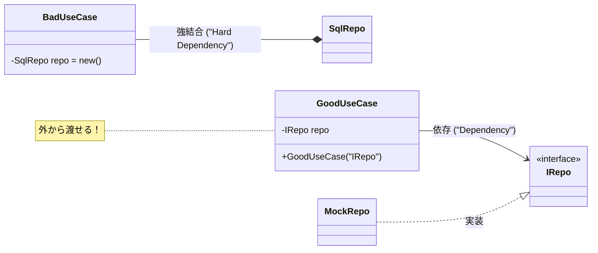

# 第07章：DI入門：newしないで渡す（コンストラクタ注入）📥🧪

〜「new しないで渡す」で、依存の矢印➡️をキレイに守ろう〜

---

## 0) 今日のゴール🎯💕

この章を終えたら、次ができるようになります👇✨

* `new` が「依存を固定」しちゃう感覚がわかる😵‍💫➡️🔒
* **コンストラクタ注入**で、中心（方針）を外側（詳細）から守れる🧭🧱
* **本番用/テスト用**の差し替えがサクッとできる🔄🧪
* `.NET` の標準DI（`Microsoft.Extensions.DependencyInjection`）で最小構成を組める🧩✨ ([Microsoft Learn][1])

ちなみに今の最新ラインは **.NET 10（LTS）** で、2025/11/11リリース＆2026/01/13に 10.0.2 が出ています🆕✨ ([Microsoft][2])
（C# も **C# 14** が .NET 10 とセットで試せるよ〜🧁） ([Microsoft Learn][3])

---

## 1) まず「new」が何を“固定”するの？🧨😱


`new` 自体は悪じゃないよ！🙂
でも、**中心の層（Domain/Application）**で `new` して **外側の実装クラス**を作っちゃうと…

* 「この具体クラスに依存します！」って **矢印➡️が外側に向く**
* つまり **Dependency Rule に反しやすい**（中心が詳細に引っ張られる）😵‍💫

たとえば Application が、Infra の `SqlOrderRepository` を直 `new` しちゃうと…👇

```csharp
// ❌ 悪い例：Application が Infrastructure の具体に依存してしまう
public sealed class PlaceOrderUseCase
{
    private readonly SqlOrderRepository _repo = new SqlOrderRepository(); // ← 固定🔒

    public void Execute()
    {
        // ...
        _repo.Save(/* ... */);
    }
}
```

これ、何が困るかというと…💦

* DB を変えたい（SQL→API→メモリ etc）→ 影響デカい💥
* テストで差し替えたい（本番DB触りたくない）→ つらい😭
* 依存の矢印➡️が「中心→外側」になりがち😵‍💫🧅

---

## 2) DI（依存性注入）って、要するに何？🧸✨


DIはむずかしい呪文じゃなくて、超ざっくり言うと👇

> **「必要な道具は、自分で買いに行かず（newしないで）持ってきてもらう」**📦➡️😊

カフェで例えると☕️

* UseCase（あなた）「ラテ作りたい！」
* でも自分で牧場に行って牛乳を作らないよね🐮💦
* 「牛乳ください」って受け取る（渡してもらう）🥛✨

---

## 3) コンストラクタ注入：いちばん基本＆いちばん強い💪💖


ポイントはコレ👇✨




* **中心側は「インターフェース（契約）」だけ知る**🧾
* **具体実装は外側に置く**🧰
* 必要なものは **コンストラクタで受け取る**📥

## ✅ 良い例：契約に依存する（中心が守られる）🧭🧱

```csharp
public interface IOrderRepository
{
    void Save(Order order);
}

public sealed class PlaceOrderUseCase
{
    private readonly IOrderRepository _repo;

    // ✅ コンストラクタ注入
    public PlaceOrderUseCase(IOrderRepository repo)
    {
        _repo = repo;
    }

    public void Execute(Order order)
    {
        // ルール（中心の判断）
        _repo.Save(order);
    }
}
```

これで何が嬉しい？😍✨

* Application は **IOrderRepository（契約）だけ**知ってればOK🧾
* Infra の実装は **後から差し替え自由**🔄
* テストも **Fake/Mock** を渡せばOK🧪

---

## 4) 演習①：本番用/テスト用を差し替えてみよう🔄🧪💞


ここがDIの“気持ちよさ”ポイントだよ〜！🥹✨

## 4-1) 本番用（Infrastructure側）🗄️

```csharp
public sealed class SqlOrderRepository : IOrderRepository
{
    public void Save(Order order)
    {
        // ここでDB保存（例）
        Console.WriteLine("DBに保存しました🗄️✨");
    }
}
```

## 4-2) テスト用（Fake）🧸

```csharp
public sealed class FakeOrderRepository : IOrderRepository
{
    public List<Order> Saved { get; } = new();

    public void Save(Order order)
    {
        Saved.Add(order);
        Console.WriteLine("Fakeに保存したよ🧸✨");
    }
}
```

## 4-3) “同じUseCase”に、渡す物だけ変える🎁✨


```csharp
// ✅ 本番
var prodRepo = new SqlOrderRepository();
var useCaseProd = new PlaceOrderUseCase(prodRepo);

// ✅ テスト
var fakeRepo = new FakeOrderRepository();
var useCaseTest = new PlaceOrderUseCase(fakeRepo);
```

たったこれだけで差し替えできるのが、DIの最強ポイント〜！🥳🎉

---

## 5) 演習②：.NET標準DIコンテナで「自動で渡す」を体験🧩✨


「渡すの忘れた〜😭」とかを減らすために、.NET のDIコンテナがよく使われます🧰
（ASP.NET Core だと標準で `builder.Services.Add...` を使うやつね！） ([Microsoft Learn][4])

## ✅ Consoleでも最小で体験できるよ👩‍💻✨

```csharp
using Microsoft.Extensions.DependencyInjection;

var services = new ServiceCollection();

// 契約 → 実装 を登録
services.AddTransient<IOrderRepository, SqlOrderRepository>();

// UseCase も登録（必要な依存は自動で渡される）
services.AddTransient<PlaceOrderUseCase>();

using var provider = services.BuildServiceProvider();

var useCase = provider.GetRequiredService<PlaceOrderUseCase>();
useCase.Execute(new Order(/* ... */));
```

ここで大事なのは👇🧠✨

* UseCase 側は **new SqlOrderRepository()** を知らない
* 「必要なのは IOrderRepository です」だけ
* どこで組み立てるか（Composition Root）は **次章**でガッツリやるよ🏗️🧭

---

## 6) ちょい注意：ライフタイム（寿命）って何？⏳🧪


登録するときに出てくるやつ👇

* `AddTransient`：毎回新しい🆕
* `AddScoped`：一定の範囲で同じ（Webだと“リクエスト単位”が多い）🌿
* `AddSingleton`：アプリ全体で1個だけ👑

このへんは公式でも “寿命” として整理されてるよ📚✨ ([Microsoft Learn][4])
そしてガチ運用の注意点（破棄・スコープ混在など）はガイドラインがあるよ🚧✨ ([Microsoft Learn][5])

この章ではまず、**「コンストラクタで受け取る」**ができればOKだよ〜！😊💕

---

## 7) よくあるつまづき集😵‍💫➡️😌

## つまづき①：コンストラクタ引数が増えすぎる〜😭


✅ まずはOK！成長の証💮
その上で、増えすぎたら次の手もあるよ👇

* 依存の粒度が細かすぎない？（責務分割のサイン）🔍
* “設定/ログ/時計”みたいな横断関心を整理できてる？🧼
* まとまりがあるなら「小さなファサード」にするのも手🧩

## つまづき②：DIってコンテナがないとできないの？🤔

✅ できるよ！
DIは「渡す設計」そのもの。コンテナは「自動で渡してくれる道具」🧰✨
（手渡しでもDIはDI！📦）

## つまづき③：`provider.GetService` をあちこちで呼びたくなる😈

それ、**Service Locator** っぽくなりやすい⚠️
基本は「必要なものはコンストラクタで受け取る」がおすすめだよ😊
（ガイドラインで注意点がまとまってる） ([Microsoft Learn][5])

---

## 8) AI活用コーナー🤖💡（Copilot/Codex向け）

コピペで使える“お願い文”を置いとくね🫶✨

## 🔧 リファクタお願い（new → DI）

* 「このクラスの `new` を消して、コンストラクタ注入に直して。依存先は interface にして、interface は中心側に置く方針で」

## 🧪 テストも一緒に作って

* 「xUnitで、Fake実装を使ったユニットテストを書いて。保存が1回呼ばれたことを検証して」

## 🧭 依存の矢印チェック

* 「このコードはDependency Rule（中心→外側に依存しない）を守れてる？破ってたら、どこがダメでどう直す？」

---

## 9) ミニまとめ🎀✨

* `new` を中心でやると、依存が固定されて矢印➡️が外側に向きやすい😵‍💫
* **コンストラクタ注入**で「契約（interface）だけ知る」形にすると、中心が守られる🧭🧱
* 本番/テストの差し替えが一瞬でできる🔄🧪
* 組み立て場所（Composition Root）は次章で完成させるよ🏗️✨

---

## おまけ：確認クイズ🎓💞

1. Application層で `new SqlOrderRepository()` していい？（理由も）🤔
2. UseCaseが知っていいのは「具体クラス」？それとも「契約」？🧾
3. テストで差し替えるとき、何を渡すのが気持ちいい？🧸🧪

---

次は **第8章：Composition Root** 🏗️🧭✨
「じゃあ、組み立てはどこでやるのが正解なの〜？🥺」をスッキリ解決するよ〜！

[1]: https://learn.microsoft.com/en-us/dotnet/core/extensions/dependency-injection?utm_source=chatgpt.com "Dependency injection - .NET"
[2]: https://dotnet.microsoft.com/en-us/platform/support/policy/dotnet-core?utm_source=chatgpt.com "NET and .NET Core official support policy"
[3]: https://learn.microsoft.com/ja-jp/dotnet/csharp/whats-new/csharp-14?utm_source=chatgpt.com "C# 14 の新機能"
[4]: https://learn.microsoft.com/en-us/aspnet/core/fundamentals/dependency-injection?view=aspnetcore-10.0&utm_source=chatgpt.com "Dependency injection in ASP.NET Core"
[5]: https://learn.microsoft.com/en-us/dotnet/core/extensions/dependency-injection-guidelines?utm_source=chatgpt.com "Dependency injection guidelines - .NET"
