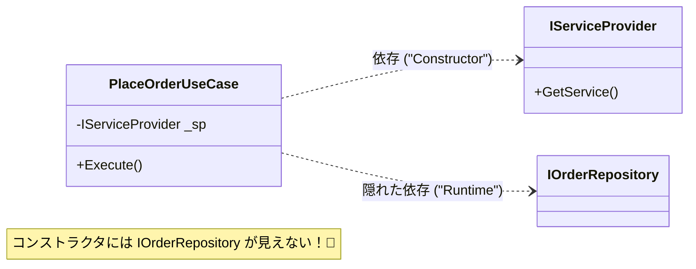

# 第08章：Composition Root：組み立ては“外側”でやる🏗️🧭

この章はひとことで言うと👇
**「依存の“組み立て（newやDI登録）”は、いちばん外側（UI/起動地点）に全部まとめようね」**って話です😌🧩

いま（2026/01時点）は **C# 14 + .NET 10（LTS）** が最新の前提で進めます💖 ([Microsoft Learn][1])
（つまり `Program.cs` で `builder.Services` する “いまどき” スタイルでOKです✨）

---

## 1) Composition Rootってなに？🌱


**Composition Root（コンポジション・ルート）**＝
✅ アプリ起動時に **依存関係を組み立てる場所**（＝newする場所 / DI登録する場所）です🏗️

たとえば👇みたいな「決めごと」を置く場所！

* 「`IOrderRepository` の実装は、今は `SqlOrderRepository` ね」🗄️
* 「本番は `SystemClock`、テストは `FakeClock` に差し替えたい」⏰🔁
* 「ログはSerilogにする？」📈
* 「DB接続文字列は設定から読む？」🔧

---

## 2) なぜ“外側”に寄せるの？（Dependency Ruleとの接続）🧭➡️


Dependency Ruleの気持ちとしては👇

* **中心（Domain/Application）は長生きしてほしい**🌳
* **外側（UI/DB/外部API）は変わりやすい**🌪️
* だから **中心が外側を知らない**（依存しない）ようにしたい😌

でも…もし中心側（Application）が👇みたいに書いちゃうと？

```csharp
// ❌ Application層で new しちゃう例（やりがち）
var repo = new SqlOrderRepository(connectionString);
```

これ、Applicationが **DB都合に依存**しちゃうんですよね😵‍💫
→ DBを変えたら中心が巻き添えで変更、という事故コース💥

だから結論👇
**new（どの実装を使うか決める）は外側でやる！** 🏗️✨
中心は「インターフェースだけ知ってる」状態に保つ🎯

---

## 3) Composition Rootはどこに置く？📌


だいたいここです👇（全部“外側”！）

* Webアプリ：`Program.cs`（ASP.NET Core）🌐
* Consoleアプリ：`Program.cs`（Main）🖥️
* Windowsアプリ（WPF/WinForms）：起動地点（App.xaml.cs / Program.cs）🪟
* Worker/Batch：エントリポイント（ホスト起動）⚙️
* テスト：テストプロジェクト側のセットアップ🧪

ASP.NET Coreの基本として **DIは標準機能**で、`Program.cs` が組み立ての中心になります🧩 ([Microsoft Learn][2])

---

## 4) “ダメな例”→“よい例”で体感しよ🧠✨

題材：**注文を作る（PlaceOrder）** 🛒💕

## 4-1. まずダメな例（中心が外側を知っちゃう）🙅‍♀️


```csharp
// Application層
public class PlaceOrderUseCase
{
    public void Execute()
    {
        // ❌ 具体クラスnew（外側の都合に依存）
        var repo = new SqlOrderRepository("Server=...");
        repo.Save(...);
    }
}
```

これだと
Application層が **SQLの実装**と **接続文字列**を知ってしまう😵
→ 変更が中心まで波及💥

---

## 4-2. よい例（中心は“欲しいもの”だけ言う）🥰

### ✅ Application層：インターフェースだけ知る

```csharp
// Application層
public interface IOrderRepository
{
    void Save(Order order);
}

public sealed class PlaceOrderUseCase
{
    private readonly IOrderRepository _repo;

    public PlaceOrderUseCase(IOrderRepository repo) // ✅ もらう（注入）
    {
        _repo = repo;
    }

    public void Execute(Order order)
    {
        _repo.Save(order);
    }
}
```

### ✅ Infrastructure層：実装を書く（差し替え可能）

```csharp
// Infrastructure層
public sealed class InMemoryOrderRepository : IOrderRepository
{
    private readonly List<Order> _orders = new();

    public void Save(Order order) => _orders.Add(order);
}
```

### ✅ UI層（外側）：ここがComposition Root！🏗️✨

```csharp
// UI層 Program.cs（Console例）
using Microsoft.Extensions.DependencyInjection;

var services = new ServiceCollection();

// ✅ 依存の組み立て（どの実装を使うか決める）
services.AddSingleton<IOrderRepository, InMemoryOrderRepository>();
services.AddTransient<PlaceOrderUseCase>();

var provider = services.BuildServiceProvider();

var useCase = provider.GetRequiredService<PlaceOrderUseCase>();
useCase.Execute(new Order(/* ... */));
```

```mermaid
sequenceDiagram


    participant Main as Program.cs ("UI")
    participant DI as DI Container
    participant Infra as Repository ("Infra")
    participant App as UseCase ("App")

    Note over Main: アプリ起動 ("Composition Root")
    Main->>DI: Repositoryを登録 ("Singleton")
    Main->>DI: UseCaseを登録 ("Transient")
    
    Note over Main: 実行時
    Main->>DI: UseCaseを要求
    DI->>Infra: Repository作成
    DI->>App: UseCase作成 ("Repoを注入")
    DI-->>Main: UseCaseを返す
    Main->>App: Execute()
```

ポイントはここ👇💖

* Applicationは **実装を選ばない**（選ぶのは外側）🧭
* 外側は **中心を使って組み立てる**🏗️

---

## 5) Program.csが太りすぎ問題🥺 → “登録をまとめる”コツ🧩


Composition Rootは外側に置くけど、`Program.cs` が巨大になるのはあるある😇

そこでよくやるのが👇
**「登録だけを拡張メソッドに分割」**（でも呼び出しはProgram.csで！）✨

## 5-1. Infrastructure側に「登録メソッド」を置く（おすすめ）🛠️

```csharp
// Infrastructure層
using Microsoft.Extensions.DependencyInjection;

public static class InfrastructureDI
{
    public static IServiceCollection AddInfrastructure(this IServiceCollection services)
    {
        services.AddSingleton<IOrderRepository, InMemoryOrderRepository>();
        return services;
    }
}
```

## 5-2. UIのProgram.csは“組み立ての台本”だけになる🎬✨

```csharp
var builder = WebApplication.CreateBuilder(args);

builder.Services.AddInfrastructure();  // ✅ 外側が呼ぶ
builder.Services.AddTransient<PlaceOrderUseCase>();

var app = builder.Build();
app.Run();
```

※ `IServiceCollection` 自体は .NET のDI基盤として標準です📦 ([Microsoft Learn][3])

---

## 6) 罠：Service Locator（サービスロケータ）に注意⚠️🙅‍♀️


「DIしてるつもりで、実は依存が隠れてる」パターンがこれ👇

```csharp
public class PlaceOrderUseCase
{
    private readonly IServiceProvider _sp;

    public PlaceOrderUseCase(IServiceProvider sp) // ❌ なんでも取れる
    {
        _sp = sp;
    }

    public void Execute()
    {
        var repo = _sp.GetRequiredService<IOrderRepository>(); // ❌ 依存が隠れる
    }
}
```




これやると👇

* クラスの依存が **コンストラクタから見えない**😵
* テストもしんどい💦
* 「中心が外側のDI容器に依存」っぽくなりがち

なので基本は👇💖
✅ **必要なものはコンストラクタで全部受け取る**（依存が見える化）👀✨

---

## 7) もう一段だけ：ライフタイム（生存期間）も外側で決める⏳🧠

DI登録でよく使う3つ👇

* `Singleton`：アプリ中ずっと1個🗿（設定・キャッシュ等）
* `Scoped`：Webなら「リクエストごと」📨（DbContextなど）
* `Transient`：毎回new🫧（UseCaseなど）

ASP.NET CoreのDI/ホスティングはこの考え方が前提になってます🌐 ([Microsoft Learn][2])

---

## 8) 演習（この章のメイン！）🧪🎀

## 演習A：newを追放して、Program.csに集約しよ✂️🏗️


1. Application層にある `new XxxRepository()` を探す🔎
2. `IOrderRepository` に置き換える🧷
3. 実装クラスはInfrastructureへ移動🧳
4. `Program.cs` で登録して動かす🚀

✅ゴール：Application層から具体クラス名が消える✨

---

## 演習B：実装を差し替える（本番/テスト）🔁🧪

* 本番：`SqlOrderRepository`
* テスト：`InMemoryOrderRepository`

Program.cs（またはテスト側）で切り替えるだけにする💡
→ UseCaseは無改造でOKなのが最高🥰

---

## 演習C：設定値（接続文字列など）を“外側で解釈”する🔧🧭

* 設定ファイルの読み取りは外側でやる
* 中心には「必要な値だけ」渡す

（中心に `IConfiguration` を渡し始めたら黄色信号🚥💛）

---

## 9) AI活用（Copilot / Codex想定）🤖✨


使いどころはここが強いです👇

* 「いまの依存の矢印、どこが逆向き？」ってレビューさせる🔍🤖
* 「Program.csの登録を整理して、拡張メソッドに分割して」📦✨
* 「Service Locatorになってないかチェックして」⚠️

ただし注意👇😇
AIが「とりあえず `IServiceProvider` 注入しよう」と提案してきたら、だいたい罠です🙅‍♀️💥

---

## 10) この章のまとめ🧁✨

* Composition Root＝**依存を組み立てる場所**🏗️
* 置き場所は **外側（Program.cs / 起動地点）**📌
* 中心は **インターフェースだけ知る**🧷
* `Program.cs` が肥大化したら **登録を拡張メソッドに分割**🧩
* `IServiceProvider` で取りに行く **Service Locatorは避ける**⚠️

---

次の章（第9章）は、層をまたぐときの **DTO / Port / Adapter** の話に入っていくので、
この第8章で「組み立ては外側！」が腹落ちしてるとめちゃくちゃ楽になりますよ〜🥰🧭✨

[1]: https://learn.microsoft.com/en-us/dotnet/csharp/whats-new/csharp-14?utm_source=chatgpt.com "What's new in C# 14"
[2]: https://learn.microsoft.com/en-us/aspnet/core/fundamentals/?view=aspnetcore-10.0&utm_source=chatgpt.com "ASP.NET Core fundamentals overview"
[3]: https://learn.microsoft.com/en-us/dotnet/api/microsoft.extensions.dependencyinjection.servicecollection?view=net-10.0-pp&utm_source=chatgpt.com "ServiceCollection Class"
